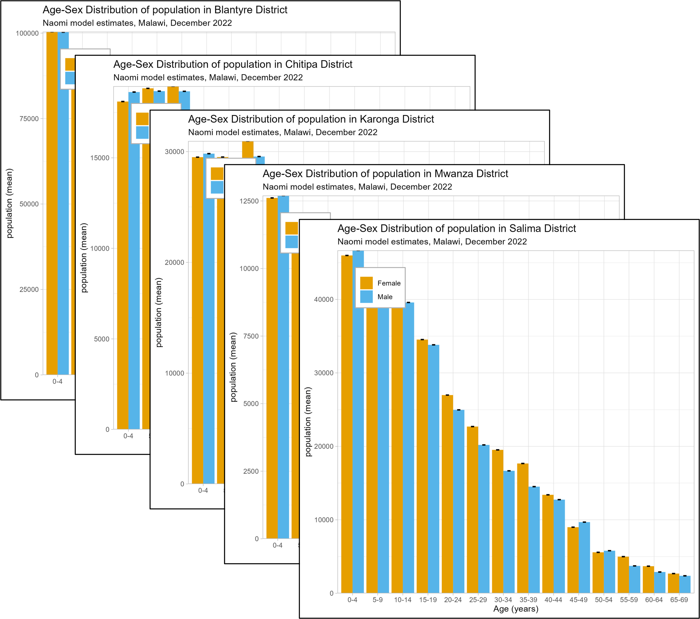
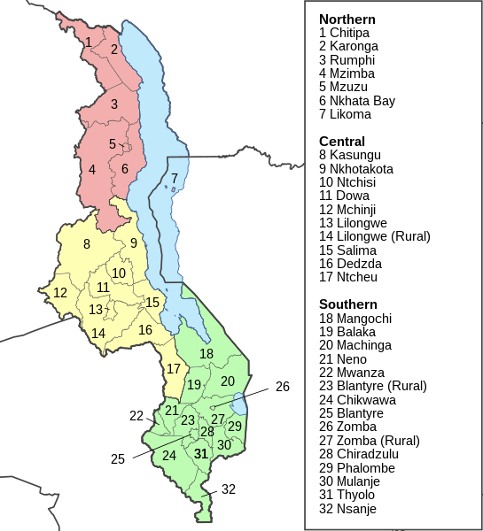
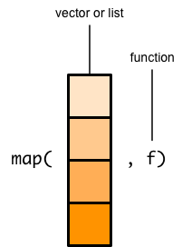
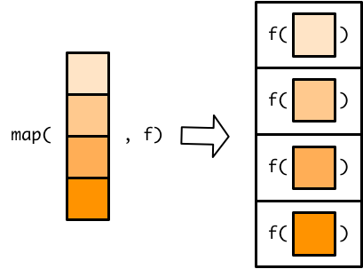

```{r, echo = F, message = F, warning = F}
knitr::opts_chunk$set(class.source = "tgc-code-block")
# Load packages 
if(!require(pacman)) install.packages("pacman")
pacman::p_load(tidyverse, knitr, here, reactable)

# Source functions 
source(here::here("global/functions/lesson_functions.R"))

# knitr settings
knitr::opts_chunk$set(warning = F, message = F, class.source = "tgc-code-block", error = T)


```

# Automating Data Visualization with {ggplot2} and {purrr}

## Introduction

-   Situations requiring repetitive plotting tasks
-   Example: Plotting the same epidemic indicator for multiple regions
-   Focus on automating data visualizations
-   Tools: `{ggplot2}` and `{purrr}` in R
-   Programmatic approach with `{ggplot2}`
    -   Creating custom plotting functions
    -   Streamlining graphing tasks
-   Utilizing `{purrr}` for iteration
    -   Handling different variables
    -   Generating and saving multiple plots in a single step
-   Benefits of automating plotting for data analysis workflows



## Learning Objectives {.unlisted .unnumbered}

1.  **Recognize the challenges of repetitive filtering and plotting**: Identify when repetitive plotting is needed and create a workflow involving data subsetting, plotting, and saving.

2.  **Create custom plotting functions**: Develop custom functions for repetitive plotting tasks with, including variable and row subsetting. Learn to add multiple inputs for dynamic plot customization.

3.  **Iterate plotting tasks**: Apply plotting functions over a vector of variables, with the help of `purrr::map()`.

4.  **Use nested loops for automation**: Use `map()` within a for loop to iterate over a combination of subsets and response variables.

By the end of this lesson, you'll have the skills to automate `{ggplot2}` graphs, saving time and enhancing the reproducibility of your data-driven narratives.

## Packages

In this lesson we will use the following packages:

-   `{tidyverse}` metapackage

    -   `{ggplot2}` for creating plots

    -   `{purrr}` for iterating functions through a vector

-   `{here}` for project-relative file paths

-   `{glue}` for concatenating strings and automating plot annotation

```{r warning = F, message = F}
# Load packages 
pacman::p_load(tidyverse, here, glue)
```

------------------------------------------------------------------------

## Introduction to the data: HIV in Malawi

-   Dataset Overview
    -   Source: Malawi Ministry of Health Department of HIV & AIDS and Viral Hepatitis
    -   Data for December 2022
    -   Subnational HIV epidemic indicators
-   Estimation Method
    -   Small‐area estimation model: Naomi
    -   Estimates key measures
    -   Stratified by subnational administrative units, sex, and age groups
-   Dataset Access
    -   Original dataset link: [Malawi HIV Subnational Estimates Naomi Model 2023](https://dms.hiv.health.gov.mw/dataset/malawi-hiv-subnational-estimates-naomi-model-2023)

We have prepared a subset of that data to analyse in this lesson:

```{r render = .reactable_10_rows, message = FALSE}
# Import data from CSV
hiv_mwi_agesex <- read_csv(here("data/clean/hiv_mwi_agesex.csv"))

# View data frame
hiv_mwi_agesex
```

-   **Geographic area**:
    -   `area_level` - administrative unit (country, region, or district)
    -   `area_name` - name of the geographic area
-   **Demographic information**
    -   `age_group` and `sex`
-   **HIV indicators**: total population, people living with HIV (PLHIV), HIV prevalence, incidence, ART coverage, and PLHIV who are aware of their status.
    -   `indicator` - short code
    -   `indicator_label` - full name
-   **Statistical measures**: model estimates with probabilistic uncertainty
    -   `mean`, `lower`, `upper`

::: key-point
The Naomi model synthesizes data from multiple data sources to give small-area estimates of key HIV indicators for sub‐Saharan Africa. These estimates are instrumental for HIV program planning, resource allocation, and target setting. You can learn more about the Naomi model [here](https://www.ncbi.nlm.nih.gov/pmc/articles/PMC8454682/).
:::

### Visualizing age-sex distribution

-   Age and sex disparities in HIV prevalence influenced by various factors

-   Focus on visualizing age-sex distribution of indicators at different levels

-   Initial task: Create a national-level bar chart of HIV prevalence using `ggplot()`

```{r}
# Bar chart of age-sex distribution 
hiv_mwi_agesex %>% 
  filter(area_level == 'Country',
         indicator == 'prevalence') %>% 
  ggplot(aes(x = age_group,
             y = mean, 
             fill = sex)) +
  geom_col(position = 'dodge') +
  theme_minimal() +
  labs(title = 'National estimates of HIV prevalence, Malawi (Dec 2022)')
```

Oops! Something looks off with the order of age groups. This is important to fix because we will be creating plots grouped by age and sex for the rest of this lesson.

::: error
**Reveling the x-axis variable**

The variable **`age_group`** is a **character** vector, which is not inherently ordered the way a **factor** is.

```{r}
# View unique values the age_group variable
hiv_mwi_agesex %>% pull(--------) %>% unique()
```

If we look at the unique values of the variable, we get a vector that is correctly ordered from youngest to oldest. However, `{ggplot2}` arranges character variables "alphabetically", which means our "5-9" age group is plotted in the wrong place.

To arrange our bar plot the correct age sequence, we can convert `age_group` to a factor and specify the order of levels using **`forcats::fct_relevel()`**:

```{r}
# Create a vector of correctly ordered age group values
ordered_age_groups <- hiv_mwi_agesex %>% pull(------------) %>%  unique()

# Reorder age_group levels and save to a new data frame
hiv_malawi <- hiv_mwi_agesex %>%
  mutate(-----------------------------------)
```

Now we are ready to plot age distributions with our new **`hiv_malawi`** data frame.
:::

Let's try the same `ggplot()` code again, with `hiv_malawi`:

```{r}
# Plot with releveled age groups
hiv_malawi %>% 
  filter(area_level == --------,
         indicator == ----------) %>% 
  ggplot(aes(x = age_group, 
             y = mean, 
             fill = sex)) +
  geom_col(----------------) +
  theme_minimal() +
  labs(title = "National estimates of HIV prevalence, Malawi (Dec 2022)")
```

Much better!

::: side-note
**Insights on HIV prevalence**

-   Gender Disparity in HIV Prevalence
    -   Starts at age 15, linked to sexual activity onset
    -   Women have higher prevalence than men in their 20s to 40s
    -   Possible reasons: biological vulnerability, social dynamics
    -   Shift after age 50, with men having higher rates
    -   Influenced by factors like sexual behavior, mortality rates, and treatment access
:::

-   Deeper Investigation: Examining trends in more localized areas
-   Geographic Areas: Dataset includes estimates for 3 main regions and 28 districts of Malawi
-   Initial Focus: Analyzing the three regions as the first administrative level



## The challenge of repetitive plotting

-   Data Visualization Challenge
    -   Repetitive filtering of data subsets
-   Task: Create a Plot for `"Northern"` Region
    -   Adapt code from the national plot
    -   Replace `"Country"` with `"Region"`
    -   Addthe region's name to the filter

```{r}
# Example of repetitive filtering and plotting - Region 1

hiv_malawi %>% 
  # Filter to Northern Region
  filter(
    area_level == ---------,
    area_name == ---------,
    indicator == ---------
  ) %>% 
  ggplot(aes(x = age_group, 
             y = mean, 
             fill = sex)) +
  geom_col(position = "dodge") +
  theme_minimal() +
  # Change the title
  labs(title = "HIV Prevelance by age and sex in Northern Region, Malawi (Dec 2022)")
```

Now let's repeat this for the other two regions:

```{r}
# Example of repetitive filtering and plotting - Region 2

hiv_malawi %>% 
  # Filter to Southern Region
  filter(area_level == "Region",
         area_name == ---------,
         indicator == "prevalence") %>% 
  ggplot(aes(x = age_group, 
             y = mean, 
             fill = sex)) +
  geom_col(position = "dodge") +
  theme_minimal() +
  # Change the title
  labs(title = "HIV Prevelance by age and sex in Southern Region, Malawi (Dec 2022)")

# Example of repetitive filtering and plotting - Region 3

hiv_malawi %>% 
  # Filter to Central Region
  filter(area_level == "Region",
         area_name == ---------,
         indicator == "prevalence") %>% 
  ggplot(aes(x = age_group, 
             y = mean, 
             fill = sex)) +
  geom_col(position = "dodge") +
  theme_minimal() +
  # Change the title
  labs(title = "HIV Prevelance by age and sex in Central Region, Malawi (Dec 2022)")
```

-   Limitations of Manual Filtering
    -   Works for a small number of subgroups
    -   Becomes inefficient and error-prone as subgroups increase
-   Approach to Address Challenge
    -   Demonstrate using `{ggplot2}` and functional programming techniques
    -   Avoid copying and pasting code for each subgroup

::: side-note
**Faceting for small multiples**

-   Faceted Plot as an Alternative
    -   Breakdown by region or district
-   Limitation
    -   Too many levels in grouping variable
    -   Potential data overload with numerous subsets
-   Challenge with Crowded Plots
    -   28 facets could make the plot unreadable

```{r}
# Example of faceted subplots by region
hiv_malawi %>% 
  filter(area_level == "Region",
         indicator == "prevalence") %>% 
  ggplot(aes(x = age_group, 
             y = mean, 
             fill = sex)) +
  geom_col(position = "dodge") +
  theme_minimal() +
  labs(title = "HIV Prevelance by age and sex for Regions of Malawi (Dec 2022)") +
  facet_wrap(---------)
  
```

Other times we may generate individual plots for separate documents or slides. Instead of sticking solely to faceting, we can create functions that allow us to create a series of plots systematically.
:::

::: practice
**Question 1: Filtering and plotting**

Make an age-sex bar plot of **ART coverage** in **Lilongwe** district. You can start with the code we used to create the regional plots. This time, you will need to filter the data to **District**, and adjust the plot title accordingly.

```{r include = F}
# PQ1 ans A
hiv_malawi %>% 
  filter(area_level == "District",
         area_name == "Lilongwe",
         indicator == "art_coverage") %>% 
  ggplot(aes(x = age_group, 
             y = mean, 
             fill = sex)) +
  geom_col(position = "dodge") +
  theme_minimal() +
  labs(title = 'Estimates of ART coverage by age and sex for Lilongwe district')
```

Now adapt your code to create the same plot for **Mzimba** district.

```{r include = F}
# PQ1 ans B
hiv_malawi %>% 
  filter(area_level == "District",
         area_name == "Mzimba",
         indicator == "art_coverage") %>% 
  ggplot(aes(x = age_group, 
             y = mean, 
             fill = sex)) +
  geom_col(position = "dodge") +
  theme_minimal() +
  labs(title = 'Estimates of ART coverage by age and sex for Mzibma district')

```
:::

## Create custom plotting functions

### Single-argument function

-   First Step in Automation: Create a Filtering and Plotting Function
-   Example: Visualizing Mean Prevalence for a Region
    -   Define a function
    -   Input argument: Subset condition
    -   Function creates regional plot using filtered data

```{r}
# Simple function for filtering to region and plotting age sex grouped bar chart

plot_region<- function(region_name){
  # copy the code from above and replace area name with a placeholder
  hiv_malawi %>% 
  filter(area_level == "Region",
         area_name == ---------,
         indicator == "prevalence") %>% 
  ggplot(aes(x = age_group, 
             y = mean, 
             fill = sex)) +
  geom_col(position = "dodge") +
  theme_minimal() +
  labs(title = ---------)
}
```

-   Code Inside User-Defined Function
    -   Similar to previous chart creation
    -   Placeholder for region name: `{{region_name}}`
    -   Filtering with `filter()` function based on `region_name`
    -   Using `region_name` as plot title in `labs()` function

::: watch-out
**Curly curlies**

Notice the use of curly braces `{{}}` inside the `plot_region()` function. This practice is recommended when using `{tidyverse}` functions inside another custom function, to avoid errors. See [here](https://r4ds.hadley.nz/functions.html#plot-functions) for more examples.
:::

Now let's run the function for each region featured in the data set, and see what we get!

```{r}
# Create individual plots for the three regions 
northern <- plot_region('Northern')
southern <- plot_region('Southern')
central <- plot_region('Central')

# Print plots
northern
southern
central
```

-   Efficiency of Custom Function
    -   Avoids repetitive code
    -   Allows easy adjustments without altering individual plots
-   Consistency in Age-Sex Patterns
    -   Observed at both national and regional levels
-   Variation in Prevalence
    -   Higher prevalence in the Southern region compared to others

::: pro-tip
**Customizing titles with `glue()`**

-   Custom Function Plots
    -   Nearly identical to previous plots
    -   Difference: Title
    -   Title adjustment: From "Central" to 'Central region estimates of HIV prevalence'

We can fix that with the **`glue()`** function inside our custom function:

```{r}
# Adapt function to include custom title
plot_region2 <- function(region_name){
  hiv_malawi %>% 
  filter(area_level == "Region",
         area_name == {{region_name}},
         indicator == "prevalence") %>% 
  ggplot(aes(x = age_group, 
             y = mean, 
             fill = sex)) +
  geom_col(position = "dodge") +
  theme_minimal() +
  labs(title = glue("HIV Prevelance by age and sex in --------- Region, Malawi (Dec 2022)"))
}

# Test function
plot_region2("Central")
```
:::

::: practice
**Question 2: Custom plotting function for districts**

-   Create custom function called **`plot_district()`** which takes `district_name` as an input, and creates an age-sex plot of **persons living with HIV** (the "plhiv" indicator), at the district level. Use `glue()` to create a custom title.

```{r include = F}
## PQ2 ans A - same as the plot_region() function from above, but filter area_level to to "District", replace {{region_name}} with {{district_name}}, and change indicator to "plhiv"

plot_district <- function(district_name){
  hiv_malawi %>% 
    filter(area_level == "District",
           area_name == ---------,
           indicator == ---------) %>% 
    ggplot(aes(x = age_group, 
               y = mean, 
               fill = sex)) +
    geom_col(position = "dodge") +
    theme_minimal() +
    labs(title = glue("PLHIV by age and sex in --------- District, Malawi (Dec 2022)"))
}
```

Use your function to create a plot for the **Chitipa** and **Neno** districts.

```{r include=F}
# PQ2 ans B - Test function
plot_district("Chitipa")
plot_district("Neno")
```
:::

### Multiple input function

-   Enhancing the `plot_region()` Function
    -   Customization for versatility
-   New Input Parameters
    -   HIV indicator for the y-axis
    -   Filter by "Region" or "District"

```{r}
# Create custom function with multiple inputs
plot_malawi <- function(area_name, area_level, hiv_indicator){
  hiv_malawi %>% 
    # filter by 3 conditions
  filter(
    area_level == ---------,
    area_name == ---------,
    indicator == ---------) %>% 
  ggplot(aes(x = age_group, 
             y = mean, 
             fill = sex)) +
  geom_col(position = "dodge") +
  theme_minimal() +
    # custom title
  labs(title = glue("Mean --------- by age group in --------- ---------, Malawi (Dec 2022)"))
}
```

Now we can apply the new custom function **`plot_malawi()`** to any indicator, at any geographic level in our dataset when we specify the 3 required inputs.

```{r}
# ART coverage for a district
plot_malawi("Chitipa", "District", "art_coverage")

# Population for a region
plot_malawi("Southern", "Region", "population")
```

::: side-note
**Filtering to area level**

-   Inclusion of `area_level` Parameter
    -   Prevents conflicts when a district and region share the same name
    -   Provides flexibility to handle similar cases in other datasets
    -   Allows customization of the plot title to mention area level
:::

-   Custom Functions for Effortless Plot Creation
    -   Eliminate the need for manual code duplication
    -   Achieve automation to save time and effort

However, despite the improvements, some repetition remains:

-   Example: Creating a plot of PLHIV for each of the 28 districts
-   Still involves copying and pasting code and replacing names for each district

```{r eval=F}
# Apply custom function to each district
chitipa_plhiv <- plot_malawi("Chitipa", "District", "plhiv")
karonga_plhiv <- plot_malawi("Karonga", "District", "plhiv")
nkhatabay_plhiv <- plot_malawi("Nkhatabay", "District", "plhiv")
rumphi_plhiv <- plot_malawi("Rumphi", "District", "plhiv")
mzimba_plhiv <- plot_malawi("Mzimba", "District", "plhiv")
likoma_plhiv <- plot_malawi("Likoma", "District", "plhiv")
kasungu_plhiv <- plot_malawi("Kasungu", "District", "plhiv")
nkhotakota_plhiv <- plot_malawi("Nkhotakota", "District", "plhiv")
ntchisi_plhiv <- plot_malawi("Ntchisi", "District", "plhiv")
dowa_plhiv <- plot_malawi("Dowa", "District", "plhiv")
salima_plhiv <- plot_malawi("Salima", "District", "plhiv")
lilongwe_plhiv <- plot_malawi("Lilongwe", "District", "plhiv")
mchinji_plhiv <- plot_malawi("Mchinji", "District", "plhiv")
dedza_plhiv <- plot_malawi("Dedza", "District", "plhiv")
ntcheu_plhiv <- plot_malawi("Ntcheu", "District", "plhiv")
mangochi_plhiv <- plot_malawi("Mangochi", "District", "plhiv")
machinga_plhiv <- plot_malawi("Machinga", "District", "plhiv")
zomba_plhiv <- plot_malawi("Zomba", "District", "plhiv")
mulanje_plhiv <- plot_malawi("Mulanje", "District", "plhiv")
phalombe_plhiv <- plot_malawi("Phalombe", "District", "plhiv")
balaka_plhiv <- plot_malawi("Balaka", "District", "plhiv")
chiradzulu_plhiv <- plot_malawi("Chiradzulu", "District", "plhiv")
blantyre_plhiv <- plot_malawi("Blantyre", "District", "plhiv")
mwanza_plhiv <- plot_malawi("Mwanza", "District", "plhiv")
thyolo_plhiv <- plot_malawi("Thyolo", "District", "plhiv")
chikwawa_plhiv <- plot_malawi("Chikwawa", "District", "plhiv")
nsanje_plhiv <- plot_malawi("Nsanje", "District", "plhiv")
neno_plhiv <- plot_malawi("Neno", "District", "plhiv")
```

What a pain! Fortunately, R provides with a way to **iterate** our custom function through all the regions or districts, without any copying and pasting.

## Looping through a vector of variables

### Introducing `purrr::map()`

We can make a vector of names and run the function to go through all the names in that vector with the `map()` function form the `{purrr}` package.

We will give `map()` two arguments: a **vector** and a **function**.



`map()` will then apply the function to each element of the input vector.



Applying the function to each element of the input vector results in one output element per each input element.


`map()` then combines all these output elements into a list.


For example, here we have a custom function that takes an input and appends a "Dr." prefix to the beginning of the string.

```{r}
# Example single argument function
add_dr <- function(full_name) {
  return(glue("Dr.{full_name}"))
}
# Apply the function to a single name
add_dr("Mohamed Hsin Bennour")
```

Now let's say we have a vector of names for which we want to add the prefix "Dr."

```{r}
# List of people
phd_students <- c("Mohamed Hsin Bennour", "Imad El Badisy", "Kenechukwu David Nwosu")
```

We pass the vector of names to `purrr::map()`, and insert our custom `add_dr()` function as an argument. This will allow us to apply the custom function to all elements of the vector, iterating the process.

```{r}
# Loop function over vector of variables
purrr::map(phd_students, add_dr)
```

Above you will notice that the output of `purrr::map()` is a list. To retrieve elements from list, we can first assign it to an object and then use the `[[` operator, like so:

```{r}
# Pipe vector to map() and save output as a list
phd_grads <- phd_students %>% purrr::map(add_dr)

# Print list
phd_grads

# Call a specific element from the list
phd_grads[[2]]
```

In essence, `map()` does the same work a `for` loop would do, but in a functional way.

### Automating ggplots

We can use the same workflow to create a list of plots, by applying our custom `plot_malawi()` function to a vector of region names.

```{r}
# Create vector of the 3 Malawi regions
region_names <- c("Northern", "Central", "Southern")

# Apply plot_region() to region_names

region_names %>% map(plot_malawi, 'Region', 'prevalence')

```

Now we created 3 plots with 2 lines of code.

::: practice
**Question 3: Iterating through a vector of districts**

Create a vector of 5 district names from `hiv_malawi`.

```{r include=F}
districts5 <- "WRITE YOUR CODE HERE"
```

Apply the `plot_malawi()` function to the vector of disctrict names, to create five plots for **PLHIV** in one step.

```{r include=F}
districts5 %>% purrr::map(--------, "District", "plhiv")
```
:::

#### Area level helper function

-   Analyzing Disease Patterns at Various Geographic Scales
    -   Vital for epidemiological analysis
-   Objective: Create plots for different geographic scales
-   Approach: Generate a vector of all district names from `hiv_malawi` dataset

```{r}
# Creating a vector of unique district names
district_names <- hiv_malawi %>% 
  filter(area_level == "District") %>% 
  pull(area_name) %>% 
  unique()
# Print
district_names
```

-   Introduction of Helper Function: `area_lvl()`
    -   Aids in optimizing the identification of unique area names at different levels
-   Purpose
    -   Efficiently generate unique area names for various geographic levels
    -   Avoid manual repetition

```{r}
# Write helper function to get unique area names for a given level
area_lvl <- function(level){
  hiv_malawi %>% 
    filter(area_level == {{level}}) %>% 
    pull(area_name) %>% 
    unique() %>% 
    return()
}

# Test helper function
area_lvl("Region")
area_lvl("District")
```

-   Simplification with `area_lvl()` Function
    -   Facilitates obtaining unique names for any area level
    -   Integration with `map()` for efficient iteration through regions or districts
    -   Eliminates the need to manually create custom vectors

```{r}
# Plot incidence for all regions
area_lvl(---------) %>% map(plot_malawi, ---------, ---------)
```

```{r eval= F}
# Plot HIV awareness ('aware_plhiv_prop') for all districts
area_lvl(---------) %>% map(plot_malawi, ---------, '---------)
```

### Looping through two vectors

-   Handling Multiple Response Variables
    -   Manual copy-pasting of code for different response variables is cumbersome
    -   For many indicators, a more efficient approach is needed
-   Approach
    -   Create a vector of indicators
    -   Utilize a `for` loop to iterate through the indicators
    -   Feed each indicator to `map()` for plot generation
    -   Results in multiple plots, improving efficiency and clarity

```{r}
# Choose indicators: PLHIV and Prevalence
indicators <- c("plhiv", "prevalence")

# Nested loop to plot 3 regions x 2 indicators
for (i in ---------) {
  area_lvl(---------) %>% 
    map(plot_malawi, ---------, ---------) %>% 
    print()
}
```

We could change "Region" to "District", and the above code would give us 56 plots, 2 indicators for each of the 28 districts.

## Finalize and save

-   Automating the Plotting Process
    -   Prepare for finalization and image saving
    -   Examine plots for adjustments
    -   Modify `plot_malawi()` function if needed
    -   Rerun with `map()` function for efficient management of multiple plots

Let's revisit our original `ggplot()` code, which we've been filtering and reusing for all the plots:

```{r}
# National prevalence age-sex bar chart
hiv_malawi %>% 
  filter(area_level == "Country",
         indicator == "prevalence") %>% 
  ggplot(aes(x = age_group, 
             y = mean, 
             fill = sex)) +
  geom_col(position = "dodge") +
  theme_minimal() +
  labs(title = "National estimates of HIV prevalence, Malawi (Dec 2022)")
```

-   Enhancing Plot Appearance for Publication
    -   Customization options for `ggplot()` graphs
-   Code Modifications for a More Refined Final Plot

```{r}
# National prevalence age-sex bar chart with additional modifications
hiv_malawi %>% 
  filter(indicator == "prevalence", area_name == "Malawi") %>% 
  ggplot(aes(x = age_group, y = mean, fill = sex,
             ymin = lower, ymax = upper)) + 
  geom_col(position = position_dodge(width = 0.9)) +
  geom_errorbar(position = position_dodge(width = 0.9), ## add error bars
                width = 0.25, linewidth = 0.8) +   # Adjust the size for thicker lines
####################################################################################
  scale_y_continuous(expand = c(0, 0)) +  # Start y-axis at 0
  scale_fill_manual(values = c("female" = "#E69F00", "male" = "#56B4E9"),
                    labels = c("Female", "Male")) +  # Use colorblind-friendly colors
  theme_light() + # Light theme for a cleaner look
####################################################################################
  theme(legend.position = c(0.05, 0.95), # Place legend in the top left corner
        legend.justification = c(0, 1),  # Anchor the legend at the top left corner
        legend.background = element_rect(color = "darkgray", linewidth = 0.5),
        legend.title = element_blank()) +
  labs(x = "Age (years)",
       y = "Prevalence",
       title = "Age-Sex Distribution of HIV Prevalence in Malawi",
       subtitle = "Naomi model estimates, December 2022")
```

Once we are satisfied with the look of the plot, we can use this new `ggplot()` code in a custom function:

```{r}
plot_malawi_final <- function(area_name, area_level, hiv_indicator){
  # prevalence age-sex bar chart with additional modifications
hiv_malawi %>% 
  filter(indicator == ---------, 
         area_level == ---------,  
         area_name == ---------) %>% 
  ggplot(aes(x = age_group, y = mean, fill = sex,
             ymin = lower, ymax = upper)) + 
  geom_col(position = position_dodge(width = 0.9)) +
  geom_errorbar(position = position_dodge(width = 0.9), ## add error bars
                width = 0.25, linewidth = 0.8) +   # Adjust the size for thicker lines
####################################################################################
  scale_y_continuous(expand = c(0, 0)) +  # Start y-axis at 0
  scale_fill_manual(values = c("female" = "#E69F00", "male" = "#56B4E9"),
                    labels = c("Female", "Male")) +  # Use colorblind-friendly colors
  theme_light() + # Light theme for a cleaner look
####################################################################################
  theme(legend.position = c(0.05, 0.95), # Place legend in the top left corner
        legend.justification = c(0, 1),  # Anchor the legend at the top left corner
        legend.background = element_rect(color = "darkgray", linewidth = 0.5),
        legend.title = element_blank()) +
  labs(x = "Age (years)",
       y = "Prevalence",
       title = glue("Age-Sex Distribution of --------- in ---------"),
       subtitle = "Naomi model estimates, December 2022")
}

plot_malawi_final("Chitipa", "District", "plhiv")
```

We can use this new function to get plots for a set of regions or districts, just like we did with the previous `plot_malawi()` function.

```{r}
# Iterate over regions
area_lvl("Region") %>% map(plot_malawi_final, "Region", "prevalence")
```

-   Saving Generated Plots Locally
    -   Avoiding the need to regenerate plots repeatedly
-   Final Change to Plotting Function
    -   Adding `ggsave()` function
    -   Saving plots as image files with unique and descriptive names

```{r}
# Create custom function to plot AND save to a specific file path
plot_save_final <- function(area_name, area_level, hiv_indicator){
 # prevalence age-sex bar chart with additional modifications
hiv_malawi %>% 
  filter(indicator == {{hiv_indicator}}, 
         area_level == {{area_level}},  
         area_name == {{area_name}}) %>% 
  ggplot(aes(x = age_group, y = mean, fill = sex,
             ymin = lower, ymax = upper)) + 
  geom_col(position = position_dodge(width = 0.9)) +
  geom_errorbar(position = position_dodge(width = 0.9), ## add error bars
                width = 0.25, linewidth = 0.8) +   # Adjust the size for thicker lines
  scale_y_continuous(expand = c(0, 0)) +  # Start y-axis at 0
  scale_fill_manual(values = c("female" = "#E69F00", "male" = "#56B4E9"),
                    labels = c("Female", "Male")) +  # Use colorblind-friendly colors
  theme_light() + # Light theme for a cleaner look

  theme(legend.position = c(0.05, 0.95), # Place legend in the top left corner
        legend.justification = c(0, 1),  # Anchor the legend at the top left corner
        legend.background = element_rect(color = "darkgray", linewidth = 0.5),
        legend.title = element_blank()) +
  labs(x = "Age (years)",
       y = "Prevalence",
       title = glue("Age-Sex Distribution of {hiv_indicator} in {area_name}"),
       subtitle = "Naomi model estimates, December 2022")
  
  # NEW CODE STARTS HERE: Save plot with custom file names
  ggsave(filename = here(glue("outputs/{hiv_indicator}_{area_level}_{area_name}.jpg")))
}
```

Now that we have finalized our custom function called `plot_save_final()` let's try it out for the Chitipa district!

```{r eval=F}
plot_save_final("Chitipa", "District", "plhiv")
```

You should now see a new file named "plhiv_District_Chitipa.jpg" in your outputs folder.

-   Using a For Loop to Create and Save Plots
    -   Utilizing `plot_save_final()` function
    -   Creating plots and saving images in the "outputs" folder
-   Streamlining the process for indicators `plhiv` and `prevalence`

```{r eval=F}
# Iterate over regions and SAVE
area_lvl("Region") %>% map(plot_save_final, "Region", "prevalence")
```

Next, let's loop through **two** vectors and save region-level plots for two more HIV indicators.

```{r eval=F}
# Choose new indicators
indicators2 <- c("plhiv", "art_coverage")

# Loop through plot saving function
for (i in 1:length(indicators2)) {
  area_lvl("Region") %>% 
    map(plot_save_final, "Region", indicators2[i])
}
```

If you access the `outputs` folder, you should now find **6** newly created and saved plots added to the folder. This is the magic of automation in R!

::: practice
**Question 4: Save a plot series**

Using your `districts5` vector from the last question, write a for loop to create and save age-sex distribution graphs for: - Prevalence - ART coverage - PLHIV

```{r include=F}
# PQ4 ans
indicators3 <- c(----------)

# Loop through plot saving function
for (i in 1:length(------)) {
  ------- %>% 
    map(plot_save_final, "District", ------)
}
```
:::

## WRAP UP! {.unnumbered}

-   Key Learnings in the Lesson
    -   Development of custom filtering and plotting functions with `{dplyr}` and `{ggplot2}`
    -   Utilization of `purrr::map()` and for loops for two-dimensional iteration
    -   Efficient generation and saving of customized plots
    -   Demonstrates the power of functional programming principles
    -   Advantages: Cleaner, more modular, and easily maintainable code

## Answer Key {.unnumbered}

PQ1 - A PQ4 -

## Contributors {.unlisted .unnumbered}

The following team members contributed to this lesson:

`r .tgc_contributors_list(ids = c("benn", "joy"))`

## References {.unlisted .unnumbered}

[Joy will add]

`r .tgc_license()`
