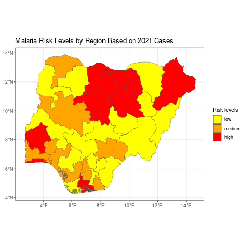

```{r, include = FALSE, warning = FALSE, message = FALSE}
# Load packages 
if(!require(pacman)) install.packages("pacman")
pacman::p_load(tidyverse, knitr, here)

# Source functions 
source(here("global/functions/lesson_functions.R"))

# knitr settings
knitr::opts_chunk$set(warning = F, message = F, class.source = "tgc-code-block", error = T, fig.width = 5, fig.height = 3)
```

# Creating Choropleth maps with {ggplot2}

## Learning objectives {.unlisted .unnumbered}

1.  **Choropleth Maps with {ggplot2}:**

    -   Master `ggplot()` and `geom_sf()` functions for map visualization.

2.  **Data Matching with Polygons:**

    -   Obtain boundaries and disease-related data.

    -   Combine data based on administrative levels.

3.  **Color Scaling Techniques:**

    -   Implement color scales for both continuous and discrete data types.

4.  **Faceting for Map Visualization:**

    -   Use `facet_wrap()` and `facet_grid()` to create small multiple maps.

## Introduction

A choropleth map is a thematic map in which geographic regions are shaded or patterned in proportion to the value of a variable being represented. This variable can be an epidemiological indicator such as disease prevalence or mortality rate. Choropleth maps are particularly useful for visualizing spatial patterns and variations across different regions.

The essential components of a choropleth map include:

**Geographic Regions**: These are the areas that will be represented on the map, such as countries, states, districts, or any other geographic divisions.

**Data Values**: These are the values associated with each geographic region that will be represented on the map, including population density, prevalence, incidence, mortality rate, etc.

**Color Scale**: This is the range of colors used to represent the different data values. Typically, a gradient of colors is used, with lighter colors representing lower values and darker colors representing higher values.



::: side-note
Choropleth maps offer:

-   Clear visuals highlighting spatial data trends.
-   Intuitive designs comprehensible without expertise.

However, they come with challenges:

-   Data classification and color choices can skew appearances.
-   Larger regions might dominate, causing visual bias.
:::

In the following section, you will learn how to create a choropleth map using the {ggplot2} package in R.

### Packages

This code snippet bellow shows how to load necessary packages using `p_load()` from the {pacman} package. If not installed, it installs the package before loading.

```{r warning = F, message = F}
# Load necessary packages

# Use pacman to load multiple packages; it will install them if they're not already installed
pacman::p_load(tidyverse,  # for data wrangling and visualization
               here,       # for project-relative file paths
               sf)         # for spatial data

# Disable scientific notation for clearer numeric displays
options(scipen=10000)
```

------------------------------------------------------------------------

## Data Preparation

Before creating a choropleth map, it is essential to prepare the data. The data should contain the geographic regions and the values you want to visualize.

In this section, you will go through the data preparation process, which includes the following steps:

1.  **Import polygon data**: This is the geographical data that contains the boundaries of each region that you want to include in your map.

2.  **Import attribute data**: This is the data that contains the values you want to visualize on the map, such as disease prevalence, population density, etc.

3.  **Join the polygon and attribute data**: This step involves merging the polygon data with the attribute data based on a common identifier, such as the administrative level or region name. This will create a single dataset that contains both the geographic boundaries and the corresponding data values.

Now, let's go through each step in detail!

### Step 1: Import polygon data

Polygons are closed shapes with three or more sides. In spatial data, polygons are used to represent areas such as the boundary of a city, lake, or any land use type. They are essential in geographical information systems (GIS) for tasks like mapping, spatial analysis, and land cover classification.

::: side-note
Shapefiles are a common format for storing spatial data. They consist of at least three files with extensions .shp (shape), .shx (index), and .dbf (attribute data).
:::

In R, you can load shapefiles using the `sf` package. In our lesson today, we will be working with malaria data sourced from the Nigeria Epi Review (2022).

```{r render = .reactable_10_rows, message = FALSE}
# Reading the shapefile
nga_adm1 <- 
  sf::st_read(here::here("data/raw/NGA_adm_shapefile/NGA_adm1.shp")) 
```

::: reminder
The important elements of any ggplot layer are the aesthetic mappings `aes(x,y, …)` which tell ggplot where to place the plot objects.
:::

We can imagine a map just like a graph with all features mapping to an x and y axis. All geometry (`geom_`) types in ggplot feature some kind of aesthetic mapping, and these can either be declared at the plot level, e.g., `ggplot(data, aes(x = variable1, y = variable2))`, or at the individual layer level, e.g., `geom_point(aes(color = variable3))`.

Bellow you can see that `geom_sf()` is used to trace the boundaries of the different states of Nigeria. Similarly, different layers can be added on top.

```{r}
ggplot()+
  geom_sf(data = nga_adm1)+
  labs(title = "Nigeria Shapefile Overview")
```

Here, we first read the Nigeria shapefile using `sf::st_read()` and then plot it using `ggplot`. The `geom_sf()` function is used to render the spatial data, and `labs()` is used to add a title to the plot.

::: pro-tip
Since the shapefile was loaded using `sf::st_read()`, we don't need to specify the axis names. In fact, the coordinates are stored as a multipolygon object in the geometry variable, and `geom_sf()` automatically recognizes them.
:::

::: side-note
For users who are interested in accessing subnational boundary data in R, there are a couple of packages available on GitHub which make this process straightforward:

-   The {rgeoboundaries} (<https://github.com/wmgeolab/rgeoboundaries>) fetches data from the [Geoboundaries](https://www.geoboundaries.org/), an open database of political administrative boundaries.

-   The {rnaturalearth} (<https://github.com/ropensci/rnaturalearth>) fetches data from [Natural Earth](https://www.naturalearthdata.com/), a public domain map dataset.
:::

### Step 2: Import Attribute Data

::: vocab
In the context of choropleth maps, the "attribute data" refers to the quantitative or qualitative information that will be used to shade or color the various geographical areas on the map. For instance, if you have a map of a country's regions and wish to shade each based on its population, the population data would be considered the attribute data.
:::

As highlighted above, we will be using the number of malaria cases reported in Nigeria for the years 2000, 2006, 2010, 2015, and 2021.

```{r render = .reactable_10_rows, message = FALSE}
# Reading the attribute data
malaria_cases <- read_csv(here::here("data/malaria.csv"))
malaria_cases
```

### Step 3: Checking the Joined Data

It is essential to check and validate the joined data to ensure that the merge will be successful and the data will be accurate.

```{r warning = F, message = F}
# Validate the joined data
all.equal(unique(nga_adm1$NAME_1), unique(malaria_cases$state_name))

# Identify the mismatches
setdiff(unique(nga_adm1$NAME_1), unique(malaria_cases$state_name))
```

In the code snippet provided, we're comparing the unique region names between the `nga_adm1` and `malaria_cases` datasets using the `all.equal()` function. This is to ensure that all the regions in the shapefile align with their counterparts in the attribute data.

If the region names are identical, `all.equal()` will return `TRUE.` However, if there are discrepancies, it will detail the differences between the two sets of region names.

It's noted that the "Water body" is present in the shapefile but not in the `malaria_cases`. Since "Water body" isn't a proper region, it should be removed prior to joining the datasets. We can do this with `filter()`.

```{r}
nga_adm1 <- filter(nga_adm1, NAME_1 != "Water body")
```

### Step 4: Join Data by Administrative Levels

Now we'll get the data we want to plot on the map. The important thing is that the region names are the same in the shapefile as in your data you want to plot, because that will be necessary for them to merge properly.

Before joining the two datasets, we need to define the join key (`by =`).

::: reminder
Remember to review the lesson on joining tables for more details on how to merge data.frames in R if you are not familiar with joining.
:::

```{r}
# Add population data and calculate cases per 10K population
malaria <- malaria_cases %>% 
     left_join(nga_adm1,                        
               by = c("state_name" = "NAME_1")) %>% 
     st_as_sf() # convert to shapefile 

# Select the most important columns
malaria2 <- malaria%>% 
     select(state_name,  cases_2000, cases_2006, cases_2010, cases_2015, cases_2021, geometry)
```

In this step, we merge the shapefile data `nga_adm1` with `malaria_cases` data using `left_join()` from the {dplyr} package. The `by` argument is used to specify the common column on which to merge the datasets.

Finally, we convert the merged data to a shapefile using `st_as_sf()`.

We can keep only the important variables that will be used in the construction of the plots by using `select()`.

::: recap
In this part of the lesson, we learned about the importance of administrative levels in spatial data and how to join spatial and attribute data by administrative levels using the {dplyr} package in R and how to check and validate the joined data.
:::

------------------------------------------------------------------------

## Creating a Beautiful Choropleth Map with {ggplot2}

### Using the Fill Variable (i.e., Attribute Variable)

To display the number of cases, for 2021 for example, we need to fill the polygons drawn with `geom_sf()` using the `fill` variable. This is very straightforward as it follows the same logic as the syntax of {ggplot2} package.

```{r}
ggplot(data=malaria2) + 
  geom_sf(aes(fill=cases_2021)) +   # set fill to vary by case count variable
  labs(title = "Nigeria Malaria Distributed Cases") + 
  theme_void()
```

We create a basic choropleth map using {ggplot2}. The `fill` aesthetic is set to vary by the `cases` variable, which colors the regions based on the number of Malaria cases.

### Customizing the Map

We can customize the map by adding titles to the axes and the legend, adding a north arrow and scale bar using `ggspatial::annotation_north_arrow()` and `ggspatial::annotation_scale()`, and changing the theme to `theme_bw()`.

```{r}
ggplot(data=malaria2) + 
  geom_sf(aes(fill=cases_2021)) +   # set fill to vary by case count variable
  labs(title = "Nigeria Malaria Distributed Cases (2021)",
       fill = "Number of Cases") +
  xlab("Longitude")+
  ylab("Latitude")+
  ggspatial::annotation_north_arrow(location = "br")+
  ggspatial::annotation_scale(location = "tr")+
  theme_bw()
```

::: recap
In this section, we first crafted a basic choropleth map using {ggplot2} to visualize regional malaria cases in Nigeria for 2021. Then, we enhanced the map by adding **titles**, **axis-labels**, a **north arrow**, a **scale bar**, and applying a monochrome **theme**.
:::

::: r-practice
**Q: Construct your beautiful choropleth map**

Construct a choropleth map to display the distribution of Malaria cases in 2015, using the `cases_2015` column from the `malaria2` dataset. You can elevate your map's design and clarity by incorporating titles, axis labels, and any other pertinent labels.
:::

------------------------------------------------------------------------

## Color Scaling

### Color Scaling for Continuous Attributes

The `scale_fill_continuous()` function from the {ggplot2} package in R is used to apply continuous color scaling to a choropleth map.

We can customize the color palette used for continuous color scaling by specifying the `low` and `high` parameters in the `scale_fill_continuous()` function.

```{r}
# Create a ggplot object
ggplot(data = malaria2) +
  geom_sf(aes(fill = cases_2021)) +
  scale_fill_continuous(low = "yellow", high = "red", name = "Cases") + # apply continuous color scaling
  ggtitle("Distribution of Malaria Cases by Region in 2021") + # Add the corrected title here
  theme_bw()
```

::: recap
In this section, we learned how to apply continuous color scaling to a choropleth map using the `scale_fill_continuous()` function from the {ggplot2} package in R and how to customize the color palette.
:::

### Color Scaling for Discrete Attributes

::: reminder
Discrete data is a type of quantitative data that can only take specific, separate values. It is often the result of counting objects or events. Discrete data is important in choropleth maps as it allows us to represent the count or quantity of objects or events in different regions.
:::

The `scale_fill_brewer()` function from the {ggplot2} package in R is used to apply discrete color scaling to a choropleth map.

Before applying the discrete color scaling, we will need to create a new discrete column, which could be a risk level based on the number of cases. For this, we can use `mutate()` combined with `case_when()`.

```{r warning = F, message = F}
# Transforming the data: Creating a new 'risk' column based on the number of cases in 2021
malaria3 <- malaria2 %>%
  mutate(risk = case_when(cases_2021 < quantile(cases_2021, 0.5) ~ 'low',
                          cases_2021 > quantile(cases_2021, 0.75) ~ 'high', 
                          TRUE ~ 'medium')) 

# Visualizing the data
ggplot(data = malaria3) +
  geom_sf(aes(fill =  fct_reorder(risk, cases_2021)))+ # The risk levels are reordered based on the number of cases
  scale_fill_brewer(palette = "Set4", "Risk levels")+ 
  theme_bw()
```

You can also create a custom color palette for discrete variables.

```{r warning = F, message = F}
custom_palette <- c("yellow", "orange", "red") # create a custom color palette manually

# Apply custom color palette
ggplot(data = malaria3) + # Create a ggplot object
   geom_sf(aes(fill =  fct_reorder(risk, cases_2021))) + # reorder the risk labels according to the number of cases
   scale_fill_manual(values = custom_palette, name = "Risk levels") + 
   coord_sf(expand = TRUE) +
   ggtitle("Malaria Risk Levels by Region Based on 2021 Cases") + # Add title here
   theme_bw()
```

::: recap
In this section, we learned how to apply discrete color scaling to a choropleth map using the `scale_fill_brewer()` function from the {ggplot2} package and how to customize the color palette.
:::

::: practice
**Q: Create a your own color palette**

Create a your own color palette distinct from the initial one, and display the Malaria cases across Nigeria for 2000 using this custom color palette. Don't forget to incorporate additional aesthetic enhancements.
:::

## Facet Wrap vs. Grid

-   `facet_wrap()`: This function wraps a 1D sequence of panels into 2D. This is useful when you have a single variable with many levels and want to arrange the plots in a more space-efficient manner.
-   `facet_grid()`: This function creates a matrix of panels defined by row and column faceting variables. It is most useful when you have two discrete variables, and all combinations of the variables exist in the data.

::: pro-tip
-   `facet_wrap()` is used for single variable faceting, while `facet_grid()` is used for two-variable faceting.
-   `facet_wrap()` arranges the panels in a 2D grid, while `facet_grid()` arranges them in a matrix.
:::

### Creating Small Multiples using facet_wrap()

We can use the `facet_wrap()` function to create small multiples based on a given variable. In the following example, we can use the `year` variable.

::: reminder
Remember that color scaling can be adjusted by `scale_fill_continuous()` if the variable is continuous or by `scale_fill_brewer()` if the variable is discrete.
:::

Here, we need to make a slight adjustment to the structure of our dataset. Since the cases are presented by year and each year is represented in a separate column, we'll use the `pivot_longer()` function to consolidate them into a single column, along with an identifier key.

```{r, render = .reactable_10_rows, message = FALSE}
malaria3_longer <- malaria3 %>%
  pivot_longer(cols = `cases_2000`:`cases_2021`, names_to = "year", values_to = "cases")
```

It seems that the variable `year` in our dataset has a prefix `cases_` that we would like to remove for aesthetic reasons before plotting.

Here's how we can do it using the `str_replace()` function from {stringr} package, which is part of the tidyverse:

```{r}
# Recode the 'year' variable by removing the 'cases_' prefix
malaria3_longer$year <- str_replace(malaria3_longer$year, "cases_", "")
```

After executing the code above, the `year` variable in our `malaria3_longer` dataset will no longer have the `cases_` prefix, making it cleaner for visualization purposes.

Now we want to create Small Multiples using `facet_wrap()`.

```{r}
# Create ggplot object using facet_wrap
ggplot(data = malaria3_longer) +
  geom_sf(aes(fill = cases)) +
  facet_wrap(~ year)+
  scale_fill_continuous(low = "green", high = "red") + # apply continuous color scaling
  theme_void()
```

We can add another variable to the `facet_wrap()`. Here we add `risk`, but we will use only 2000 and 2021 cases for demonstration purposes:

```{r}
ggplot() +
  geom_sf(data = nga_adm1) + 
  geom_sf(aes(fill = cases), data = filter(malaria3_longer, year %in% c("2000", "2021"))) +
  facet_wrap(year ~ risk)+
  coord_sf(expand = TRUE)+
  scale_fill_continuous(low = "green", high = "red")+
  theme_void()
```

In the last plot bellow, you will notice that we used a continuous fill variable, but we also used a `facet_wrap` on two other discrete variables.

Now, we will use `facet_grid()` to create a grid of plots. For each year (2000 and 2021), separate plots are made for each risk level, giving an easy visual comparison across both years and risks.

```{r}
ggplot() +
  geom_sf(data = nga_adm1) + # need the 
  geom_sf(aes(fill = cases), data = filter(malaria3_longer, year %in% c("2000", "2021"))) +
  facet_grid(year ~ risk)+
  coord_sf(expand = TRUE)+
  scale_fill_continuous(low = "green", high = "red")+
  labs(title = "Distribution of Malaria cases and risk levels in Nigeria",
       subtitle = "2000 & 2021")+
  xlab("Longitude")+
  ylab("Latitude")+
  theme_void()
```

::: pro-tip
`facet_grid()` is ideal when you have two factors and you want to explore every combination. `facet_wrap()` is better when you have just one factor or when you have multiple factors but want a simpler layout.

Choosing between them often depends on the specific needs of your data and how you want to visualize the relationships.
:::

::: challenge
**Q: Analyze the distribution of malaria cases**

Your goal now is to analyze the distribution of malaria cases in Nigeria for the years 2000 and 2021. But you will need first to categorize the data into risk levels using the median (high/low), and then visualize this information on a map.
:::

::: recap
In this section, we learned the differences between `facet_wrap()` and `facet_grid()`, and how to create small multiples using both of these functions.
:::

## WRAP UP! {.unnumbered}

Today, we went deep into the world of choropleth maps, unlocking the power of visual geographical representation.

You've gained insights into:

-   The essence and components of a choropleth map.

-   The pros and cons of these maps.

-   Data preparation essentials for choropleth visualization.

-   Crafting maps with {ggplot2} and applying varied color palettes.

-   Harnessing `facet_wrap()` and `facet_grid()` for intricate map designs.

## Learning outcomes {.unlisted .unnumbered}

Congratulations on completing this lesson! Let's recap the cognitive journey you've taken:

1.  **Knowledge & Understanding:**

    -   Recognized the definition and components of a choropleth map.

    -   Comprehended the advantages and limitations of choropleth maps.

2.  **Application:**

    -   Prepare data specifically for the creation of a choropleth map.

    -   Employed {ggplot2} in R to design a choropleth map.

    -   Implemented continuous and discrete color scaling techniques.

3.  **Analysis:**

    -   Differentiated between continuous and discrete color scaling.

4.  **Synthesis:**

    -   Integrated various components to create small multiples using `facet_wrap()` and `facet_grid()`.

With these skills in hand, you're now equipped to innovate with different datasets and visualize them in impactful ways. Dive in, experiment, and enhance your map-making journey using {ggplot2} in R. Happy mapping!

## Solutions {.unnumbered}

**1. Construct your beautiful choropleth map**

Construct a choropleth map to display the distribution of Malaria cases in 2019, using the `cases_2019` column from the `malaria2` dataset. You can elevate your map's design and clarity by incorporating titles, axis labels, and any other pertinent labels.

```{r}
ggplot(data=malaria2) + 
  geom_sf(aes(fill=cases_2015)) +
  labs(title = "Malaria Cases in Nigeria (2015)",
       fill = "Cases Count",
       x = "Longitude",
       y = "Latitude") +
  ggspatial::annotation_north_arrow(location = "br")+
  ggspatial::annotation_scale(location = "tr")+
  theme_void()
```

**2. Create your own color palette**

Create a your own color palette distinct from the initial one provided bellow, and display the Malaria cases across Nigeria for 2000 using this custom color palette. Don't foreget to incorporate additional aesthetic enhancements.

```{r}
new_palette <- c("gray", "orange", "red") # Define a different set of colors
ggplot(data=malaria3) + 
   geom_sf(aes(fill =  fct_reorder(risk, cases_2000))) + # Reorder risk labels according to year 2000 cases
   scale_fill_manual(values = new_palette, "Risk Levels") + 
   labs(title = "Malaria Cases Distribution in Nigeria",
        fill = "Cases Count",
        x = "Longitude",
        y = "Latitude") +
   coord_sf(expand = TRUE)+
   theme_void()
```

**3. Analyze the distribution of malaria cases**

Your goal now is to analyze the distribution of malaria cases in Nigeria for the years 2000 and 2021. But you will need first to categorize the data into risk levels using the median (high/low), and then visualize this information on a map.

```{r}
# Pivoting the data
malaria3_longer <- malaria2 %>%
  pivot_longer(cols = `cases_2000`:`cases_2021`, names_to = "year", values_to = "cases")

# Categorizing risk based on median
malaria3_longer %>%
  mutate(risk = case_when(
    cases <= median(cases) ~ 'low',
    cases > median(cases) ~ 'high'
  )) -> malaria3_longer2

# Cleaning up the year values
malaria3_longer2$year <- str_replace(malaria3_longer2$year, "cases_", "")

# Plotting the data
ggplot() +
  geom_sf(data = nga_adm1) + 
  geom_sf(aes(fill = cases), data = filter(malaria3_longer2, year %in% c("2000", "2021"))) +
  facet_grid(year ~ risk) +
  coord_sf(expand = TRUE) +
  scale_fill_continuous(low = "green", high = "red") +
  labs(title = "Malaria cases and risk levels in Nigeria",
       subtitle = "2000 & 2021") +
  xlab("Longitude") +
  ylab("Latitude") +
  theme_void()
```

## Contributors {.unlisted .unnumbered}

The following team members contributed to this lesson:

`r .tgc_contributors_list(ids = c("imad", "kendavidn", "joy"))`

## References {.unlisted .unnumbered}

-   Wickham, Hadley, Winston Chang, and Maintainer Hadley Wickham. "Package 'ggplot2'." *Create elegant data visualisations using the grammar of graphics. Version* 2, no. 1 (2016): 1-189.

-   Wickham, Hadley, Mine Çetinkaya-Rundel, and Garrett Grolemund. *R for data science*. " O'Reilly Media, Inc.", 2023.

-   Lovelace, Robin, Jakub Nowosad, and Jannes Muenchow. *Geocomputation with R*. CRC Press, 2019.

`r .tgc_license()`
