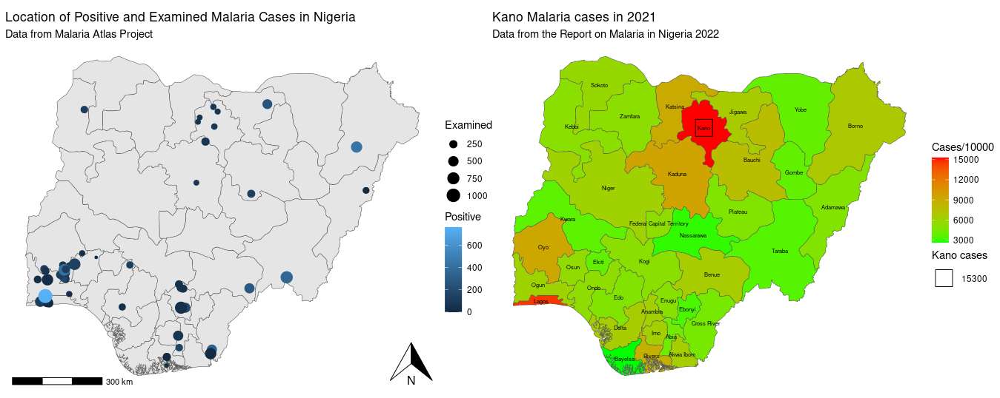

```{r, include = FALSE, warning = FALSE, message = FALSE}
# Load packages 
if(!require(pacman)) install.packages("pacman")
pacman::p_load(tidyverse, knitr, here)

# Source functions 
source(here("global/functions/misc_functions.R"))

# knitr settings
knitr::opts_chunk$set(warning = F, message = F, class.source = "tgc-code-block", error = T)

# Source autograder script quietly 
source(here("lessons/ls99_template_autograder.R"))
```

## Introduction

In the geospatial data visualization, maps are powerful storytelling tools. However, a map without clear annotations and labels is like a book without titles or chapter headings. While the story might still be there, it becomes significantly harder to understand, interpret, and appreciate.

In this lesson, we place a special emphasis on the importance of annotating and labeling maps. Proper annotation transforms a simple visualization into an informative guide, allowing viewers to quickly grasp complex spatial data. With precise labeling, areas of interest can be immediately recognized, facilitating a clearer comprehension of the data's narrative.



## Learning objectives {.unlisted .unnumbered}

**Learning Objectives: Advanced Geospatial Visualization Techniques**

By the end of this section, you should be able to:

-   Incorporate continuous data indicators into choropleth maps for enhanced granularity.

-   Effectively overlay state names onto choropleth maps, ensuring clarity and readability.

-   Seamlessly integrate state names with increase rates on maps without compromising legibility.

-   Apply techniques to accentuate specific regions on a map while retaining the overall context.

-   Determine optimal point placement strategies and integrate them effectively into geospatial visualizations.

Upon mastering these objectives, you will have the tools and knowledge to create rich, detailed, and informative geospatial visualizations.

## Packages

```{r warning = F, message = F}
# Load packages 
if(!require(pacman)) install.packages("pacman")
pacman::p_load(______,
               ______,
               ______,
               ______,
               ______,
               ______,
               ______,
               ______,
               ______) 

# Unable scientific notation 
options(scipen=100000)
```

## Data Preparation

‣ Includes reading in datasets, merging related information, and filtering out irrelevant entries.

‣ Geographical shapefile data for Nigeria's administrative boundaries.

```{r}
# Reading the geographical shapefile data
nga_adm1 <- ______::______(here::here("data/raw/NGA_adm_shapefile/NGA_adm1.shp"))
```

‣ Load data related to malaria cases in Nigeria.

```{r}
# Reading the attribute data related to malaria cases
malaria_cases <- read_csv(here::here("data/malaria.csv"))
```

‣ Filter out "Water body" from shapefile `nga_adm1`

‣ Combine the data frames using state names as a reference.

‣ Merged data is then converted into a format suitable for geospatial visualizations.

```{r}
# Filtering out the 'Water body' entries from the geographical data
nga_adm1 <- filter(______, ______ = ______)

# Merging the geographical data with the malaria cases data
malaria <- malaria_cases %>% 
     left_join(nga_adm1, by = c(______ = ______)) %>% 
     st_as_sf()
```

‣ Narrow down our dataset to specific columns

```{r}
# Filtering down to essential columns for our analysis
malaria2 <- malaria %>% 
  select(state_name,  cases_2000, cases_2006, cases_2010, cases_2015, cases_2021, geometry)
```

‣ Load data indicating the population of different states or regions in Nigeria.

```{r}
# Reading in population data for different regions of Nigeria
population_nigeria <- read_csv(here::here("data/population_nigeria.csv"))
```

‣ Merge the population data with our malaria cases data, to enrich our dataset.

```{r}
# Combining the population data with our malaria data
malaria3 <- malaria2 %>% 
     left_join(population_nigeria, by = c(______)) %>% 
     st_as_sf()
```

‣ Address aesthetic concerns with labeling a small area like the "Federal Capital Territory" on a map:

```{r}
# Modify the state names, changing "Federal Capital Territory" to "Capital"
malaria3$state_name <- ifelse(______ == ______, ______, ______)
```

## Building a Simple Choropleth Map

::: reminder
Choropleth maps are powerful visualization tools that display divided geographical areas shaded or patterned in proportion to the value of a variable.
:::

‣ Example: Choropleth map to visualize the distribution of malaria cases across Nigeria for 2021.

```{r}
# Constructing the choropleth map using ggplot2
ggplot(data=malaria3) + 
  geom_sf(aes(fill=______)) + # The fill color is determined by the number of malaria cases in 2021, scaled per 1000
  labs(title = "Nigeria Malaria Distributed Cases in 2021", fill = "Cases per 1000")+ # Adding labels and title to the plot
  scale_fill_continuous(low = ______, high = ______)+ # Using a continuous color scale transitioning from green to red
  theme_void() # Using a minimal theme for better visualization of the map
```

::: practice
### Q: Modify the provided choropleth map to visualize the distribution of malaria cases in Nigeria for the year 2015.

**Instructions**

1)  Update the data mapping in the `geom_sf()` function to reflect malaria cases for the year 2015.

2)  Adjust the title in the `labs()` function to indicate that the visualization pertains to 2015.

3)  Change the color gradient in `scale_fill_continuous()` to transition from blue (`low` cases) to yellow (`high` cases).

Below a starter code:

```{r, eval=FALSE}
# Constructing the choropleth map for 2015 using ggplot2
ggplot(data=malaria3) + 
  geom_sf(aes(fill=___________)) +  # Fill in the correct data column for 2015
  labs(title = "______________________", fill = "Cases per 1000")+  # Update the title appropriately
  scale_fill_continuous(___________)+  # Modify the color scale
  theme_void() 
```
:::

------------------------------------------------------------------------

## Adding Continuous Data Indicators to the Choropleth Map

‣ Look beyond raw case numbers and focus on rates, particularly incidence rates.\
\
‣ Incidence rate provides a normalized measure, making comparisons more meaningful.

**Understanding Incidence**

‣ It quantifies the number of new cases of a disease that occur within a specific time frame.

‣ Mathematically, it's given by:

$$ \text{Incidence} = \frac{\text{Number of new cases during the time period}}{\text{Population at risk at the start of the period}} $$

‣ Incidence of malaria in different states of Nigeria for the year 2021:

```{r}
# Visualizing Malaria Incidence in 2021 using a Choropleth Map
ggplot(data = malaria3) +
  # Filling each state with a color representing the incidence rate in 2021.
  geom_sf(aes(fill = round(______/______, _____))) + 
  # Add the name of each state to its centroid
  geom_sf_text(aes(label = str_wrap(______, ______)), size = ______)+
  # Adding title and legend title.
  labs(title = "Nigeria Malaria Incidence in 2021", fill = "Incidence")+
  # Using a continuous color scale 
  scale_fill_continuous(low = ______, high = ______)+
  # Using a minimalistic theme for clearer visualization.
  theme_void()
```

‣ Visualization offers an immediate grasp of the malaria situation in Nigeria.

## Exploring Malaria Case Increase Rates Using Choropleth Maps

‣ Understanding the change in the number of disease cases over time can provides insights:

-   effectiveness of interventions

-   disease progression

-   areas where increased resources might be needed.

‣ Example: Visualize the percentage increase in malaria cases from 2015 to 2021 across different states in Nigeria.

**Computing the Increase Rate**

‣ The increase rate for each state is computed as:

$$ \text{Increase Rate} = \left( \frac{\text{Cases in 2021} - \text{Cases in 2015}}{\text{Cases in 2015}} \right) \times 100\% $$

‣ Shows the percentage growth (or decrease) in malaria cases from 2015 to 2021.

**Visualization of Increase Rates**

‣ Example: Visualize the percentage increase in malaria cases from 2015 to 2021 across different states in Nigeria.

```{r}
# Calculate the increase rate for each state
malaria3 <- malaria3 %>%
  mutate(increase_rate = round(((______ - ______) / ______) * 100)) 

# Visualizing the increase rates using a choropleth map
ggplot(data = malaria3) +
  # Coloring each state based on its increase rate
  geom_sf(aes(fill = ______), color="white", size = 0.2) +
  # Using a continuous color scale to represent increase rates, transitioning from green to red
  scale_fill_continuous(name="Increase rate (%)", limits=c(0,70), low = "green", high = "red", breaks=c(0, 20, 40, 60))+
  # Labeling each state with its increase rate percentage
  geom_sf_text(aes(label = str_wrap(paste0(______, ______), 1)), size = 2)+
  # Adding a title to the plot
  labs(title = "Nigeria Malaria Increase rate in 2021 compared with 2015")+
  theme_void()
```

‣ Quickly identify regions with significant growth in malaria cases over the selected period.

‣ Pinpoint regions where malaria is on the rise and potentially allocate resources more effectively.

## Labeling the Choropleth Map with State Names

‣ Labels can significantly enhance the clarity of the visualization.

‣ Especially helpful when audiences are not familiar with all geographical boundaries shown.

‣ Example, adding state names to the `malaria3` dataset makes the data more accessible and understandable:

```{r}
# Constructing a choropleth map with state names
ggplot(data = malaria3) +
  # Fill each state based on the number of malaria cases in 2021, scaled per 10,000
  geom_sf(aes(fill = ______/______)) +
  # Add the name of each state to its centroid
  geom_sf_text(aes(label = str_wrap(state_name, 1)), size = 2)+
  # Add titles and labels
  labs(title = ______, fill = ______)+
  # Use a continuous color scale from green to red 
  scale_fill_continuous(low = "green", high = "red")+
  theme_void()
```

‣ A clear and informative map of malaria cases in Nigeria with each state labeled for easy reference!

## Displaying Combined State Names and Increase Rates on the Choropleth Map

‣ Pairing state names with their corresponding increase rates provides a richer, detailed view of the data

‣ Example: Choropleth map showcasing the malaria cases per 10000 residents across Nigeria in 2021

-   Include labels combining state names and their respective increase rates from 2015.

```{r}
# Combine the state names and their respective increase rates into a single label
malaria3$label_text <- paste(______, ______)

# Visualize the data
ggplot(data = malaria3) +
  # Create a choropleth map shaded based on the number of malaria cases in 2021 per 10,000 residents
  geom_sf(aes(fill = ______/______)) +
  # Add combined labels (state name and increase rate) to each state's centroid
  geom_sf_text(aes(label = str_wrap(______, ______)), size = 2)+
  # Add titles and customize the color legend
  labs(title = "Nigeria Malaria cases in 2021 (%)", fill = "Cases/10000")+
  scale_fill_continuous(low = "green", high = "red") +  # Set color gradient
  theme_void()  # Apply a minimal theme for clarity
```

‣ Efficient communication of two important pieces of information (cases per 10000 and increase rate)

::: practice
### Q: Create a single choropleth map that showcases the malaria increase rates across different states in Nigeria with each state labeled by its name

**Instructions**

1)  Start by setting up the base plot using the malaria3 dataset.

2)  Create a choropleth map where the fill color represents the increase rate from 2015 to 2021.

3)  Label each state with its name using the centroids.

4)  Customize the color scale to transition from green (low increase) to red (high increase).

5)  Add appropriate titles and labels to the plot.

Below a starter code:

```{r, eval=FALSE}
# Combining visualization of increase rates with state names
ggplot(data = malaria3) +
  _______ +  # Fill in the code to generate the choropleth map
  _______ +  # Add state names to each region
  _______ +  # Specify the color scale for increase rates
  _______    # Add titles and labels
```
:::

## Highlighting a Specific Region on the Map while Preserving Context

‣ Use specific graphical elements, like larger markers or distinctive colors to emphasize certain regions while still showcasing the broader data.

‣ Example: Focusing on the "Kano" region of Nigeria.

```{r}
# Calculate centroid coordinates for labeling
centroid_coords <- st_coordinates(st_centroid(______))

# Visualize the malaria cases across Nigeria with an emphasis on Kano
ggplot(data = malaria3) +
  # Create a choropleth map with color based on malaria cases in 2021
  geom_sf(aes(fill = cases_2021/1000)) +
  # Set a continuous color gradient from green to red
  scale_fill_continuous(low = "green", high = "red")+
  
  # Overlay a point on Kano to emphasize it. The size of the point corresponds to the number of cases
  geom_point(data = subset(______, state_name == ______),
             aes(x = st_coordinates(st_centroid(______))[1], 
                 y = st_coordinates(st_centroid(______))[2], size = round(cases_2021/1000)),
             color = ______, shape = 22,  fill = ______) +
  
  # Label each region with its name
  geom_sf_text(aes(label = str_wrap(state_name, 1)), size = 3)+
  
  # Customize the scale of the size of the emphasized point
  scale_size_continuous(range = c(______, ______)) +
  
  # Add title and legends
  labs(title = "Kano Malaria cases in 2021", subtitle = "Data from the Report on Malaria in Nigeria 2022", size = "Kano cases", fill = "Cases/10000",)+
  
  # Apply a minimal theme for clarity
  theme_void()
```

::: recap
While "Kano" is emphasized, all other regions are also displayed with their respective color shading based on malaria cases. This offers a holistic view of the situation across Nigeria, enabling viewers to compare Kano with other regions.

Such an approach is invaluable when you wish to spotlight specific details or areas of interest without sidelining the broader dataset, enriching your data presentations.
:::

------------------------------------------------------------------------

## Labeling Point Locations: Exploring Malaria Positive Rate and Incidence

‣ Visualizing specific data points on a geographical map can provide crucial insights\
\
‣ Example: Malaria prevalence for Nigeria:

```{r}
# Data Retrieval
# The malariaAtlas package provides the `getPR` function to access the parasite rate (PR).
# PR is an essential indicator of malaria prevalence.

# Fetching data for Nigeria for both malaria species
nigeria_pr <- malariaAtlas::getPR(ISO = "NGA", species = "both") %>%
  # Filtering out records with missing PR values
  filter(______(______)) %>% 
  # Removing any rows with missing longitude or latitude
  drop_na(______, ______) %>%
  # Converting the data into a spatial dataframe to facilitate mapping
  st_as_sf(coords = c("longitude", "latitude"), crs = 4326)
```

```{r}
# Setting up a geospatial visualization using ggplot2

# Starting the plot
ggplot() +
  # Plotting the administrative boundaries of Nigeria
  geom_sf(data = _______) + 
  # Adding points for each testing location
  # The color of each point indicates if the test was positive, and the size represents the number of people tested
  geom_sf(aes(size = ______, color = ______), data = ______)+
  # Setting titles, axis labels, and legends for the plot
  labs(title = "Location of Positive and Examined Malaria Cases in Nigeria",
       subtitle = "Data from Malaria Atlas Project",
       color = "Positive",
       size = "Examined")+
  # Adding labels for longitude and latitude
  xlab("Longitude")+
  ylab("Latitude")+
  # Incorporating a north arrow to provide orientation
  ggspatial::annotation_north_arrow(location = "br")+
  # Incorporating a scale bar to assist in distance interpretation
  ggspatial::annotation_scale(location = "bl")+
  # Applying a minimalistic theme for visual clarity
  theme_void()
```

::: recap
This code chunk visualizes the malaria data on a map. It highlights regions based on the number of malaria tests and their outcomes. Specific tools from the `ggspatial` package are used to add cartographic elements, making the map more informative.
:::

::: challenge
### Q: Reflecting the positive rate by size and color

Create a new visualization that represents the positive rate (number of positive cases divided by the number examined) for each location. Modify the size of the points to reflect the positive rate.
:::

------------------------------------------------------------------------

# WRAP UP! {.unnumbered}

Geospatial data visualization is more than just plotting data on a map. It's about narrating a story that's rooted in location and space. This lesson delved deep into a layers-based narrative approach, from the importance of clear annotations to the integration of diverse data types for a richer understanding.

------------------------------------------------------------------------

## Learning outcomes {.unlisted .unnumbered}

By engaging with this lesson on map labeling, you should now be able to:

-   Demonstrate the ability to use clear annotations and labels to make complex spatial data understandable.

-   Show proficiency in integrating continuous indicators, overlaying labels, emphasizing regions, and determining optimal point placements on geospatial maps.

-   Illustrate the importance of contextualizing highlighted areas within the larger geographical landscape to preserve the integrity and interpretability of the map.

-   Utilize the functionalities of key R packages like ggplot2, sf, and ggspatial to facilitate advanced mapping processes.

------------------------------------------------------------------------

# Answer Key {.unnumbered}

### Solution for practice 1

To visualize the distribution of malaria cases in Nigeria for the year 2015, follow the instructions provided in the exercise. Here's the complete solution:

```{r, eval=FALSE}
# Constructing the choropleth map for 2015 using ggplot2
ggplot(data = malaria3) +
  geom_sf(aes(fill = cases_2015 / 1000)) +  # Updated data column to reflect 2015
  labs(title = "Nigeria Malaria Distributed Cases in 2015", fill = "Cases per 1000") +  # Updated title for 2015
  scale_fill_continuous(low = "blue", high = "yellow") +  # Modified color scale to blue-to-yellow gradient
  theme_void() 
```

### Solution for practice 2

To combine the visualization of increase rates with state names, follow the steps below:

```{r, eval=FALSE}
# Combining visualization of increase rates with state names
ggplot(data = malaria3) +
  # Create a choropleth map with fill color based on the increase rate
  geom_sf(aes(fill = increase_rate), color="white", size = 0.2) +
  # Label each region with its state name
  geom_sf_text(aes(label = str_wrap(state_name, 1)), size = 2)+

  # Specify the color scale for increase rates
  scale_fill_continuous(name="Increase rate (%)", 
                        limits=c(0,70), 
                        low = "green", 
                        high = "red", 
                        breaks=c(0, 20, 40, 60)) +
  
  # Add a title and legend to the plot
  labs(title = "Nigeria Malaria Increase Rate from 2015 to 2021", 
       fill = "Increase Rate (%)") +
  
  theme_void()  # Apply a minimalistic theme for clarity

```

In this solution, the choropleth map is created based on the increase rate of malaria cases from 2015 to 2021. Each state in Nigeria is labeled by its name, and the color gradient (from green to red) showcases the magnitude of the increase rate. The map is enhanced with a title and a legend to ensure clarity and comprehension.

------------------------------------------------------------------------

### Solution for practice 3

Create a visualization that represents the positive rate:

```{r, eval=FALSE}
# Adding a positive rate column
nigeria_pr$positive_rate <- (nigeria_pr$positive / nigeria_pr$examined) * 100

ggplot() +
  geom_sf(data = nga_adm1) + 
  geom_sf(aes(size = positive_rate, color = positive_rate), data = nigeria_pr)+
  labs(title = "Location and Positive Rate of Malaria Cases in Nigeria",
       subtitle = "Data from Malaria Atlas Project",
       color = "Positive Rate (%)",
       size = "Positive Rate (%)")+
  xlab("Longitude")+
  ylab("Latitude")+
  ggspatial::annotation_north_arrow(location = "br")+
  ggspatial::annotation_scale(location = "bl")+
  theme_void()
```

## Contributors {.unlisted .unnumbered}

The following team members contributed to this lesson:

`r tgc_contributors_list(ids = c("imad", "kendavidn", "joy"))`

## References {.unlisted .unnumbered}

-   Wickham, Hadley, Winston Chang, and Maintainer Hadley Wickham. "Package 'ggplot2'." *Create elegant data visualisations using the grammar of graphics. Version* 2, no. 1 (2016): 1-189.

-   Wickham, Hadley, Mine Çetinkaya-Rundel, and Garrett Grolemund. *R for data science*. " O'Reilly Media, Inc.", 2023.

-   Lovelace, Robin, Jakub Nowosad, and Jannes Muenchow. *Geocomputation with R*. CRC Press, 2019.
