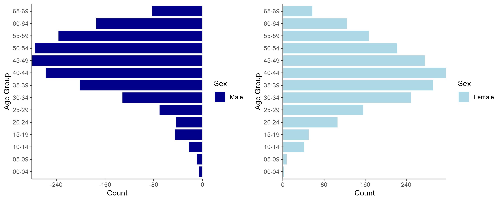
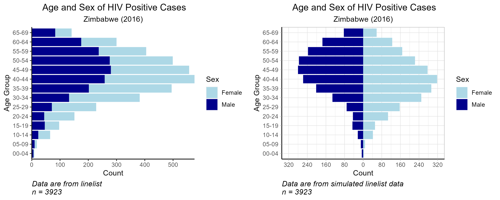

```{r, echo = F, message = F, warning = F}

# require pacman 
if(!require(pacman)) install.packages("pacman")

# Source functions 
source(here::here("global/functions/lesson_functions.R"))

# knitr settings
knitr::opts_chunk$set(warning = F, message = F, class.source = "tgc-code-block", error = T)

```

# Introduction

A demographic pyramid, also known as a population pyramid or an age-sex pyramid, helps to visualize the distribution of a population by two important demographic variables: **age** and **sex**.

Today you will learn about the importance of using demographic pyramids to help visualize the distribution of a disease by age and sex and how to create one using `{ggplot2}`.

Let's get into it!

# Learning Objectives

By the end of this lesson, you will be able to:

-   Explain **the importance of demographic pyramids** for communicating **age and sex-specific patterns** of disease distribution.

-   Understand the **components of a demographic pyramid** and conceptualize it as a modified version of a **stacked bar plot**.

-   **Summarize and prepare data** into the appropriate format for plotting with **{dplyr}** functions.

-   Use **`{ggplot2}`** code to **plot a demographic pyramid using `geom_col()`**, showing total counts or percentages on the x axis.

-   **Customize the plot** by changing the color scheme, labels, and axis.

# Introducing Demographic Pyramids

Population pyramids are graphs that show the distribution of ages across a population. The graph s divided down the center between male and female members of the population, where the y-axis shows the age groups and the x-axis the sex.


The overall plot often takes the shape of a pyramid, hence its name.

Three key features of a demographic pyramid are:

1.  **Age Groups**: The pyramid is divided into horizontal bars, each representing an age group, often in five-year increments (0-4, 5-9, 10-14, etc.).

2.  **Gender Representation**: The left side of the pyramid typically represents males, and the right side represents females, allowing for a quick comparison between the gender distribution within each age group.

3.  **Population Size**: The length of the bars indicates the size of the population in each age group. A longer bar suggests a larger population in that age group.

Through the use of `{ggplot2}` we are able to create pyramids while customizing it to our specific needs. At the end of this lesson, our final plot will look like this:


## The Use of Population Pyramids in Epidemiology

Demographic pyramids are useful for describing and understanding the epidemiology of various diseases, by visualizing the distribution of disease by age and sex.

**Age and Gender-Specific Vulnerability**

Different diseases may affect age groups differently. We know that the incidence of certain communicable diseases can vary with age. In the case of tuberculosis (TB) in Africa, adolescents and young adults are primarily affected in the region. However, in countries where TB incidence has decreased significantly, such as the United States, it is mainly seen in older people, or the immunocompromised. Another disease that demonstrates age variation is malaria, where children under the age of 5 years old account for a high majority of deaths in the region of Africa. HIV has been shown to affect females more than males, especially in younger age groups. This could be due to biological vulnerability or social factors.

Therefore, when describing the epidemiology of communicable diseases such as HIV, Malaria, and TB, it is important to observe the distribution of cases or deaths by age group and sex. This information helps inform national surveillance programs by identifying which age and sex groups experience the highest burden, and who to target for intervention.

::: side-note
**Using Demographic Distribution for Data Quality Assessment**

Demographic pyramids can also play a crucial role in assessing the data quality of routine surveillance systems by helping assess the internal and external consistency.

When trying to assess surveillance data quality standards of certain diseases, external consistency can be evaluated by comparing the national surveillance data with the global epidemiology of that disease. Data calculations based on demographic variables such as age group are sometimes used.

For the instance of TB surveillance data, external consistency can be evaluated by calculating the percentage of children diagnosed with TB within the program and comparing it with the global average cases.
:::

## Conceptualizing Demographic Pyramids

Let's take a closer look at our target demographic pyramid, and break down how it can be graphed using `geom_col()` from `{ggplot2}`.


As you can see, the x-axis is divided in two halves (males and females), which are plotted in opposite directions starting at 0. The units on the x-axis are symmetrical on either side, and the age groups are labelled along the y-axis.

In other words, we can think of it two **bar graphs** -- one for males and one for females.



A demographic pyramid can also be conceptualized as a specialized form of a stacked bar chart. In a traditional stacked bar chart, the segments are piled on top of one another, starting from a baseline of zero and extending outward.

In contrast, a demographic pyramid aligns the bars back-to-back along a central axis. This axis represents the point of division between two categories (male and female populations) with the bars extending in opposite directions to illustrate the proportion of each age group within these categories.



::: key-point
A demographic pyramid is akin to a modified stacked bar chart with two key distinctions:

1)  **Central Axis**: Instead of stacking the bar segments on top of each other, bars are aligned back-to-back along a **central axis**, which acts as the point of division between male and female populations.

2)  **Bar Orientation**: Unlike traditional stacked bars that build from zero outward in one directly, demographic pyramid bars extend in **opposite directions** to represent the size of each age group within the categories.
:::

# Packages

This lesson will require the following packages to be installed and loaded:

```{r warning = F, message = F}
# Load packages 
pacman::p_load(here,       # to locate files
               tidyverse,  # to wrangle and plot data (includes ggplot2)
               apyramid)   # package dedicated to creating age pyramids
```

::: reminder
Every lesson from The GRAPH Courses comes with a code-along RMarkdown script, which you should download and use to follow along with the lesson video or lesson notes.
:::

# Data Preparation

## Intro to the Dataset

For this lesson, we will use a simulated HIV dataset imitating a linelist of HIV cases in Zimbabwe during 2016. For this specific lesson, we will focus on the **age-related** and **sex** variables to create our demographic pyramid.

## Importing Data

Let's start by importing our data into our RStudio environment and taking a closer look at it to better understand the variables we will be using for the creation of our demographic pyramid.

```{r load_data, warning = F, message = F, render = .reactable_10_rows}
hiv_data <- read_csv(here::here("data/hiv_zw_linelist_2016.csv"))

hiv_data
```

Our imported dataset contains **28000** rows and **3** columns containing the `age_group` and `sex` variables we will be using for the creation of our demographic pyramid. Each line (row) corresponds to one patient, while each column represents different variables of interest. The linelist only contains demographic and HIV-related variables (HIV status) . In addition, the `hiv_status` variable provides us with information on the status of individuals (*positive* or *negative*).

Since we are interested on creating a demographic pyramid on HIV prevalence, we first need to filter for HIV positive individuals.

Let's filter data!

```{r hiv_cases, render = .reactable_10_rows}
# Create subset with only HIV positive individuals
hiv_cases <- hiv_data %>% 
  filter(hiv_status == "positive")

hiv_cases
```

Notice that we now have data subset of **3923** rows and **3** columns where all of the individuals are **HIV positive**!

## Data Inspection

Now, before moving to the creation of our demographic pyramid, let's inspect the data by creating a table summarizing the `age_group` and `sex` columns!

For this step, we will use `count()` from **`{dplyr}`**.

```{r summary_table, render = .reactable_10_rows}
hiv_cases %>% 
  count(age_group, sex)
```

We can see that the data is clean and the `age_group` column is correctly organized in ascending order (youngest to oldest).

::: watch-out
Always verify your data's order before plotting a demographic pyramid!

Before creating your demographic pyramid, make sure to check that your data is clean and correctly organized in **ascending order**! This is important when using categorical variables as the order of your `age_group` will affect the order it will be plotted in your pyramid.

In the case of demographic pyramids, we want the youngest age group to be located at the bottom of the y-axis and the oldest age group to be at the top of the y-axis.
:::

## Creating Aggregated Data Subset

Before we get started, we need to create an aggregated data frame that calculates the total number cases per age group, divided by sex. We want the aggregated data frame to look like this:


We have 14 age groups and two sexes, therefore 28 rows. We'll first calculate the sum of each group in the `total` column, then we'll negate the male values and create a the new column called `axis_counts`, then add the last column, `axis_percent`, which presents the totals as percentages.

The reason *male* values are negated is to plot the male bars on the *left side* of the axis!

::: key-point
When using the `geom_col()` function, the count for each group **needs to be pre-calculated** and specified in `aes()` as the x or y variable. In other words, you will need to convert linelist data into summary table with the aggregated number of occurrences for each categorical level. If your data is pre-aggregated, you can skip this aggregation step.
:::

Let's start by using `{dplyr}` to create the summarized data frame, with the 28 rows and 5 column we saw above! We'll use the `group_by()` and `summarise()` functions to do this.

::: reminder
Don't forget to negate the male counts in order to obtain the male bar plot on the *left side* of the graph! We can do this with the `mutate()` function.
:::


```{r count_occurences, render = .reactable_5_rows, message=F}

# Create new subset
pyramid_data <- 
  hiv_cases %>% 
  
  # Count total cases by age group and gender
  count(age_group, sex, name = "total") %>%  
  
  # Create new columns for x-axis values on the plot
  mutate(
    # New column with axis values - convert male counts to negative
    axis_counts = ifelse(sex == "male", -total, total),
    # New column for percentage axis values
    axis_percent = round(100 * (axis_counts / nrow(hiv_cases)), 
                         digits = 1))

head(pyramid_data)
```

Notice that the male values in the `axis_counts` and `axis_percent` columns are *negative*!

Now that the data is summarized and in the appropriate format, we can use our new `pyramid_data` data frame to plot the pyramid with `{ggplot2}`!

::: practice
Let's test your understanding with the following multiple-choice question:

1.  **When preparing data for plotting with `geom_col()`, what modification must be made to the count values?**
    a.  All total counts must be negated.
    b.  Counts must be multiplied by 2.
    c.  Counts must be converted into percentages.
    d.  Male counts must be negated (multiplied by -1).

*Answer key can be found at the end of this document.*
:::

# Plot Creation

As we mentioned earlier, a demographic pyramid can be thought of as a modified version of a stacked bar plot.

To create a basic stacked bar plot with `geom_col()`, we plot a categorical variable (e.g., `age_group`) against a continuous variable (e.g., `total`), and set `fill` color to a second categorical variable (e.g., `sex`).

```{r}
# Basic stacked bar plot

# Begin ggplot  
ggplot() +
 
# Create bar graph using geom_col()
  geom_col(data = pyramid_data,   # specify data to graph
           aes(x = age_group,     # indicate categorical x variable
               y = total,         # indicate continuous y variable
               fill = sex))  +    # fill by second categorical variable
# Modify theme
  theme_light() +

# Flip X and Y axes
  coord_flip()
```

Here we used the `total` variable from `pyramid_data`, where all counts are positive.


::: recap
In order to use the `geom_col()` function for a stacked bar chart, your dataset needs to include the total sums aggregated by each categorical variable (**`age_group`** and **`sex`**)!

The basics of plotting bar graphs with {ggplot2} is covered in our introductory data visualization course, Data on Display. Further applications of bar charts for epidemic reporting are taught in our lesson on Visualizing Comparisons and Compositions. All content can be found on our [website](thegraphcourses.org).
:::

## Using `geom_col()` for demographic pyramids

Now we will build on the basic stacked bar code above to create a demographic pyramid.

This time we use `axis_counts` for the y axis, which has negative male counts.


```{r geom_col}

demo_pyramid <- 
  ggplot() +
 
  geom_col(data = pyramid_data, #specify data to graph
           aes(
             x = age_group,    # indicate x variable
             y = axis_counts,  # indicate NEGATED y variable
             fill = sex))  +   # fill by sex
  theme_light() +
  coord_flip()


demo_pyramid
```

::: key-point
A demographic pyramid is a version of a stacked bar chart, with the bars' horizontal alignment adjusted along the x axis.
:::

We can also create the same population pyramid using the percent totals on our y-axis.


```{r geom_col_percent, warning=F}

demo_pyramid_percent <- 
  ggplot() +
  geom_col(data = pyramid_data, 
           aes(x = age_group,
               y = axis_percent, # use the pre-calculated percentages
               fill = sex)) +
  coord_flip() +
  theme_light()

demo_pyramid_percent
```

::: side-note
Multiple packages are available to facilitate data analysis and data visualization. In the case of demographic pyramids, the `{apyramid}` package can be a useful tool. This package from the **R4Epis** project contains a function `age_pyramid()`, which allows for the rapid creation of population pyramids:

```{r}
hiv_cases %>% # can use the original linelist
  # Grouping variable must be a factor
  mutate(age_group = factor(age_group)) %>% 
apyramid::age_pyramid(# 2 required arguments:
                      age_group = "age_group",
                      split_by = "sex")
```

However, this package has limited functionality and few options for customization. `{ggplot2}` a much more versatile approach, and uses syntax we are already familiar with.

Additional information about the function can be read [**here**](https://cran.r-project.org/web/packages/apyramid/vignettes/intro.html) or by entering `?age_pyramid` in your R console.
:::

::: practice
Let's test your understanding with the following multiple-choice questions (Answer Key is located at the end):

2.  **When using `geom_col()`, what type of x variable should your dataset include?**
    a.  Continuous variables
    b.  Categorical variables
    c.  Binary variables
    d.  Ordinal variables
3.  **Which `{ggplot2}` function can you use to flip the x and y axes?**
    a.  `coord_flip()`
    b.  `x_y_flip()`
    c.  `geom_flip()`
    d.  Any of the above
:::

::: practice
Now let's test your understanding with the following coding practice question:

**We will be using a cleaned and prepared dataset containing the total population of Zimbabwe in 2016 grouped by age group and sex.**

Start by loading the prepared dataset as:

```{r loading_coding_practice}

zw_2016 <- readRDS(here::here("data/population_zw_2016.rds"))

zw_2016
```

*Note that the male total count is already **negated**!*

5.  **Create a demographic pyramid for the total population of Zimbabwe in 2016 using the `geom_col()` function from the `{ggplot2}` package. Make sure to add a white border around each bar!**

```{r coding_question4, eval=FALSE}
Q4_pyramid_zw_2016 <- 
  
# Begin ggplot
  ggplot() +

# Create bar graph using geom_bar
  geom_col(data = ____,
           aes(x = ____,
               y = ____,
               fill = ____),
           color = ____) +
  
# Flip x and y axes    
  ____
```
:::

# Plot Customization

So far, you have learned how to create a demographic pyramid using `{ggplot2}` as shown below:

```{r geom_col_final, warning=FALSE}

demo_pyramid
```

However, in order to create an informative graph, a certain level of plot customization is needed. For instance, it is important to include informative labels and to re-scale the x and y axis for better visualization.

Let's learn some useful `{ggplot2}` customization!

## Axis Adjustments

The current axis settings result in an asymmetrical representation, with the right side (female) extending further than the left (male) due to a higher case count in the largest female age group. For an accurate comparison, it's essential that both sides mirror each other in range.

We will adjust the axis limits to equal positive and negative values, ensuring that the data is symmetrically visualized for a clear and balanced comparison.

We will start by re-scaling the *total count* axis, or in the case of our plot, the **y-axis**. For this, we will start by identifying the maximum and saving it as an object.

```{r max_min}

max_count <- max(pyramid_data$total)

max_count
```

Now that we have identified that the maximum value for *total count* is **318**, we can use it to re-scale our y-axis accordingly.

In this particular case, we want to rescale our y axis to be symmetrical. Therefore we will take the biggest absolute value and use it as our limit for both the *positive* and *negative* sides.

In this case, we will use our maximum value.

```{r custom_axis, warning=F}

custom_axes <- 

# Use previous graph
  demo_pyramid +
  
# Adjust y-axis (total count)  
  scale_y_continuous(

    # Specify limit of y-axis using max value and making positive and negative
    limits = c(-max_count, max_count),
    
    # Specify the spacing between axis labels
    breaks = scales::breaks_width(100),
    
    # Make axis labels absolute so male labels appear positive
    labels = abs)


custom_axes
```

Adjusting axis limits to equal extents on both sides ensures a symmetrical and accurate visual comparison, facilitating proper interpretation of the data.  Note that we also changed the axis labels to their absolute value, so that the male case counts no longer appear as negative numbers.

## Add custom labels

Let's use the population pyramid we previously created using the `geom_col()` function and build upon it.

We can start by adding an informative title, axes, and caption to our graph:

```{r adjusting_labels, warning=FALSE}

custom_labels <- 
  
# Start with previous demographic pyramid
  custom_axes +
  
# Adjust the labels
  labs(
    title = "HIV Positive Cases by Age and Sex",
    subtitle = "Zimbabwe (2016)",
    x = "Age Group",
    y = "Count", 
    fill = "Sex",
    caption = stringr::str_glue("Data are from simulated linelist data \nn = {nrow(hiv_cases)}"))


custom_labels

```

## Enhance Color Scheme and Themes

We can also make necessary adjustments to the color scheme and theme of the graph.

Below is an example of some changes, we can perform:

```{r color_theme, warning=F}

custom_color_theme <- 
  
# Use previous graph
  custom_labels +
  
# Designate colors and legend labels manually
  scale_fill_manual(
    
    # Select color of sex fill
    values = c("female" = "lightblue",
               "male" = "darkblue"),
    
    # Capitalize legend labels
    labels = c("Female", "Male")) +
  
# Adjust theme settings
  theme(
    axis.line = element_line(colour = "black"), # make axis line black
    plot.title = element_text(hjust = 0.5),     # center title
    plot.subtitle = element_text(hjust = 0.5),  # center subtitle
    plot.caption = element_text(hjust = 0,      # format caption text
                                size = 11, 
                                face = "italic")) 

custom_color_theme

```


# WRAP UP! {.unnumbered}

As you can see, demographic pyramids are an essential visualization tool to understand the distribution of specific diseases across age groups and sex.

The concepts learned in this lesson can also be applied to create other types of graphs that require both negative and positive outputs such as percentage change in case notification rates and more.

Now that you have learned the concept behind the creation of demographic pyramids, the possibilities are endless! From plotting the **cases** per age group and sex over the **baseline/true** population to graphing the change (positive and negative) of interventions in a population, you should be able to apply these concepts to create informative epidemiological graphs.

Congratulations on finishing this lesson. We hope you can now apply the knowledge learned in today's lesson during the analysis and creation of epidemiological review reports.

# Answer Key {.unnumbered}

1.  d
2.  b
3.  a
4.  c
5.  

```{r}
Q4_pyramid_zw_2016 <-
  ggplot() +
  geom_col(data = zw_2016,
           aes(x = age_group,
               y = total_count,
               fill = sex),
           color = "white") +
  coord_flip()
```

# Contributors {.unlisted .unnumbered}

The following team members contributed to this lesson:

`r .tgc_contributors_list(ids = c("sabina", "joy"))`

# References {.unnumbered}

1.  Adjusted lesson content from: Batra, Neale, et al. The Epidemiologist R Handbook. 2021. <https://doi.org/10.5281/zenodo.4752646>\
2.  Adjusted lesson content from: WHO. Understanding and Using Tuberculosis Data. 2014. <https://apps.who.int/iris/bitstream/handle/10665/129942/9789241548786_eng.pdf>\
3.  Referenced package from: <https://r4epis.netlify.app/>
