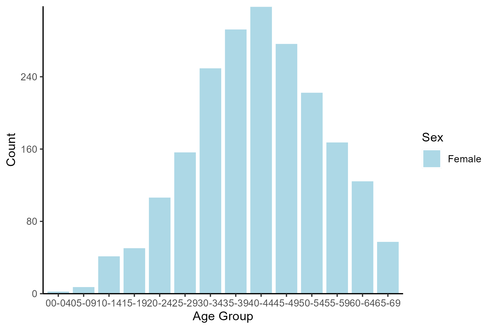

```{r, echo = F, message = F, warning = F}

# require pacman 
if(!require(pacman)) install.packages("pacman")

# Source functions 
source(here::here("global/functions/lesson_functions.R"))

# knitr settings
knitr::opts_chunk$set(warning = F, message = F, class.source = "tgc-code-block", error = T)

```

# Demographic Pyramids for Epidemiological Analysis

## Intro

# [FULL FACE INTRO VIDEO, SO NO NEED TO SHOW THIS SECTION IN SCREEN RECORDING]

A demographic pyramid, also known as a population pyramid or an age-sex pyramid, helps to visualize the distribution of a population by two important demographic variables: **age** and **sex**.

Today you will learn about the importance of using demographic pyramids to help visualize the distribution of a disease by age and sex and how to create one using `{ggplot2}`.

Let's get into it!

## Learning Objectives

1.  Explain **the importance of demographic pyramids** for communicating **age and sex-specific patterns** of disease distribution.

2.  Understand the **components of a demographic pyramid** and conceptualize it as a modified version of a **stacked bar plot**.

3.  **Summarize and prepare data** into the appropriate format for plotting with **`{dplyr}`**.

4.  Use **`{ggplot2}`** code to **plot a demographic pyramid using `geom_col()`**, showing total counts or percentages on the x axis.

5.  **Customize the plot** by changing the color scheme, labels, and axis.

## Introducing Demographic Pyramids

‣ Demographic pyramids visualize **population distribution** by **age** and **sex**.

‣ Plot is **divided down the center** between male and female members of the population.

‣ Age groups on the y axis and sex on the x axis.

{width="219"}

{width="298"}

{width="219"}

‣ Three key features of a demographic pyramid are:

**1) Age Groups**: The pyramid is divided into horizontal bars, each representing an age group, often in five-year increments.

**2) Gender Representation**: The left side of the pyramid typically represents males, and the right side represents females.

**3) Population Size**: The length of the bars indicates the size of the population in each age group.

‣ **`{ggplot2}`** allows us to create these plots and customize their appearance.

{width="320"}

## The Use of Demographic Pyramids in Epidemiology

‣ Pyramids aid in understanding **age and sex-specific vulnerability** to diseases.

‣ Incidence of **tuberculosis**, **HIV**, and **malaria** varies with age, sex, and differs by regions.

‣ These visualizations can inform **surveillance programs** about which age or sex groups to target.

‣ **Demographic distribution** also assists in **data quality assessment** for surveillance systems by comparing national data with global epidemiology checks for **external consistency**.

{width="219"}

## Conceptualizing Demographic Pyramids

{width="364"}

‣ A **population pyramid** is essentially two bar graphs merged on the y axis.

{width="533"}

‣ Below is the female half of the pyramid, with axes flipped:

{width="329"}

‣ We can also think of a demographic pyramid as akin to a modified **stacked bar chart**, with the bars **centered at the point of division** between the male and female sections.

{width="560"}

‣ To get this effect in `geom_col()`, we will calculate a **negative count** for males to plot the bars on the left side of the axis.

## Load packages

‣ This requires R packages for **data manipulation**, **data visualization**, and **relative** **file paths**

```{r}
# Load packages
pacman::p_load(
  tidyverse,  # to clean, wrangle, and plot data (includes readr, dplyr, and ggplot2)
  here,       # to locate files
  apyramid)   # package dedicated to creating age pyramids
```

## Data Preparation

### Intro to the Dataset

‣ We'll be using a **simulated HIV dataset** of **linelist cases** in Zimbabwe during 2016.

‣ Our focus: **age-related** and **sex** variables for a demographic pyramid.

{width="212"}

### Importing Data

‣ Let's import our dataset into RStudio and inspect the variables:

```{r}
# Import the dataset from CSV file
hiv_data <- read_csv(here("data/hiv_zw_linelist_2016.csv"))

# Display the data frame
hiv_data
```

‣ Our dataset has **28000 cases** across **3 columns**: `age_group`, `sex`, and `hiv_status`.

‣ To create a demographic pyramid of HIV **prevalence**, we'll filter the data to include only **HIV positive** individuals.

```{r}
# Filter and save as new dataset
hiv_cases <- hiv_data %>% 
  filter(hiv_status == "positive")

# View dataset
hiv_cases
```

{width="212"}

‣ Filtered subset: **3923 rows**, with individuals all **HIV positive**.

{width="212"}

### Data Inspection

‣ Next, we'll look at a summary table for `age_group` and `sex` to check that our data is clean.

```{r}
# Summarize the data into a table by age group and sex
hiv_cases %>% 
  count(age_group, sex)
```

‣ **Age groups are in ascending order** - this is crucial for plotting the demographic pyramid correctly.

{width="212"}

## Grouping and Aggregating Data

‣ To plot the pyramid bars, we need to summarize the **linelist observations** into an **aggregated table**.

‣ We want **positive female totals** and **negative male totals**, to plot bars on **opposite sides of the axis**.

{width="451"}

‣ We can use **`count()`** and **`mutate()`** to get total cases and percents grouped by age group and sex.

```{r}
# Create new subset with grouped counts
pyramid_data <- 
  hiv_cases %>% 
  # Count total cases by age group and gender
  count(age_group, sex, name = "total") %>% 

  # Create new columns for x axis values on the plot
  mutate(
    # Add column with diverging axis values - convert male counts to negative
    axis_counts = ifelse(sex == "male", -total, total),
    
    # Add column with percentage axis values
    axis_percent = round(100 * (axis_counts / sum(total)), digits = 1))

pyramid_data
```

‣ Now that the data is summarized in the **appropriate format,** we can use `pyramid_data` to create a population pyramid with **`{ggplot2}`**!

{width="212"}

::: side-note
**Alternative to `{ggplot2()`**

The **`{apyramid}`** package can be a useful tool contains a function **`age_pyramid()`**, which allows for the rapid creation of age-sex pyramids:

```{r}
# Start with the original linelist (no need to summarize counts)
hiv_cases %>% 
  # Age group variable must be a factor
  mutate(age_group = factor(age_group)) %>% 
  apyramid::age_pyramid(
    # Required arguments:
    age_group = "age_group",
    split_by = "sex")
```

However, `{apyramid}` has **limited functionality**. `{ggplot2}` is more versatile, with familiar syntax.
:::

{width="212"}

::: r-practice
**Practice Question**

Let's test your understanding with the following multiple-choice question:

1.  **When preparing data for plotting with `geom_col()`, what modification must be made to the count values?**

    A. All total counts must be negated.

    B. Counts must be multiplied by 2.

    C. Counts must be converted into percentages.

    D. Male counts must be negated (multiplied by -1).

*Answer key can be found at the end of this document.*
:::

{width="212"}

## Plotting Demographic Pyramids with `{ggplot2}`

‣ Remember: a demographic pyramid is a modified version of a **stacked bar plot**.

‣ A basic stacked bar plot with **`geom_col()`** needs a **categorical variable against a continuous variable** (e.g., **`age_group`** vs. **`total`**), and **`fill`** set to a ***second*** **categorical variable** (e.g., **`sex`**).

```{r}
# Basic stacked bar plot: bars stacked on top of each other
 
# Initialize plot  
  ggplot() +
    
# Create bar graph using geom_col()
  geom_col(data = pyramid_data,   # specify dataset for plotting
           aes(x = age_group,     # indicate categorical x variable
               y = total,         # indicate continuous y variable
               fill = sex))  +    # fill by second categorical variable
# Modify theme
    theme_light() +

# Flip X and Y axes
    coord_flip()
```

{width="212"}

‣ Note that we used the **`total`** variable for this plot where the male counts are **not** negated.

{width="618"}

{width="212"}

::: recap
The basics of `{ggplot2}` is taught in our Data on Display course, available at [**thegraphcourses.org**](thegraphcourses.org).


:::

{width="212"}

### Using `geom_col()` for demographic pyramids

‣ We can **build on the stacked bar code** above to create a demographic pyramid.

‣ This time we use **`axis_counts`** for the y variable instead of `total`, which has negative male counts.

```{r}
# Create and save plot to environment
demo_pyramid <- 
  ggplot() +
  geom_col(data = pyramid_data, 
           aes(x = age_group,
               y = axis_counts, # indicate special y variable
               fill = sex)) +
  theme_light() + 
  
# Flip X and Y axes
  coord_flip()

demo_pyramid
```

{width="212"}

‣ We can also use percentage values (**`axis_percent`**) on the y axis

```{r}
demo_pyramid_percent <- 
  ggplot() +
  geom_col(data = pyramid_data, 
           aes(x = age_group,
               y = axis_percent, # indicate special y variable
               fill = sex)) +
  theme_light() + 
  coord_flip()

demo_pyramid_percent
```

{width="212"}

::: r-practice
**Practice Questions**

‣ **What type of variables should be used in `geom_col()`, and bar plots in general?**

A)  Continuous variables
B)  Categorical variables
C)  One categorical variable and one continuous variable
D)  Ordinal variables

‣ **Which `{ggplot2}` function flips the axes of a plot?**

A)  `coord_flip()`
B)  `x_y_flip()`
C)  `geom_flip()`
D)  Any of the above
:::

{width="212"}

::: r-practice
**Coding Practice Question**

Start by loading the prepared dataset with population of Zimbabwe, aggregated by age and sex:

```{r}
zw_2016 <- readRDS(here::here("data/population_zw_2016.rds"))

zw_2016
```

‣ Create a demographic pyramid with the **`zw_2016`** dataset.

```{r}
# Fill in the blanks with the correct variable names and values:
Q4_pyramid_zw_2016 <- 
  ggplot() +
  geom_col(data = ____________,
           aes(x = ____________,
               y = ____________,
               fill = ____________),
           color = "white") +
  coord_flip()
```
:::

{width="212"}

## Plot Customization

‣ Our current `demo_pyramid` plot looks like this:

{width="421"}

{width="212"}

‣ Next we'll re-scale the **case count axis**, add informative **labels,** and edit **non-data elements**.

{width="212"}

## Axis Adjustments

‣ The current graph shows **asymmetrical axis** **limits** due to varying case counts between genders.

{width="486"}

{width="212"}

### **Choosing the limits**

‣ Our goal is an axis that is symmetrical, with the **same length on both sides** around zero.


‣ First we identify the **maximum** value from our `pyramid_data`.

```{r}
# Save max case count as an object
max_count <- ___(pyramid_data$total)
```

{width="212"}

{width="212"}

We will edit the *continuous* axis using the **`scale_y_continuous()`** function and do the following:

‣ Set the **upper and lower axis limits** to `max_count`.

‣ Define the spacing between axis breaks.

‣ Convert the negative labels left of 0 to their **absolute values** (remove minus sign).


```{r}
# Add scales layer to previous graph
custom_axes <- demo_pyramid +
  # Scale function for y axis (total count)  
  scale_y_continuous(
    # Specify upper and lower limits of the same length, for symmetry
    limits = c(-__________, __________),
    # Specify the spacing between axis break labels
    breaks = scales::breaks_width(___),
    # Make axis numbers absolute so male counts appear positive
    labels = ___)

custom_axes
```

{width="323"}


{width="212"}

‣ **Equal upper and lower `limits` on both sides** ensures a symmetrical and accurate visual comparison.

‣ Negative numbers from `axis_counts` are converted to **positive** **numbers** using **`labels = abs`**.

‣ The **width of breaks** are fixed at a specific value using **`breaks_width(100)`**.

{width="212"}

## Add custom labels

{width="367"}

‣ Add informative main title, subtitle, axis titles, and caption.

```{r}
custom_labels <- 
  # Start with previous demographic pyramid
  custom_axes +
  # labs() function controls label text
  labs(
    title = "________",
    subtitle = "Zimbabwe (2016)",
    x = "________",
    y = "________",
    caption = "Data are from linelist \nn = ________")

custom_labels
```

{width="212"}

## Enhance Color Scheme and Themes

{width="367"}

‣ Let's apply some **style adjustments** to our demographic pyramid.

```{r}
custom_color_theme <- 
# Build upon the previous plot
  custom_labels +
# Manually specify custom colors for each sex
  scale_fill_manual(values = c("female" = "__________",
                               "male" = "__________"),
                    # Capitalize legend labels
                    labels = c("____________", "____________")) +
  # Fine-tune theme elements for a cleaner look
  theme(axis.line = element_line(colour = "_____"), # make axis lines black
        # Center title and subtitle
        plot.title = element_text(hjust = 0.5),
        plot.subtitle = element_text(hjust = 0.5),
        # Format caption text
        plot.caption = element_text(hjust = 0,            # align left
                                    size = 11,            # increase font size
                                    face = "__________")) # italicize text
custom_color_theme
```

{width="212"}

‣ Let's review the modifications we just made.

{width="725"}

{width="212"}

## Wrap-Up

‣ Demographic pyramids are **vital tools** for visualizing disease distribution by **age and sex**.

‣ The techniques used here can be extended to other graphs with **negative and positive values**.

‣ You can now take these concepts to visualize **cases against baseline populations** or the **impact of health interventions**.

‣ This knowledge is invaluable for **epidemiological analysis** and reporting.

‣ **Congratulations** on completing this lesson! Your new skills are ready for real-world application.

{width="212"}

## Learning Outcomes

Now you should be able to:

1.  Explain **the importance of demographic pyramids** for communicating **age and sex-specific patterns** of disease distribution.

2.  Understand the **components of a demographic pyramid** and conceptualize it as a modified version of a **stacked bar plot**.

3.  **Summarize and prepare data** into the appropriate format for plotting with **`{dplyr}`** functions.

4.  Use **`{ggplot2}`** code to **plot a demographic pyramid using `geom_col()`**, showing total counts or percentages on the x axis.

5.  You can **customize the plot** by changing the color scheme, labels, and axis.
