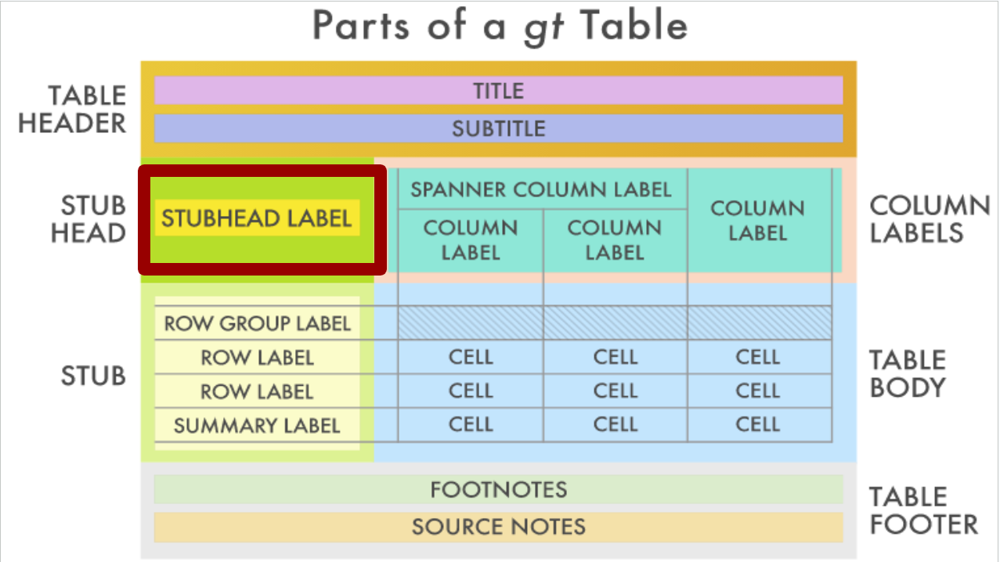
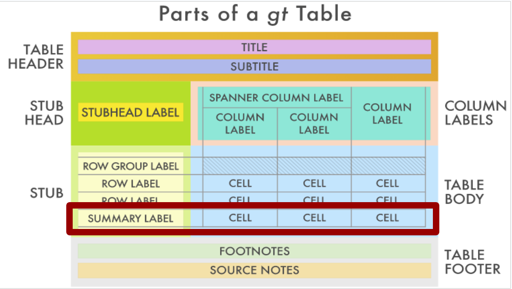

```{r setup, include=FALSE}
knitr::opts_chunk$set(echo = TRUE, class.source = "tgc-code-block")

if(!require(pacman)) install.packages("pacman")

# functions
source(here::here("global/functions/lesson_functions.R"))

# default render
registerS3method(".reactable_5_rows", "data.frame", .reactable_5_rows)
```

# Introduction

Tables are a powerful tool for visualizing data in a clear and concise format. With R and the gt package, we can leverage the visual appeal of tables to efficiently communicate key information. In this lesson, we will learn how to build aesthetically pleasing, customizable tables that support data analysis goals.

# Learning objectives

-   Use the `gt()` function to create basic tables.

-   Group columns under spanner headings.

-   Add a stub head.

-   Relabel column names.

-   Add summary rows for groups.

By the end, you will be able to generate polished, reproducible tables like this:

{width="577"}

# Packages

* We will use the `{gt}` package for creating tables.
* The `{tidyverse}` package will be used for data wrangling.
* The `{here}` package will be used for file paths.


```{r}
# Load packages
pacman::p_load(tidyverse, gt, here)
```

# Introducing the dataset

* Our data comes from the Malawi HIV Program.
* Covers antenatal care and HIV treatment during 2019.
* We will focus on quarterly regional and facility-level aggregates.

```{r message=FALSE}
# Import data
hiv_malawi <- read_csv(here::here("data/clean/hiv_malawi.csv"))
```

* Let's explore the variables:

```{r render = .reactable_10_rows}
# First 6 rows
head(hiv_malawi)
```

```{r}
# Variable names and types 
glimpse(hiv_malawi)
```

The data covers geographic regions, healthcare facilities, time periods, patient demographics, test results, preventive therapies, antiretroviral drugs, and more. More information about the dataset is in the appendix section.

The key variables we will be considering are:

-  `region`: The geographical region or area where the data was collected or is being analyzed.

-  `period`: A specific time period associated with the data, often used for temporal analysis.

-  `previous_negative`: The number of patients who visited the healthcare facility in that quarter that had prior negative HIV tests.

-  `previous_positive`: The number of patients (as above) with prior positive HIV tests.

-  `new_negative`: The number of patients newly testing negative for HIV.

-  `new_positive`: The number of patients newly testing positive for HIV.

In this lesson, we will aggregate the data by quarter and summarize changes in HIV test results.

# Creating simple tables with `{gt}`

* `{gt}`'s flexibility, efficiency, and power make it a formidable package for creating tables in R. We'll explore some of it's core features in this lesson.

::: key-point


The `{gt}` package contains a set of functions that take raw data as input and output a nicely formatted table for further analysis and reporting.
:::

* To effectively leverage the `{gt}` package, we first need to wrangle our data into an appropriate summarized form.

* In the code chunk below, we use `{dplyr}` functions.
* We aim to summarize HIV testing in select Malawi testing centers by quarter.
* We first group the data by time period.
* Then, we sum case counts across multiple variables using the `across()` function.


```{r}
# Variables to summarize
cols <- c("new_positive", "previous_positive", "new_negative", "previous_negative")

# Create summary by quarter
hiv_malawi_summary <- hiv_malawi %>%  
  group_by(______) %>%
  summarize(
    across(______) # Summarize all columns
  )

hiv_malawi_summary
```

This aggregates the data nicely for passing to `{gt}` to generate a clean summary table.

* To create a simple table from the aggregated data, we can call the `gt()` function.
* The default table formatting is quite plain and unrefined.
* However, `{gt}` provides many options to customize and beautify the table output.
* We'll delve into these customization options in the next section.


```{r}
# Create gt table
hiv_malawi_summary %>% 
  ______
```


# Customizing `{gt}` tables

* The `{gt}` package allows full customization of tables through its "grammar of tables" framework.

* This is similar to how `{ggplot2}`'s grammar of graphics works for plotting.

* To take full advantage of `{gt}`, it helps to understand some key components of its grammar.


As seen in the figure from the package website, The main components of a `{gt}`table are:

- **Table Header**: Contains an optional title and subtitle

- **Stub**: Row labels that identify each row

- **Stub Head**: Optional grouping and labels for stub rows

- **Column Labels**: Headers for each column

- **Table Body**: The main data cells of the table

- **Table Footer**: Optional footnotes and source notes

Understanding this anatomy allows us to systematically construct `{gt}` tables using its grammar.

## Table Header and Footer

* The basic table we had can now be updated with more components.

* Tables become more informative and professional-looking with the addition of headers, source notes, and footnotes.
  
* We can easily enhance the basic table from before by adding these elements using `{gt}` functions.

* To create a header, we use `tab_header()` and specify a title and subtitle. This gives the reader context about what the table shows.


```{r}
# Add table header
hiv_malawi_summary %>%
  gt() %>%
  ______
```

We can add a footer with the function `tab_source_note()` to cite where the data came from:

```{r}
# Add source note
hiv_malawi_summary %>%
  gt() %>% 
  tab_header(
    title = "HIV Testing in Malawi",
    subtitle = "Q1 to Q4 2019"
  ) %>%
  ______  
```

- Footnotes are useful for providing further details about certain data points or labels.

- The `tab_footnote()` function attaches footnotes to indicated table cells.

- For example, we can footnote the new diagnosis columns.


```{r}
# Add footnote
hiv_malawi_summary %>%
  gt() %>%
  tab_header(
    title = "HIV Testing in Malawi", 
    subtitle = "Q1 to Q2 2019"
  ) %>%
  tab_source_note("Source: Malawi HIV Program") %>%  
  ______
```

* These small additions greatly improve the professional appearance and informativeness of tables.

## Stub

The stub is the left section of a table containing the row labels. These provide context for each row's data.

::: reminder
This image displays the stub component of a `{gt}` table, marked with a red square. 
:::

* In our HIV case table, the `period` column holds the row labels we want to use. To generate a stub, we specify this column in `gt()` using the `rowname_col` argument.

* Note that the column name passed to `rowname_col` should be in quotes.

```{r}
hiv_malawi_summary %>%
  gt(rowname_col = "period") %>%
  tab_header(
    title = "HIV Testing in Malawi",
    subtitle = "Q1 to Q2 2019"  
  ) %>%
  tab_source_note("Source: Malawi HIV Program")
```


For convenience, let's save the table to a variable `t1`:

```{r}
t1 <- hiv_malawi_summary %>%
  gt(rowname_col = "period") %>%
  tab_header(
    title = "HIV Testing in Malawi",
    subtitle = "Q1 to Q2 2019"
  ) %>% 
  tab_source_note("Source: Malawi HIV Program")

t1
```

## Spanner columns & sub columns

* To better structure our table, we can group related columns under spanners.

* Spanners are headings that span multiple columns, providing a higher-level categorical organization.

* This can be achieved using the `tab_spanner()` function.


* Let's create two spanner columns for new and previous tests. We'll start with the "New tests" spanner so you can observe the syntax:

```{r}
# Create spanner column
t1 %>%  
  # First spanner for "New tests"
  ______
```

* The `columns` argument lets us select the relevant columns, and the `label` argument takes in the span label.

* Let's now add both spanners:

```{r}
# Save table to t2 for easy access  
t2 <- t1 %>%  
  # First spanner for "New tests"   
  tab_spanner(
    label = "New tests",
    columns = starts_with("new") 
  ) %>%
  # Second spanner for "Previous tests"
  ______
  )

t2 
```

* Note that the `tab_spanner` function automatically rearranged the columns in an appropriate way.

::: practice
**Question 1: The Purpose of Spanners**

What is the purpose of using "spanner columns" in a **`{gt}`** table?

A. To apply custom CSS styles to specific columns.

B. To create group columns and increase readability.

C. To format the font size of all columns uniformly.

D. To sort the data in ascending order.

**Question 2: Spanners Creation**

Using the **`hiv_malawi`** data frame, create a **`{gt}`** table that displays a summary of the **`sum`** of `new_positive` and `previous_positive` cases for each region. Create spanner headers to label these two summary columns. To achieve this, fill in the missing parts of the code below:

```{r}

region_summary <- hiv_malawi %>%
  group_by(region) %>%
  summarize(
    _________(
      c(new_positive, previous_positive),
      ______
    )
  )

# Create a gt table with spanner headers
summary_table_spanners <- region_summary %>%
  _____________ %>%
  ___________(
    label = "Positive cases",
    ________ = c(new_positive, previous_positive)
  )
```
:::

# Renaming Table Columns

- The column names currently contain unneeded prefixes like "new_" and "previous_". For better readability, we can rename these using `cols_label()`.

- `cols_label()` takes a set of old names to match (on the left side of a tilde, `~`) and new names to replace them with (on the right side of the tilde).

- We can use `contains()` to select columns with "positive" or "negative".


```{r}
t3 <- t2 %>%
  ______

t3
```

* `cols_label()` accepts several column selection helpers like `contains()`, `starts_with()`, `ends_with()` etc. 

* These come from the `{tidyselect}` package and provide flexibility in renaming.


::: pro-tip
`cols_label()` has more identification function like `contains()` that work in a similar manner that are identical to the [`{tidyselect}`](https://tidyselect.r-lib.org/reference/starts_with.html) helpers, these also include :

-   `starts_with()`: Starts with an exact prefix.

-   `ends_with()`: Ends with an exact suffix.

-   `contains()`: Contains a literal string.

-   `matches()`: Matches a regular expression.

-   `num_range()`: Matches a numerical range like x01, x02, x03.

These helpers are useful especially in the case of multiple columns selection.

More on the `cols_label()` function can be found here: <https://gt.rstudio.com/reference/cols_label.html>
:::


::: practice
**Question 3: Column labels**

Which function is used to change the labels or names of columns in a **`{gt}`** table?

```         
A. `tab_header()`

B. `tab_style()`

C. `tab_options()`

D. `tab_relabel()`
```
:::

# Summary rows

* Let's take the same data we started with at the beginning of this lesson.

* Instead of only grouping by period (quarters), let's group by both `period` and `region`.

* We will do this to illustrate the power of summarization features in `{gt}`: summary tables.


::: reminder
**{gt} reminder - Summary Rows** This image shows the summary rows component of a `{gt}` table, clearly indicated within a red square. Summary rows, provide aggregated data or statistical summaries of the data contained in the corresponding columns. 
:::


* First let's recreate the data:

```{r}
summary_data_2 <- hiv_malawi %>% 
  group_by(
    # Note the order of the variables we group by.
    ______
  ) %>% 
  summarise(
    across(all_of(cols), sum) 
    ) 
summary_data_2
```

::: watch-out
The order in the `group_by()` function affects the row groups in the `{gt}` table.
:::

* Second, let's re-incorporate all the changes we've done previously into this table:

```{r}
# saving the progress to the t4 object

t4 <- summary_data_2 %>% 
  gt(rowname_col = "period", groupname_col = "region") %>% 
  tab_header(
    title = "Sum of HIV Tests in Malawi",
    subtitle = "from Q1 2019 to Q4 2019"
  ) %>% 
  tab_source_note("Data source: Malawi HIV Program") %>% tab_spanner(
    label = "New tests",
    columns = starts_with("new") # selects columns starting with "new"
  ) %>% 
   # creating the first spanner for the Previous tests
  tab_spanner(
    label = "Previous tests",
    columns = starts_with("prev") # selects columns starting with "prev"
  ) %>% 
  cols_label(
    # locate ### assign 
    contains("positive") ~ "Positive",
    contains("negative") ~ "Negative"
  )

t4
```

* Now, what if we want to visualize on the table a summary of each variable for every region group?

* More precisely, we want to see the sum and the mean for the 4 columns we have for each `region`.


::: reminder
Remember that our 4 columns of interest are : `new_positive`, `previous_positive`, `new_negative`, and `previous_negative`. We only changed the labels of these columns in the `{gt}` table and not in the data.frame itself, so we can use the names of these columns to tell `{gt}` where to apply the summary function. Additionally, we already stored the names of these 4 columns in the object `cols` so we will use it again here.
:::

* In order to achieve this we will use the handy function `summary_rows`.

* We explicitly provide the columns that we want summarized, and the functions we want to summarize with, in our case it's sum and mean.

* Note that we assign the name of the new row (unquoted) a function name ("quoted").


```{r}
t5 <- t4 %>% 
  summary_rows(
    ______
  )

t5
```


::: practice
**Question 4 : Summary rows**

What is the correct answer (or answers) if you had to summarize the standard deviation of the rows of columns `new_positive` and `previous_negative` only?

**A.** Use **`summary_rows()`** with the **`columns`** argument set to `new_positive` and `previous_negative` and **`fns`** argument set to "sd".

```{r eval=FALSE, echo=TRUE}
# Option A 
your_data %>%   
  summary_rows(
    columns = c("new_positive", "previous_negative"),     
    fns = "sd" 
  )
```

**B.** Use **`summary_rows()`** with the **`columns`** argument set to `new_positive` and `previous_negative` and **`fns`** argument set to "summarize(sd)".

```{r eval=FALSE, echo=TRUE}
# Option B 

your_data %>%   
  summary_rows(
    columns = c("new_positive", "previous_negative"),     
    fns = summarize(sd) 
  )
```

**C.** Use **`summary_rows()`** with the **`columns`** argument set to `new_positive` and `previous_negative` and **`fns`** argument set to **`list(SD = "sd")`**.

```{r eval=FALSE, echo=TRUE}
# Option C 
your_data %>%   
  summary_rows(
    columns = c("new_positive", "previous_negative"),     
    fns = list(SD = "sd")   
  )


```

**D.** Use **`summary_rows()`** with the **`columns`** argument set to `new_positive` and `previous_negative` and **`fns`** argument set to "standard_deviation".

```{r eval=FALSE, echo=TRUE}
# Option D
your_data %>%
  summary_rows(
    columns = c("new_positive", "previous_negative"),
    fns = "standard_deviation"
  )
```
:::

# Wrap-up

* In today's lesson, we delved into data tables in R using `{gt}`.

* We started by setting clear goals, introducing the packages we'll be using, and getting acquainted with our dataset.

* We then created straightforward tables, learning to organize our data neatly using spanner columns and tweaking column labels for clarity and coherence.

* We wrapped up with some nifty table summaries.

* These are the fundamental aspects of table-making in R and `{gt}`, and they will be extremely useful as we continue our journey on creating engaging and informative tables in R.


# Answer Key {.unnumbered}

1. **Question 1: The Purpose of Spanners**
   - *B*

2. **Question 2: Spanners Creation**

```{r}
# Solutions are where the numbered lines are

# summarize data first
district_summary <- hiv_malawi %>%
  group_by(region) %>%
  summarize(
    across(  #1
      c(new_positive, previous_positive),
      sum #2
    )
  )

# Create a gt table with spanner headers
summary_table_spanners <- district_summary %>%
  gt() %>% #3
  tab_spanner( #4
    label = "Positive cases",
    columns = c(new_positive, previous_positive) #5
  )
  
```


3. **Question 3: column labels**
   - *D*

4. **Question 4: summary rows**
   - *C*


# Contributors {.unlisted .unnumbered}

The following team members contributed to this lesson:

`r .tgc_contributors_list(ids = c("benn","joy"))`

# References {.unlisted .unnumbered}

1.  Tom Mock, "The Definite Cookbook of {gt}" (2021), The Mockup Blog, <https://themockup.blog/static/resources/gt-cookbook.html#introduction>.

2.  Tom Mock, "The Grammar of Tables" (May 16, 2020), The Mockup Blog, <https://themockup.blog/posts/2020-05-16-gt-a-grammar-of-tables/#add-titles>.

3.  RStudio, "Introduction to Creating gt Tables," Official `{gt}`Documentation, <https://gt.rstudio.com/articles/intro-creating-gt-tables.html>.

4.  Fleming, Jessica A., Alister Munthali, Bagrey Ngwira, John Kadzandira, Monica Jamili-Phiri, Justin R. Ortiz, Philipp Lambach, et al. 2019. "Maternal Immunization in Malawi: A Mixed Methods Study of Community Perceptions, Programmatic Considerations, and Recommendations for Future Planning." *Vaccine* 37 (32): 4568--75. <https://doi.org/10.1016/j.vaccine.2019.06.020>.

`r .tgc_license()`