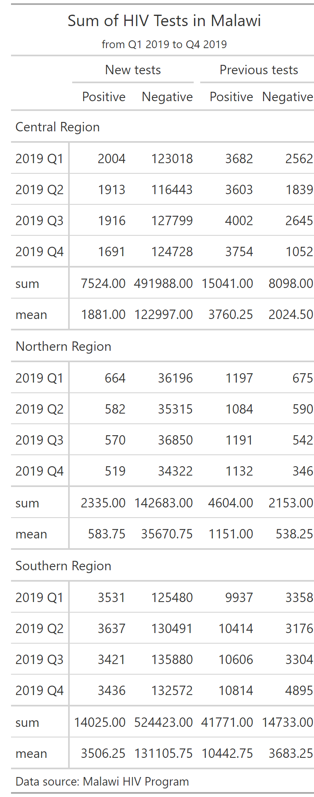

```{r setup, include=FALSE}
knitr::opts_chunk$set(echo = TRUE, class.source = "tgc-code-block")

if(!require(pacman)) install.packages("pacman")

# functions
source(here::here("global/functions/lesson_functions.R"))

# default render
registerS3method(".reactable_5_rows", "data.frame", .reactable_5_rows)
```

# Introduction

The previous `{gt}` lesson focused mainly on the components of the table its structure and how to manipulate it properly. This lesson, presenting the second part of the `{gt}` series will focus on using the package to polish, style, and customize the visual effects of tables in a way that elevate the quality and efficiency of your reports.

Let's dig in.

------------------------------------------------------------------------

# Learning objectives

1.  Themes using the `opt_style()` function.

2.  Cells Formatting

3.  Conditional coloring

4.  Format text(font color, bold,etc.)

5.  Add borders to text

By the conclusion of this lesson, you will have the skills to artfully style your **`{gt}`** tables to meet your specific preferences achieving a level of detail similar to this:

{width="482"}

------------------------------------------------------------------------

# Packages

In this lesson, we will use the following packages:

-   `{gt}` for nice tables

-   `{dplyr}` , `{tidyr}` , and `{purrr}`.

-   `{janitor}`

-   `ggsci` for color palettes

```{r}
# Load packages
pacman::p_load(tidyverse, janitor, gt, ggsci, here)
```

------------------------------------------------------------------------

# Previously in part 1

::: recap
In the previous `{gt}` lesson we had the opportunity to :

-   Discover the HIV prevalence data of Malawi.

-   Discover the grammar of tables and the `{gt}` package.

-   Create a simple `{gt}` table.

-   Add details like title and footnote to the table.

-   Group columns under spanner labels.

-   Create summary rows.

{width="455"}
:::

------------------------------------------------------------------------

# The dataset

In this lesson, we will use the same data from the previous lesson, you can go back for a detailed description of the data and the preparation process we made.

::: recap
Here's the full details of the columns we will use:

-   `region`: The geographical region or area where the data was collected or is being analyzed.

-   `period`: A specific time period associated with the data, often used for temporal analysis.

-   `previous_negative`: The count or number of individuals with a previous negative test result.

-   `previous_positive`: The count or number of individuals with a previous positive test result.

-   `new_negative`: The count or number of newly diagnosed cases with a negative result.

-   `new_positive`: The count or number of newly diagnosed cases with a positive result.
:::

But for the purposes of this lesson we will use the tables directly, this this the table that we created with the right spanners and columns labels, we will base the rest of our lesson on this particular one.

```{r}
# Read in gt object
hiv_malawi_summary <- read_rds(here::here("data/clean/malawi_hiv_summary_t3.rds"))

hiv_malawi_summary
```

------------------------------------------------------------------------

# Themes

-   The main objective of this lesson is to focus on table styling.
-   We will start by using a pre-defined theme to enhance the table's visuals and colors.
-   This can be accomplished using the `opt_style()` function.
-   This function has multiple pre-defined styles and can accept a color argument.
-   In our example, we will use style No.1 and the color `'cyan'`.
-   You can adjust these arguments according to your preferences.

```{r}
t1 <- hiv_malawi_summary %>% 
  ___________

t1
```

::: challenge
For more sophisticated themes and styling, you can refer to the function `tab_options()` (documentations [here](https://gt.rstudio.com/reference/tab_options.html?q=tab%20options#null)) which is basically the equivalent to the `theme()` function in {`ggplot2}`. This function contains arguments and options on every single layer and component of the table. For the purposes of this lesson we won't dive into it.
:::

------------------------------------------------------------------------

# Formatting the values in the table

-   Visualizing differences between values in a specific column using color can be useful.
-   Color-coded tables are particularly helpful in reports with a large number of rows.
-   We aim to apply this technique to our table, formatting the `new_positive` column in red.
-   To implement this, we'll utilize the `data_color()` function.
-   Two arguments need to be specified for this function: `columns` (which column should the styling be applied to?) and `palette` (what color palette do we intend to use?).

```{r}
t2 <- t1 %>% 
  ___________

t2
```

::: side-note
`ggsci::red_material` is not the only palette we can use, in fact there are hundereds of palettes that are designed to be used in R. You can find a lot more in the `paletteer` package documentations in [here](https://emilhvitfeldt.github.io/paletteer/#included-packages), or in the official `data_color` documentation [here](https://gt.rstudio.com/reference/data_color.html?q=data_color#null).
:::

-   We can do this for the `previous_negative` column as well.
-   We can use a different kind of palette, specifically the green palette from the same package: [`ggsci::green_material`](https://github.com/nanxstats/ggsci).
-   The palette you choose is a matter of convenience and personal taste.
-   You can explore more about this if you refer to the side note above.

```{r}
t2 %>% 
  ___________
```

-   Similarly, we can also color multiple columns at once.
-   For example, we can style the columns with positive cases in red, and those with negative cases in green.
-   To do this, we need to write *two* `data_color` statements, one for each color style.

```{r}
t4 <- t1 %>% 

  data_color(
    columns = ends_with("positive"), # selecting columns ending with the wor positive
    palette = "ggsci::red_material" # red palette 
  ) %>% 
  ___________


t4
```

::: reminder
Remember in the previous lesson we used the [`tidyselect`](https://tidyselect.r-lib.org/reference/starts_with.html) functions to select columns, in the code above we used the function `ends_with` to select the columns ending either with the word 'negative' or 'positive' which is perfect for the purpose of our table.

Again, the column labels in the `{gt}` table and the actual column names in the `data.frame` can be different, in our case we refer to the names in the data.
:::

------------------------------------------------------------------------

# Conditional formatting

-   The table can be configured to conditionally change the style of a cell based on its value.
-   We aim to highlight values in the `previous_positive` column that meet or exceed a threshold of 15700, coloring these in green.
-   This is accomplished using the `tab_style` function, where we specify two arguments:
    -   `style`: Here we set the color in the `cell_text` function, as we want to modify the text within the cells.
    -   `location`: This is where we identify the columns and rows for our modification within the `cells_body`, as these cells are located in the main body of the table.

We'll use `t2` as demonstration fro this process:

```{r}
t5 <- t2 %>% 
  ___________

t5  
```

::: watch-out
In the code above, the condition over which the styling will occur is stated in :

`locations = cells_body(columns = previous_positive, rows = previous_positive >= 15700 )`

Also, note that we can pass more arguments to the `cell_text` function, such as the size and the font of the cells we intend to style.
:::

-   We want cells with values greater or equal to the threshold to be styled in green, and cells with values less than the threshold to be styled in cyan.
-   This is entirely possible. We've already completed the first part (as demonstrated in the previous code chunk).
-   To introduce the second condition, we simply need to add another `tab_style` statement in a similar manner.

```{r}
t6 <- t5 %>% 
  ___________

t6

```

::: practice
**Question 1: Conditional Formatting** To highlight (in yellow) rows in a **`{gt}`** table where the "hiv_positive" column exceeds 1,000, which R code snippet should you use?

A.  

```{r eval=FALSE, echo=TRUE}
data %>% 
  gt() %>% 
  tab_style(
    style = cells_body(), 
    columns = "Sales", 
    conditions = style_number(Sales > 1000, background = "yellow")
  )
```

B.  

```{r eval=FALSE, echo=TRUE}
data %>% 
  gt() %>% 
  tab_style(
    style = cells_data(columns = "Sales"), 
    conditions = style_number(Sales > 1000, background = "yellow") 
  )
```

C.  

```{r eval=FALSE, echo=TRUE}
data %>% 
  gt() %>% 
  tab_style(
    style = cell_fill(
      color = "yellow"
    ), 
    locations = cells_body(
      columns = "hiv_positive",
      rows = hiv_positive > 1000
    ) 
  )
    
```

D.  

```{r eval=FALSE, echo=TRUE}
 data %>% 
   gt() %>% 
   tab_style(
     style = cells_data(columns = "Sales"), 
     conditions = style_text(Sales > 1000, background = "yellow")
   )
```

**Question 2: Cell Coloration Fill**

Using the **`hiv_malawi`** data frame, create a **`{gt}`** table that displays the total number (**sum**) of "*`new_positive`*" cases for each "*`region`*". Highlight cells with values more than 50 cases in *red* and cells with less or equal to 50 in *green*. Complete the missing parts (___________) of this code to achieve this.

```{r eval=FALSE, echo=TRUE}
# Calculate the total_new_pos summary
total_summary <- hiv_malawi %>%
  group_by(_________) %>%
  summarize(total_new_positive = __________)

# Create a gt table and apply cell coloration
summary_table <- total_summary %>%
  gt() %>%
  tab_style(
    style = cell_fill(color = "red"),
    locations = _________(
      columns = "new_positive",
      rows = _________________
    )
  ) %>%
  tab_style(
    style = ___________________,
    locations = cells_body(
      columns = "new_positive",
      _______ new_positive <= 50
    )
  )
```
:::

------------------------------------------------------------------------

# Fonts and text

-   Our next step is to improve the visual appeal of our table's text using the `gt::tab_style()` function.
-   We aim to adjust the font and color of the title and the subtitle.
-   We'll choose the 'Yanone Kaffeesatz' font from Google Fonts.
-   Google Fonts is a resource that provides a wide range of fonts, allowing for unique table customization beyond standard Excel options.

To apply these changes, we'll configure the `gt::tab_style()` function as follows:

-   The `style` argument is assigned the `cell_text()` function, which houses two other arguments:
    -   `font` is assigned the `google_font()` function with our chosen font name.
    -   `color` is set to a hexadecimal color code that corresponds to our desired text color.
-   The `locations` argument is assigned the `cells_title()` function:
    -   We specify `title` and `subtitle` within the `groups` argument using vector notation `c(...)`.

::: side-note
To specifically modify the title or subtitle, you can use `locations = cells_title(groups = "title")` or `locations = cells_title(groups = "subtitle")`, respectively, without the need for `c(…)`.

**Using lists to pass arguments in gt:** Lists in R are an integral part of the language and are extremely versatile. A list can contain elements of different types (numbers, strings, vectors, and even other lists) and each element can be accessed by its index. In the context of our {gt} table, we use lists to group together style properties (with the style argument) and to specify multiple locations in the table where these styles should be applied (with the locations argument).

**Using Hexadecimal Color Codes:** Colors in many programming languages, including R, can be specified using hexadecimal color codes. These codes start with a hash symbol (#) and are followed by six hexadecimal digits. The first two digits represent the red component, the next two represent the green component, and the last two represent the blue component. So, when we set color = "#00353f", we're specifying a color that has no red, a bit of green, and a good amount of blue, which results in a deep blue color. This allows us to have precise control over the colors we use in our tables.
:::

```{r}
t7 <- t4 %>% 
  tab_style(
      style = cell_text(
          font = google_font(name = '___________'), 
          color = "#00353f"
        ),
      locations = cells_title(groups = c("___________"))
  )

t7
```

-   We can extend our customization to include the labels for columns, spanners, and stubs, as well as the source note.
-   Within the `locations` argument, we'll supply a list indicating the specific locations for these changes.
-   For a comprehensive understanding of the locations, please refer to Appendix (List 1).

```{r}
t8 <- t7 %>% 
  tab_style(
    style = list(
      cell_text(
        font = google_font(name = "___________"),
        color = "#00353f"
      )
    ),
    locations = list(
      cells_column_labels(columns = everything()), # select every column
      cells_column_spanners(spanners = everything()), # select all spanners
      cells_source_notes(),
      cells_stub()
    )
  )
t8
```

::: side-note
If you want to change the fill background of the title, you can do so by adjusting the `locations` argument to point at `cells_title(groups = "title")`. Here's how you could do it:

```{r eval = FALSE}
t9 <- t7 %>% 
  ___________

t9
```

In this code, `cell_fill(background = "#ffffff")` changes the background color to white, and `locations = cells_title(groups = "title")` applies this change specifically to the title of the table.
:::

::: practice
**Question 2: Fonts and Text** Which R code snippet allows you to change the font size of the footnote text in a **`{gt}`** table?

A.  

```{r eval=FALSE, echo=TRUE}
data %>% 
  gt() %>% 
  tab_header(font.size = px(16))
```

B.  

```{r eval=FALSE, echo=TRUE}
data %>% 
  gt() %>% 
  tab_style(
    style = cell_text(
      size = 16
    ),
    locations = cells_footnotes()
  )
```

C.  

```{r eval=FALSE, echo=TRUE}
 data %>% 
   gt() %>% 
   tab_style(
     style = cells_header(), 
     css = "font-size: 16px;"
   )
```

D.  

```{r eval=FALSE, echo=TRUE}
 data %>% 
   gt() %>% 
   tab_style(
     style = cells_header(), 
     css = "font-size: 16;"
   )
```
:::

------------------------------------------------------------------------

# Borders

-   In `{gt}`, we can draw borders in the tables to help users focus on specific areas.
-   To add borders to a `{gt}` table, we'll use the `tab_style` function and specify the `style` and `locations` arguments.
-   The difference this time is that we'll use the `cell_borders` helper function and assign it to the `style` argument.
-   The following instructions will demonstrate how to do this.

Let's first add a vertical line:

```{r}
t10 <- t8 %>% 
  ___________

t10
```

Now let's add another horizontal border line:

```{r}
t11 <- t10 %>% 
    tab_style(
    style = cell_borders( # we are adding a border line
      sides = "bottom",   # to the bottom of the selected location
      color = "#45785e",     # with a dark green color
      weight = px(5)      # and five pixels of thickness
    ),
    locations = ___________
  )
  
t11
```

::: challenge
**Question 4: Borders** To add a solid border around the entire **`{gt}`** table, which R code snippet should you use?

Hint : we can use a function that sets options for the entirety of the table, just like the `theme` function for the `ggplot` package.

A.  

```{r eval=FALSE, echo=TRUE}
data %>% 
  gt() %>% 
  tab_options(table.border.top.style = "solid")
```

B.  

```{r eval=FALSE, echo=TRUE}
data %>% 
  gt() %>% 
  tab_options(table.border.style = "solid")
```

C.  

```{r eval=FALSE, echo=TRUE}
data %>% 
  gt() %>% 
  tab_style(
    style = cells_table(), 
    css = "border: 1px solid black;"
  )
```

D.  

```{r eval=FALSE, echo=TRUE}
data %>% 
  gt() %>% 
  tab_style(
    style = cells_body(), 
    css = "border: 1px solid black;"
  )
```
:::

------------------------------------------------------------------------

# Wrap up

-   **Previously in pt1:** Recap of discussions from part 1 of the series.
-   **Themes:** Use of `opt_stylize()` function to apply predefined styles and colors to tables.
-   **Formatting the values in the table:** Introduction to the `data_color` function for applying color-coded value distinctions in columns.
-   **Conditional formatting:** Usage of `tab_style` function to change cell styles based on their values.
-   **Fonts and text:** Enhancing text appearance in tables using `gt::tab_style()` and unique fonts from Google Fonts.
-   **Borders:** Explanation of how to add borders with `tab_style` function and `cell_borders` helper function to focus on specific table areas.

# Answer Key {.unnumbered}

1.  **Question 1: Conditional Formatting**
    -   *C*
2.  **Question 2: Cell Coloration Fill**

```{r eval=FALSE, echo=TRUE}
# Solutions are where the numbered lines are

# Calculate the total_new_pos summary
total_summary <- hiv_malawi %>%
  group_by(region) %>% ##1
  summarize(total_new_positive = new_positive) ##2 

# Create a gt table and apply cell coloration
summary_table <- total_summary %>%
  gt() %>% ##3
  tab_style(
    style = cell_fill(color = "red"),
    locations = cells_body( ##4
      columns = "new_positive",
      rows = new_positive >= 50 ##5
    )
  ) %>%
  tab_style(
    style = cell_fill(color = "green"), ##6
    locations = cells_body(
      columns = "new_positive",
      rows = new_positive < 50  ##7
    )
  )
```

3.  **Question 2: Fonts and Text**
    -   *B*
4.  **Question 4: Borders**
    -   *B*

------------------------------------------------------------------------

# Contributors {.unlisted .unnumbered}

The following team members contributed to this lesson:

`r .tgc_contributors_list(ids = c("benn", "joy"))`

------------------------------------------------------------------------

# External resources and packages

-   The definite cookbook of `{gt}` by Tom Mock : <https://themockup.blog/static/resources/gt-cookbook.html#introduction>

-   the Grammar of Table article : <https://themockup.blog/posts/2020-05-16-gt-a-grammar-of-tables/#add-titles>

-   official `{gt}` documentation page : <https://gt.rstudio.com/articles/intro-creating-gt-tables.html>

-   Create Awesome HTML Table with knitr::kable and kableExtra book by Hao Zhu : <https://cran.r-project.org/web/packages/kableExtra/vignettes/awesome_table_in_html.html#Overview>

# Appendix {.unlisted .unnumbered}

The `{gt}` package in R provides a variety of functions to specify locations within a table where certain styles or formatting should be applied. Here are some of them:

-   `cells_body()`: This function targets cells within the body of the table. You can further specify rows and columns to target a subset of the body.

-   `cells_column_labels()`: This function targets the cells that contain the column labels.

-   `cells_column_spanners()`: This function targets cells that span multiple columns.

-   `cells_footnotes()`: This function targets cells that contain footnotes.

-   `cells_grand_summary()`: This function targets cells that contain grand summary rows.

-   `cells_group()`: This function targets cells that contain group label rows.

-   `cells_row_groups()`: This function targets cells that contain row group label rows.

-   `cells_source_notes()`: This function targets cells that contain source notes.

-   `cells_stub()`: This function targets cells in the table stub (the labels in the first column of the table).

-   `cells_stubhead()`: This function targets the cell that contains the stubhead.

-   `cells_stub_summary()`: This function targets cells that contain stub summary rows.

-   `cells_title()` : This function targets cells that contain the table title and subtitle.

-   `cells_summary()`: This function targets cells that contain summary rows.

These functions can be used in the `locations` argument of the `tab_style()` function to apply specific styles to different parts of the table.

------------------------------------------------------------------------
