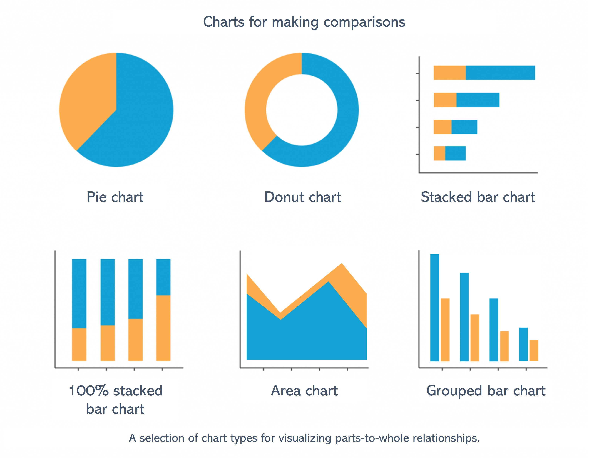

```{r, include = FALSE, warning = FALSE, message = FALSE}
# require pacman 
if(!require(pacman)) install.packages("pacman")

# Source functions 
source(here::here("global/functions/lesson_functions.R"))

# knitr settings
knitr::opts_chunk$set(warning = F, message = F, class.source = "tgc-code-block", error = T)
```

# Introduction

Bar plots are one the most common chart type out there and come in several varieties. In the previous lesson, we learned how to make bar plots and their circular counterparts with `{ggplot2}`.

{width="566"}

In this lesson, we'll delve into the intricacies of labeling bar plots, focusing on `geom_label()` and `geom_text()` functions from `{ggplot2}`.

# Learning Objectives

After this lesson, you will be able to:

1.  **Use two different text geoms to label ggplots:**
    -   **`geom_text()`** for simple labels
    -   **`geom_label()`** for emphasized labels
2.  Appropriately transform and summarize data in the appropriate format for different chart types.
3.  Adjust text placement to position labels on stacked, Dodged, and percent-stacked bar plots.
4.  Adjust text placement to position labels on pie charts and donut plots.

## Packages

‣ **Load packages** for the lesson using the `pacman::p_load()` function.

‣ Packages: **tidyverse, here, patchwork, medicaldata**.

```{r}
# Load required packages: tidyverse, here, patchwork, medicaldata
pacman::p_load(tidyverse, here, patchwork, medicaldata)
```

## Introduction to text geoms in {ggplot2}

‣ Focus on `geom_text()` for **simple labeling** and `geom_label()` for **emphasized labels**.

‣ Apply these geoms on **bar plots, stacked bars, dodged bars, normalized stacked bars, and circular plots**.

‣ Start with a simple bar plot using **fake data** for practice.

```{r}
# Create example data frame with categories A, B, C and counts 10, 20, 15
data <- data.frame(
  category = c("A", "B", "C"),
  count = c(10, 20, 15)
)

# Generate a bar plot using ggplot2, mapping category to x and count to y, 
# Use geom_col() and fill with "steelblue"
# and geom_text() to add labels
```

‣ As you can see however, the placement of our text is odd. Can fix with `nudge_y`. Also increase text size.

```{r}
# Use geom_text in ggplot to add labels
# Address label placement and size
```

‣ Explore negative values of `nudge_y` to move text down.

```{r}
# Experiment with negative nudge_y values to move text down
```

‣ For horizontal bar plots, use `nudge_x` to adjust text horizontally.

```{r}
# Adjust horizontal position of text using nudge_x in horizontal bar plot
```

‣ We can also use the `geom_label()` function for text labels with background rectangles.

```{r}
# Replace geom_text with geom_label for labels with background
```

‣ We can `fill` and `color` aesthetics in `geom_label()` for background and text color.

```{r}
# Adjust fill and color in geom_label for background and text color changes
```

::: practice
### Q: Simple labeling {.unlisted .unnumbered}

Consider the following sample data frame:

```{r}
# Create example data frame
district_cases <- data.frame(
  district = c("A", "B", "C"),
  cases = c(10, 20, 15)
)

district_case
```

Create a labeled bar plot of the data frame above, where the x-axis is the district and the y-axis is the number of cases. The labels should be the number of cases, and should be placed above the bars. The labels should have "darkblue" text with a "lightblue" background. The bar color should be "steelblue".

:::

‣ **PRO-TIP: Setting a custom theme** to streamline your plotting process.

‣ Combine an existing theme with your own customizations: create a **custom theme** combining theme_dark with large bold axis labels:

```{r}
# Define a custom theme with theme_light and large bold axis titles
theme_dark_custom <- 
  theme_dark() +
  theme(axis.title = element_text(size = 16, face = "bold"))
```

‣ Can use this on a single plot as follows:

```{r}
# Apply custom theme to a single plot
```

‣ Set the custom theme as the **default for all plots**:

```{r}
# Set the custom theme as the default for all plots
theme_set(theme_dark_custom)
```

‣ Observe the effect: `theme_dark_custom` automatically applies to every new plot.

‣ Example: Redraw an earlier plot with the new default theme.

```{r}
# Redraw an earlier plot using the new global theme
ggplot(data, aes(x = category, y = count)) +
  geom_col(fill = "steelblue") +
  geom_label(aes(label = count), 
            nudge_y = -3,
            fill = "royalblue4",
            color = "white")
```

‣ To set the default theme back to the original, use `theme_set(theme_gray())`.

```{r}
theme_set(theme_gray())
```

## The `vjust` and `hjust` arguments

‣ Explore `vjust` and `hjust` in `ggplot2` for adjusting text position.

‣ These arguments control **vertical** and **horizontal** justification of text.

## Understanding `hjust` (horizontal justification)

‣ `hjust` modifies horizontal position of text relative to anchor points.

‣ `hjust` values range from **0 to 1**:


```         
‣ `hjust = 0`: Left edge aligns with anchor point.

‣ `hjust = 0.5`: Centered on anchor point.

‣ `hjust = 1`: Right edge aligns with anchor point.
```

```{r}
# Example to show hjust in action
# Use geom_text to display different hjust values on a plot

# Example data
df <- data.frame(x = 1, y = 1)

# Base plot with a point
base_p <- ggplot(df, aes(x, y)) + geom_point() + theme_void()

base_p + geom_text(aes(label = "text"))
```

```{r}
p_hjust_0 <- base_p + geom_text(aes(label = "hjust=0"), hjust = 0)
p_hjust_0.25 <- base_p + geom_text(aes(label = "hjust=0.25"), hjust = 0.25)
p_hjust_0.5 <- base_p + geom_text(aes(label = "hjust=0.5"), hjust = 0.5)
p_hjust_0.75 <- base_p + geom_text(aes(label = "hjust=0.75"), hjust = 0.75)
p_hjust_1 <- base_p + geom_text(aes(label = "hjust=1"), hjust = 1)

# Combine plots with patchwork
p_hjust_0 / p_hjust_0.25 / p_hjust_0.5 / p_hjust_0.75 / p_hjust_1
```

‣ `hjust < 0` and `hjust > 1` for extra left/right alignment/padding.

```{r}
p_hjust_neg0.5 <- base_p + geom_text(aes(label = "hjust=-0.5"), hjust = -0.5)
p_hjust_neg0.2 <- base_p + geom_text(aes(label = "hjust=-0.2"), hjust = -0.2)
p_hjust_1.2 <- base_p + geom_text(aes(label = "hjust=1.2"), hjust = 1.2)
p_hjust_1.5 <- base_p + geom_text(aes(label = "hjust=1.5"), hjust = 1.5)

# Combine plots with patchwork
p_hjust_neg0.5 / p_hjust_neg0.2 / p_hjust_0 / p_hjust_0.25 / p_hjust_0.5 / p_hjust_0.75 / p_hjust_1 / p_hjust_1.2 / p_hjust_1.5
```

::: practice
### Q: Horizontal adjusment practice {.unlisted .unnumbered}

Consider the following horizontal bar plot with text labels added:

```{r}
# sample data
sample_gender <- 
  data.frame(gender = c("F", "M"), 
             n = c(10, 20))

ggplot(sample_gender, aes(x = n, y = gender)) + 
  geom_col() + 
  geom_text(aes(label = n))
```

Use the `hjust` or `vjust` arguments to adjust the position of the text label so that it is inside the bar, with some padding on the right side.
:::

::: pro-tip
‣ Be cautious with `hjust` outside 0-1 range for varying label lengths. Can be problematic when your labels are not the same length:

```{r}
# Different text labels with varying lengths
p_xx <- base_p + geom_text(aes(label = "xxx"), hjust = 1.5)
p_xxxx <- base_p + geom_text(aes(label = "xxxxxx"), hjust = 1.5)
p_xxxxxx <- base_p + geom_text(aes(label = "xxxxxxxxx"), hjust = 1.5)

# Combine plots with patchwork
p_xx / p_xxxx / p_xxxxxx
```

‣ When this matters, you can use `nudge_x` and `nudge_y` as an alternative for consistent label positioning.
:::

## Understanding `vjust` (vertical justification)

‣ `vjust` adjusts vertical position of text labels.

‣ `vjust` values also from **0 to 1**:

```         
‣ `vjust = 0`: Bottom edge aligns with anchor point.

‣ `vjust = 0.5`: Centered vertically.

‣ `vjust = 1`: Top edge aligns with anchor point.
```

```{r}
# Base plot with a point
p <- ggplot(df, aes(x, y)) + geom_point() + theme_void()

p + geom_text(aes(label = "text"))
```

```{r}
p_vjust_0 <- p + geom_text(aes(label = "vjust=0"), vjust = 0)
p_vjust_0.25 <- p + geom_text(aes(label = "vjust=0.25"), vjust = 0.25)
p_vjust_0.5 <- p + geom_text(aes(label = "vjust=0.5"), vjust = 0.5)
p_vjust_0.75 <- p + geom_text(aes(label = "vjust=0.75"), vjust = 0.75)
p_vjust_1 <- p + geom_text(aes(label = "vjust=1"), vjust = 1)

# Combine plots with patchwork
p_vjust_0 / p_vjust_0.25 / p_vjust_0.5 / p_vjust_0.75 / p_vjust_1
```

‣ Like `hjust`, `vjust` can go beyond 0-1 to add padding:

```{r}
p_vjust_neg0.5 <- p + geom_text(aes(label = "vjust=-0.5"), vjust = -0.5)
p_vjust_1.5 <- p + geom_text(aes(label = "vjust=1.5"), vjust = 1.5)

# Combine plots with patchwork
p_vjust_neg0.5 / p_vjust_0 / p_vjust_0.25 / p_vjust_0.5 / p_vjust_0.75 / p_vjust_1 / p_vjust_1.5
```

::: practice
### Q: Vertical adjusment practice {.unlisted .unnumbered}

Consider the following bar plot with text labels added:

```{r}
# sample data
sample_gender <- 
  data.frame(gender = c("F", "M"), 
             n = c(10, 20))


ggplot(sample_gender, 
       aes(x = gender, y = n)) + 
  geom_col() + 
  geom_text(aes(label = n), color = "white")
```

Use the `hjust` or `vjust` arguments to adjust the position of the text label so that it is inside the bar, with some padding on the top.
:::

## Data Example: TB Treatment Outcomes in Benin

‣ We will apply our learned skills to the `tb_outcomes` dataset.

‣ This dataset was also used in a previous lesson.

```{r}
tb_outcomes <- read_csv(here::here('data/benin_tb.csv'))
tb_outcomes
```

‣ Our goal: to plot the number of TB cases per hospital.

‣ The total number of cases per hospital isn't directly available.

‣ We need to first summarize the `cases` data.

```{r}
# Calculate total number of cases per hospital
# Group by hospital, then summarize cases = sum(cases)
```

‣ We'll visualize the total number of cases per hospital using `hospital_sums`.

‣ `geom_text()` will be used to annotate the bars in the plot.

```{r}
# Plot using ggplot
# Use geom_col for bars and geom_text for annotations
```

::: practice
### Q: Summarize then plot {.unlisted .unnumbered}

Consider the `aus_tb_notifs` dataset imported below, which shows the number of TB cases in urban and rural areas per quarter:

```{r}
aus_tb_notifs <- read_csv(here::here('data/aus_tb_notifs_modified.csv'))
aus_tb_notifs 
```

Create a simple bar plot to visualize the total number of TB cases in urban areas for **each year**. Label each bar with the total number of cases using `geom_text()` just below the bar.

**Hint**: First, aggregate the data by year and sum up the urban cases. Then use `ggplot()` with `geom_col()` for the bar plot and `geom_text()` for the labels.
:::

::: pro-tip
**Further Aesthetic Modifications**

‣ Additional aesthetics include:

-   `size`: the size of the text, in mm
-   `angle`: the angle of the text, from 0 to 360
-   `alpha`: the transparency of the text, from 0 to 1
-   `color`: the color of the text
-   `family`: the font family of the text, such as "sans", "serif", "mono"
-   `fontface`: the font face of the text, including "plain", "bold", "italic", "bold.italic"
-   `group`: a grouping variable for the text
-   `hjust`: horizontal justification of the text
-   `vjust`: vertical justification of the text
-   `lineheight`: the line height of the text

‣ Experiment with these aesthetics to understand their impact on the plot.

```{r}
ggplot(hospital_sums, aes(x = hospital, y = cases)) +
  geom_col(fill = "steelblue") +
  geom_text(aes(label = paste(cases, "\ncases")), 
            size = 5,
            angle = 0,
            alpha = 0.5,
            color = "black",
            family = "mono",
            fontface = "bold",
            hjust = 0.5,
            vjust = 1,
            nudge_y = -10,
            lineheight = 0.8) + 
  theme(axis.text.x = element_text(angle = 90))
```
:::

## Labeling Stacked Bar Plots

‣ We explore **labeling in stacked bar plots** with two categorical variables.

‣ We use the `tb_outcomes` dataset, summarizing by `period_date` and `diagnosis_type`.

```{r}
# Summarize the data by period and diagnosis type
# Group by period_date and diagnosis_type
# Summarize cases = sum(cases)
```

‣ Create a **simple stacked bar plot** using ggplot2.

```{r}
# Basic stacked bar plot called quarter_dx_bar
  # Use aes(x = period_date, y = cases, fill = diagnosis_type)
  # geom_col() for bar plot
  # labs(title = "New and relapse TB cases per quarter",
  #     subtitle = "Data from six health facilities in Benin, 2015-2017")
```

‣ We aim to **add text labels** to each bar segment using `cases`.

```{r}
quarter_dx_bar
# Add text labels to the bar plot
  # geom_text() with aes(label = cases)
```

‣ Notice the misalignment of labels - they don't match bar heights.

‣ To correct this, set `position = "stack"` in `geom_text()`.

```{r}
# Correct label position
  # Add position = "stack" to geom_text()
```

‣ For vertical alignment inside bars, we can use `vjust` in `geom_text()`.

```{r}
# Reposition labels inside the bars
# Add vjust = 1.5 
```

‣ But what if we want to center the labels in each bar segment? Can use `position_stack(vjust = 0.5)`.

```{r}
# Center labels vertically in each bar segment
# Adjust position_stack() parameter vjust to 0.5
```

‣ This approach is effective for horizontal bar plots - flip axes with `coord_flip()`.

```{r}
# Horizontal bar plot with flipped axes and label modifications
  # Add color and fontface adjustments to geom_text()
  # Use coord_flip() for horizontal orientation
```

::: practice
### Q: Practice with labeling stacked plots {.unlisted .unnumbered}

Create a stacked bar plot showing the distribution per year of TB cases in rural and urban areas using the `aus_tb_notifs` dataset. Use `geom_text()` and adjust the position of the labels for clarity.

**Hint**: Pivot the data so that `area_type` is a column, then summarize the data by `year` and `area_type`, calculating the sum of cases (`cases`) for each group. The pivoting is done for you in the code below.

```{r}
# Pivot the data
aus_tb_notifs %>%
  pivot_longer(cols = c(rural, urban),
               names_to = "area_type", 
               values_to = "cases")

# Summarize the data by year and area type


# Create the stacked bar plot
```
:::

## Labeling Dodged Bar Plots

‣ Exploring **dodged bar charts**: multiple categories displayed side by side.

‣ Start by grouping `tb_outcomes` dataset by `hospital` and `diagnosis_type`.

‣ Calculate the sum of cases (`cases`) for each group.

```{r}
# Group tb_outcomes by hospital and diagnosis_type
# Calculate cases = sum(cases)
# Store in hospital_dx_cases
```

‣ Create a **dodged bar chart**, setting `position = "dodge"` in `geom_col()`

```{r}
# Create dodged bar chart with tb_outcomes
  # Use ggplot, setting x to hospital, y to cases, and fill to diagnosis_type
  # Add geom_col with position set to dodge
  # Assign to hospital_dx_bar
```

‣ Annotate chart with `geom_text()` to display the labels.

```{r}
# Add geom_text to hospital_dx_bar
  # Set aes label to cases
```

‣ Not quite right! Need to adjust `geom_text()` with `position = position_dodge()` for proper alignment with bars.

```{r}
# Adjust geom_text in hospital_dx_bar
  # Use position_dodge()
```

‣ **Important**: Specify a `width` argument for `position_dodge()`.

‣ Use `width = 0.9` for `geom_text()`, as this is the default width for `geom_col()`.

```{r}
# Adjust geom_text in hospital_dx_bar
# Use position_dodge() with width = 0.9
```

‣ Finally, shift labels up slightly with `vjust` for better visualization.

```{r}
# Final adjustment to geom_text
# Use position_dodge with width = 0.9 and adjust vjust
```

::: practice
### Q: Practice with labeling dodged bar plots {.unlisted .unnumbered}

Generate a dodged bar plot that displays rural and urban TB cases side by side for each year using the `aus_tb_notifs` dataset. Label each bar using `geom_text()`, ensuring the labels are correctly aligned.

You can use the code and comments below as a guide:

```{r}
# Pivot the data
aus_tb_notifs %>%
  pivot_longer(cols = c(rural, urban),
               names_to = "area_type",
               values_to = "cases")

# then summarize the data by year and area type


# then create the dodged bar plot
# for the text, use position = position_dodge(width = 0.9)


```
:::

# Labeling Percent-Stacked Bar Plots

‣ For percent stacked bar plot, need to format labels into percentages to match the segments on the chart.

‣ By the end of this section, you'll have recreated the example graph.

```{r echo = F}
tb_outcomes %>% 
  group_by(hospital, diagnosis_type) %>% 
  summarise(total_cases = sum(cases)) %>%
  mutate(prop = total_cases / sum(total_cases)) %>% 
  ggplot(aes(x = hospital, y = total_cases, fill = diagnosis_type)) +
  geom_col(position = "fill") +
  geom_text(aes(label = scales::percent(prop, accuracy = 1)), # set sig figs
                position = position_fill(vjust = 0.5), 
            color = "white", fontface = "bold", size = 4.5) +
  coord_flip() + 
  theme_minimal() +
  labs(x="", y = "Proportion", fill = "Diagnosis Method",
       title = "New and Relapse Tuberculosis Cases Diagnosis",
       subtitle = "Data from six health facilities in Benin, 2015-2017")
```

‣ Let's start with a stacked bar plot showing raw counts.

```{r}
hosp_dx_sum <- tb_outcomes %>%
  group_by(hospital, diagnosis_type) %>%
  summarise(total_cases = sum(cases))

hosp_dx_sum

hosp_dx_sum %>%
  ggplot(aes(x = hospital, y = total_cases, fill = diagnosis_type)) +
  geom_col() +
  geom_text(aes(label = total_cases),
            position = "stack")
```

‣ Now we can normalize this by using the "fill" position for geom_col() and geom_text(). Or rather, position_fill().

```{r}
# use position_fill() for geom_col() and geom_text()
```

‣ Next, replace raw values with percentages.

```{r}
# Calculate proportion of cases for each hospital and diagnosis type
# Create a column 'prop' for proportions
```

‣ Create a bar chart with the `prop` column.

```{r}
# Use prop for the y-axis in ggplot
# Create a bar chart with geom_col. Don't need position_fill any longer
# assign to hosp_dx_fill
```

‣ Add labels using `geom_text()`.

```{r}
# Add labels to the plot using geom_text and position_fill
```

‣ Improve label readability by formatting decimals and percentages.

```{r}
hosp_dx_fill +
  geom_text(aes(label = scales::percent(prop)),
            position = position_fill()) 
```

‣ Center labels using `vjust` in `position_fill()`.

```{r}
# Center labels in the bar plot using vjust in position_fill()
```

‣ Enhance readability with flipped coordinates and aesthetic tweaks.

```{r}
# Flip coordinates for better readability
# Add aesthetic elements like color, fontface and size to labels
```

::: practice
### Q: Creating Percent-Stacked Bar Plots with Labels {.unlisted .unnumbered}

Transform the `aus_tb_notifs` data into a percent-stacked bar plot, with a bar for each year, and the fill aesthetic mapped to the area type (rural vs urban).

Label each segment with the percentage of cases using `geom_text()`. Format the labels as percentages.

You can use the code and comments below as a guide:

```{r}
# Pivot the data 
aus_tb_notifs %>%
  pivot_longer(cols = c(rural, urban),
               names_to = "area_type",
               values_to = "cases")

# Then summarize and calculate proportions


# Next create the percent-stacked bar plot
# For the label, use the scales::percent() function with an accuracy of 1
# Use position_fill() to center the labels


```
:::

## Labeling Circular Plots

‣ Begin with **summarizing the data** by calculating total cases for each hospital.

```{r}
# Use tb_outcomes data
# Group by hospital
# Summarise to get total_cases
# Save as total_results
```

‣ Create a **simple bar chart** to visualize the data before moving to circular plots.

```{r}

# plot with ggplot
# Set x to 4 for bar chart
# y is total_cases
# fill based on hospital
# Use geom_col()
```

‣ Transform the bar chart into a **basic pie chart** using `coord_polar()`.

```{r}

# Take the bar chart results
# Add coord_polar with theta set to "y"
# Assign to outcome_pie
```

‣ Create a **base donut chart** with `xlim()`.

```{r}


# Start with the pie chart
# Apply xlim set to c(0, 4.5)
# Store as outcome_donut
```

‣ Next, focus on **adding labels** to the pie chart.

```{r}
# Add labels using geom_text
  # Set label to total_cases
  # Note: labels will be misplaced initially
```

‣ Adjust label positions using `position_stack()` and `vjust`.

```{r}
# Update geom_text
  # Add position argument with position_stack
  # vjust set to 0.5 to center labels
```

‣ Apply similar adjustments using `geom_label()`.

```{r}
# Use geom_label instead of geom_text
# Same position and x adjustments
# Address legend issue with show.legend = FALSE
```

‣ Label the **donut chart** similarly, centering labels in sections.

```{r}

# Apply geom_text to donut chart
```

‣ Enhance the chart's aesthetics with `theme_void()`, color adjustments, and label styling.

```{r}
# Final aesthetic adjustments
# Use theme_void for cleaner look 
# Apply new color palette with scale_fill_viridis_d
# Update geom_text for label visibility and style
```

‣ **Congratulations!** The charts should now look great!

::: practice
### Q: Labeling Pie Charts {.unlisted .unnumbered}

Plot total TB cases in all rural vs urban areas in the `aus_tb_notifs` dataset as a pie chart. Use `geom_text()` to place labels correctly, indicating the number of cases in that area.

You can use the code and comments below as a guide:

```{r}
# Pivot then summarize the total cases per area type
aus_tb_notifs %>%
  pivot_longer(cols = c(rural, urban),
               names_to = "area_type",
               values_to = "cases") %>% 
  group_by(area_type) %>%
  summarise(total_cases = sum(cases)) 

# Now, create the pie chart
# For the text labels, use geom_text() and position_stack(vjust = 0.5)


```
:::

::: pro-tip
**Pro-Tip: Enhancing Text Labels with ggtext**

For advanced plotters seeking even more sophisticated control over text formatting in ggplot2, the {ggtext} package may come in handy.

Consider the example below, which uses {ggtext} for the plot title, subtitle and bar labels:

```{r}
pacman::p_load(tidyverse, ggtext, medicaldata)

# Data and Plot
medicaldata::strep_tb %>% 
  count(gender) %>% 
  mutate(gender_label = paste0("**<span style='font-size:16pt'>", n, "</span>**", 
                               if_else(gender == "M", " men", " women"))) %>% 
  ggplot(aes(x = gender, fill = gender, y = n)) +
  geom_col() +
  scale_fill_manual(values = c("M" = "#ee6c4d", "F" = "#424874")) +
  labs(
    title = "<b><span style='color:#424874; font-size:19pt'>Female</span> vs
    <span style='color:#ee6c4d; font-size:19pt'>Male</span> 
    Patients in Strep Study</b>",
    subtitle = "<span style='color:gray60'>A demonstration of custom text labels with </span>**{ggtext}**") +
  theme_classic() +
  theme(plot.title = element_textbox_simple(), 
        plot.subtitle = element_textbox_simple(),
        legend.position = "none", 
        axis.text.x = element_blank()) +
  geom_richtext(aes(label = gender_label, y = n/2), 
                label.r = grid::unit(5, "pt"), fill = "white")
```

To learn more about {ggtext}, visit [the package website](https://wilkelab.org/ggtext/).
:::

# Learning Objectives

After this lesson, you will be able to:

‣ **Use two different text geoms to label ggplots:** - **`geom_text()`** for simple labels - **`geom_label()`** for emphasized labels

‣ Appropriately transform and summarize data in the appropriate format for different chart types.

‣ Adjust text placement to position labels on stacked, Dodged, and percent-stacked bar plots.

‣ Position labels on pie charts and donut plots.
