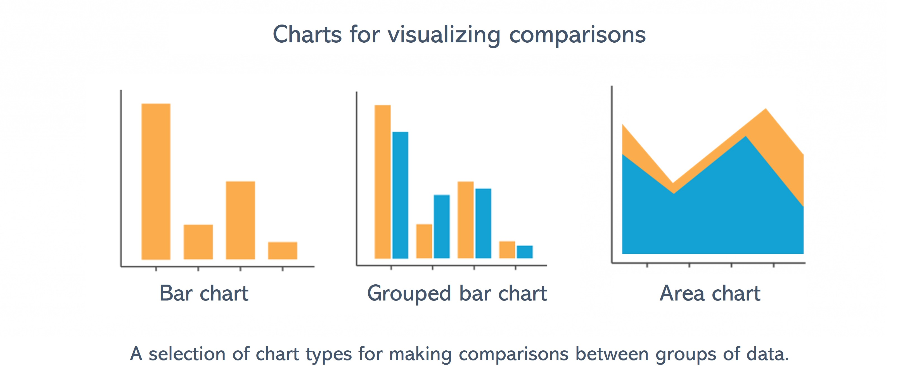
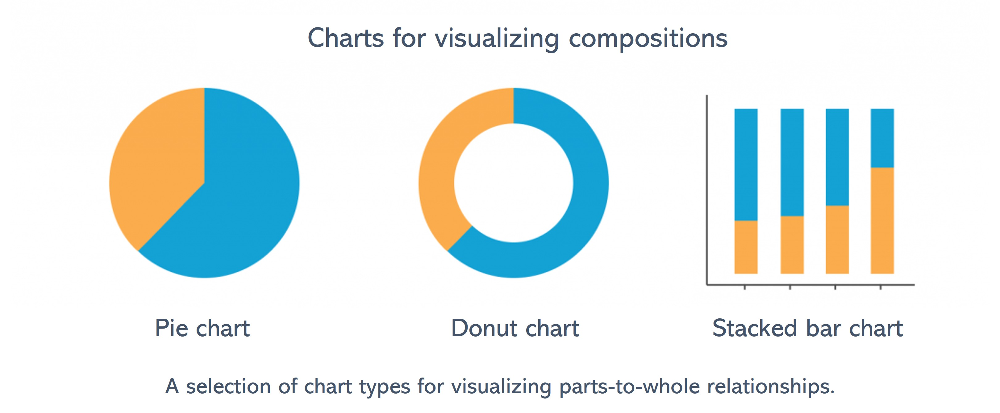

---

title: 'Visualizing Comparisons and Compositions'
output:
  html_document:
    number_sections: true
    toc: true
    toc_float: true
    css: !expr here::here("global/style/style.css")
    highlight: kate
  word_document:
    toc: true
editor_options:
  markdown:
    wrap: 100
  canonical: true
  chunk_output_type: inline
---

```{r, echo = F, message = F, warning = F}
knitr::opts_chunk$set(class.source = "tgc-code-block")
# Load packages 
if(!require(pacman)) install.packages("pacman")
pacman::p_load(tidyverse, knitr, here, reactable)

# Source functions 
source(here::here("global/functions/lesson_functions.R"))

# knitr settings
knitr::opts_chunk$set(warning = F, message = F, class.source = "tgc-code-block", error = T)
```

# Introduction {.unnumbered}

Welcome to our tutorial on visualizing comparisons and compositions using {ggplot2} in R. Analyzing and comparing categories, as well as visually representing the composition of elements, are fundamental aspects of data visualization in R.

In this lesson, we'll explore a variety of visualization techniques for these two applications!

We will start our journey by examining bar charts, a foundational element in data visualization. Bar charts offer exceptional versatility, allowing straightforward comparisons across diverse categories. However, when our focus shifts to understanding proportions or compositions, pie charts come into play. These charts prove invaluable in visually representing data where the cumulative sum of all parts constitutes a whole.

This tutorial aims to equip you with the skills to effectively visualize aggregated data and make comparisons. By the end, you'll have a solid understanding of how to use {ggplot2} functions to visualize and compare groups in your data, enhancing your ability to draw meaningful insights from your datasets. Let's get started!


# Learning objectives {.unnumbered}

1)  Understand the difference between visualizing comparisons and visualizing compositions, and recall the appropriate chart types for these two types of analysis.
2)  Create and customize bar charts using {ggplot2} for comparing categorical data, with `geom_col()`, `geom_errorbar()`, and `position` adjustments.
3)  Create and customize pie charts using `coord_polar()` with `geom_col()`.

# Load packages

In this lesson we will use the following packages:

-   `{tidyverse}` for data wrangling and data visualization

-   `{here}` for project-relative file paths

```{r}
pacman::p_load("tidyverse", "here")
```

# Data: TB treatment outcomes in Benin

In the realm of public health, data often comes in forms that require us to compare metrics between subgroups or understand the relative contributions to a total count.

Today we'll be looking at sub-national tuberculosis (TB) data from Benin. The data was provided by WHO and hosted on this [DHIS2 dashboard](https://tbhistoric.org/). We will be looking at a subset of this data, with records of treatment outcomes for TB patients in hospitals, from 2015 to 2017.

Let's import the `tb_outcomes` data subset.

```{r render = .reactable_10_rows, message = FALSE}
# Import data from CSV
tb_outcomes <- read_csv(here::here('data/benin_tb.csv'))

# Print data frame
tb_outcomes
```

The data contains records of the number of new and relapse cases started on treatment (`cases`). The case counts are disaggregated by a number of groupings: time period, health facility, treatment outcome, and diagnosis type.

Here are the detailed variable definitions for each column:

1.  **`period`** and **`period_date`**: records the time frame for each entry in the dataset. The periods are marked quarterly, starting from the first quarter of 2015 (represented as `2015Q1`) up to the last quarter of 2017 (`2017Q4`). This allows us to track the progression and changes in TB cases over time.

2.  **`hospital`**: indicates the specific health facility where the TB cases were recorded. These facilities represent different geographical and administrative areas, each with unique characteristics and capabilities. This subset of the data contains treatment outcome records from five health facilities: St Jean De Dieu, CHPP Akron, CS Abomey-Calavi, Hopital Bethesda, Hopital Savalou, and Hopital St Luc. This information can be used to analyze and compare the prevalence and treatment outcomes of TB across different facilities.

3.  **`outcome`:** This column categorizes the TB cases based on the diagnosis type and the stage of their treatment journey. Each variable corresponds to a different aspect of the patient's diagnosis and treatment progress:

    -   **`completed`**: started on treatment and the respective outcome is indicated as completed.

    -   **`cured`**: started on treatment and for whom the respective outcome is indicated as cured (and backed by at least two clear sputum smear results)

    -   **`died`**: Represents the TB cases that resulted in the death of the patient during treatment, including both bacteriologically confirmed and clinically diagnosed cases.

    -   **`failed`**: These are the cases where treatment failed, which is confirmed for bacteriologically tested patients and observed in clinically diagnosed cases.

    -   **`unevaluated`**: These are the TB cases that started treatment but do not have an evaluated treatment outcome available. This applies to both bacteriologically confirmed and clinically diagnosed cases.

4.  **`diagnosis_type`**: This column categorizes the TB cases based on the method of diagnosis. There are two types of diagnosis included in this dataset:

    -   **`bacteriological`**: These are the cases where the presence of TB bacteria is confirmed through bacteriological examination methods, such as sputum smear microscopy or culture methods.
    -   **`clinical`**: These are the cases where TB diagnosis is made based on clinical signs and symptoms, without bacteriological confirmation. This usually happens when bacteriological tests are either unavailable or inconclusive, and the patient presents TB symptoms.

5.  **`cases`**: the number of new or relapse cases started on treatment. This allows for quantitative analysis of the TB cases, such as the total number of new cases over a specific period or the number of cases that completed treatment in a particular health facility.

# Visualizing comparisons

Visualizations allow you to ask questions of your data, and the type of question you want to ask will determine the chart type. A ton of questions you might ask about your data will hinge on a comparison between values. Which region was responsible for the most cases or deaths? What year had the best treatment outcomes? These questions are answered quickly by gathering and comparing different values in your data.



## Bar charts

One of the most common chart types are bar charts, and for good reason! They are often the most efficient and effective way of conveying counts per group or category so that comparisons can be made between the bars.

They are especially effective when the categories are ordinal (i.e., contain an inherent order; e.g., age groups), or time based (e.g., months of the year).

But when should we consider choosing a bar/column chart? Bar charts are ideally used when dealing with data that can be **grouped into categories** and when wanting to make **comparisons** between these categories.

When using {ggplot2}, we can use the `geom_col()` function to create a bar plot of a categorical variable against a numerical variable.

Let's exemplify this by visualizing the *Number of cases per treatment outcomes* in the `tb_outcomes` dataset:

```{r}
# Basic bar plot example 1: Frequency of treatment outcomes
tb_outcomes %>% 
  # Pass the data to ggplot as a basis for creating the visualization
  ggplot(
    # Specify that the x and y axis variables 
    aes(x = outcome, y = cases)) + 
  #  geom_col() creates a bar plot
  geom_col() +
  labs(title = "Number of cases per treatment outcome")
```

As we can see from the graph above, `geom_col()` has automatically tallied the total number of cases per outcomes, across all periods, hospitals, and diagnosis types.

We can also change the x-axis variable to any other categorical variable in the data as below:

```{r}
# Basic bar plot example 2: Case counts per hospital
tb_outcomes %>% 
  ggplot(aes(x = hospital, y = cases)) + 
  geom_col() +
  labs(title = "Number of Cases per Hospital")
```

In order to properly visualize the various categories, we can generate a horizontal bar plot, by integrating the `coord_flip()` function into our previous code.

```{r}
# Basic bar plot example 3: Horizontal bars
tb_outcomes %>% 
  ggplot(aes(x = hospital, y = cases)) + 
  geom_col() +
  labs(title = "Number of Cases per Hospital") +
  coord_flip()
```

::: side-note
We will use `coord_*()` functions later in the lesson to create circular plots.
:::

## Stacked bar charts

While the previous bar charts depicted case distribution across a *single categorical variable*, we can elevate our understanding by introducing a *second categorical variable* and creating **stacked bar charts**.

This can be done in `ggplot()` by setting fill color to a categorical variable:

```{r}
# Stacked bar plot: 
tb_outcomes %>% 
  ggplot(
    # Fill color of bars by the 'outcome' variable
    aes(x = hospital, 
        y = cases,
        fill = outcome)) + 
  geom_col()
```

As seen above, stacked plots maintain our *primary categories* on the axis while visually **segregating contributions** from different subgroups by splitting the bars into smaller segments.

## Grouped bar charts

-   Grouped bar plots provide a side-by-side representation of subgroups within each main category.
-   We can set the `position` argument to `"dodge"` in `geom_col()` to display bars side by side:

```{r}
# Grouped bar plot: 
tb_outcomes %>% 
  ggplot(
    aes(x = hospital, 
        y = cases,
        fill = outcome)) +
  # Add position argument for side-by-side bars 
  geom_col(position = "dodge")
```

-   Grouped bar charts are not ideal when there are too many groups.
-   We can try this again but with a different grouping variable that has fewer categories:

```{r}
# Grouped bar plot: split into 2 bars
tb_outcomes %>% 
  ggplot(
    # Fill color of bars by the 'diagnosis_type' 
    aes(x = hospital, 
        y = cases,
        fill = diagnosis_type)) +
  geom_col(position = "dodge")
```

::: practice
**Question 1: Basic bar plot**

Write the adequate code that generates a basic bar chart of the number of `cases` per quarter with `period_date` on the x-axis.

```{r eval=FALSE}
tb_outcomes %>% 
  ggplot(
    aes(_______, _______)) + 
  geom_col()
```

**Question 2: Stacked bar plot**

Create a stacked bar chart to display treatment outcomes over different time periods.

```{r eval=FALSE}
tb_outcomes %>% 
  ggplot(
    aes(_______, _______, _______)) + 
  geom_col()
```
:::

## Adding error bars

Visualizing data with error bars allows for a clearer understanding of the variability or uncertainty inherent in the dataset. Error bars can indicate the reliability of a mean score or an individual data point, providing context to the plotted values.

To implement error bars in {ggplot2}, we use the `geom_errorbar()` function. This requires a value for the range of your error, typically defined by the standard deviation, standard error, or confidence intervals.

Here's an example of how to add error bars to our grouped `geom_col()` plot above.

First, let's create the necessary summary data since we need to have some kind of error measurement. In our case, we will compute the standard deviation:

```{r}
hosp_dx_error <- tb_outcomes %>%  
  group_by(hospital, diagnosis_type) %>% 
  summarise(
    total_cases = sum(cases, na.rm = T),
    error = sd(cases, na.rm = T))

hosp_dx_error
```

```{r}
# Recreate grouped bar chart and add error bars
hosp_dx_error %>% 
  ggplot(
    aes(x = hospital,
        y = total_cases,
        fill = diagnosis_type)) +
  geom_col(position = "dodge") +  # Dodge the bars
  #  geom_errorbar() adds error bars
  geom_errorbar(
    # Specify upper and lower limits of the error bars
    aes(ymin = total_cases - error, ymax = total_cases + error),
    position = "dodge"  # Dodge the error bars to align them with side-by-side bars
  )
```

# Visualizing compositions with normalized bar charts and pie charts

With compositions, we want to show how individual parts make up the whole. We could try to answer these questions using chart types discussed above, but there are many chart types devoted to compositions that do a much better job. These part-to-whole chart types immediately focus our visual attention on the relative importance of every part to the total value in the data.



## Percent-stacked bar chart

To visualize a composition, or part-to-whole relationship, we need two ingredients: the parts, and the whole.

The stacked bar charts we created earlier do a somewhat okay job of this:

```{r}
# Regular stacked bar plot
tb_outcomes %>% 
  ggplot(
    aes(x = hospital, 
        y = cases,
        fill = outcome)) + 
  geom_col()
```

-   They show us parts-of-wholes, but all the wholes are different sizes.
-   The height of the bars represents the total number of cases, which is different at every location.
-   Looking at the *relative* distribution of outcomes would be much easier if every bar were the same size.
-   We can do this by creating a 100% stacked bar chart, where the total height of each bar is standardized to the same size, effectively showing proportions rather than counts or absolute values.


This is achieved by setting the `position` argument to `"fill"` in `geom_col()`.

```{r}
# Percent-stacked bar plot
tb_outcomes %>% 
  ggplot(
    aes(x = hospital, 
        y = cases,
        fill = outcome)) + 
  # Add position argument for normalized bars
  geom_col(position = "fill")
```

-   All bars are now the same length, meaning all the wholes are now the same size. This now allows us to easily evaluate the contributions of the different parts to the whole.

## Circular plots: Pie charts

In this section, we will delve into circular data visualizations, particularly pie charts, to demonstrate categorical data distribution. These types of plots can be quite polarizing in the data visualization community due to their tendency to distort data interpretation. However, when employed judiciously, they can offer an intuitive snapshot of proportions within a dataset.

::: watch-out
-   Delve into pie charts with a note of caution: they're visually enticing but can mislead.
-   Recognize that bar plots often surpass these charts in delivering precise data interpretations.
-   Understand that our brains prefer comparing lengths (like bars) over angles or areas (like pie slices).
-   Remember, as data categories grow, pie charts can get overly crowded and lose clarity.
-   Acknowledge their inability to effectively display changes over time, unlike the adept bar plot.
-   Use pie charts sparingly, with a mindful eye on their potential to obscure the data's true story.
:::

Before we can visualize the data, we must first aggregate it to get the total counts for each treatment outcome category, ensuring we have a clear representation of each segment of our dataset.

```{r}
outcome_totals <- tb_outcomes %>% 
  group_by(outcome) %>% 
  summarise(
    total_cases = sum(cases, na.rm = T))

outcome_totals
```

A pie chart is basically a round version of a single 100% stacked bar.

```{r}
# Single-bar chart (precursor to pie chart)
ggplot(outcome_totals, 
       aes(x=4, # Set arbitrary x value
           y=total_cases,
           fill=outcome)) +
  geom_col()
```

-   In ggplot2, we'll explore how `coord_*()` functions can change a plot's perspective, like tweaking aspect ratios or axis limits.
-   We'll transform our plot from linear to polar coordinates using `coord_polar()`, which will shape our data into slices for a pie chart.
-   By mapping the `y` aesthetic to angles (using the `theta` argument), we'll collaboratively create a visual that clearly displays the distribution of our categorical data.

```{r}
# Basic pie chart
ggplot(outcome_totals, 
       aes(x=4, 
           y=total_cases, 
           fill=outcome)) +
  geom_col() +
  coord_polar(theta = "y") # Change y axis to be circular
```

## Wrap Up! {.unnumbered}

-   We've worked through this `{ggplot2}` lesson to improve visual comparisons and compositions using bar charts and pie charts.
-   Bar charts were our starting point, highlighting their strength in comparing categories and customization strategies in ggplot2.
-   We then explored pie charts, focusing on their ability to display compositions.
-   Using the `tb_outcomes` dataset, we applied these techniques to real-world public health data, emphasizing TB treatment outcomes in Benin.
-   Our practical exercises included transforming bar plots to 100% stacked bars and creating pie charts with `geom_col()` and `coord_polar()`.
-   The lesson aimed to empower you with the knowledge to choose the right chart type and `{ggplot2}` tools to effectively present your data.

# Solutions {.unlisted .unnumbered}

```{r}
# PQ1 answer:
tb_outcomes %>% 
  ggplot(aes(x = period_date,
             y = cases)) + 
  geom_col()
```

```{r}
# PQ2 answer:
tb_outcomes %>% 
  ggplot(
    aes(x = period_date, 
        y = cases,
        fill = outcome)) + 
  geom_col()
```

