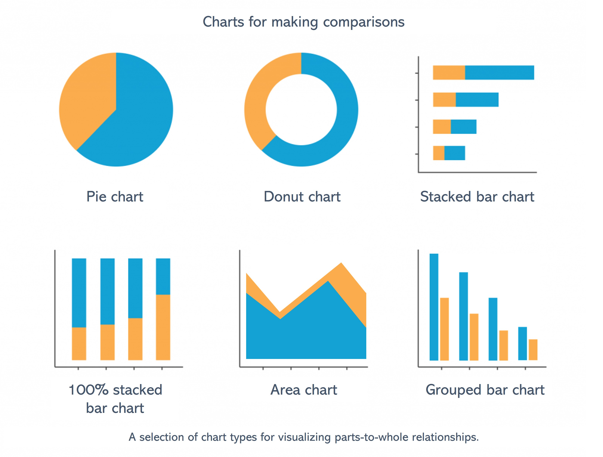

```{r, echo = F, message = F, warning = F}
knitr::opts_chunk$set(class.source = "tgc-code-block")
# Load packages 
if(!require(pacman)) install.packages("pacman")
pacman::p_load(tidyverse, knitr, here, reactable)

# Source functions 
source(here::here("global/functions/lesson_functions.R"))

# knitr settings
knitr::opts_chunk$set(warning = F, message = F, class.source = "tgc-code-block", error = T)
```

# Parts-to-whole visualization

## Introduction

What do bar charts, pie charts, and donut charts have in common? They are all types of parts-to-whole charts! Along with making comparisons, visualizing what things are composed of is one of the most important applications of data visualization. Examining these "parts-to-whole" relationships can provide insight into demographics, budget allocation, levels of agreement, and more. [change this to be more public healthy).



-   these visualisations work for data that can be grouped into categories, where our aim is to see how much of the total each category makes up

-   importance/relevance of comparing between subgroups or categories in epidemiology

-   data often aggregated by age, sex, geographic location, etc.

-   today we'll look at how best to visualizing these comparisons between key population groups, to yield insights about disease patterns

[Example final plots]

## Load packages

```{r}
pacman::p_load("tidyverse", "here", "patchwork")
```

## Data: TB treatment outcomes in Benin

Today we'll be using sub-national data on tuberculosis (TB) in Benin.

-   new or relapse cases started on treatment, 2015-2017, quarterly, 5 hospitals

-   comparing treatment outcomes between key subgroups

Data sourced from WHO, which is hosted on this [DHIS2 dashboard](https://tbhistoric.org/).

Let's import the `tb_outcomes` data subset. This subset comprises tuberculosis (TB) cases recorded over specific periods at certain health facilities. It presents data on the nature of TB cases, the diagnosis type, and the treatment outcomes.

```{r}
tb_outcomes <- read_csv(here::here('data/clean/benin_tb.csv'))
head(tb_outcomes)
```

For clarity, let's review the details of each column in our dataset:

1.  **`period`** and **`period_date`**: records the time frame for each entry in the dataset. The periods are marked quarterly, starting from the first quarter of 2015 (represented as `2015Q1`) up to the last quarter of 2017 (`2017Q4`). This allows us to track the progression and changes in TB cases over time.

2.  **`hospital`**: indicates the specific health facility where the TB cases were recorded. These facilities represent different geographical and administrative areas, each with unique characteristics and capabilities. This subset of the data contains treatment outcome records from five health facilities: St Jean De Dieu, CHPP Akron, CS Abomey-Calavi, Hopital Bethesda, and Hopital St Luc. This information can be used to analyze and compare the prevalence and treatment outcomes of TB across different facilities.

3.  **`outcome`:** This column categorizes the TB cases based on the diagnosis type and the stage of their treatment journey. Each variable corresponds to a different aspect of the patient's diagnosis and treatment progress:

    -   **`completed`**: started on treatment and the respective outcome is indicated as completed.

    -   **`cured`** started on treatment and for whom the respective outcome is indicated as cured (and backed by at least two clear sputum smear results)

    -   **`died`** Represents the TB cases that resulted in the death of the patient during treatment, including both bacteriologically confirmed and clinically diagnosed cases. died while under treatment

    -   **`failed`**: These are the cases where treatment failed, which is confirmed for bacteriologically tested patients and observed in clinically diagnosed cases.

    -   **`unevaluated`** These are the TB cases that started treatment but do not have an evaluated treatment outcome available. This applies to both bacteriologically confirmed and clinically diagnosed cases.

4.  **`diagnosis_type`**: This column categorizes the TB cases based on the method of diagnosis. There are two types of diagnosis included in this dataset:

    -   **bacteriologically_confirmed** These are the cases where the presence of TB bacteria is confirmed through bacteriological examination methods, such as sputum smear microscopy or culture methods.
    -   **clinically_diagnosed** These are the cases where TB diagnosis is made based on clinical signs and symptoms, without bacteriological confirmation. This usually happens when bacteriological tests are either unavailable or inconclusive, and the patient presents TB symptoms.

5.  **`newrel_cases`**: the number of new or relapse cases started on treatment. This allows for quantitative analysis of the TB cases, such as the total number of new cases over a specific period or the number of cases that completed treatment in a particular health facility.

By providing a comprehensive view of the TB cases, the dataset facilitates the detailed analysis of the disease's prevalence and progression over time, the effectiveness of different treatment approaches, and the performance of different health facilities in managing and treating TB. This dataset also helps in understanding the distribution of bacteriologically confirmed and clinically diagnosed TB cases. \## **Counting categorical data**

## Bar charts/column charts

When to choose a bar/column chart

-   Have a set of data that can be grouped into categories
-   Want to make comparisons between those categories

```{r}
# Basic bar plot example 1
tb_outcomes %>% 
  # Pass the data to ggplot as a basis for creating the visualization
  ggplot() + 
  #  geom_col() creates a bar plot
  geom_col(
    # Specify that the x-axis will represent the 'outcome' variable 
    aes(x = outcome, y = newrel_cases)
  ) +
  labs(title = "Number of Cases for Each Treatment")
```

```{r}
# Basic bar plot example 2
tb_outcomes %>% 
  # Pass the data to ggplot as a basis for creating the visualization
  ggplot() + 
  #  geom_col() creates a bar plot
  geom_col(
    # Specify that the x-axis will represent the 'hospital' variable 
    aes(x = hospital, y = newrel_cases)
  ) +
  labs(title = "Number of Cases per Hospital")
```

### Stacked bar charts


Step 1: set fill

```{r}
# Stacked bar plot
tb_outcomes %>% 
  ggplot() + 
  geom_col(
    # Fill color of bars by the 'outcome' variable 
    aes(x = hospital, 
        y = newrel_cases,
        fill = outcome)
  )
```

Step 2: position adjustment

```{r}
# Percent-stacked bar plot
tb_outcomes %>% 
  ggplot() + 
  geom_col(
    aes(x = hospital, 
        y = newrel_cases,
        fill = outcome),
    position = "fill"
  )
```

::: pro-tip
`str_wrap()` for managing overlapping x axis labels
:::

### Grouped bar charts

-   first show with outcome, then say better with smaller number of categories, like diagnosis_type with only two types.

```{r}
# Grouped bar plot - too many categories
tb_outcomes %>% 
  # Pass the data to ggplot as a basis for creating the visualization
  ggplot() + 
  #  geom_col() creates a bar plot
  geom_col(
    # Specify that the x-axis will represent the 'outcome' variable 
    aes(x = hospital, 
        y = newrel_cases,
        fill = outcome),
    position = "dodge"
  ) +
  labs(title = "Number of Cases for Each Treatment")
```

```{r}
# Grouped bar plot - 2 categories
tb_outcomes %>% 
  # Pass the data to ggplot as a basis for creating the visualization
  ggplot() + 
  #  geom_col() creates a bar plot
  geom_col(
    # Specify that the x-axis will represent the 'outcome' variable 
    aes(x = hospital, 
        y = newrel_cases,
        fill = diagnosis_type),
    position = "dodge"
  ) +
  labs(title = "Number of Cases for Each Treatment")
```

::: practice
1)  Basic bar chart of numer of cases per quarter

-   period_date on x axis

```{r}
# PQ1 answer:
tb_outcomes %>% 
  ggplot() + 
  geom_col(
    aes(x = period_date, 
        y = newrel_cases)
  )
```

2)  show treatment outcomes over time

-   100% stacked bar chart of outcomes

```{r}
# PQ2 answer:
tb_outcomes %>% 
  ggplot() + 
  geom_col(
    aes(x = period_date, 
        y = newrel_cases,
        fill = outcome),
    position = "fill"
  )
```
:::

## Error bars

Visualizing data with error bars allows for a clearer understanding of the variability or uncertainty inherent in the dataset, which is crucial when comparing different groups or conditions. Error bars can indicate the reliability of a mean score or an individual data point, providing context to the plotted values.

To implement error bars in {ggplot2}, we use the `geom_errorbar()` function. This requires an understanding of the range of your error, typically defined by the standard deviation, standard error, or confidence intervals.

Here's an example of how to add error bars to a `geom_col()` plot to check out how many treatment cases per year do we have in our data.

First let's create the necessary summary data since we need to have some kind of error measurement, in our case we will compute the standard deviation:

```{r}
hosp_dx_error <- tb_outcomes %>%  
  group_by(period_date, diagnosis_type) %>% 
  summarise(
    total_cases = sum(newrel_cases, na.rm = T),
    error = sd(newrel_cases, na.rm = T))

hosp_dx_error
```

```{r}
# Create the ggplot with proper dodging
hosp_dx_error %>% 
  ggplot(aes(
    x = period_date,
    y = total_cases,
    fill = diagnosis_type,
    group = diagnosis_type  # Ensure proper grouping for dodging
  )) +
  geom_col(position = "dodge") +  # Dodge the bars
  geom_errorbar(
    aes(ymin = total_cases - error, ymax = total_cases + error),
    position = "dodge"  # Dodge the error bars
  )
```

## Area charts

In this section, we\'ll be exploring area plots with `geom_area()`. These plots are especially advantageous for visualizing a range of data values or the progression of data across time, making them ideal for use cases like tracking stock prices or climate changes and in our case the quarterly treatment cases.

Similar to stacked bar charts. We can visualize this same distribution but with an area chart:\

```{r}
tb_outcomes %>% 
  ggplot() + 
  geom_col(
    aes(x = period_date, 
        y = newrel_cases,
        fill = outcome))
```

In order to do this we need to summarise our data so we have the sum of cases for every treatment outcome per quarter:

```{r}
outcome_periods <- tb_outcomes %>% 
  group_by(period_date, outcome) %>% 
  summarise(
    total_cases = sum(newrel_cases, na.rm = T))

outcome_periods
```

```{r}
# Area Plot
outcome_periods %>% 
ggplot(
  aes(
    x = period_date,    # Map 'period' to the x-axis
    y = total_cases,     # Map 'value' to the y-axis
    fill = outcome    # Map 'variable_name' to the fill aesthetic
  )) +
  geom_area(stat = "identity")    # Add an area plot to the graph
```
::: practice


```{r}
# PQ 3 answer
tb_outcomes %>% 
  group_by(period_date, diagnosis_type) %>% 
  summarise(
    total_cases = sum(newrel_cases, na.rm = T)) %>% 
ggplot(
  aes(
    x = period_date,
    y = total_cases,
    fill = diagnosis_type)) +
  geom_area(stat = "identity")
```

:::


## Circular plots: Pie and Donut charts

In this section, we will delve into circular data visualizations, particularly pie charts and donut plots, to demonstrate categorical data distribution. These types of plots can be quite polarizing in the data visualization community due to their tendency to distort data interpretation. However, when employed judiciously, they can offer an intuitive snapshot of proportions within a dataset.

Before we can visualize the data, we must first aggregate it to get the total counts for each treatment outcome category, ensuring we have a clear representation of each segment of our dataset.

```{r}
outcome_totals <- tb_outcomes %>% 
  group_by(outcome) %>% 
  summarise(
    total_cases = sum(newrel_cases, na.rm = T))

outcome_totals
```

A pie chart is basically a round version of a single 100% stacked bar.

```{r}
# Single-bar chart (precursor to pie chart)
ggplot(outcome_totals, 
       aes(x=4, # Set arbitrary x value
           y=total_cases,
           fill=outcome)) +
  geom_col()
```

-   brief sentences about coord functions in ggplot

```{r}
# Basic pie chart
ggplot(outcome_totals, aes(x=4, y=total_cases, fill=outcome)) +
  geom_col() +
  coord_polar(theta = "y")
```

```{r}
# Make it a donut chart
ggplot(outcome_totals, aes(x=4, y=total_cases, fill=outcome)) +
  geom_col(color = "white") +
  coord_polar(theta = "y") + 
  xlim(c(0.2, 4 + 0.5)) # Set x-axis limits
```

the x value controls hole size. smaller number = bigger hole size. replace 4 with placeholder `hsize`.

```{r}
# Set hole width
hsize <- 4

ggplot(outcome_totals, aes(x=hsize, y=total_cases, fill=outcome)) +
  geom_col(color = "white") +
  coord_polar(theta = "y") +
  xlim(c(0.2, hsize + 0.5))

# Set hole width
hsize <- 6

ggplot(outcome_totals, aes(x=hsize, y=total_cases, fill=outcome)) +
  geom_col(color = "white") +
  coord_polar(theta = "y") +
  xlim(c(0.2, hsize + 0.5))

# Set hole width
hsize <- 2

ggplot(outcome_totals, aes(x=hsize, y=total_cases, fill=outcome)) +
  geom_col(color = "white") +
  coord_polar(theta = "y") +
  xlim(c(0.2, hsize + 0.5))

```

```{r}
# Improved aesthetics
ggplot(outcome_totals, aes(x=hsize, y=total_cases, fill=outcome)) +
  geom_col(color = "white") +
  coord_polar(theta = "y") + 
  xlim(c(0.2, hsize + 0.5)) +
  theme_void() # remove background, grid, numeric labels
```

```{r}
# Faceted plot using previous summary data
ggplot(outcome_periods, aes(x=hsize, y=total_cases, fill=outcome)) +
  geom_col(color = "white", position = "fill") +
  coord_polar(theta = "y") + 
  xlim(c(0.2, hsize + 0.5)) +
  theme_void() +
  facet_wrap(~period_date)
```


:::

```{r}
# PQ4 answer
tb_outcomes %>% 
  group_by(outcome, diagnosis_type) %>% 
  summarise(
    total_cases = sum(newrel_cases, na.rm = T)) %>% 
ggplot(aes(x=hsize, y=total_cases, fill=outcome)) +
  geom_col(color = "white", position = "fill") +
  coord_polar(theta = "y") + 
  xlim(c(0.2, hsize + 0.5)) +
  theme_void() +
  facet_wrap(~diagnosis_type)
```

:::