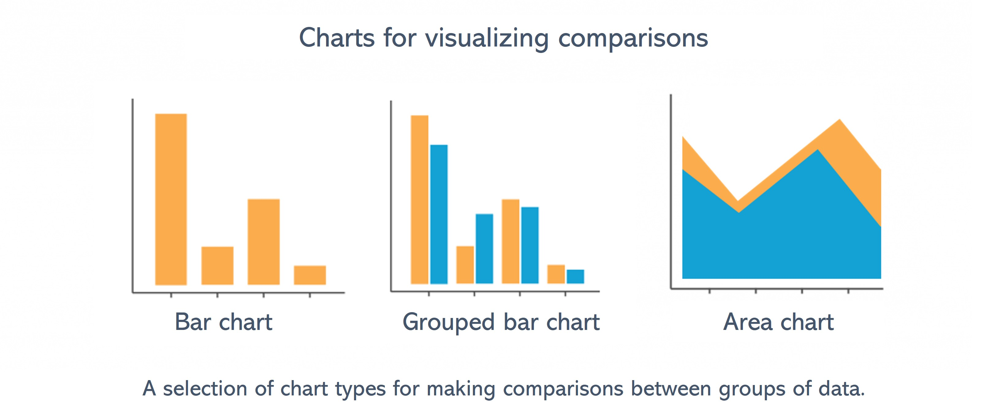
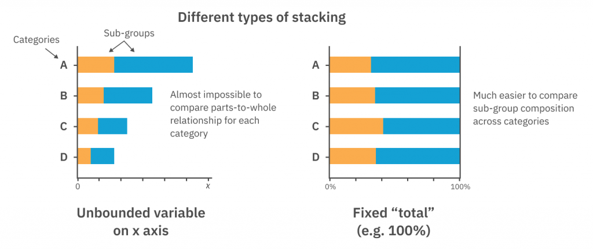

```{r, echo = F, message = F, warning = F}
knitr::opts_chunk$set(class.source = "tgc-code-block")
# Load packages 
if(!require(pacman)) install.packages("pacman")
pacman::p_load(tidyverse, knitr, here, reactable)

# Source functions 
source(here::here("global/functions/lesson_functions.R"))

# knitr settings
knitr::opts_chunk$set(warning = F, message = F, class.source = "tgc-code-block", error = T)
```

# Visualizing Comparisons and Compositions

## Introduction

-   **Begin with `{ggplot2}`**: We welcome you to our tutorial, designed to enhance your visual data comparison and composition skills in R.
-   **Analyze and Visualize**: We'll tackle category analysis and visual breakdowns of data elements.
-   **Master Bar Charts**: Starting with bar charts, we'll compare diverse categories with simplicity and precision.
-   **Pie and Donut Insights**: Moving to proportions, pie and donut charts will show how data parts form a complete picture.
-   **Skill Enhancement Goal**: We aim to boost your `{ggplot2}` proficiency for effective data visualization and comparison.


## Learning objectives

1)  Understand the difference between visualizing comparisons and visualizing compositions, and recall the appropriate chart types for these two types of analysis.
2)  Create and customize bar charts using {ggplot2} for comparing categorical data, with `geom_col()`, `geom_errorbar()`, and `position` adjustments.
3)  Create area plots with `geom_area()` for visualizing comparisons.
4)  Understand the principles of creating effective pie and donut charts for visualizing compositions.
5)  Create and customize pie and donut charts using `coord_polar()` with `geom_col()`.


## Load packages

In this lesson we will use the following packages:

-   `{tidyverse}` for data wrangling and data visualization

-   `{here}` for project-relative file paths

```{r}
pacman::p_load("tidyverse", "here")
```

## Data: TB treatment outcomes in Benin

-   **Public Health Data Analysis**: Compare subgroup metrics and understand data contributions.
-   **Focus on Benin's TB Data**: Investigate WHO-provided sub-national TB data on [DHIS2 dashboard](https://tbhistoric.org/).
-   **Data Composition**: Includes new and relapse TB `cases` started on treatment.
-   **Disaggregation Categories**: Data broken down by time period, health facility, treatment outcome, and diagnosis type.

Let's import the `tb_outcomes` data subset.

```{r render = .reactable_10_rows, message = FALSE}
# Import data from CSV
tb_outcomes <- read_csv(here::here('data/benin_tb.csv'))

# Print data frame
tb_outcomes
```

Here are the detailed variable definitions for each column:

1.  **Time Frame Tracking (`period` and `period_date`)**: Quarterly records from `2015Q1` to `2017Q4`.

2.  **Health Facility Identifier (`hospital`)**:

    -   Data from St Jean De Dieu, CHPP Akron, CS Abomey-Calavi, Hopital Bethesda, Hopital Savalou, Hopital St Luc.

3.  **Treatment Outcome Categories (`outcome`)**:

    -   `completed`: Treatment finished, outcome marked as completed.
    -   `cured`: Treatment succeeded with sputum smear confirmation.
    -   `died`: Patient succumbed to TB during treatment.
    -   `failed`: Treatment did not succeed.
    -   `unevaluated`: Treatment outcome not determined.

4.  **Diagnosis Categorization (`diagnosis_type`)**:

    -   `bacteriological`: Diagnosis confirmed by bacteriological tests.
    -   `clinical`: Diagnosis based on clinical symptoms, sans bacteriological confirmation.

5.  **Case Counts (`cases`)**: Quantifies the number of TB cases starting treatment.

## Visualizing comparisons

-   **Visualization Purpose**: Tailor chart type to the data question at hand.
-   **Comparison Focus**: Utilize visualizations to compare values across categories.
-   **Key Questions**:
    -   Which region had the highest number of cases or deaths?
    -   What year showed the most favorable treatment outcomes?
-   **Data Interpretation**: Use visuals for efficient data value comparison and insights.



### Bar charts

-   **Bar Chart Advantages**: Ideal for displaying counts and making categorical comparisons.
-   **Optimal Usage**:
    -   Effective for ordinal categories or time-based data.
    -   Best when data is grouped into distinct categories.
-   **Comparison Tool**: Bar charts excellently illustrate comparisons among groups.
-   **{ggplot2} Implementation**: Use `geom_col()` for plotting categorical against numerical data.

Let's exemplify this by visualizing the *Number of cases per treatment outcomes* in the `tb_outcomes` dataset:

```{r}
# Basic bar plot example 1: Frequency of treatment outcomes
tb_outcomes %>% 
  # Pass the data to ggplot as a basis for creating the visualization
  ggplot(
    # Specify that the x and y axis variables 
    aes(-------, -------)) + 
  #  geom_col() creates a bar plot
  geom_col() +
  labs(title = "Number of cases per treatment outcome")
```

-   **Aggregation**: `geom_col()` sums up cases by outcomes, incorporating all periods, hospitals, and diagnosis types.
-   **Flexible Axes**: Easily swap the x-axis variable to display other categorical data dimensions.

```{r}
# Basic bar plot example 2: Case counts per hospital
tb_outcomes %>% 
  ggplot(aes(-------, -------)) + 
  geom_col() +
  labs(title = "Number of Cases per Hospital")
```

-   **Horizontal Bar Plot Creation**: Utilize `coord_flip()` to transform a vertical bar chart into a horizontal layout.
-   **Enhanced Category Visualization**: Horizontal orientation can improve readability of categories.

```{r}
# Basic bar plot example 3: Horizontal bars
tb_outcomes %>% 
  ggplot(aes(x = hospital, y = cases)) + 
  geom_col() +
  labs(title = "Number of Cases per Hospital") 
  # new code line here:
  -----------
```

::: side-note
We will use `coord_*()` functions later in the lesson to create circular plots.
:::

### Stacked bar charts

-   **Stacked Bar Charts**: Introduce a second categorical variable for deeper insight.
-   **`ggplot()` Customization**: Use `fill` attribute to differentiate categories within the bars.

```{r}
# Stacked bar plot: 
tb_outcomes %>% 
  ggplot(
    # Fill color of bars by the 'outcome' variable
    aes(x = hospital, 
        y = cases,
        # new code here
        ----------)) + 
  geom_col()
```

-   **Stacked Plot Function**: Retain primary categories on the axis while displaying subgroup contributions.
-   **Visual Segregation**: Differentiate subgroups within bars through color-coded segments.

### Grouped bar charts

-   Grouped bar plots provide a side-by-side representation of subgroups within each main category.
-   We can set the `position` argument to `"dodge"` in `geom_col()` to display bars side by side:

```{r}
# Grouped bar plot: 
tb_outcomes %>% 
  ggplot(
    aes(x = hospital, 
        y = cases,
        fill = outcome)) +
  # Add position argument for side-by-side bars 
  geom_col(-----------)
```

-   Grouped bar charts are not ideal when there are too many groups.
-   We can try this again but with a different grouping variable that has fewer categories:

```{r}
# Grouped bar plot: split into 2 bars
tb_outcomes %>% 
  ggplot(
    # Fill color of bars by the 'diagnosis_type' 
    aes(x = hospital, 
        y = cases,
        # different variable here
        --------------)) +
  geom_col(position = "dodge")
```

::: practice
**Question 1: Basic bar plot**

Write the adequate code that generates a basic bar chart of the number of `cases` per quarter with `period_date` on the x axis

```{r}
# PQ1 answer:
tb_outcomes %>% 
  ggplot(
    aes(_______, _______)) + 
  geom_col()
```

**Question 2: Stacked bar plot**

Create a stacked bar chart to display treatment outcomes over different time periods

```{r}
tb_outcomes %>% 
  ggplot(
    aes(_______, _______, _______)) + 
  geom_col()
```
:::

### Adding error bars

-   Showcasing data variability or uncertainty is done effectively with **error bars**.
-   Error bars help illustrate the **reliability of mean scores** or the precision of data points.
-   In {ggplot2}, adding error bars is achieved with the `geom_errorbar()` function.
-   The error range is typically defined by **standard deviation**, **standard error**, or **confidence intervals**.
-   Essential summary statistics like **mean** and **standard deviation** are necessary for error bars and need to be calculated.
-   By integrating error bars into our grouped bar plots, we gain a more nuanced understanding of the data.

First, let's create the necessary summary data since we need to have some kind of error measurement. In our case we will compute the standard deviation:

```{r}
hosp_dx_error <- tb_outcomes %>%  
  group_by(-------, -------) %>% 
  summarise(
    total_cases = -------,
    error = -------)

hosp_dx_error
```

Now, let use this data to create the plot:

```{r}
# Recreate grouped bar chart and add error bars
hosp_dx_error %>% 
  ggplot(
    aes(x = -------,
        y = -------,
        fill = -------)) +
  geom_col(position = "dodge") +  # Dodge the bars
  #  geom_errorbar() adds error bars
  geom_errorbar(
    # Specify upper and lower limits of the error bars
    aes(ymin = -------, ymax = -------),
    position = "dodge"  # Dodge the error bars to align them with side-by-side bars
  )
```

### Area charts

-   Area plots are constructed with `geom_area()`, which is well-suited for visualizing data over time or across different values.
-   They excel at showcasing the progression of data, such as the number of new treatment cases each quarter.
-   These plots allow us to observe trends and patterns over a continuous variable, highlighting growth or decline in a dataset.

Let's start by visualizing this distribution with a stacked bar chart:

```{r}
tb_outcomes %>% 
  ggplot(
    aes(x = period_date, 
        y = cases,
        fill = outcome)) + 
  geom_col()
```

-   Unlike `geom_col()`, `geom_area()` will not automatically compute the sums for each category.

-   We need to group and summarize our data so we have a data frame with the sum of cases for every treatment outcome per quarter:

```{r}
# Create summary data frame
outcome_by_period <- tb_outcomes %>% 
  group_by(------, ------) %>% 
  summarise(
    total_cases = sum(------, na.rm = T))

outcome_by_period
```

```{r}
# Area plot of treated cases over time
outcome_by_period %>% 
ggplot(
  aes(
    x = period_date,    # Map 'period' to the x-axis
    y = total_cases,     # Map 'value' to the y-axis
    fill = outcome    # Map 'variable_name' to the fill aesthetic
  )) +
  #  geom_area() creates an area plot
  ---------
```

-   To understand the dominant outcome in each section, we analyze the relative contribution of specific outcomes to the overall total.
-   Tracking the proportion of cured cases over time shifts the focus from raw numbers to their percentage of the total for each period.
-   Visualizing part-to-whole relationships requires techniques that highlight composition, such as pie charts, stacked area charts, or treemaps.
-   In the forthcoming section, we will delve into methods that effectively display these composition relationships, providing clarity on how individual parts contribute to the whole.

::: practice
**Question 3: Area Chart**

Create an area chart that illustrates the temporal variation of the total number of cases while simultaneously comparing different types of diagnoses. Using the `tb_outcomes` data frame grouped by `period_date` and `diagnosis_type`, represent the time period `period_date` on the x-axis and the total number of cases `total_cases` on the y-axis.

```{r}
tb_outcomes  %>% 
  group_by(________________) %>% 
  summarise(________________) %>% 
ggplot(
  aes(
    x = __________,
    y = __________,
    fill = __________)) +
  ________________
```
:::

## Visualizing comparisons with normalized bar charts, pie charts, and donut charts

-   Leet's explore how compositions illustrate the contributions of individual parts to a whole.
-   Consider using dedicated composition chart types that better represent these relationships.
-   We'll focus on part-to-whole charts to highlight how each piece fits into the overall picture.


### Percent-stacked bar chart

-   For showcasing compositions, we need to identify the parts and the whole they comprise.
-   Stacked bar charts, previously discussed, serve as an acceptable starting point for visualizing these relationships.

```{r}
# Regular stacked bar plot
tb_outcomes %>% 
  ggplot(
    aes(x = hospital, 
        y = cases,
        fill = outcome)) + 
  geom_col()
```

-   They show us parts-of-wholes, but all the wholes are different sizes.
-   The height of the bars represent the total number of cases, which is different at every location.
-   Looking at the *relative* distribution of outcomes would be much easier if every bar were the same size.
-   We can do this by creating a 100% stacked bar chart, where the total height of each bar is standardized to the same size, effectively showing proportions rather than counts or absolute values.



This is achieved by setting the `position` argument to `"fill"` in `geom_col()`.

```{r}
# Percent-stacked bar plot
tb_outcomes %>% 
  ggplot(
    aes(x = hospital, 
        y = cases,
        fill = outcome)) + 
  # Add position argument for normalized bars
  geom_col(----------)
```

-   All bars are now the same length, meaning all the wholes are now the same size. This now allows us to easily evaluate the contributions of the different parts to the whole.

### Circular plots: Pie and Donut charts

-   Let's dive into circular data visualizations together, examining pie charts and donut plots.
-   We'll acknowledge the mixed feelings these plots sometimes evoke in the data community.
-   With careful use, we aim to unlock their potential for presenting clear snapshots of data proportions.

::: watch-out
-   Delve into donut and pie charts with a note of caution: they're visually enticing but can mislead.
-   Recognize that bar plots often surpass these charts in delivering precise data interpretations.
-   Understand that our brains prefer comparing lengths (like bars) over angles or areas (like pie slices).
-   Remember, as data categories grow, pie and donut charts can get overly crowded and lose clarity.
-   Acknowledge their inability to effectively display changes over time, unlike the adept bar plot.
-   Use pie and donut charts sparingly, with a mindful eye on their potential to obscure data's true story.
:::

-   We'll start by aggregating data to tally total counts for each treatment outcome category.
-   This step ensures each segment of our dataset is clearly represented for visualization.

```{r}
outcome_totals <- tb_outcomes %>% 
  group_by(-------) %>% 
  summarise(
    total_cases = sum(-------, na.rm = T))

outcome_totals
```

A pie chart is basically a round version of a single 100% stacked bar.

```{r}
# Single-bar chart (precursor to pie chart)
ggplot(outcome_totals, 
       aes(x = ------, # Set arbitrary x value
           y = ------,
           fill = ------)) +
  geom_col()
```

-   In ggplot2, we'll explore how `coord_*()` functions can change a plot's perspective, like tweaking aspect ratios or axis limits.
-   We'll transform our plot from linear to polar coordinates using `coord_polar()`, which will shape our data into slices for a pie chart.
-   By mapping the `y` aesthetic to angles (using the `theta` argument), we'll collaboratively create a visual that clearly displays the distribution of our categorical data.

```{r}
# Basic pie chart
ggplot(outcome_totals, 
       aes(x=4, 
           y=total_cases, 
           fill=outcome)) +
  geom_col() +
  ------------- # Change y axis to be circular
```

-   Donut charts, or ring charts, offer a compelling twist on traditional pie charts and are within our reach using ggplot2 in R.
-   We build these charts with a process akin to pie charts, but we add distinctive touches.
-   By employing `geom_col()` we lay the groundwork with a bar chart.
-   The transformation into a circle comes next with `coord_polar(theta = "y")`.
-   With `xlim(c(0.2, 4 + 0.5))`, we're setting the stage for the donut's signature feature: its central void.
-   The lower limit of `0.2` carves out the space for the donut's hole, while `4.5` on the upper end ensures every category has its place.

```{r}
# Make it a donut chart
ggplot(outcome_totals, 
       aes(x=4, 
           y=total_cases, 
           fill=outcome)) +
  geom_col() +
  coord_polar(theta = "y") + 
  xlim(c(0.2, 4 + 0.5)) # Set x-axis limits
```

-   `xlim` is a ggplot2 function to set x-axis limits, crucial for which data appears.
-   `c(0.2, 4 + 0.5)` specifies these limits, creating the donut chart's central hole and ensuring complete category inclusion.
    -   `0.2` as the lower limit crafts the hole by trimming the inner part of the bars.
    -   `4.5` as the upper limit guarantees the last data group is fully visible.
-   The x value controls hole size.
-   Replace 4 with placeholder `hsize` which can be varied.
-   The bigger the value the bigger the hole size. Note that the hole size must be bigger than 0.

```{r}
# Set hole width
hsize <- ---

ggplot(outcome_totals, 
       aes(x= ------- , y=total_cases, fill=outcome)) +
  geom_col() +
  coord_polar(theta = "y") +
  xlim(c(0.2, ------ + 0.5)) +
  labs(title = 'Donut chart with hsize = 4')

# Increase the value to make the hole bigger
hsize <- ---

ggplot(outcome_totals, aes(x=hsize, y=total_cases, fill=outcome)) +
  geom_col() +
  coord_polar(theta = "y") +
  xlim(c(0.2, hsize + 0.5))+
  labs(title = 'Donut chart with hsize = 6')

# Decrease the value to make the hole smaller
hsize <- ---

ggplot(outcome_totals, aes(x=hsize, y=total_cases, fill=outcome)) +
  geom_col() +
  coord_polar(theta = "y") +
  xlim(c(0.2, hsize + 0.5))+
  labs(title = 'Donut chart with hsize = 2')

```

The border, fill colors and the theme of the donut plot can be customized in several ways. The code below illustrates some customization options:

```{r}
# Improved aesthetics
hsize <- 2
ggplot(outcome_totals, 
       aes(x = ------, y=total_cases, fill=outcome)) +
  geom_col(color = "white", --------) + # Add white borders
  coord_polar(theta = "y") + 
  xlim(c(0.2, ----- + 0.5)) +
  scale_fill_brewer(palette = "Paired") + # Set color palette
  ----------- # Remove background, grid, numeric labels
```

The R code snippet enhances a donut chart in ggplot2 for optimal aesthetics:

-   `geom_col(color = "white", linewidth = 0.7)` adds white borders to bars, sharpening their look.
-   `xlim(c(0.2, hsize + 0.5))` adjusts the x-axis limits to create the chart's central hole effectively.
-   `scale_fill_brewer(palette = "Paired")` applies a color scheme for clear distinction between data segments.
-   `theme_void()` strips away the chart's background and labels for a clean, distraction-free presentation.

::: recap
What do stacked bars, pies, and donuts have in common? They are all types of parts-to-whole charts! Along with making comparisons, visualizing what things are composed of is one of the most important applications of data visualization. These visualizations work for data that is grouped into multiple subcategories, where our aim is to see how much of the total each category makes up. Examining these "parts-to-whole" relationships can provide insight into demographics, budget allocation, levels of agreement, and more.
:::

::: practice
**Practice Question:** The whole picture

Using the `tb_outcomes` dataset in R, create a visual representation that compares the proportion of tuberculosis cases by outcome across different types of diagnoses. Your visualization should:

1.  Group the data by `outcome` and `diagnosis_type`.
2.  Summarize the total number of `cases` for each group, accounting for possible missing values (`NA`s).
3.  Display this information in a series of donut charts, one for each diagnosis type, showing the proportion of each outcome within the diagnosis type.
4.  Ensure the charts have a clean look with `**white**` borders around the segments and no background or gridlines.
5.  Arrange the individual donut charts for each diagnosis type using `facet_wrap`.

Write the R code to create this visualization.

```{r}
# PQ4 answer
tb_outcomes %>% 
  group_by(------, -------) %>% 
  summarise(
    total_cases = sum(-----, -----)) %>% 
ggplot(aes(x=----, y=------, fill=-------)) +
  geom_col(color = ------, position = -------) +
  coord_polar(theta = "y") + 
  xlim(c(0.2, ------ + 0.5)) +
  theme_void() +
  -------------
```
:::

## Wrap Up!

-   We've worked through this `{ggplot2}` lesson to improve visual comparisons and compositions using bar, pie, area, and donut charts.
-   Bar charts were our starting point, highlighting their strength in comparing categories and customization strategies in ggplot2.
-   We transitioned to pie and donut charts, focusing on their ability to display compositions and aesthetic details.
-   Using the `tb_outcomes` dataset, we applied these techniques to real-world public health data, emphasizing TB treatment outcomes in Benin.
-   Our practical exercises included transforming bar plots to 100% stacked bars and creating donut charts with `geom_col()`, `coord_polar()`, and `xlim`.
-   We polished our donut charts with aesthetic enhancements such as white borders and Brewer color palettes for visual clarity and appeal.
-   The lesson aimed to empower you with the knowledge to choose the right chart type and `{ggplot2}` tools to effectively present your data.

## Solutions {.unlisted .unnumbered}

```{r}
# PQ1 answer:
tb_outcomes %>% 
  ggplot(aes(x = period_date,
             y = cases)) + 
  geom_col()
```

```{r}
# PQ2 answer:
tb_outcomes %>% 
  ggplot(
    aes(x = period_date, 
        y = cases,
        fill = outcome)) + 
  geom_col()
```

```{r}
# PQ 3 answer
tb_outcomes %>% 
  group_by(period_date, diagnosis_type) %>% 
  summarise(
    total_cases = sum(cases, na.rm = T)) %>% 
ggplot(
  aes(
    x = period_date,
    y = total_cases,
    fill = diagnosis_type)) +
  geom_area()
```

```{r}
# PQ4 answer
tb_outcomes %>% 
  group_by(outcome, diagnosis_type) %>% 
  summarise(
    total_cases = sum(cases, na.rm = T)) %>% 
ggplot(aes(x=hsize, y=total_cases, fill=outcome)) +
  geom_col(color = "white", position = "fill") +
  coord_polar(theta = "y") + 
  xlim(c(0.2, hsize + 0.5)) +
  theme_void() +
  facet_wrap(~diagnosis_type)
```
