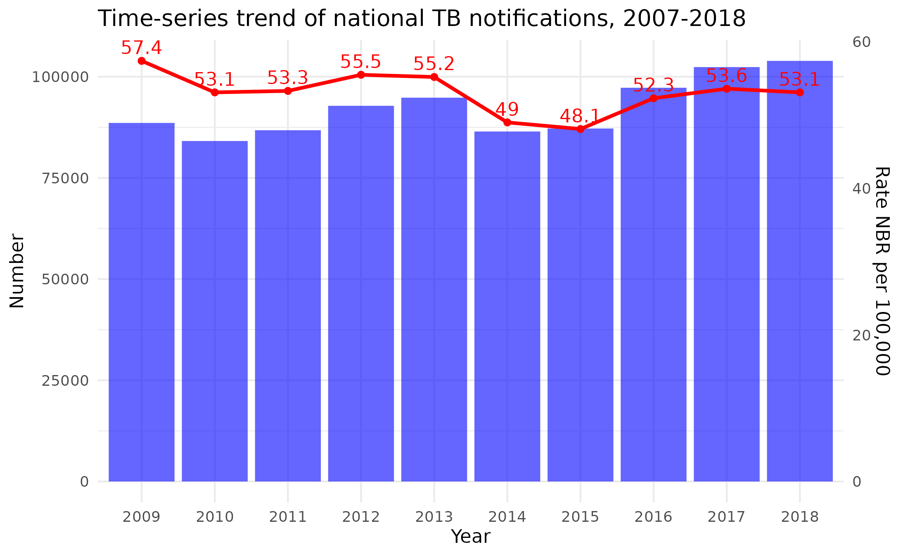

```{r, echo = F, message = F, warning = F}
# Load packages 
if(!require(pacman)) install.packages("pacman")
pacman::p_load(rlang, tidyverse, knitr, here, reactable, gt, flextable, zoo)

## functions
source(here::here("global/functions/misc_functions.R"))

## default render
knitr::opts_chunk$set(class.source = "tgc-code-block", warning = FALSE, message = FALSE)
```

# Introduction

By analyzing time series data—observations made sequentially over time—epidemiologists can spot trends and patterns in disease outbreaks, and inform decision-making for improved health outcomes. In this lesson, we explore using ggplot and the tidyverse to visualize time series data and effectively communicate insights.

{width="408"}

# Learning Objectives

By the end of this lesson you will be able to:

-   Reshape time series data for plotting with pivot_longer()
-   Create line graphs in ggplot2 mapping time to x and values to y
-   Enhance line graph aesthetics with techniques like custom labels, color palettes, annotations
-   Visualize confidence intervals with geom_ribbon()
-   Highlight patterns in noisy data using smoothing and aggregation
-   Compare time series with distinct scales using dual axes and sec_axis()

## Packages

‣ Install and load the necessary packages with the following code chunk

```{r}
# Load packages 
if(!require(pacman)) install.packages("pacman")
pacman::p_load(tidyverse, outbreaks, scales, ggrepel, ggthemes)
options(scipen=999)
```

## Intro to Line Graphs for Time Series Data

‣ We will examine tuberculosis (TB) notifications in Australia over time, comparing notifications in urban and rural areas

‣ **Notifications**: Reported cases of a disease to public health authorities

## Data Preparation: Aggregating and Pivoting

‣ Start by loading and inspecting the data

```{r}
tb_data_aus <- read_csv(here::here("data/aus_tb_notifs.csv"))
# view data
```

‣ Dataset includes `period` (time in quarterly format), `rural` (cases in rural areas), and `urban` (cases in urban areas)

‣ Visualize *annual* TB notifications in urban and rural areas

‣ First, let's extract the year from the `period` column using `str_sub()` function

```{r}
tb_data_aus %>% 
# year as str_sub of period, 1 to 4
# convert to numeric
```

‣ Aggregate the data by year using `group_by()` and `summarise()`

```{r}
________________ <- 
  tb_data_aus %>%
  mutate(year = str_sub(period, 1, 4)) %>% 
  mutate(year = as.numeric(year)) %>% 
  # group by year
  # sum the number of cases in each year, with vars named rural and urban

  
annual_data_aus # view data
```

‣ Now can make an initial line plot, with two geoms, one for urban and one for rural

```{r}
# ggplot of annual_data_aus
```

‣ Not ideal though. Unnecessary code duplication! Consider we try to add additional geoms, such as points, or text:

```{r}
ggplot(annual_data_aus, aes(x = year)) +
  geom_line(aes(y = urban, colour = "Urban")) + 
  geom_line(aes(y = rural, colour = "Rural")) + 
  geom_point(aes(y = urban, colour = "Urban")) + 
  geom_point(aes(y = rural, colour = "Rural")) + 
  geom_text(aes(y = urban, label = urban), size = 2, nudge_y = 20) + 
  geom_text(aes(y = rural, label = rural), size = 2, nudge_y = 20)
```

‣ Or we had more regions to plot!

‣ Better, to use `pivot_longer()` from {tidyr} to reshape the data for easier plotting

```{r}
# Pivot, rename name to region, and value to cases. Store as aus_long

```

## A Basic Grouped Line Graph

‣ Now, we have a better way to plot. Map colour and group aesthetics to the `region` column:

```{r}
# line chart of aus_long, with x = year, y = cases, colour = region, group = region
```

‣ Add points and text labels with less code

```{r}
ggplot(aus_long, aes(x = year, y = cases, colour = region, group = region)) + 
  geom_line() 
        # add points
        # add text labels, size 2, nudge_y of 20
```

::: practice
### Q: Reshaping and Plotting TB Data {.unlisted .unnumbered}

Consider the Benin dataset shown below, which contains information about bacteriologically confirmed and clinically diagnosed TB cases for several years in Benin. (The data was sourced from a paper [here](https://www.ncbi.nlm.nih.gov/pmc/articles/PMC4884892/)

```{r}
tb_data_benin <- read_csv(here("data/benin_tb_notifs.csv"))
tb_data_benin
```

Reshape the dataset using `pivot_longer()`, then create a plot with two lines, one for each type of TB case diagnosis. Add points and text labels to the plot.
:::

## Aesthetic Improvements to Line Graphs

‣ Focus on enhancing the **clarity and visual appeal** of time series line graphs.

### Reducing Label Frequency

‣ We had a plot with small text labels, hard to read in a public-facing plot.

```{r}
ggplot(aus_long, aes(x = year, y = cases, colour = region, group = region)) +
  geom_line() +
  geom_point() +
  geom_text(aes(label = cases), size = 2, nudge_y = 20)
```

‣ Can increase size (e.g. to 3, but we get overlap)

‣ Solution: Display labels for **only certain years**.

‣ Create a dataset with only **even years** for `geom_text()`.

```{r}
even_years <- 
  # filter aus_long to keep only even years using %% 2 == 0

ggplot(aus_long, aes(x = year, y = cases, colour = region, group = region)) +
  # Add geom_line, geom_point
  # Use geom_text with even_years as data, size 2.8, nudge_y 20
```

### Alternating Labels

‣ Aim to display labels for **all years**.

‣ Display labels for even years above and odd years below data points. More labels helpful for public health officials trying to interpret the plot, for example.

‣ Filter `aus_long` for **odd years** and apply `geom_text()` twice.

```{r}
odd_years <- # filter aus_long to keep only odd years
  aus_long 

ggplot(aus_long, aes(x = year, y = cases, colour = region, group = region)) +
  geom_line() + 
  geom_point() + 
  geom_text(data = even_years, aes(label = cases), size = 2.8, nudge_y = 20)  # add odd_years
```

### `ggrepel::geom_text_repel()`

‣ Further work to prevent overlap and increase clarity: `geom_text_repel()` to increase clarity.

```{r}
# replace geom_text with geom_text_repel. 
# nudge_y = 60 for even_years, nudge_y = -60 for odd_years. segment.size = 0.1
ggplot(aus_long, aes(x = year, y = cases, colour = region, group = region)) +
  geom_line() + 
  geom_point() + 
  geom_text(data = even_years, aes(label = cases), 
            nudge_y = 20, size = 2.8) +
  geom_text(data = odd_years, aes(label = cases), 
            nudge_y = -20, size = 2.8)
```

### Customizing the Color Palette

‣ Match plot colors to organizational color scheme.

‣ Use `scale_color_manual()` to specify custom colors for each region.

```{r}
ggplot(aus_long, aes(x = year, y = cases, colour = region, group = region)) +
  geom_line() + 
  geom_point() + 
  geom_text_repel(data = even_years, aes(label = cases), 
                  nudge_y = 60, size = 2.8, segment.size = 0.1) +
  geom_text_repel(data = odd_years, aes(label = cases), 
                  nudge_y = -60, size = 2.8, segment.size = 0.1) 
# scale_color_manual with values = c("urban" = "#0fa3b1", "rural" = "#2F2C4E")
```

### Adding Plot Annotations

‣ Enhance plot with titles, axis labels, captions, and theme modifications.

```{r}
ggplot(aus_long, aes(x = year, y = cases, colour = region, group = region)) +
  geom_line(linewidth = 1) + 
  geom_text_repel(data = even_years, aes(label = cases), 
                  nudge_y = 60, size = 2.8, segment.size = 0.08) +
  geom_text_repel(data = odd_years, aes(label = cases), 
                  nudge_y = -50, size = 2.8, segment.size = 0.08) +
  scale_color_manual(values = c("urban" = "#0fa3b1", "rural" = "#2F2C4E")) +
  labs(title = "Tuberculosis Notifications in Australia", 
       subtitle = "1993-2022",
       caption = "Source: Victoria state Government Department of Health",
       x = "Year",
       color = "Region") +
  ggthemes::theme_few()
```

::: practice
### Q: Aesthetic improvements {.unlisted .unnumbered}

Consider the following plot, which shows the number of child TB cases in three countries over time:

```{r}
tb_child_cases_southam <- tidyr::who2 %>% 
  transmute(country, year, 
            tb_cases_children = sp_m_014 + sp_f_014 + sn_m_014 + sn_f_014) %>% 
  filter(country %in% c("Brazil", "Colombia", "Chile")) %>% 
  filter(!is.na(tb_cases_children))

tb_child_cases_southam %>% 
  ggplot(aes(x = year, y = tb_cases_children, color = country)) +
  geom_line() + 
  geom_point() + 
  geom_text(aes(label = tb_cases_children))
```

Build on this plot, implementing the following improvements:

-   Set the `geom_text` labels to alternate above and below the lines, similar to the example we saw above.
-   Use the following color palette `c("#212738", "#F97068", "#067BC2")`
-   Apply `theme_classic()`
-   Add a title, subtitle, and caption to provide context and information about the data. (You can type `?tidyr::who2` into the console to learn more about the data source.)

:::

# Plotting Confidence Intervals with `geom_ribbon()`

‣ Often useful to plot confidence intervals in time series visualizations.

‣ We will use a **dataset on new HIV infections in Brazil**, which includes estimated numbers and confidence intervals.

```{r}
hiv_data_brazil <- 
  rio::import(here("data/new_hiv_infections_gho.xlsx"), 
                               sheet = "Brazil") %>% 
  as_tibble() %>% 
  janitor::clean_names()
hiv_data_brazil
```

‣ The `new_hiv_cases` column contains both the number of cases and the confidence intervals, which need to be **extracted into numeric forms**.

‣ We use `separate()` to split `new_hiv_cases` into `cases`, `cases_lower`, and `cases_upper`:

```{r}
hiv_data_brazil # separate
```

::: pro-tip
Large Language Models like ChatGPT are great for understanding and generating regular expressions.
:::

‣ **Convert string values to numeric** by removing non-numeric characters.

```{r}
hiv_data_brazil_clean <- 
  hiv_data_brazil %>% 
  separate(new_hiv_cases, 
           into = c("cases", "cases_lower", "cases_upper"), sep = "\\[|–") 
# convert the relevant vars to numeric 
```

‣ Ready to **plot the data** using `geom_ribbon()` to display confidence intervals.

```{r}
hiv_data_brazil_clean %>% 
  filter(___________) %>%  # plot "Both sexes"
                           # add line geom
                           # add confidence with geom_ribbon, ymin and ymax
```

‣ Create separate ribbons for men and women to **compare infection trends**.

```{r}
hiv_data_brazil_clean %>% 
  filter(sex != "Both sexes") %>%  # Drop "both sexes"
  ggplot(__________) + # plot cases vs. year, with color and fill set to sex
  geom_line() + # add line graph
  geom_ribbon(___________) # add confidence intervals

```

::: practice

### Q: Plotting confidence intervals {.unlisted .unnumbered}

Consider the following dataset that shows the number of annual malaria cases in Kenya and Nigeria. The data is sourced from the WHO Global Health Observatory data repository and can be accessed [here](https://www.who.int/data/gho/data/indicators).

```{r}
nig_ken_mal <- read_csv("data/nigeria_kenya_malaria.csv")
nig_ken_mal
```

Write code to extract the confidence intervals from the "malaria_cases" column and create a plot with confidence intervals using `geom_ribbon()`. Use a different color for each country.
:::

## Smoothing Noisy Trends

‣ Analyzing **time series data** often involves dealing with **noise and variability**.

‣ **Smoothing techniques** help to **highlight important trends** and patterns.

## Creating an Incidence Table from a Linelist

‣ The example uses a **linelist of pediatric malaria admissions** in Mozambique.

‣ The `date_positive_test` column indicates when children tested positive for malaria.

```{r}
mal <- 
  rio::import(here("data/pediatric_malaria_data_joao_2021.xlsx")) %>% 
  as_tibble() %>% 
  mutate(date_positive_test = as.Date(date_positive_test)) %>% 
  # Keep data from 2019-2020 
  filter(date_positive_test >= as.Date("2019-01-01"),
         date_positive_test <= as.Date("2020-12-31")) 
mal
```

‣ To create an **incidence table**, count cases per day using `count()`:

```{r}
mal
# count date_positive_test, name the count column "cases"
```

‣ To account for missing dates, use `complete()` and fill in zeroes:

```{r}
mal_notif_count <- 
  mal %>%
  count(date_positive_test, name = "cases") 
  # complete date_positive_test as seq.Date() from min to max, by "day"
  # and fill with list(cases = 0)

mal_notif_count
```

‣ This results in a complete incidence table with data for 406 consecutive days.

‣ Plotting this data reveals the overall trend but can be noisy.

```{r}
# Basic epicurve using ggplot2
ggplot(mal_notif_count) # line plot of cases against date_positive_test
```

## Smoothing with `geom_smooth()`

‣ The `geom_smooth()` function uses `loess` "locally weighted scatterplot smoothing" by default.

‣ Let's see how it smooths out the time series.

```{r, warning=FALSE, message=FALSE}
# replace code geom_line from previous plot with geom_smooth()
```

‣ `loess` fits a smooth curve by calculating weighted averages of nearby points.

‣ Adjust `span` to change smoothing sensitivity: lower for more, higher for less.

```{r}
# Experiment with span 0.1 and 0.9
ggplot(mal_notif_count, aes(x = date_positive_test, y = cases)) +
  geom_smooth(method = "loess")
```

## Smoothing by Aggregating

‣ Another smoothing approach: **aggregating data** into larger time intervals.

‣ Goal is to group by month. Start by converting daily malaria cases to monthly using `floor_date()`.

```{r}
mal_notif_count %>% 
  mutate(month = floor_date(_____________________))
```

‣ Use `group_by()` and `summarize()` for total cases per month:

```{r}
mal_monthly <- 
  mal_notif_count %>% 
  mutate(month = floor_date(date_positive_test, unit = "month")) 
  # group by month, summarize cases as sum of cases
```

‣ Now plot monthly data for a clearer trend visualization.

```{r}
# line plot of cases against month
```

::: practice
### Q: Smoothing HIV Death Data in Colombia {.unlisted .unnumbered}

Consider this dataset of individuals who died from HIV in Colombia between 2010 and 2016, sourced from [this URL](https://www.datos.gov.co/en/Salud-y-Protecci-n-Social/Mortalidad-VIH-2010-A-2016/yht4-twf4).

```{r}
colom_hiv_deaths <- 
  read_csv(here("data/colombia_hiv_deaths_2010_to_2016.csv")) %>% 
  mutate(date_death = ymd(paste(death_year, death_month, death_day, sep = "-")))
colom_hiv_deaths 
```

Using the steps taught above:

1.  Create a table that counts HIV-related deaths per month.
2.  Plot an epicurve of the deaths per month
3.  Apply `geom_smooth` to the epicurve for a smoother visualization. Ensure you choose an appropriate span for smoothing.
:::

## Smoothing with Rolling Averages

‣ **Rolling averages** are used to **smooth noisy time series data**.

‣ Use the `rollmean()` function from the **{zoo} package** for calculating rolling means.

‣ **14 day rolling average** applied to smooth daily malaria case data:

```{r}
mal_notif_count <- mal_notif_count %>%
  # new column called roll_cases which is rolling mean: cases, k=14, fill=NA
```

‣ Key arguments for `rollmean()`: - `x`: time series data to smooth - `k`: number of points to average - `fill`: handling missing data in each window

‣ Let's plot it

```{r}
mal_notif_count %>% 
  ggplot(aes(x = date_positive_test, y = roll_cases)) +
  geom_line(color = "gray80")
```

‣ Commonly need to plot a rolling average of the *past* 1 or 2 weeks. Set `align` to `"right"`:

```{r}
mal_notif_count <- mal_notif_count %>%
  mutate(roll_cases = rollmean(cases, k = 14, fill = NA))
```

‣ With `align = "right"`, first 13 days are NA (no 14 days before)

‣ Comparing original and smoothed data:

```{r}
mal_notif_count %>% 
  ggplot(aes(x = date_positive_test, y = cases)) +
  geom_line(color = "gray80") + 
  geom_line(aes(y = roll_cases), color = "red")
```

‣ Voila!

::: practice
### Q: Smoothing with rolling averages {.unlisted .unnumbered}

Consider again the dataset of HIV patient deaths in Colombia:

```{r}
colom_hiv_deaths 
```

The following code calculates the number of deaths per day:

```{r}
colom_hiv_deaths_per_day <- 
  colom_hiv_deaths %>% 
  group_by(date_death) %>%
  summarize(deaths = n()) %>% 
  complete(date_death = seq.Date(min(date_death),
                                 max(date_death), 
                                 by = "day"), 
           fill = list(deaths = 0)) 
  
colom_hiv_deaths_per_day
```

Your task is to create a new column that calculates the rolling average of deaths per day over a 14-day period. Then, plot this rolling average alongside the raw data.
:::

## Secondary Axes

‣ Useful for visualizing two different measures with distinct scales on the same plot.

‣ Sometimes frowned upon, but often appreciated by **public health decision-makers**.

‣ We'll plot **daily malaria cases** and **cumulative malaria cases** on the same plot.

‣ **Create Cumulative Case Counts** - Aggregate malaria data to calculate cumulative case counts.

```{r}
# Aggregate data into `mal_notif_count_cumul` object
mal_notif_count_cumul <- 
  mal_notif_count %>% 
  # group by date_positive_test
  # summarize with cases as sum of cases per date
  # mutate with cumul_cases as cumsum of cases
  
mal_notif_count_cumul
```

‣ **Identifying the Need for a Secondary Y-Axis** - Plot both daily cases and cumulative cases on the same y-axis.

```{r}
# Plot total malaria cases AND daily cases
# Using ggplot with date_positive_test on x-axis and cases on y-axis
```

‣ **Calculating the Scale Factor** - Determine scale factor by comparing ranges of cases and cumulative cases.

```{r}
# Calculate maximum values for cases and cumul_cases to determine scale factor
max(mal_notif_count_cumul$cases)
max(mal_notif_count_cumul$cumul_cases)

# Calculate scale factor as larger value divided by smaller value
```

‣ Now divide the cumulative cases by the scale factor

```{r}
ggplot(mal_notif_count_cumul, aes(x = date_positive_test)) +
  geom_line(aes(y = cases)) +
  geom_line(aes(y = cumul_cases), color = "red") # divide cumul_cases by scale factor
```

‣ SIDE-NOTE: You would normally store the scale factor in a variable. We're doing it manually for easier understanding.

‣ **Adding the Secondary Y-Axis** - Use `sec_axis()` from {ggplot2} with `trans` for scale and `name` for axis label.

```{r}
ggplot(mal_notif_count_cumul, aes(x = date_positive_test)) +
  geom_line(aes(y = cases)) +
  geom_line(aes(y = cumul_cases / 49.97), color = "red") +
# Add scale_y_continuous with sec.axis = sec_axis, transofrmation is x * scale_factor
# and name it "Cumulative Cases"
```

‣ **Enhancing Plot Readability** - Adjust secondary axis labels and formatting for clear visualization.

```{r}
# Finalizing the plot with color-coordinated axes
ggplot(mal_notif_count_cumul, aes(x = date_positive_test)) +
  geom_line(aes(y = cases)) +
  geom_line(aes(y = cumul_cases / 49.97), color = "red") +
  scale_y_continuous(
    name = "Daily Cases",
    sec.axis = sec_axis(~ . * 49.97, name = "Cumulative Cases")
  ) +
  labs(title = "Malaria Cases in Sussundenga Municipality",
       subtitle = "Daily and Cumulative Cases",
       x = NULL) + 
  theme_economist() + 
  theme(axis.text.y.right = element_text(color = "red"),
        axis.title.y.right = element_text(color = "red"))
```

**CONCLUSION**: You've learned to add a secondary y-axis to a plot, enabling comparison of two datasets with different scales in a single visualization.

::: practice
### Q: Secondary axes {.unlisted .unnumbered}

Revisit the dataset `colom_hiv_deaths_per_day`.

```{r}
colom_hiv_deaths_per_day
```

Your task is to create a plot with two y-axes: one for the daily deaths and another for the cumulative deaths in Colombia.
:::

# Learning Objectives

By the end of this lesson you will be able to:

-   Reshape time series data for plotting with pivot_longer()

-   Create line graphs in ggplot2 mapping time to x and values to y

-   Enhance line graph aesthetics with techniques like custom labels, color palettes, annotations

-   Visualize confidence intervals with geom_ribbon()

-   Highlight patterns in noisy data using smoothing and aggregation

-   Compare time series with distinct scales using dual axes and sec_axis() 

# Wrap up

In this lesson, you developed key skills for wrangling, visualizing, and enhancing time series data to uncover and communicate meaningful trends over time. These skills will come in handy as you continue to explore and analyze time series data in R.

# Answer Key

### Q: Reshaping and Plotting TB Data {.unlisted .unnumbered}

```{r}
tb_benin_long <- tb_data_benin %>%
  pivot_longer(cols = c("new_clindx", "new_labconf")) %>% 
  rename(type = name, cases = value)

ggplot(tb_benin_long, aes(x = year, y = cases, colour = type, group = type)) +
  geom_line() +
  geom_point() + 
  geom_text(aes(label = cases), size = 2.2, nudge_y = 100, color = "black")
```

### Q: Aesthetic improvements {.unlisted .unnumbered}

```{r}
even_years_southam <- tb_child_cases_southam %>%
  filter(year %% 2 == 0) # Keep only years that are multiples of 2

odd_years_southam <- tb_child_cases_southam %>%
  filter(year %% 2 == 1) # Keep only years that are not multiples of 2


tb_child_cases_southam %>% 
  ggplot(aes(x = year, y = tb_cases_children, color = country)) +
  geom_line() + 
  geom_point() +
  geom_text(data = even_years_southam, aes(label = tb_cases_children), 
            nudge_y = 100, size = 2.8) +
  geom_text(data = odd_years_southam, aes(label = tb_cases_children), 
            nudge_y = -100, size = 2.8) +
  scale_color_manual(values = c("#212738", "#F97068", "#067BC2")) +
  labs(title = "Tuberculosis Notifications in Three South American Countries", 
       subtitle = "Child Cases, 1993-2022", 
       caption = "Source: World Health Organization",
       x = "Year",
       y = "Number of Cases", 
       color = "Country") +
  theme_classic()
```

### Q: Plotting confidence intervals {.unlisted .unnumbered}

```{r}
nig_ken_mal %>% 
  separate(malaria_cases, 
           into = c("cases", "cases_lower", "cases_upper"), 
           sep = "\\(|to") %>% 
  mutate(across(c("cases", "cases_lower", "cases_upper"), 
                ~ str_replace_all(.x, "[^0-9]", "") %>% 
                  as.numeric()
                )) %>% 
  ggplot(aes(x = year, y = cases, color = country, fill = country)) +
  geom_line() +
  geom_ribbon(aes(ymin = cases_lower, ymax = cases_upper), alpha = 0.4)
```

### Q: Smoothing HIV Death Data in Colombia {.unlisted .unnumbered}

```{r}
hiv_monthly_deaths_table <- 
  colom_hiv_deaths %>% 
  # Aggregate data to count deaths per month
  mutate(month = floor_date(date_death, unit = "month")) %>%
  group_by(month) %>%
  summarize(deaths = n())

# Create the epicurve
ggplot(hiv_monthly_deaths_table, aes(x = month, y = deaths)) +
  # Apply smoothing to the curve
  geom_smooth(method = "loess", span = 0.1) + 
  scale_x_date(date_breaks = "12 months", date_labels = "%b %Y") 
```

### Q: Smoothing with rolling averages {.unlisted .unnumbered}

```{r}
colom_hiv_deaths_per_day %>% 
  mutate(roll_deaths = rollmean(deaths, k = 14, fill = NA)) %>% 
  ggplot(aes(x = date_death, y = deaths)) +
  geom_line(color = "gray80") +
  geom_line(aes(y = roll_deaths), color = "red")
```

### Q: Secondary axes {.unlisted .unnumbered}

```{r}
# Step 1: Calculate cumulative deaths
colom_hiv_deaths_cumul <- colom_hiv_deaths_per_day %>%
  mutate(cum_deaths = cumsum(deaths))

# Step 2: Plot daily deaths
ggplot(colom_hiv_deaths_cumul, aes(x = date_death)) +
  geom_line(aes(y = deaths))

# Step 3: Calculate scale factor
scale_factor <- max(colom_hiv_deaths_cumul$cum_deaths) / max(colom_hiv_deaths_cumul$deaths)

# Step 4: Add cumulative deaths to the plot
ggplot(colom_hiv_deaths_cumul, aes(x = date_death)) +
  geom_line(aes(y = deaths)) +
  geom_line(aes(y = cum_deaths / scale_factor), color = "red")

# Step 5: Add secondary y-axis
ggplot(colom_hiv_deaths_cumul, aes(x = date_death)) +
  geom_line(aes(y = deaths)) +
  geom_line(aes(y = cum_deaths / scale_factor), color = "red") +
  scale_y_continuous(sec.axis = sec_axis(trans = ~ .x * scale_factor, name = "Cumulative Deaths")) + 
    theme(axis.text.y.right = element_text(color = "red"),
        axis.title.y.right = element_text(color = "red"))

```
