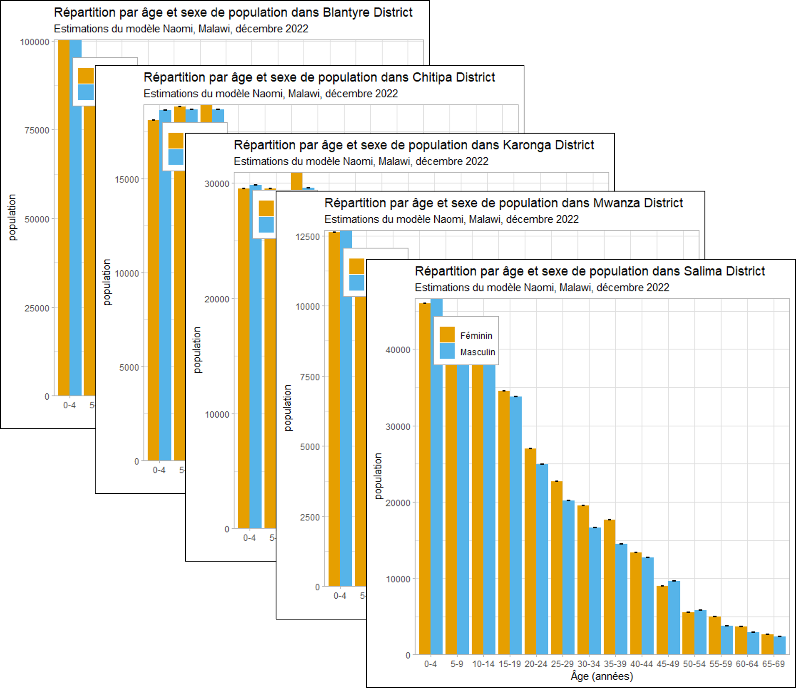

```{r, echo = F, message = F, warning = F}
knitr::opts_chunk$set(class.source = "tgc-code-block")
# Load packages 
if(!require(pacman)) install.packages("pacman")
pacman::p_load(tidyverse, knitr, here, reactable)

# Source functions 
source(here::here("global/functions/lesson_functions.R"))

# knitr settings
knitr::opts_chunk$set(warning = F, message = F, class.source = "tgc-code-block", error = T)


```


# Automatisation de la visualisation de données

## Introduction

Il arrive souvent de devoir effectuer des tâches de création de graphiques de manière répétitive. Par exemple, vous souhaitez tracer le même type de données (par exemple le même indicateur d'épidémie) pour plusieurs États, provinces ou villes. Dans cette leçon, nous allons explorer comment automatiser les visualisations de données à l'aide de la puissante combinaison de `{ggplot2}` et `{purrr}` en R. Tout d'abord, nous plongerons dans le côté programmatique de `{ggplot2}`, en créant des fonctions de création de graphiques personnalisées pour rationaliser vos tâches de graphisme. Ensuite, nous utiliserons `{purrr}` pour itérer à travers différentes variables, ce qui nous permettra de générer et d'enregistrer une multitude de graphiques d'un seul coup! Apprendre à automatiser la création de graphiques améliorera grandement vos flux de travail d'analyse de données.



## Objectifs d'apprentissage {.unlisted .unnumbered} 

1. **Reconnaître les problèmes du filtrage et de la création de graphiques répétitifs** : Identifier quand la création de graphiques répétitive est nécessaire et créer un workflow impliquant la création de sous-ensemble de données, la création de graphiques, et l'enregistrement.

2. **Créer des fonctions de création de graphiques personnalisées**: Développer des fonctions personnalisées pour les tâches de création de graphiques répétitives, y compris le sous-ensemble de lignes et de variables. Apprendre à ajouter plusieurs entrées pour une personnalisation dynamique des graphiques.

3. **Itérer les tâches de création de graphiques**: Appliquer les fonctions de création de graphiques sur un vecteur de variables, avec l'aide de `purrr::map()`.

4. **Utiliser des boucles imbriquées pour l'automatisation** : Utiliser `map()` à l'intérieur d'une boucle for pour itérer sur une combinaison de sous-ensembles et de variables de réponse. À la fin de cette leçon, vous maîtriserez l'automatisation des graphiques `{ggplot2}`, gainant du temps et améliorant la reproductibilité de vos récits basés sur les données.

À la fin de cette leçon, vous aurez les compétences pour automatiser les graphiques `{ggplot2}`, ce qui va vous gagner du temps et améliorer la reproductibilité de vos récits basés sur les données.

## Packages

Dans cette leçon, nous utiliserons les packages suivants :

- `{tidyverse}`, méta-package

    - `{ggplot2}` pour créer des graphiques

    - `{purrr}` pour itérer les fonctions à travers un vecteur

- `{here}` pour les chemins de fichiers relatifs au projet

- `{glue}` pour la concaténation de chaînes et l'automatisation de l'annotation des graphiques

```{r warning = F, message = F}
# Chargement des packages
pacman::p_load(tidyverse, here, glue)
```

------------------------------------------------------------------------

## Introduction aux données : le VIH au Malawi 

Aujourd'hui, nous allons examiner un jeu de données d'indicateurs épidémiologiques du VIH à l'échelon infranational du Ministère de la Santé du Malawi, Département du VIH et de l'Hépatite virale, pour décembre 2022. Ces estimations ont été dérivées d'un modèle d'estimation de petite zone, appelé Naomi, pour estimer des mesures clés stratifiées par unités administratives infranationales, sexe et groupes d'âge par tranche de 5 ans. Le jeu de données original peut être consulté [ici](https://dms.hiv.health.gov.mw/dataset/malawi-hiv-subnational-estimates-naomi-model-2023).

Nous avons préparé un sous-ensemble de ces données à analyser dans cette leçon :

```{r render = .reactable_10_rows, message = FALSE}
# Importation des données depuis CSV
hiv_mwi_agesex <- read_csv(here("data/clean/hiv_mwi_agesex.csv"))

# Affichage du dataframe de données
hiv_mwi_agesex
```

- **Zone géographique** :
   - `area_level` - unité administrative (pays, région ou district)  
   - `area_name` - nom de la zone géographique
- **Informations démographiques**
   - `age_group` et `sex`
   - **Indicateurs du VIH** : population totale, personnes vivant avec le VIH (PVVIH), prévalence du VIH, incidence, couverture du TAR, PVVIH connaissant leur statut.
   - `indicator` - code court 
   - `indicator_label` - nom complet
- **Mesures statistiques** : estimations du modèle avec incertitude probabiliste
   - `mean`, `lower`, `upper`

::: key-point 
Le modèle Naomi synthétise des données de multiples sources pour fournir des estimations en petite zone des principaux indicateurs du VIH pour l'Afrique subsaharienne. Ces estimations sont essentielles à la planification des programmes du VIH, à l'allocation des ressources et à la définition des objectifs. Vous pouvez en savoir plus sur le modèle Naomi [ici](https://www.ncbi.nlm.nih.gov/pmc/articles/PMC8454682/).
:::


### Visualisation de la répartition par âge et sexe

Les disparités d'âge et de sexe en termes de prévalence du VIH sont observées mondialement et sont influencées par de nombreux facteurs qui se chevauchent, notamment la discrimination de genre, les comportements sexuels et l'accès aux soins de santé et à l'éducation. Ces facteurs peuvent influencer à la fois la probabilité d'infection initiale et les issues pour les personnes vivant avec le VIH. 

Dans cette leçon, nous nous concentrerons sur la visualisation de la répartition par âge et sexe de divers indicateurs aux niveaux national, régional et de district. Tout d'abord, utilisons `ggplot()` pour créer un graphique en barres national de la prévalence du VIH, regroupé par âge et départagé par sexe.

```{r}
# Graphique en barres de la répartition par âge et sexe
hiv_mwi_agesex %>%
  filter(area_level == "Country",
         indicator == "prevalence") %>%
  ggplot(aes(x = age_group, 
             y = mean, 
             fill = sex)) + 
  geom_col(position = "dodge") +
  theme_minimal() +
  labs(title = "Estimations nationales de la prévalence du VIH, Malawi (déc. 2022)")
```

Oops! Il semble y avoir un problème avec l'ordre des groupes d'âge. Il est important de corriger cela car nous allons créer des graphiques regroupés par âge et sexe pour le reste de cette leçon.

::: error
**Réorganisation de l'axe des x**

La variable **`age_group`** est un vecteur de type **caractère**, qui n'est pas intrinsèquement ordonné de la même manière qu'un **facteur**.

```{r}
# Afficher les valeurs uniques de la variable age_group
hiv_mwi_agesex %>% pull(age_group) %>% unique()
```

Si on regarde les valeurs uniques de la variable, on obtient un vecteur correctement ordonné du plus jeune au plus vieux. Cependant, `{ggplot2}` range les variables de type caractère "alphabétiquement", ce qui signifie que notre groupe d'âge "5-9" est placé dans le mauvais ordre. 

Pour ordonner correctement notre graphique en barres selon l'âge, nous pouvons convertir `age_group` en facteur et spécifier l'ordre des niveaux avec **`forcats::fct_relevel()`**:

```{r}  
# Créer un vecteur des valeurs de groupes d'âge ordonnées
ordered_age_groups <- hiv_mwi_agesex %>% pull(age_group) %>% unique()

# Réordonner les niveaux de age_group et sauver dans un nouveau dataframe
hiv_malawi <- hiv_mwi_agesex %>%
  mutate(age_group = forcats::fct_relevel(age_group, ordered_age_groups))
```

Nous sommes maintenant prêts à tracer les distributions d'âge avec notre nouveau dataframe **`hiv_malawi`**.
:::

Essayons à nouveau le même code `ggplot()` avec `hiv_malawi` :

```{r}
# Graphique avec groupes d'âge réordonnés  
hiv_malawi %>%
  filter(area_level == "Country",
         indicator == "prevalence") %>%
  ggplot(aes(x = age_group,  
             y = mean,
             fill = sex)) +
  geom_col(position = "dodge") +
  theme_minimal() + 
  labs(title = "Estimations nationales de la prévalence du VIH, Malawi (déc. 2022)")
```

Bien mieux !

::: side-note
**Enseignements sur la prévalence du VIH**

Le graphique révèle une disparité de genre discernable dans la prévalence du VIH à partir de 15 ans, probablement liée au début de l'activité sexuelle. Les femmes ont une prévalence nettement plus élevée que les hommes entre 20 et 40 ans, ce qui pourrait refléter des facteurs tels que la vulnérabilité biologique et la dynamique sociale. De manière intéressante, cette tendance s'inverse après 50 ans, où les hommes montrent des taux plus élevés. Ce changement pourrait être influencé par le comportement sexuel des hommes, les taux de mortalité et l'accès ou la recherche de traitement.
:::

Examinons maintenant plus en profondeur si les mêmes tendances sont observées lorsque nous nous concentrons sur des zones plus localisées. Nous pouvons filtrer les données pour tracer la répartition par âge et sexe aux différentes zones géographiques. Notre jeu de données comprend des estimations agrégées pour les 3 principales régions et les 28 districts du Malawi. Nous allons nous intéresser en premier lieu au premier niveau administratif du Malawi --- **les trois régions**


## Le défi de la création de graphiques répétitifs

Dans cette section, nous mettrons en évidence un défi commun en matière de visualisation de données : le filtrage répétitif de sous-ensembles de données.

Commençons par créer un graphique de la prévalence du VIH pour la région du "Nord" du Malawi. Nous pouvons copier le code du graphique national que nous avons créé précédemment et remplacer `"Country"` par `"Region"`, et `"Malawi"` par le nom de la région que nous souhaitons représenter.

```{r}
# Exemple de filtrage et de création de graphique répétitifs - Région 1

hiv_malawi %>%
  # Filtrer pour la région Nord 
  filter(area_level == "Region",
         area_name == 'Northern',  
         indicator == "prevalence") %>%
  ggplot(aes(x = age_group,
             y = mean,  
             fill = sex)) +
  geom_col(position = "dodge") +
  theme_minimal() +
  # Changer le titre
  labs(title = "Prévalence du VIH par âge et sexe dans la région Nord du Malawi (déc. 2022)")
```

Répétons maintenant cela pour les deux autres régions :

```{r}
# Exemple de filtrage et de création de graphique répétitifs - Région 2

hiv_malawi %>%
  # Filtrer pour la région Sud
  filter(area_level == "Region",
         area_name == 'Southern',  
         indicator == "prevalence") %>%

  ggplot(aes(x = age_group,
             y = mean,
             fill = sex)) +
  geom_col(position = "dodge") +
  theme_minimal() +
  # Changer le titre  
  labs(title = "Prévalence du VIH par âge et sexe dans la région Sud du Malawi (déc. 2022)")

# Exemple de filtrage et de création de graphique répétitifs - Région 3

hiv_malawi %>%
  # Filtrer pour la région Centre
  filter(area_level == "Region", 
         area_name == 'Central',
         indicator == "prevalence") %>%

  ggplot(aes(x = age_group,
             y = mean,
             fill = sex)) + 
  geom_col(position = "dodge") +
  theme_minimal() +
  # Changer le titre
  labs(title = "Prévalence du VIH par âge et sexe dans la région Centre du Malawi (déc. 2022)")  
```

Bien que la méthode de copier-coller et de remplacement des noms fonctionne pour un petit nombre de sous-groupes, les limites du filtrage manuel deviennent évidentes lorsque le nombre de sous-groupes augmente. Imaginez faire cela pour chacun des 28 districts dans les données - ce serait extrêmement inefficace et sujet aux erreurs !

Au lieu de copier-coller le même code et de modifier les variables, nous allons démontrer dans les prochaines sections comment gérer ce défi à l'aide d'une combinaison de `{ggplot2}` et de techniques de programmation fonctionnelle.

::: side-note
**Facétages pour petits multiples**

Une autre option consiste à créer un graphique facetté, décomposé par région ou district. La limite est qu'il peut y avoir trop de niveaux dans votre variable de regroupement, ou trop de données pour tenir dans chaque sous-ensemble. Un graphique composé de 28 facettes serait encombré et pratiquement illisible.

```{r}
# Exemple de sous-graphiques facettés par région
hiv_malawi %>%
  filter(area_level == "Region",  
         indicator == "prevalence") %>%
  ggplot(aes(x = age_group,
             y = mean,
             fill = sex)) +
  geom_col(position = "dodge") +
  theme_minimal() +
  labs(title = "Prévalence du VIH par âge et sexe pour les régions du Malawi (déc. 2022)") +
  facet_wrap(~area_name) 
```

Parfois, nous pouvons générer des graphiques individuels pour des documents ou des diapositives distincts. Au lieu de nous en tenir uniquement au facétages, nous pouvons créer des fonctions qui nous permettent de créer une série de graphiques de manière systématique.
:::

::: practice
**Question 1: Filtrage et création de graphiques**

Créez un graphique en barres de la répartition par âge et sexe de la **couverture par le TAR** dans le district de **Lilongwe**. Vous pouvez partir du code utilisé pour créer les graphiques régionaux. Cette fois, vous devrez filtrer les données au niveau **"District"** et ajuster le titre du graphique en conséquence.

```{r include = F}
# Réponse 1
hiv_malawi %>%
  filter(area_level == "District",
         area_name == "Lilongwe", 
         indicator == "art_coverage") %>%
  ggplot(aes(x = age_group, 
             y = mean, 
             fill = sex)) + 
  geom_col(position = "dodge") +
  theme_minimal() +
  labs(title = "Estimations de la couverture du TAR par âge et sexe dans le district de Lilongwe")
```

Maintenant, adaptez votre code pour créer le même graphique pour le district de **Mzimba**.

```{r include = F}
# Réponse 1 
hiv_malawi %>%
  filter(area_level == "District",
         area_name == "Mzimba",
         indicator == "art_coverage") %>%
  ggplot(aes(x = age_group, 
             y = mean, 
             fill = sex)) +
  geom_col(position = "dodge") +
  theme_minimal() + 
  labs(title = "Estimations de la couverture du TAR par âge et sexe dans le district de Mzimba")
```
:::

## Création de fonctions de création de graphiques personnalisées 

### Fonction à un argument

La première étape pour automatiser nos graphiques consiste à créer une petite fonction qui filtrera les données pour nous et créera le sous-ensemble de données représenté.

Par exemple, pour visualiser la prévalence moyenne d'une région, nous pouvons **définir une fonction** prenant comme entrée une condition de sous-ensemble et créant le graphique régional avec les données filtrées.

```{r}
# Simple fonction pour filtrer selon la région et créer le graphique en barres groupées par âge et sexe 

plot_region<- function(nom_region){
  # copier le code au-dessus et remplacer le nom de région par un indicateur
  
  hiv_malawi %>%
  filter(area_level == "Region",
         area_name == {{nom_region}},
         indicator == "prevalence") %>%
  ggplot(aes(x = age_group,
             y = mean,
             fill = sex)) +
  geom_col(position = "dodge") +  
  theme_minimal() +
  labs(title = {{nom_region}})
}
```

Le code à l'intérieur de la fonction définie par l'utilisateur ci-dessus est essentiellement le même que celui utilisé pour créer le graphique précédent. La seule différence est que nous ne spécifions pas de nom de région précis, mais créons un "**indicateur**" appelé `{{nom_region}}` pour contrôler la condition de filtrage et le titre. Dans la fonction `filter()`, nous sous-ensemble nos données selon `nom_region` ; dans la fonction `labs()`, nous utilisons cette chaîne de caractères comme titre du graphique.

::: watch-out
**Accolades courbes**

Remarquez l'utilisation d'accolades `{{}}` à l'intérieur de la fonction `plot_region()`. Cette pratique est recommandée lors de l'utilisation de fonctions `{tidyverse}` à l'intérieur d'une autre fonction personnalisée, pour éviter les erreurs. Consultez [ici](https://r4ds.hadley.nz/functions.html#plot-functions) pour plus d'exemples.
:::

Maintenant, exécutons la fonction pour chacune des régions présentées dans le jeu de données, et voyons le résultat !

```{r}
# Créer des graphiques individuels pour les trois régions
nord <- plot_region('Nord') 
sud <- plot_region('Sud')
centre <- plot_region('Centre')

# Afficher les graphiques
nord
sud 
centre
```

Vous pouvez voir qu'utiliser une fonction personnalisée est bien plus efficace que de répéter et modifier le même bloc de code. Si des modifications sont nécessaires, nous n'avons pas besoin de modifier le code pour chaque graphique individuel. Au lieu de cela, nous pouvons apporter une petite modification à notre fonction `plot_region()`.

Ces graphiques montrent que les tendances de la répartition par âge et sexe de la prévalence du VIH sont les mêmes aux niveaux national et régional. Mais on peut voir que la prévalence globale est beaucoup plus élevée dans la région Sud que dans les autres.

::: pro-tip
**Personnalisation des titres avec `glue()`** 

Les graphiques générés par notre fonction personnalisée ressemblent *presque* exactement aux précédents - arrivez-vous à repérer une différence ? C'est ça, le titre ! Au lieu de simplement "Centre", nous voulons qu'il dise « Estimations du VIH par âge et sexe dans la région Centre du Malawi ».

Nous pouvons corriger cela avec la fonction **`glue()`** à l'intérieur de notre fonction personnalisée :

```{r}
# Adapter la fonction pour inclure un titre personnalisé
plot_region2 <- function(nom_region){
  hiv_malawi %>%
  filter(area_level == "Region",
         area_name == {{nom_region}},  
         indicator == "prevalence") %>%
  ggplot(aes(x = age_group,
             y = mean,
             fill = sex)) +
  geom_col(position = "dodge") +
  theme_minimal() +
  labs(title = glue("Prévalence du VIH par âge et sexe dans la région {nom_region} du Malawi (déc. 2022)"))
}

# Tester la fonction
plot_region2("Centre")
```
:::

::: practice
**Question 2: Fonction de création de graphique personnalisée pour les districts**

- Créer une fonction personnalisée appelée **`plot_district()`** prenant comme entrée le `nom_district`, et créant un graphique de la répartition par âge et sexe des **personnes vivant avec le VIH** (l'indicateur "plhiv"), au niveau du district. Utiliser `glue()` pour créer un titre personnalisé.

```{r include = F}
## Réponse 2 - même que la fonction plot_region() ci-dessus, mais filtrer au niveau "District", remplacer {{nom_region}} par {{nom_district}}, et changer l'indicateur pour "plhiv"

plot_district <- function(nom_district){
  hiv_malawi %>%
    filter(area_level == "District",
           area_name == {{nom_district}},
           indicator == "plhiv") %>%
    ggplot(aes(x = age_group,
               y = mean,
               fill = sex)) +
    geom_col(position = "dodge") +
    theme_minimal() +
    labs(title = glue("PVVIH par âge et sexe dans le district de {nom_district}, Malawi (déc. 2022)"))  
}
```

Tester la fonction pour créer un graphique pour les districts de **Chitipa** et **Neno**.

```{r include=F}
# Réponse 2 - Tester la fonction
plot_district("Chitipa")
plot_district("Neno") 
```
:::

### Fonction à entrées multiples

Dans la section précédente, notre fonction `plot_region()` acceptait une seule entrée : `nom_region`, et filtrait les données au niveau "Région" uniquement. 

Nous pouvons rendre notre fonction encore plus polyvalente en permettant de personnaliser l'indicateur du VIH à représenter sur l'axe des y, et de filtrer par le niveau "Région" ou "District".

```{r}
# Créer une fonction personnalisée avec entrées multiples
plot_malawi <- function(nom_zone, niv_zone, indicateur_vih){
  hiv_malawi %>%
    # filtrer selon 3 conditions    
    filter(
      niv_zone == {{niv_zone}},
      nom_zone == {{nom_zone}},  
      indicateur == {{indicateur_vih}}) %>%
    ggplot(aes(x = age_group,
               y = mean, 
               fill = sex)) +
    geom_col(position = "dodge") +
    theme_minimal() +
      # titre personnalisé
    labs(title = glue("Moyenne de {indicateur_vih} par groupe d'âge dans {nom_zone} {niv_zone}, Malawi (déc. 2022)"))
}
```

Maintenant nous pouvons appliquer la nouvelle fonction personnalisée **`plot_malawi()`** à n'importe quel indicateur, à n'importe quel niveau géographique de notre jeu de données en spécifiant les 3 entrées requises.

```{r}
# Couverture du TAR pour un district
plot_malawi("Chitipa", "District", "art_coverage")

# Population pour une région  
plot_malawi("Sud", "Région", "population")
```

::: side-note
**Filtrage du niveau de zone**

La raison pour laquelle nous avons ajouté **`niv_zone`** est pour éviter une situation où un district et une région partagent le même nom. Ce cas ne se présente pas dans ce jeu de données, mais il n'est pas rare que des États/provinces aient le même nom qu'une ville ou un district important à l'intérieur de leurs frontières (par ex. New York se situe dans l'État de New York). De plus, cela nous permet de personnaliser le titre de notre graphique pour mentionner le niveau de zone.
:::

En utilisant des fonctions personnalisées, nous pouvons créer des graphiques pour différentes régions, districts et indicateurs sans devoir recopier-coller le code `{ggplot2}` et apporter de multiples ajustements manuellement. 

Mais cela reste répétitif ! Il faut toujours recopier et remplacer les noms, même si c'est une seule ligne. Ce n'est toujours pas automatisé !

Par exemple, si nous voulions utiliser notre fonction personnalisée pour créer un graphique des PVVIH pour chacun des 28 districts, il faudrait faire :

```{r eval=F}
# Appliquer la fonction personnalisée à chaque district
chitipa_pvvih <- plot_malawi("Chitipa", "District", "pvvih")  
karonga_pvvih <- plot_malawi("Karonga", "District", "pvvih")
# etc
```

Quelle corvée ! Heureusement, R nous fournit un moyen d'**itérer** notre fonction personnalisée à travers toutes les régions ou districts, sans aucune recopie-coller.

## Bouclage à travers un vecteur de variables

### Présentation de `purrr::map()`


Nous pouvons créer un vecteur de noms et faire fonctionner la fonction sur tous les noms de ce vecteur à l'aide de la fonction `map()` du package `{purrr}`.

`map()` prendra deux arguments : un **vecteur** et une **fonction**.


`map()` appliquera alors la fonction à chaque élément du vecteur d'entrée.


Appliquer la fonction à chaque élément du vecteur d'entrée résulte en un élément de sortie par élément d'entrée.


`map()` combine alors tous ces éléments de sortie dans une liste.


Par exemple, voici une fonction personnalisée qui prend en entrée un nom et ajoute le préfixe "Dr." au début de la chaîne de caractères.

Appliquer la fonction à un nom unique
```{r}
# Exemple de fonction à un seul argument  
add_dr <- function(nom_complet) {   
  return(paste("Dr.", nom_complet))
}
# Appliquer la fonction à un nom unique
add_dr("Mohamed Hsin Bennour")
```

Imaginons maintenant que nous ayons un vecteur de noms pour lesquels nous souhaitons ajouter le préfixe "Dr.".


```{r}
# Liste de personnes
etudiants_phd <- c("Mohamed Hsin Bennour", "Imad El Badisy", "Kenechukwu David Nwosu")
```


Nous passons le vecteur de noms à `purrr::map()`, en insérant notre fonction personnalisée `add_dr()` comme argument. Cela nous permettra d'appliquer la fonction personnalisée à tous les éléments du vecteur, en itérant le processus.


```{r}
# Boucler la fonction sur le vecteur de variables
purrr::map(etudiants_phd, add_dr)
```


Vous remarquerez que la sortie de `purrr::map()` est une liste. Pour récupérer les éléments de la liste, nous pouvons d'abord l'assigner à un objet et ensuite utiliser l'opérateur `[[` :


```{r}
# Transmettre le vecteur à map() et sauvegarder la sortie dans une liste
etudiants_diplomes <- etudiants_phd %>% purrr::map(add_dr)

# Afficher la liste
etudiants_diplomes

# Rappeler un élément spécifique de la liste
etudiants_diplomes[[2]]
```

En essence, `map()` effectue le même travail qu'une boucle `for`, mais de manière fonctionnelle.

### Automatisation des graphiques ggplot2

Nous pouvons utiliser le même workflow pour créer une liste de graphiques, en appliquant notre fonction personnalisée `plot_malawi()` à un vecteur de noms de régions.

```{r}
# Créer un vecteur des 3 régions du Malawi
noms_regions <- c("Nord", "Centre", "Sud")

# Appliquer plot_region() à noms_regions  
noms_regions %>% map(plot_malawi, "Région", "prevalence")
```

Nous avons maintenant créé 3 graphiques avec seulement 2 lignes de code.

::: practice
**Question 3: Itération à travers un vecteur de districts**

Créez un vecteur de 5 noms de districts à partir de `hiv_malawi`.

```{r include=F}
districts5 <- "Écrivez votre code ici"
```


Appliquez la fonction `plot_malawi()` au vecteur de noms de districts pour créer cinq graphiques des **PVVIH** d'un coup.

```{r include=F}
districts5 %>% purrr::map("District", "pvvih")
```
:::


#### Fonction d'aide pour le niveau de zone

L'analyse des tendances épidémiologiques à différentes échelles géographiques (pays, état, département, ville, etc.) est cruciale. Nous pouvons vouloir créer un graphique pour chaque état, ou chaque département.

Nous pouvons créer un vecteur de tous les noms de districts à partir de `hiv_malawi` avec ce modèle de code :

```{r}
# Création d'un vecteur des noms de district uniques
noms_district <- hiv_malawi %>%
  filter(niv_zone == "District") %>%
  pull(nom_zone) %>%
  unique()
# Afficher
noms_district  
```

Ce code identifie les noms de zone uniques au niveau "District". Cependant, répéter manuellement cela pour différents niveaux est inefficace. Pour optimiser, nous introduisons une fonction d'aide appelée `area_lvl()`:


```{r}
# Écrire une fonction d'aide pour obtenir les noms de zone uniques pour un niveau donné
area_lvl <- function(niveau){
  hiv_malawi %>%
    filter(niv_zone == {{niveau}}) %>%
    pull(nom_zone) %>%
    unique() %>%
    return()
}

# Tester la fonction d'aide
area_lvl("Région")
area_lvl("District")
```


Cette fonction simplifie l'obtention des noms uniques pour n'importe quel niveau de zone. Nous pouvons utiliser `area_lvl()` avec `map()` pour itérer à travers toutes les régions ou tous les districts, sans avoir à créer un vecteur personnalisé au préalable.


```{r}
# Tracer l'incidence pour toutes les régions
area_lvl("Région") %>% map(plot_malawi, "Région", "incidence")
```


```{r eval= F}  
# Tracer la sensibilisation au VIH pour tous les districts
area_lvl("District") %>% map(plot_malawi, "District", "prop_pvvih_connaissance_statut")
```

### Bouclage à travers deux vecteurs

Pour seulement quelques variables de réponse, nous pourrions facilement copier-coller le code ci-dessus en changeant à chaque fois la variable codée en dur sur l'axe des y (`indicateur`). Ce processus peut devenir lourd si nous souhaitons le faire pour de nombreux indicateurs. 

Bien que nous puissions utiliser une boucle imbriquée, avec une seconde fonction `map()` imbriquée dans la précédente, cette méthode n'est pas aussi facile à interpréter qu'une boucle for.

Ici, nous allons créer un vecteur de deux indicateurs, et les transmettre à une boucle for. La boucle for transmettra chaque indicateur à `map()`, et nous obtiendrons 6 graphiques.

```{r}
# Choisir les indicateurs: PVVIH et Prévalence
indicateurs <- c("pvvih", "prevalence")

# Boucle imbriquée pour représenter 3 régions x 2 indicateurs  
for (i in 1:length(indicateurs)) {
  area_lvl("Région") %>%
    map(plot_malawi, "Région", indicateurs[i]) %>%
    print()  
}
```

Nous pouvons changer "Région" en "District", et le code ci-dessus nous donnerait 56 graphiques, 2 indicateurs pour chacun des 28 districts.

## Finalisation et enregistrement

Maintenant que notre processus de création de graphiques est entièrement automatisé, nous pouvons nous préparer à les finaliser et à enregistrer les images pour une utilisation ultérieure.

Examinons d'abord les graphiques et décidons si des réglages sont nécessaires. Si des modifications s'imposent, nous n'avons pas besoin de modifier le code pour chaque graphique individuel. Il suffit d'apporter un petit réglage à notre fonction `plot_malawi()` et de la relancer avec la fonction `map()`. C'est un moyen puissant de gérer de multiples graphiques de façon efficace.

Revisitons notre code `ggplot()` d'origine, que nous avons filtré et réutilisé pour tous les graphiques :

```{r}
# Graphique en barres des prévalences nationales par âge et sexe
hiv_malawi %>%
  filter(area_level == "Country", 
         indicator == "prevalence") %>%
  ggplot(aes(x = age_group, 
             y = mean, 
             fill = sex)) +
  geom_col(position = "dodge") +
  theme_minimal() +
  labs(title = "Estimations nationales de la prévalence du VIH, Malawi (déc. 2022)")
```

Ce graphique n'est pas mauvais en soi, mais de nombreuses caractéristiques peuvent encore être ajustées et affinées pour obtenir un graphique prêt pour publication. Rappelez-vous que les graphiques `ggplot2` sont infiniment personnalisables !

Le code ci-dessous apporte plusieurs modifications pour créer un graphique final plus affiné.

```{r}
# Graphique national des prévalences avec modifications supplémentaires
ggplot(data = filter(hiv_malawi,  
                     indicator == "prevalence",
                     area_name=="Malawi"),
        aes(x = age_group, y = mean, fill = sex,
            ymin = lower, ymax = upper)) +
  geom_col(position = position_dodge(width = 0.9)) +
  geom_errorbar(aes(ymin = lower, ymax = upper), 
                position = position_dodge(width = 0.9),
                width = 0.25, linewidth = 0.8) +  
  scale_y_continuous(expand = c(0, 0)) +
  scale_fill_manual(values = c("female" = "#E69F00", "male" = "#56B4E9"),  
                    labels = c("Féminin", "Masculin")) +
  theme_light() + 
  theme(legend.position = c(0.05, 0.95),
        legend.justification = c(0, 1),  
        legend.box.just = "left",        
            
        legend.box.background = element_rect(color = "white", linewidth = 0.5),  
        legend.background = element_rect(color = "darkgray", linewidth = 0.5),
        legend.title = element_blank()) +
  labs(x = "Âge (années)",
       y = "Prévalence",
       title = "Répartition par âge et sexe de la prévalence du VIH au Malawi", 
       subtitle = "Estimations du modèle Naomi, décembre 2022")
```


Une fois satisfaits du rendu du graphique, nous pouvons utiliser ce nouveau code `ggplot()` dans une fonction personnalisée :

```{r}
# Créer une fonction personnalisée avec entrées multiples
plot_malawi_final <- function(nom_zone, niv_zone, indicateur_vih){
  filter(hiv_malawi, 
         area_name == {{nom_zone}},
         area_level == {{niv_zone}},
         indicator == {{indicateur_vih}}) %>% 

  # FILTRER SELON LES ENTREES 
  # AJOUTER DES INDICATEURS POUR LE FILTRAGE

  ggplot(aes(x = age_group, y = mean, fill = sex)) +

  geom_col(position = position_dodge(width = 0.9)) +

  geom_errorbar(aes(ymin = lower, ymax = upper),
                position = position_dodge(width = 0.9),
                width = 0.25, linewidth = 0.8) +

  scale_y_continuous(expand = c(0, 0)) +

  scale_fill_manual(values = c("female" = "#E69F00", "male" = "#56B4E9"),
                    labels = c("Féminin", "Masculin")) +

  theme_light() +

  theme(legend.position = c(0.05, 0.95),
        legend.justification = c(0, 1),
        legend.box.just = "left",       
        legend.box.background = element_rect(color = "white", linewidth = 0.5),
        legend.background = element_rect(color = "darkgray", linewidth = 0.5),
        legend.title = element_blank()) +

     # AJOUTER DES INDICATEURS POUR LE TITRE ET L'AXE Y

  labs(x = "Âge (années)",
       y = indicateur_vih,
       title = glue("Répartition par âge et sexe de {indicateur_vih} dans {nom_zone} {niv_zone}"),
       subtitle = "Estimations du modèle Naomi, Malawi, décembre 2022")
}

# Tester la fonction
plot_malawi_final("Chitipa", "District", "population")
```

Nous pouvons utiliser cette nouvelle fonction pour obtenir des graphiques pour un ensemble de régions ou de districts, tout comme nous l'avons fait avec la fonction `plot_malawi()` précédente.

```{r}
# Itérer sur les régions  
area_lvl("Région") %>% map(plot_malawi_final, "Région", "prevalence")
```


Maintenant que nous savons que la fonction fonctionne correctement et génère les graphiques souhaités, il est temps de les sauver localement. Cela nous permettra d'accéder aux graphiques sans avoir à rerunning le code à chaque fois pour les générer.

Nous allons faire cela en apportant un changement final à notre fonction de création de graphiques. Cette fois, nous ajouterons la fonction `ggsave()` à la fin, pour sauver nos graphiques sous forme de fichiers image avec des noms uniques et descriptifs.

```{r}
# Créer une fonction personnalisée pour tracer ET enregistrer dans un dossier spécifique
plot_save_final <- function(nom_zone, niv_zone, indicateur_vih){

  hiv_malawi %>%

  ggplot(...) +

  geom_col(...) +

  # Code plot

  labs(...)

  # NOUVEAU CODE COMMENCE ICI: Sauver le graphique avec des noms de fichier personnalisés
  ggsave(filename = here(glue("outputs/{indicateur_vih}_{niv_zone}_{nom_zone}.jpg")))

}
```


Maintenant que nous avons finalisé notre fonction personnalisée appelée `plot_save_final()`, essayons-la pour le district de Chitipa !


```{r eval=F}
plot_save_final("Chitipa", "District", "pvvih")
```


Vous devriez maintenant voir un nouveau fichier nommé "pvvih_District_Chitipa.jpg" dans votre dossier outputs.


Comme précédemment, créons une boucle for pour nos deux indicateurs `pvvih` et `prevalence`, mais cette fois nous utiliserons notre fonction `plot_save_final()` pour créer les graphiques **et** sauver les images dans notre dossier outputs !


```{r eval=F}
# Itérer sur les régions et SAUVER
area_lvl("Région") %>% map(plot_save_final, "Région", "prevalence") 
```


Ensuite, bouclons sur **deux** vecteurs et sauvons les graphiques au niveau régional pour deux autres indicateurs du VIH.


```{r eval=F}
# Choisir de nouveaux indicateurs
indicateurs2 <- c("pvvih", "couverture_tar")

# Boucler à travers la fonction de sauvegarde de graphiques
for (i in 1:length(indicateurs2)) {
  area_lvl("Région") %>%
    map(plot_save_final, "Région", indicateurs2[i])
}
```


Si vous accédez au dossier `outputs`, vous devriez maintenant trouver **6** nouveaux graphiques créés et sauvegardés. C'est la magie de l'automatisation sous R !

::: practice
**Question 4: Sauvegarder une série de graphiques**


En utilisant votre vecteur `districts5` de la dernière question, écrire une boucle for pour créer et sauver les graphiques de répartition par âge et sexe pour:

- La prévalence
- La couverture du TAR
- Les PVVIH

:::

## EN RÉSUMÉ ! {.unnumbered}

Dans cette leçon, nous avons appris à développer des fonctions personnalisées de filtrage et de tracé avec `{dplyr}` et `{ggplot2}`, et à les itérer à travers des vecteurs en deux dimensions avec `purrr::map()` et les boucles for.

De cette façon, nous pouvons générer des graphiques personnalisés de manière efficace et les sauvegarder pour une utilisation ultérieure, sans avoir à les créer individuellement à chaque fois. Cette approche offre une démonstration puissante de la façon dont les principes de programmation fonctionnelle peuvent être utilisés pour écrire un code plus propre, plus modulaire et plus facile à maintenir.


------------------------------------------------------------------------
## References {.unlisted .unnumbered}

Some material in this lesson was adapted from the following sources:

`r .tgc_license()`
