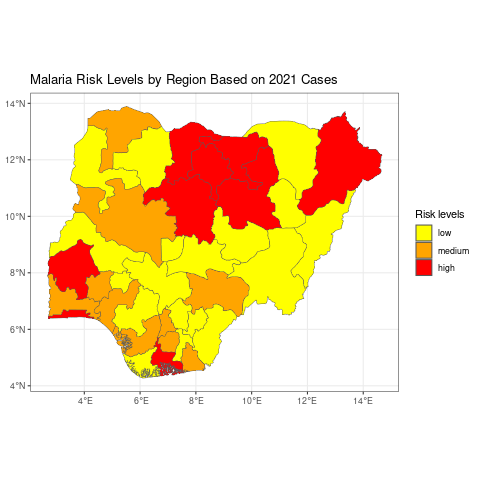

```{r, include = FALSE, warning = FALSE, message = FALSE}
# Load packages 
if(!require(pacman)) install.packages("pacman")
pacman::p_load(tidyverse, knitr, here)

# Source functions 
source(here("global/functions/lesson_functions.R"))

# knitr settings
knitr::opts_chunk$set(warning = F, message = F, class.source = "tgc-code-block", error = T, fig.width = 5, fig.height = 3)
```

# Création de cartes choroplèthes avec {ggplot2}

## Introduction

Une carte choroplèthe est une carte thématique dans laquelle les régions géographiques sont ombrées ou modélisées proportionnellement à la valeur d'une variable représentée. Cette variable peut être un indicateur épidémiologique tel que la prévalence ou le taux de mortalité d'une maladie. Les cartes choroplèthes sont particulièrement utiles pour visualiser les motifs spatiaux et les variations entre différentes régions.

Les composants essentiels d'une carte choroplèthe incluent :

**Régions géographiques** : Ce sont les zones qui seront représentées sur la carte, telles que les pays, les états, les districts ou d'autres divisions géographiques.

**Valeurs des données** : Ce sont les valeurs associées à chaque région géographique qui seront représentées sur la carte, y compris la densité de population, la prévalence, l'incidence, le taux de mortalité, etc.

**Échelle de couleurs** : C'est la gamme de couleurs utilisée pour représenter les différentes valeurs des données. Typiquement, un gradient de couleurs est utilisé, avec des couleurs plus claires représentant des valeurs inférieures et des couleurs plus foncées représentant des valeurs supérieures.



::: side-note
Les cartes choroplèthes offrent :

-   Des visuels clairs mettant en évidence les tendances des données spatiales.
-   Des conceptions intuitives compréhensibles sans expertise.

Cependant, elles présentent des défis :

-   La classification des données et les choix de couleurs peuvent biaiser les apparences.
-   Les régions plus grandes pourraient dominer, causant un biais visuel.
:::

Dans la section suivante, vous apprendrez à créer une carte choroplèthe en utilisant le package {ggplot2} dans R.

## Objectifs d'apprentissage {.unlisted .unnumbered}

1.  **Cartes choroplèthes avec {ggplot2} :**

    -   Maîtriser les fonctions `ggplot()` et `geom_sf()` pour la visualisation des cartes.

2.  **Appariement des données avec des polygones :**

    -   Obtenir des limites et des données liées aux maladies.
    
    -   Combiner les données en fonction des niveaux administratifs.

3.  **Techniques d'échelle de couleurs :**

    -   Implémenter des échelles de couleurs pour les types de données continues et discrètes.

4.  **Facettes pour la visualisation des cartes :**

    -   Utiliser `facet_wrap()` et `facet_grid()` pour créer des petites cartes multiples.

## Charger les packages nécessaires

Ce morceau de code ci-dessous montre comment charger les paquets nécessaires en utilisant `p_load()` du package {pacman}. S'ils ne sont pas installés, il installe le paquet avant de le charger.

```{r warning = F, message = F}
# Charger les paquets nécessaires

# Utiliser pacman pour charger plusieurs paquets ; il les installera s'ils ne sont pas déjà installés
pacman::p_load(tidyverse,  # pour la manipulation et la visualisation des données
               here,       # pour les chemins de fichiers relatifs au projet
               sf)         # pour les données spatiales

# Désactiver la notation scientifique pour des affichages numériques plus clairs
options(scipen=10000)
```

------------------------------------------------------------------------

## Préparation des données

Avant de créer une carte choroplèthe, il est essentiel de préparer les données. Les données doivent contenir les régions géographiques et les valeurs que vous souhaitez visualiser.

Dans cette section, vous passerez en revue le processus de préparation des données, qui comprend les étapes suivantes :

1.  **Importer les données de polygones** : Il s'agit des données géographiques contenant les limites de chaque région que vous souhaitez inclure dans votre carte.

2.  **Importer les données attributaires** : Il s'agit des données contenant les valeurs que vous souhaitez visualiser sur la carte, telles que la prévalence de la maladie, la densité de population, etc.

3.  **Joindre les données de polygones et les données attributaires** : Cette étape implique de fusionner les données de polyg

ones avec les données attributaires en fonction d'un identifiant commun, tel que le niveau administratif ou le nom de la région. Cela créera un ensemble de données unique contenant à la fois les limites géographiques et les valeurs de données correspondantes.

Maintenant, passons en détail à chaque étape !

### Étape 1 : Importer les données de polygones

Les polygones sont des formes fermées avec trois côtés ou plus. Dans les données spatiales, les polygones sont utilisés pour représenter des zones telles que la limite d'une ville, d'un lac ou de tout type d'utilisation des terres. Ils sont essentiels dans les systèmes d'information géographique (SIG) pour des tâches telles que la cartographie, l'analyse spatiale et la classification de l'occupation des terres.

::: side-note
Les fichiers de formes (shapefiles) sont un format courant pour stocker des données spatiales. Ils se composent d'au moins trois fichiers avec des extensions .shp (forme), .shx (index) et .dbf (données attributaires).
:::

Dans R, vous pouvez charger des fichiers de formes en utilisant le package `sf`. Dans notre leçon d'aujourd'hui, nous travaillerons avec des données sur le paludisme provenant de la revue Epi du Nigeria (2022).

```{r message=FALSE, render=.reactable_10_rows}
# Lecture du fichier de formes
nga_adm1 <- 
  sf::st_read(here::here("data/raw/NGA_adm_shapefile/NGA_adm1.shp")) 
```

::: reminder
Les éléments importants de toute couche ggplot sont les mappings esthétiques `aes(x,y, …)` qui indiquent à ggplot où placer les objets graphiques.
:::

Nous pouvons imaginer une carte comme un graphique avec toutes les fonctionnalités mappées sur un axe x et y. Tous les types de géométrie (`geom_`) dans ggplot comportent une sorte de mapping esthétique, et ceux-ci peuvent être déclarés au niveau du graphique, par exemple, `ggplot(data, aes(x = variable1, y = variable2))`, ou au niveau de chaque couche individuelle, par exemple, `geom_point(aes(color = variable3))`.

Ci-dessous, vous pouvez voir que `geom_sf()` est utilisé pour tracer les limites des différents états du Nigeria. De même, différentes couches peuvent être ajoutées par-dessus.

```{r}
ggplot()+
  geom_sf(data = nga_adm1)+
  labs(title = "Aperçu du fichier de formes du Nigeria")
```

Ici, nous lisons d'abord le fichier de formes du Nigeria en utilisant `sf::st_read()` puis nous le traçons en utilisant `ggplot`. La fonction `geom_sf()` est utilisée pour rendre les données spatiales, et `labs()` est utilisé pour ajouter un titre au graphique.

::: pro-tip
Comme le fichier de formes a été chargé en utilisant `sf::st_read()`, nous n'avons pas besoin de spécifier les noms des axes. En fait, les coordonnées sont stockées comme un objet multipolygone dans la variable géométrie, et `geom_sf()` les reconnaît automatiquement.
:::

::: side-note
Pour les utilisateurs intéressés par l'accès aux données de limites infranationales dans R, il existe plusieurs packages disponibles sur GitHub qui facilitent ce processus :

-   Le {rgeoboundaries} (<https://github.com/wmgeolab/rgeoboundaries>) récupère des données de [Geoboundaries](https://www.geoboundaries.org/), une base de données ouverte de limites administratives politiques.

-   Le {rnaturalearth} (<https://github.com/ropensci/rnaturalearth>) récupère des données de [Natural Earth](https://www.naturalearthdata.com/), un ensemble de données cartographiques du domaine public.
:::

### Étape 2 : Importer les Données d'Attribut

::: vocab
Dans le contexte des cartes choroplèthes, les "données d'attribut" font référence aux informations quantitatives ou qualitatives qui seront utilisées pour colorer ou nuancer les différentes zones géographiques sur la carte. Par exemple, si vous avez une carte des régions d'un pays et souhaitez colorer chaque région en fonction de sa population, les données sur la population seraient considérées comme des données d'attribut.
:::

Comme souligné ci-dessus, nous utiliserons le nombre de cas de paludisme signalés au Nigeria pour les années 2000, 2006, 2010, 2015 et 2021.

```{r render = .reactable_10_rows, message = FALSE}
# Lecture des données d'attribut
malaria_cases <- read_csv(here::here("data/malaria.csv"))
malaria_cases
```

### Étape 3 : Vérification des Données Jointes

Il est essentiel de vérifier et de valider les données jointes pour s'assurer que la fusion sera réussie et que les données seront exactes.

```{r warning = F, message = F}
# Valider les données jointes
all.equal(unique(nga_adm1$NAME_1), unique(malaria_cases$state_name))

# Identifier les discordances
setdiff(unique(nga_adm1$NAME_1), unique(malaria_cases$state_name))
```

Dans l'extrait de code fourni, nous comparons les noms de régions uniques entre les ensembles de données `nga_adm1` et `malaria_cases` en utilisant la fonction `all.equal()`. Ceci afin de s'assurer que toutes les régions du fichier de formes correspondent à leurs homologues dans les données d'attribut.

Si les noms de régions sont identiques, `all.equal()` renverra `TRUE.` Cependant, s'il y a des divergences, elle détaillera les différences entre les deux ensembles de noms de régions.

Il est noté que le "Plan d'eau" est présent dans le fichier de formes mais pas dans le `malaria_cases`. Comme "Plan d'eau" n'est pas une région propre, il devrait être retiré avant de joindre les ensembles de données. Nous pouvons le faire avec `filter()`.

```{r}
nga_adm1 <- filter(nga_adm1, NAME_1 != "Plan d'eau")
```

### Étape 4 : Joindre les Données par Niveaux Administratifs

Nous allons maintenant obtenir les données que nous voulons tracer sur la carte. L'important est que les noms des régions soient les mêmes dans le fichier de formes que dans vos données que vous souhaitez tracer, car cela sera nécessaire pour qu'ils fusionnent correctement.

Avant de joindre les deux ensembles de données, nous devons définir la clé de jointure (`by =`).

::: remember
N'oubliez pas de revoir la leçon sur la jointure des tables pour plus de détails sur la façon de fusionner les data.frames dans R si vous n'êtes pas familier avec la jointure.
:::

```{r}
# Ajouter les données de population et calculer les cas pour 10K de population
malaria <- malaria_cases %>% 
     left_join(nga_adm1,                        
               by = c("state_name" = "NAME_1")) %>% 
     st_as_sf() # convertir en fichier de formes 

# Sélectionner les colonnes les plus importantes
malaria2 <- malaria%>% 
     select(state_name,  cases_2000, cases_2006, cases_2010, cases_2015, cases_2021, geometry)
```

Dans cette étape, nous fusionnons les données du fichier de formes `nga_adm1` avec les données `malaria_cases` en utilisant `left_join()` du package {dplyr}. L'argument `by` est utilisé pour spécifier la colonne commune sur laquelle fusionner les ensembles de données.

Enfin, nous convertissons les données fusionnées en un fichier de formes en utilisant `st_as_sf()`.

Nous pouvons conserver uniquement les variables importantes qui seront utilisées dans la construction des tracés en utilisant `select()`.

::: recap
Dans cette partie de la leçon, nous avons appris l'importance des niveaux administratifs dans les données spatiales et

 comment joindre les données spatiales et d'attribut par niveaux administratifs en utilisant le package {dplyr} dans R et comment vérifier et valider les données jointes.
:::

------------------------------------------------------------------------

## Création d'une Carte Choroplèthe avec {ggplot2}

### Utilisation de la Variable de Remplissage (c.-à-d. Variable d'Attribut)

Pour afficher le nombre de cas, par exemple pour 2021, nous devons remplir les polygones tracés avec `geom_sf()` en utilisant la variable `fill`. Cela est très simple car cela suit la même logique que la syntaxe du package {ggplot2}.

```{r}
ggplot(data=malaria2) + 
  geom_sf(aes(fill=cases_2021)) +   # régler le remplissage pour varier selon la variable de nombre de cas
  labs(title = "Cas de Paludisme Répartis au Nigeria") + 
  theme_void()
```

Nous créons une carte choroplèthe de base en utilisant {ggplot2}. L'esthétique `fill` est réglée pour varier selon la variable `cases`, ce qui colore les régions en fonction du nombre de cas de paludisme.

### Personnalisation de la Carte

Nous pouvons personnaliser la carte en ajoutant des titres aux axes et à la légende, en ajoutant une flèche du nord et une barre d'échelle avec `ggspatial::annotation_north_arrow()` et `ggspatial::annotation_scale()`, et en changeant le thème pour `theme_bw()`.

```{r}
ggplot(data=malaria2) + 
  geom_sf(aes(fill=cases_2021)) +   # régler le remplissage pour varier selon la variable de nombre de cas
  labs(title = "Cas de Paludisme Répartis au Nigeria (2021)",
       fill = "Nombre de Cas") +
  xlab("Longitude")+
  ylab("Latitude")+
  ggspatial::annotation_north_arrow(location = "br")+
  ggspatial::annotation_scale(location = "tr")+
  theme_bw()
```

::: recap
Dans cette section, nous avons d'abord créé une carte choroplèthe de base en utilisant {ggplot2} pour visualiser les cas régionaux de paludisme au Nigeria pour 2021. Ensuite, nous avons amélioré la carte en ajoutant des **titres**, des **étiquettes d'axes**, une **flèche du nord**, une **barre d'échelle** et en appliquant un **thème** monochrome.
:::

::: r-practice

**Q : Construisez votre magnifique carte choroplèthe**

Construisez une carte choroplèthe pour afficher la distribution des cas de paludisme en 2015, en utilisant la colonne `cases_2015` du jeu de données `malaria2`. Vous pouvez améliorer la conception et la clarté de votre carte en intégrant des titres, des étiquettes d'axes et toute autre étiquette pertinente.
:::

------------------------------------------------------------------------

## Mise à l'échelle des Couleurs

### Mise à l'échelle des Couleurs Continue

La fonction `scale_fill_continuous()` du package {ggplot2} dans R est utilisée pour appliquer une échelle de couleurs continue à une carte choroplèthe.

Nous pouvons personnaliser la palette de couleurs utilisée pour l'échelle de couleurs continue en spécifiant les paramètres `low` et `high` dans la fonction `scale_fill_continuous()`.

```{r}
# Créer un objet ggplot
ggplot(data = malaria2) +
  geom_sf(aes(fill = cases_2021)) +
  scale_fill_continuous(low = "yellow", high = "red", name = "Cas") + # appliquer une échelle de couleurs continue
  ggtitle("Répartition des Cas de Paludisme par Région en 2021") + # Ajouter le titre corrigé ici
  theme_bw()
```

::: recap
Dans cette section, nous avons appris comment appliquer une échelle de couleurs continue à une carte choroplèthe en utilisant la fonction `scale_fill_continuous()` du package {ggplot2} dans R et comment personnaliser la palette de couleurs.
:::

### Mise à l'échelle des Couleurs Discrete

::: remember
Les données discrètes sont un type de données quantitatives qui ne peuvent prendre que des valeurs spécifiques et séparées. Elles sont souvent le résultat du dénombrement d'objets ou d'événements. Les données discrètes sont importantes dans

 les cartes choroplèthes car elles nous permettent de représenter le nombre ou la quantité d'objets ou d'événements dans différentes régions.
:::

La fonction `scale_fill_brewer()` du package {ggplot2} dans R est utilisée pour appliquer une échelle de couleurs discrète à une carte choroplèthe.

Avant d'appliquer l'échelle de couleurs discrète, nous devrons créer une nouvelle colonne discrète, qui pourrait être un niveau de risque basé sur le nombre de cas. Pour cela, nous pouvons utiliser `mutate()` combiné avec `case_when()`.

```{r warning = F, message = F}
# Transformer les données : Créer une nouvelle colonne 'risk' basée sur le nombre de cas en 2021
malaria3 <- malaria2 %>%
  mutate(risk = case_when(cases_2021 < quantile(cases_2021, 0.5) ~ 'faible',
                          cases_2021 > quantile(cases_2021, 0.75) ~ 'élevé', 
                          TRUE ~ 'moyen')) 

# Visualiser les données
ggplot(data = malaria3) +
  geom_sf(aes(fill =  fct_reorder(risk, cases_2021)))+ # Les niveaux de risque sont réordonnés en fonction du nombre de cas
  scale_fill_brewer(palette = "Set4", "Niveaux de Risque")+ 
  theme_bw()
```

Vous pouvez également créer une palette de couleurs personnalisée pour les variables discrètes.

```{r warning = F, message = F}
palette_personnalisée <- c("yellow", "orange", "red") # créer une palette de couleurs personnalisée manuellement

# Appliquer la palette de couleurs personnalisée
ggplot(data = malaria3) + # Créer un objet ggplot
   geom_sf(aes(fill =  fct_reorder(risk, cases_2021))) + # réordonner les étiquettes de risque selon le nombre de cas
   scale_fill_manual(values = palette_personnalisée, name = "Niveaux de Risque") + 
   coord_sf(expand = TRUE) +
   ggtitle("Niveaux de Risque de Paludisme par Région Basés sur les Cas de 2021") + # Ajouter un titre ici
   theme_bw()
```

::: recap
Dans cette section, nous avons appris comment appliquer une échelle de couleurs discrète à une carte choroplèthe en utilisant la fonction `scale_fill_brewer()` du package {ggplot2} et comment personnaliser la palette de couleurs.
:::

::: practice
**Q : Créez votre propre palette de couleurs**

Créez votre propre palette de couleurs distincte de celle initiale, et affichez les cas de paludisme à travers le Nigeria pour 2000 en utilisant cette palette personnalisée. N'oubliez pas d'intégrer des améliorations esthétiques supplémentaires.
:::


## Facet Wrap vs. Grille

-   `facet_wrap()`: Cette fonction enveloppe une séquence 1D de panneaux en 2D. C'est utile lorsque vous avez une seule variable avec de nombreux niveaux et que vous souhaitez organiser les graphiques de manière plus efficace en termes d'espace.
-   `facet_grid()`: Cette fonction crée une matrice de panneaux définis par des variables de facettage en lignes et en colonnes. Elle est la plus utile lorsque vous avez deux variables discrètes et que toutes les combinaisons de variables existent dans les données.

::: pro-tip
-   `facet_wrap()` est utilisé pour le facettage d'une seule variable, tandis que `facet_grid()` est utilisé pour le facettage de deux variables.
-   `facet_wrap()` organise les panneaux en grille 2D, tandis que `facet_grid()` les organise en matrice.
:::

### Création de petits multiples avec `facet_wrap()`

Nous pouvons utiliser la fonction `facet_wrap()` pour créer de multiples petits graphiques basés sur une variable donnée. Dans l'exemple suivant, nous pouvons utiliser la variable `année`.

::: remember
Rappelez-vous que l'échelle des couleurs peut être ajustée par `scale_fill_continuous()` si la variable est continue ou par `scale_fill_brewer()` si la variable est discrète.
:::

Ici, nous devons faire un léger ajustement à la structure de notre jeu de données. Puisque les cas sont présentés par année et que chaque année est représentée dans une colonne séparée, nous utiliserons la fonction `pivot_longer()` pour les consolider dans une seule colonne, accompagnée d'une clé d'identifiant.

```{r, render = .reactable_10_rows, message = FALSE}
malaria3_longer <- malaria3 %>%
  pivot_longer(cols = `cases_2000`:`cases_2021`, names_to = "year", values_to = "cases")
```

Il semble que la variable `année` dans notre jeu de données ait un préfixe `cases_` que nous aimerions supprimer pour des raisons esthétiques avant de tracer.

Voici comment nous pouvons le faire en utilisant la fonction `str_replace()` du package {stringr}, qui fait partie du tidyverse :

```{r}
# Recoder la variable 'année' en supprimant le préfixe 'cases_'
malaria3_longer$year <- str_replace(malaria3_longer$year, "cases_", "")
```

Après avoir exécuté le code ci-dessus, la variable `année` dans notre jeu de données `malaria3_longer` n'aura plus le préfixe `cases_`, la rendant plus propre pour des fins de visualisation.

Maintenant, nous voulons créer de multiples petits graphiques en utilisant `facet_wrap()`.

```{r}
# Créer un objet ggplot en utilisant facet_wrap
ggplot(data = malaria3_longer) +
  geom_sf(aes(fill = cases)) +
  facet_wrap(~ year)+
  scale_fill_continuous(low = "green", high = "red") + # appliquer l'échelle de couleur continue
  theme_void()
```

Nous pouvons ajouter une autre variable au `facet_wrap()`. Ici, nous ajoutons `risk`, mais nous utiliserons uniquement les cas de 2000 et 2021 à des fins de démonstration :

```{r}
ggplot() +
  geom_sf(data = nga_adm1) + 
  geom_sf(aes(fill = cases), data = filter(malaria3_longer, year %in% c("2000", "2021"))) +
  facet_wrap(year ~ risk)+
  coord_sf(expand = TRUE)+
  scale_fill_continuous(low = "green", high = "red")+
  theme_void()
```

Dans le dernier graphique ci-dessous, vous remarquerez que nous avons utilisé une variable de remplissage continue, mais nous avons également utilisé un `facet_wrap` sur deux autres variables discrètes.

### Création de petits multiples avec `facet_grid()`


Maintenant, nous utiliserons `facet_grid()` pour créer une grille de graphiques. Pour chaque année (2000 et 2021), des graphiques séparés sont réalisés pour chaque niveau de risque, offrant une comparaison visuelle facile à la fois sur les années et les risques.

```{r}
ggplot() +
  geom_sf(data = nga_adm1) + # besoin du 
  geom_sf(aes(fill = cases), data = filter(malaria3_longer, year

 %in% c("2000", "2021"))) +
  facet_grid(year ~ risk)+
  coord_sf(expand = TRUE)+
  scale_fill_continuous(low = "green", high = "red")+
  labs(title = "Distribution des cas de paludisme et niveaux de risque au Nigéria",
       subtitle = "2000 & 2021")+
  xlab("Longitude")+
  ylab("Latitude")+
  theme_void()
```

::: pro-tip
`facet_grid()` est idéal lorsque vous avez deux facteurs et que vous voulez explorer chaque combinaison. `facet_wrap()` est mieux lorsque vous avez juste un facteur ou lorsque vous avez plusieurs facteurs mais que vous voulez une disposition plus simple.

Le choix entre les deux dépend souvent des besoins spécifiques de vos données et de la manière dont vous souhaitez visualiser les relations.
:::

::: challenge
**Q : Analysez la distribution des cas de paludisme**

Votre objectif maintenant est d'analyser la distribution des cas de paludisme au Nigéria pour les années 2000 et 2021. Mais vous devrez d'abord catégoriser les données en niveaux de risque en utilisant la médiane (haut/bas), puis visualiser ces informations sur une carte.
:::

::: recap
Dans cette section, nous avons appris les différences entre `facet_wrap()` et `facet_grid()`, et comment créer de multiples petits graphiques en utilisant ces deux fonctions.
:::

## En Résumé ! {.unnumbered}

Aujourd'hui, nous sommes allés en profondeur dans le monde des cartes choroplèthes, débloquant le pouvoir de la représentation géographique visuelle.

Vous avez gagné des connaissances sur :

-   L'essence et les composants d'une carte choroplèthe.

-   Les avantages et inconvénients de ces cartes.

-   Les essentiels de la préparation des données pour la visualisation choroplèthe.

-   La création de cartes avec {ggplot2} et l'application de palettes de couleurs variées.

-   L'utilisation de `facet_wrap()` et `facet_grid()` pour des conceptions de cartes complexes.

## Résultats d'apprentissage {.unlisted .unnumbered}

Félicitations pour avoir terminé cette leçon ! Récapitulons le voyage cognitif que vous avez entrepris :

1.  **Connaissance & Compréhension :**

    -   Reconnu la définition et les composants d'une carte choroplèthe.

    -   Compris les avantages et les limitations des cartes choroplèthes.

2.  **Application :**

    -   Préparé des données spécifiquement pour la création d'une carte choroplèthe.

    -   Utilisé {ggplot2} dans R pour concevoir une carte choroplèthe.

    -   Mis en œuvre des techniques d'échelle de couleurs continues et discrètes.

3.  **Analyse :**

    -   Différencié entre l'échelle de couleurs continues et discrètes.

4.  **Synthèse :**

    -   Intégré divers composants pour créer de multiples petits graphiques en utilisant `facet_wrap()` et `facet_grid()`.

Avec ces compétences en main, vous êtes maintenant équipé pour innover avec différents ensembles de données et les visualiser de manière impactante. Plongez, expérimentez et améliorez votre voyage dans la création de cartes en utilisant {ggplot2} dans R. Bonne cartographie !


## Solutions {.unnumbered}

**1. Construisez votre magnifique carte choroplèthe**

Construisez une carte choroplèthe pour afficher la répartition des cas de paludisme en 2019, en utilisant la colonne `cases_2019` du jeu de données `malaria2`. Vous pouvez améliorer le design et la clarté de votre carte en incorporant des titres, des étiquettes d'axes et toute autre étiquette pertinente.

```{r}
ggplot(data=malaria2) + 
  geom_sf(aes(fill=cases_2015)) +
  labs(title = "Cas de Paludisme au Nigeria (2015)",
       fill = "Compte des Cas",
       x = "Longitude",
       y = "Latitude") +
  ggspatial::annotation_north_arrow(location = "br")+
  ggspatial::annotation_scale(location = "tr")+
  theme_void()
```

**2. Créez votre propre palette de couleurs**

Créez votre propre palette de couleurs distincte de celle initialement fournie ci-dessous, et affichez les cas de paludisme à travers le Nigeria pour 2000 en utilisant cette palette de couleurs personnalisée. N'oubliez pas d'incorporer des améliorations esthétiques supplémentaires.

```{r}
new_palette <- c("grey", "orange", "red") # Définir un ensemble différent de couleurs
ggplot(data=malaria3) + 
   geom_sf(aes(fill =  fct_reorder(risk, cases_2000))) + # Réordonner les étiquettes de risque selon les cas de l'année 2000
   scale_fill_manual(values = new_palette, "Niveaux de Risque") + 
   labs(title = "Répartition des Cas de Paludisme au Nigeria",
        fill = "Compte des Cas",
        x = "Longitude",
        y = "Latitude") +
   coord_sf(expand = TRUE)+
   theme_void()
```

**3. Analysez la distribution des cas de paludisme**

Votre objectif est maintenant d'analyser la distribution des cas de paludisme au Nigeria pour les années 2000 et 2021. Mais vous devrez d'abord catégoriser les données en niveaux de risque en utilisant la médiane (haut/bas), puis visualiser ces informations sur une carte.

```{r}
# Pivotement des données
malaria3_longer <- malaria2 %>%
  pivot_longer(cols = `cases_2000`:`cases_2021`, names_to = "année", values_to = "cas")

# Catégorisation du risque basée sur la médiane
malaria3_longer %>%
  mutate(risk = case_when(
    cas <= median(cas) ~ 'faible',
    cas > median(cas) ~ 'élevé'
  )) -> malaria3_longer2

# Nettoyage des valeurs d'année
malaria3_longer2$année <- str_replace(malaria3_longer2$année, "cases_", "")

# Tracé des données
ggplot() +
  geom_sf(data = nga_adm1) + 
  geom_sf(aes(fill = cas), data = filter(malaria3_longer2, année %in% c("2000", "2021"))) +
  facet_grid(année ~ risk) +
  coord_sf(expand = TRUE) +
  scale_fill_continuous(low = "green", high = "red") +
  labs(title = "Cas de paludisme et niveaux de risque au Nigeria",
       subtitle = "2000 & 2021") +
  xlab("Longitude") +
  ylab("Latitude") +
  theme_void()
```

## Contributeurs {.unlisted .unnumbered}

Les membres de l'équipe suivants ont contribué à cette leçon :

`r .tgc_contributors_list(ids = c("imad", "kendavidn", "joy"))`

## Références {.unnumbered}

-   Wickham, Hadley, Winston Chang, and Maintainer Hadley Wickham. "Package 'ggplot2'." *Create elegant data visualisations using the grammar of graphics. Version* 2, no. 1 (2016): 1-189.

-   Wickham, Hadley, Mine Çetinkaya-Rundel, and Garrett Grolemund. *R for data science*. " O'Reilly Media, Inc.", 2023.

-   Lovelace, Robin, Jakub Nowosad, Jannes Muenchow. *Geocomputation with R*. CRC Press, 2019.

`r .tgc_license()`
