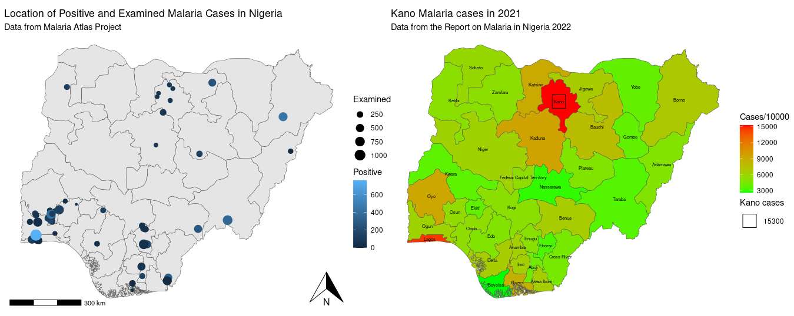

```{r, include = FALSE, warning = FALSE, message = FALSE}
# Load packages 
if(!require(pacman)) install.packages("pacman")
pacman::p_load(tidyverse, knitr, here)

# Source functions 
source(here("global/functions/misc_functions.R"))

# knitr settings
knitr::opts_chunk$set(warning = F, message = F, class.source = "tgc-code-block", error = T)

```

## Introduction


‣ Cette leçon se concentre sur **l'annotation et la labélisation des cartes**.

‣ Les cartes sont cruciales dans la **visualisation de données géospatiales**.

‣ Une annotation appropriée transforme les visualisations en guides informatifs.





## Objectifs d'apprentissage

‣ Incorporer des **indicateurs de données continus** dans des cartes choroplèthes.

‣ Superposer les **noms des États** sur des cartes choroplèthes pour plus de clarté.

‣ Intégrer les noms des États avec des **taux d'augmentation** sur les cartes.

‣ Appliquer des techniques pour **accentuer des régions spécifiques** sur une carte.

‣ Déterminer des stratégies **optimales de placement des points** dans les visualisations géospatiales.


## Charger les packages nécessaires

```{r}
# Charger les packages nécessaires
pacman::p_load(malariaAtlas,
               geodata,
               ggplot2,
               dplyr,
               readr,
               here,
               sf,
               stringr,
               patchwork)

# Définir les options
options(scipen = 10000)
```


## Préparation des données

‣ **Charger et prétraiter les données**, y compris la lecture des ensembles de données, la fusion des informations et le filtrage des entrées non pertinentes.

```{r}
# Lire les données de shapefile géographique
nga_adm1 <- sf::st_read(here::here("data/raw/NGA_adm_shapefile/NGA_adm1.shp")) 

```

```{r}
# Lire les données de cas de paludisme
malaria_cases <- read_csv(here::here("data/malaria.csv"))

```

## Fusion des données géographiques et les cas de paludisme

```{r}
# Fusionner les données géographiques et les cas de paludisme
nga_adm1 <- filter(nga_adm1, NAME_1 != "Water body") 

malaria <- malaria_cases %>% 
  left_join(nga_adm1, by = c("state_name" = "NAME_1")) %>%
  st_as_sf()

```

```{r}
malaria2 <- malaria %>%
  select(state_name, cases_2000, cases_2006, cases_2010, cases_2015, cases_2021, geometry)

malaria2
```

## Lecture et fusion des données de population

```{r}
# Lire et fusionner les données de population

population_nigeria <- read_csv(here::here("data/population_nigeria.csv"))

malaria3 <- malaria2 %>%
  left_join(population_nigeria, by = c("state_name"))

glimpse(malaria3)
malaria3$state_name

```

```{r}
# Modifier les étiquettes pour une meilleure affichage sur la carte

malaria3$state_name <- ifelse(malaria3$state_name == "Federal Capital Territory", "Capital", malaria3$state_name)
malaria3$state_name

```

## Construire une carte choroplèthe simple

‣ Les cartes choroplèthes sont utiles pour visualiser les distributions de données géographiques.

‣ Utiliser **ggplot2** pour créer une carte choroplèthe visualisant les cas de paludisme au Nigeria en 2021.

```{r eval=F}
ggplot(data= ____________) + 
  geom_sf(____________) + 
  labs(title = "Cas de paludisme répartis au Nigéria en 2021", fill = "Cas par 1000")  + 
  scale_fill_continuous(low = "green", high = "red")+
  theme_void()
  
```

### Pratique 1 : Modifier la carte choroplèthe pour les cas de paludisme de 2015 au Nigeria

**Instructions**

1.  Mettre à jour la fonction `geom_sf()` pour les cas de 2015.
2.  Ajuster le titre dans la fonction `labs()` pour 2015.
3.  Changer le gradient de couleur dans `scale_fill_continuous()`.

```{r eval=F}
ggplot(data=___________) + 
  ____________ + 
  ____________ + 
  ____________ + 
  ____________
```

## Ajouter des indicateurs de données continues à la carte choroplèthe

‣ Se concentrer sur les **taux d'incidence** pour normaliser les données pour des comparaisons significatives.

‣ Utiliser **ggplot2** pour visualiser l'incidence du paludisme en 2021 dans les États du Nigeria.

```{r eval=F}
# Visualisation de l'incidence du paludisme en 2021 à l'aide d'une carte choroplèthe

ggplot(data = ____________)+
  ____________+
  ____________+
  labs(title = "Incidences du paludisme au Nigeria en 2021", fill = "Incidences")+
  scale_fill_continuous(low = "green", high = "red")+
  theme_void()

```

## Explorer les taux d'augmentation des cas de paludisme à l'aide de cartes choroplèthes

‣ Visualiser l'**augmentation en pourcentage des cas de paludisme** de 2015 à 2021 au Nigeria.

‣ Calculer et visualiser les **taux d'augmentation** à l'aide d'une carte choroplèthe.

```{r}
# Calcul du taux d'augmentation pour chaque État


```

## Étiqueter la carte choroplèthe avec les noms des États

‣ Ajouter les noms des États pour améliorer la clarté de la carte et l'accessibilité des données.

```{r eval=F}
# Construction d'une carte choroplèthe avec les noms des États
ggplot(data = ____________)+
  ____________)+
  ____________+
  labs(title = "Cas de paludisme au Nigeria en 2011", fill = "Cas / 10000")+
  scale_fill_continuous(low = "green", high ="red")+
  theme_void()

```

### Pratique 2 : Créer une carte choroplèthe montrant les taux d'augmentation du paludisme avec les étiquettes des États

**Instructions**

1.  Préparer le tracé de base avec le jeu de données `malaria3`.
2.  La couleur de remplissage représente le taux d'augmentation de 2015 à 2021.
3.  Étiqueter chaque État avec son nom.
4.  Personnaliser l'échelle de couleur et ajouter des titres.


```{r eval=F}
# Combinaison de la visualisation des taux d'augmentation avec les noms des États
ggplot(data = malaria3) +
  _______ +  # Remplissez le code pour générer la carte choroplèthe
  _______ +  # Ajoutez les noms des États à chaque région
  _______ +  # Spécifiez l'échelle de couleurs pour les taux d'augmentation
  _______    # Ajoutez des titres et des étiquette
```


## Mettre en évidence une région spécifique sur la carte tout en préservant le contexte

‣ Mettre l'accent sur une zone particulière (par exemple, la région de "Kano") sur la carte.

```{r eval=F}

# Visualiser les cas de paludisme à travers le Nigeria en mettant l'accent sur Kano
ggplot(data = ____________) +
  # Créer une carte choroplèthe avec une couleur basée sur les cas de paludisme en 2021
  ____________ +
  # Définir un gradient de couleur continu du vert au rouge
  ____________+
  # Étiqueter chaque région avec son nom
  ____________+
  
  # Superposer un carré sur Kano pour le mettre en évidence
  ____________ +
  
  ____________+
  
  # Ajouter un titre et des légendes
  labs(title = "Cas de paludisme à Kano en 2021", subtitle = "Données du rapport sur le paludisme au Nigeria 2022", size = "Cas à Kano", fill = "Cas/10000",)+
  
  # Appliquer un thème minimal pour la clarté
  theme_void()

```

## Étiqueter les emplacements des points : Explorer le taux de positivité et l'incidence du paludisme

‣ Cartographier des points de données spécifiques (par exemple, des tests de paludisme) pour des aperçus plus profonds.

```{r eval=F}

# Récupération des données
nigeria_pr <- malariaAtlas::getPR(ISO = "NGA", species = "both")

nigeria_pr %>%
  filter(!is.na(pr))%>%
  drop_na(longitude, latitude) %>%
  st_as_sf(coords = c("longitude", "latitude"), crs = 4326) -> nigeria_pr

```

```{r eval=F}

ggplot()+
  geom_sf(data = ____________)+
  ____________+
  labs(title = "Emplacement des cas de paludisme positifs et examinés au Nigeria",
       subtitle = "Données du Malaria Atlas Project",
       color = "Positif",
       size = "Examiné")+
  ylab("Longitude")+
  xlab("Latitude")+
  ____________+
  ____________+
  theme_void()
  
```

### Pratique 3 : Visualiser le taux de positivité par taille et couleur

**Instructions**

-   Représenter le taux de positivité pour chaque emplacement.
-   Modifier la taille des points pour refléter le taux de positivité.

::: challenge
```{r, eval=FALSE}
# Visualiser le taux de positivité
ggplot() +
  _________ + 
  _________ + 
  _________ + 
  _________
```
:::

## RECAPITULATIF !

En complétant cette leçon, vous devriez être capable de :

‣ Utiliser des annotations et des étiquettes pour des données spatiales complexes.

‣ Montrer une compétence dans l'intégration d'indicateurs continus et le superposition d'étiquettes sur des cartes.

‣ Mettre en évidence des zones tout en préservant le contexte géographique plus large.

‣ Utiliser {ggplot2}, {sf} et {ggspatial} pour une cartographie avancée.
