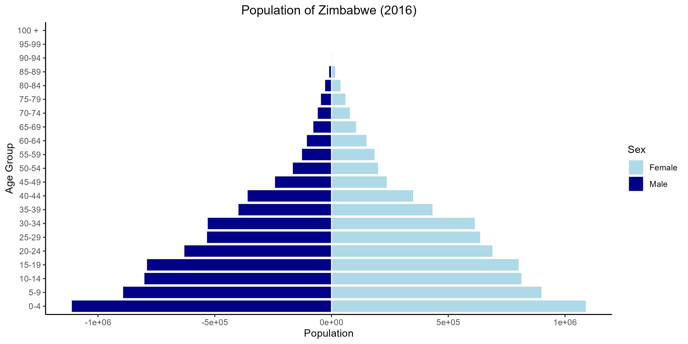
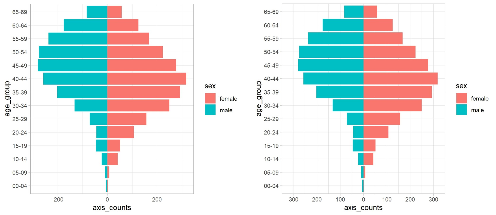

```{r, echo = F, message = F, warning = F}

# nécessite pacman 
if(!require(pacman)) install.packages("pacman")

# Fonctions source 
source(here::here("global/functions/lesson_functions.R"))

# Paramètres knitr
knitr::opts_chunk$set(warning = F, message = F, class.source = "tgc-code-block", error = T)

```

# Introduction

Une pyramide démographique, également appelée pyramide des âges ou pyramide par sexe, aide à visualiser la distribution d'une population selon deux variables démographiques importantes : **l'âge** et le **sexe**.

Aujourd'hui, vous apprendrez l'importance d'utiliser des pyramides démographiques pour visualiser la distribution d'une maladie par âge et par sexe, ainsi que comment en créer une avec `{ggplot2}`.

Allons-y !

# Objectifs d'Apprentissage

À la fin de cette leçon, vous serez en mesure de :

-   Expliquer **l'importance des pyramides démographiques** pour communiquer les **patterns spécifiques à l'âge et au sexe** de la distribution d'une maladie.

-   Comprendre les **composants d'une pyramide démographique** et la conceptualiser comme une version modifiée d'un **graphique à barres empilées**.

-   **Résumer et préparer les données** dans le format approprié pour le tracé avec les fonctions **{dplyr}**.

-   Utiliser le code **`{ggplot2}`** pour **tracer une pyramide démographique à l'aide de `geom_col()`**, montrant les totaux ou pourcentages sur l'axe x.

-   **Personnaliser le graphique** en changeant le schéma de couleurs, les étiquettes et les axes.

# Introduction aux Pyramides Démographiques

Les pyramides démographiques sont des graphiques qui montrent la distribution des âges au sein d'une population. Le graphique est divisé en deux parties entre les membres masculins et féminins de la population, où l'axe des y montre les groupes d'âge et l'axe des x le sexe.



Le graphique global prend souvent la forme d'une pyramide, d'où son nom.

Trois caractéristiques clés d'une pyramide démographique sont :

1.  **Groupes d'Âge** : La pyramide est divisée en barres horizontales, chacune représentant un groupe d'âge, souvent par tranches de cinq ans (0-4, 5-9, 10-14, etc.).

2.  **Représentation par Sexe** : Le côté gauche de la pyramide représente généralement les hommes, et le côté droit représente les femmes, permettant une comparaison rapide de la distribution entre les sexes dans chaque groupe d'âge.

3.  **Taille de la Population** : La longueur des barres indique la taille de la population dans chaque groupe d'âge. Une barre plus longue suggère une plus grande population dans ce groupe d'âge.

À l'aide de `{ggplot2}`, nous sommes en mesure de créer des pyramides tout en les adaptant à nos besoins spécifiques. À la fin de cette leçon, notre graphique final ressemblera à ceci :


## L'utilisation des Pyramides Démographiques en Épidémiologie

Les pyramides démographiques sont utiles pour décrire et comprendre l'épidémiologie de diverses maladies, en visualisant la distribution de la maladie par âge et par sexe.

**Vulnérabilité Spécifique à l'Âge et au Sexe**

Différentes maladies peuvent affecter différemment les groupes d'âge. Nous savons que l'incidence de certaines maladies transmissibles peut varier en fonction de l'âge. Dans le cas de la tuberculose (TB) en Afrique, les adolescents et les jeunes adultes sont principalement touchés dans la région. Cependant, dans des pays où l'incidence de la TB a diminué de manière significative, comme aux États-Unis, elle est principalement observée chez les personnes plus âgées ou immunodéprimées. Une autre maladie qui démontre une variation liée à l'âge est le paludisme, où les enfants de moins de 5 ans représentent une grande majorité des décès en Afrique. Le VIH a été démontré pour affecter davantage les femmes que les hommes, en particulier dans les groupes d'âge plus jeunes. Cela pourrait être dû à une vulnérabilité biologique ou à des facteurs sociaux.

Par conséquent, lors de la description de l'épidémiologie des maladies transmissibles telles que le VIH, le paludisme et la TB, il est important d'observer la distribution des cas ou des décès par groupe d'âge et par sexe. Ces informations aident à informer les programmes nationaux de surveillance en identifiant les groupes d'âge et de sexe qui connaissent la plus grande charge, et qui cibler pour l'intervention.

::: side-note
**Utilisation de la Distribution Démographique pour l'Évaluation de la Qualité des Données**

Les pyramides démographiques peuvent également jouer un rôle crucial dans l'évaluation de la qualité des données des systèmes de surveillance de routine en aidant à évaluer la cohérence interne et externe.

Lors de la tentative d'évaluation des normes de qualité des données de surveillance de certaines maladies, la cohérence externe peut être évaluée en comparant les données de surveillance nationales avec l'épidémiologie mondiale de cette maladie. Les calculs de données basées sur des variables démographiques telles que le groupe d'âge sont parfois utilisés.

Dans le cas des données de surveillance de la TB, la cohérence externe peut être évaluée en calculant le pourcentage d'enfants diagnostiqués avec la TB dans le programme et en le comparant avec la moyenne mondiale des cas.
:::

## Conceptualisation des Pyramides Démographiques

Jetons un coup d'œil plus attentif à notre pyramide démographique cible, et décomposons comment elle peut être tracée à l'aide de `geom_col()` de `{ggplot2}`.


Comme vous pouvez le voir, l'axe des x est divisé en deux moitiés (hommes et femmes), qui sont tracées dans des directions opposées à partir de 0. Les unités sur l'axe des x sont symétriques de chaque côté, et les groupes d'âge sont étiquetés le long de l'axe des y.

En d'autres termes, nous pouvons le considérer comme deux **graphiques à barres** - un pour les hommes et un pour les femmes.


Une pyramide démographique peut également être conceptualisée comme une forme spécialisée d'un graphique à barres empilées. Dans un graphique à barres empilées traditionnel, les segments sont empilés les uns sur les autres, à partir d'une ligne de base de zéro et s'étendant vers l'extérieur.

En revanche, une pyramide démographique aligne les barres dos à dos le long d'un axe central. Cet axe représente le point de division entre deux catégories (populations masculines et féminines) avec les barres s'étendant dans des directions opposées pour illustrer la proportion de chaque groupe d'âge au sein de ces catégories.


::: key-point
Une pyramide démographique ressemble à une version modifiée d'un graphique à barres empilées avec deux distinctions clés :

1) **Axe Central** : Au lieu de superposer les segments de barres les uns sur les autres, les barres sont alignées dos à dos le long d'un **axe central**, qui sert de point de division entre les populations masculines et féminines.

2) **Orientation des Barres** : Contrairement aux barres empilées traditionnelles qui partent de zéro vers l'extérieur dans une seule direction, les barres de la pyramide démographique s'étendent dans des **directions opposées** pour représenter la taille de chaque groupe d'âge au sein des catégories.
:::

# Paquets

Cette leçon nécessitera l'installation et le chargement des paquets suivants :

```{r warning = F, message = F}
# Charger les paquets 
pacman::p_load(here,       # pour localiser les fichiers
               tidyverse,  # pour manipuler et tracer les données (inclut ggplot2)
               apyramid)   # paquet dédié à la création de pyramides par âge
```

::: reminder
Chaque leçon de The GRAPH Courses est accompagnée d'un script RMarkdown pour la programmation, que vous devriez télécharger et utiliser pour suivre la leçon vidéo ou les notes de cours.
:::

# Préparation des Données

## Introduction au Jeu de Données

Pour cette leçon, nous utiliserons un jeu de données simulées sur le VIH imitant une liste linéaire des cas de VIH au Zimbabwe en 2016. Pour cette leçon spécifique, nous nous concentrerons sur les variables **âge** et **sexe** pour créer notre pyramide démographique.

## Importation des Données

Commençons par importer nos données dans notre environnement RStudio et les examiner de plus près pour mieux comprendre les variables que nous utiliserons pour la création de notre pyramide démographique.

```{r load_data, warning = F, message = F, render = .reactable_10_rows}
hiv_data <- read_csv(here::here("data/hiv_zw_linelist_2016.csv"))

hiv_data
```

Notre jeu de données importé contient **28000** lignes et **3** colonnes contenant les variables `age_group` et `sex` que nous utiliserons pour la création de notre pyramide démographique. Chaque ligne (ligne) correspond à un patient, tandis que chaque colonne représente différentes variables d'intérêt. La liste linéaire ne contient que des variables démographiques et liées au VIH (statut VIH). De plus, la variable `hiv_status` nous fournit des informations sur le statut des individus (*positif* ou *négatif*).

Comme nous sommes intéressés par la création d'une pyramide démographique sur la prévalence du VIH, nous devons d'abord filtrer pour les individus VIH positifs.

Filtrons les données !

```{r hiv_cases, render = .reactable_10_rows}
# Créer un sous-ensemble avec seulement les individus VIH positifs
hiv_cases <- hiv_data %>% 
  filter(hiv_status == "positive")

hiv_cases
```

Remarquez que nous avons maintenant un sous-ensemble de données de **3923** lignes et **3** colonnes où tous les individus sont **VIH positifs** !

## Inspection des Données

Maintenant, avant de passer à la création de notre pyramide démographique, examinons les données en créant un tableau récapitulatif des colonnes `age_group` et `sex` !

Pour cette étape, nous utiliserons `count()` de **`{dplyr}`**.

```{r summary_table, render = .reactable_10_rows}
hiv_cases %>% 
  count(age_group, sex)
```

Nous pouvons voir que les données sont propres et que la colonne `age_group` est correctement organisée dans l'ordre croissant (du plus jeune au plus vieux).

::: watch-out
Vérifiez toujours l'ordre de vos données avant de tracer un diagramme pyramidal démographique !

Avant de créer votre pyramide démographique, assurez-vous que vos données sont propres et correctement organisées dans un **ordre croissant** !
Cela est important lors de l'utilisation de variables catégorielles car l'ordre de votre `age_group` affectera l'ordre dans lequel il sera tracé dans votre pyramide.

Dans le cas des pyramides démographiques, nous voulons que le groupe d'âge le plus jeune soit situé en bas de l'axe des y et le groupe d'âge le plus vieux en haut de l'axe des y.
:::

## Création d'un sous-ensemble de données agrégées

Avant de commencer, nous devons créer un cadre de données agrégées qui calcule le nombre total de cas par groupe d'âge, divisé par sexe. Nous voulons que le cadre de données agrégées ressemble à ceci :


(Nous avons 14 groupes d'âge et deux sexes, soit 28 lignes. Nous calculerons d'abord la somme de chaque groupe - c'est la colonne `total`, puis nous nierons les valeurs masculines et créerons une nouvelle colonne appelée `axis_counts`, puis ajouterons la dernière colonne, `axis_percent`, qui présente les totaux en pourcentage. Ils sont appelés axis counts car c'est purement à des fins de traçage. Nous n'avons pas réellement -6 cas, ce n'est pas possible.)

La raison pour laquelle les valeurs *masculines* sont niées est de tracer les barres masculines sur le *côté gauche* de l'axe !

::: key-point
Lors de l'utilisation de la fonction `geom_col()`, le compte de chaque groupe **doit être préalablement calculé** et spécifié dans `aes()` comme variable x ou y.
En d'autres termes, vous devrez convertir les données de la liste en un tableau récapitulatif avec le nombre agrégé d'occurrences pour chaque niveau catégorique. Si vos données sont pré-agrégées, vous pouvez sauter cette étape d'agrégation.
:::

Commençons par utiliser `{dplyr}` pour créer le cadre de données résumées, avec les 28 lignes et 5 colonnes que nous avons vues ci-dessus ! Utilisons les fonctions `group_by()` et `summarise()` pour cela.

::: reminder
N'oubliez pas de nier les comptes masculins afin d'obtenir le graphique des barres masculines du *côté gauche* du graphique ! Nous pouvons le faire avec la fonction `mutate()`.
:::


```{r count_occurences, render = .reactable_5_rows, message=F}

# Créer un nouveau sous-ensemble
pyramid_data <- 
  hiv_cases %>% 
  
  # Compter les cas totaux par groupe d'âge et par sexe
  count(age_group, sex, name = "total") %>%  
  
  # Créer de nouvelles colonnes pour les valeurs de l'axe x sur le graphique
  mutate(
    # Nouvelle colonne avec les valeurs de l'axe - convertir les comptes masculins en négatifs
    axis_counts = ifelse(sex == "male", -total, total),
    # Nouvelle colonne pour les valeurs de l'axe en pourcentage
    axis_percent = round(100 * (axis_counts / nrow(hiv_cases)), 
                         digits = 1))

head(pyramid_data)
```
Notez que les valeurs masculines dans les colonnes `axis_counts` et `axis_percent` sont *négatives* !

Maintenant que les données sont résumées et dans le format approprié, nous pouvons utiliser notre nouveau cadre de données `pyramid_data` pour tracer la pyramide avec `{ggplot2}` !

::: practice
Testons votre compréhension avec la question à choix multiples suivante :

1. **Lors de la préparation des données pour le traçage avec `geom_col()`, quelle modification doit être apportée aux valeurs de comptage ?**
    a. Tous les comptes totaux doivent être niés.
    b. Les comptes doivent être multipliés par 2.
    c. Les comptes doivent être convertis en pourcentages.
    d. Les comptes masculins doivent être niés (multipliés par -1).

*La clé de réponse peut être trouvée à la fin de ce document.*
:::

# Création du graphique

Comme mentionné précédemment, un pyramide démographique peut être considéré comme une version modifiée d'un graphique à barres empilées.

Pour créer un graphique à barres empilées de base avec `geom_col()`, nous traçons une variable catégorielle (par exemple, `age_group`) par rapport à une variable continue (par exemple, `total`), et nous définissons la couleur de remplissage (`fill`) sur une deuxième variable catégorielle (par exemple, `sex`).

```{r}
# Graphique à barres empilées de base

# Commencer ggplot
ggplot() +
 
# Créer un graphique à barres avec geom_col()
  geom_col(data = pyramid_data,   # spécifier les données à graphiquer
           aes(x = age_group,     # indiquer la variable x catégorielle
               y = total,         # indiquer la variable y continue
               fill = sex))  +    # remplir par la deuxième variable catégorielle
# Modifier le thème
  theme_light() +

# Inverser les axes X et Y
  coord_flip()
```

Ici, nous avons utilisé la variable `total` de `pyramid_data`, où toutes les valeurs sont positives.


::: recap
Pour utiliser la fonction `geom_col()` pour un graphique à barres empilées, votre ensemble de données doit inclure les sommes totales agrégées par chaque variable catégorielle (**`age_group`** et **`sex`**) !

Les bases de la création de graphiques à barres avec {ggplot2} sont couvertes dans notre cours introductif sur la visualisation des données, Data on Display.
Des applications supplémentaires des graphiques à barres pour la déclaration d'épidémies sont enseignées dans notre leçon sur la visualisation des comparaisons et des compositions.
Tout le contenu est disponible sur notre [site web](thegraphcourses.org).
:::

## Utilisation de `geom_col()` pour les pyramides démographiques

Maintenant, nous allons construire sur le code de base du graphique à barres empilées ci-dessus pour créer une pyramide démographique.

Cette fois, nous utilisons `axis_counts` pour l'axe des y, qui contient des valeurs négatives pour les hommes.


```{r geom_col}

demo_pyramid <- 
  ggplot() +
 
  geom_col(data = pyramid_data, # spécifier les données à graphiquer
           aes(
             x = age_group,    # indiquer la variable x
             y = axis_counts,  # indiquer la variable y NÉGATIVE
             fill = sex))  +   # remplir par le sexe
  theme_light() +
  coord_flip()


demo_pyramid
```

::: key-point
Une pyramide démographique est une version d'un graphique à barres empilées, avec l'alignement horizontal des barres ajusté le long de l'axe x.
:::

Nous pouvons également créer la même pyramide démographique en utilisant les pourcentages totaux sur notre axe des y.


```{r geom_col_percent, warning=F}

demo_pyramid_percent <- 
  ggplot() +
  geom_col(data = pyramid_data, 
           aes(x = age_group,
               y = axis_percent, # utiliser les pourcentages précalculés
               fill = sex)) +
  coord_flip() +
  theme_light()

demo_pyramid_percent
```


::: side-note
Plusieurs packages sont disponibles pour faciliter l'analyse de données et la visualisation de données.
Dans le cas des pyramides démographiques, le package `{apyramid}` peut être un outil utile.
Ce package du projet **R4Epis** contient une fonction `age_pyramid()`, qui permet la création rapide de pyramides démographiques :

```{r}
hiv_cases %>% # peut utiliser la liste originale
  # La variable de regroupement doit être un facteur
  mutate(age_group = factor(age_group)) %>% 
apyramid::age_pyramid(# 2 arguments requis :
                      age_group = "age_group",
                      split_by = "sex")
```

Cependant, ce package a des fonctionnalités limitées et peu d'options de personnalisation.
`{ggplot2}` offre une approche beaucoup plus polyvalente et utilise une syntaxe avec laquelle nous sommes déjà familiers.

Des informations supplémentaires sur la fonction peuvent être lues [**ici**](https://cran.r-project.org/web/packages/apyramid/vignettes/intro.html) ou en entrant `?age_pyramid` dans votre console R.
:::

::: practice
Testons votre compréhension avec les questions à choix multiples suivantes (la clé des réponses se trouve à la fin) :

2. **Lors de l'utilisation de `geom_col()`, quel type de variable x votre ensemble de données doit-il inclure ?**
   a. Variables continues
   b. Variables catégorielles
   c. Variables binaires
   d. Variables ordinales
3. **Quelle fonction de `{ggplot2}` pouvez-vous utiliser pour inverser les axes x et y ?**
   a. `coord_flip()`
   b. `x_y_flip()`
   c. `geom_flip()`
   d. Toutes les options ci-dessus
:::

::: practice
Maintenant, testons votre compréhension avec la question de pratique suivante :

**Nous allons utiliser un ensemble de données nettoyé et préparé contenant la population totale du Zimbabwe en 2016 regroupée par groupe d'âge et par sexe.**

Commencez par charger l'ensemble de données préparé comme suit :

```{r loading_coding_practice}

zw_2016 <- readRDS(here::here("data/population_zw_2016.rds"))

zw_2016
```

*Notez que le total des hommes est déjà **négatif** !*

5. **Créez une pyramide démographique pour la population totale du Zimbabwe en 2016 en utilisant la fonction `geom_col()` du package `{ggplot2}`. Assurez-vous d'ajouter une bordure blanche autour de chaque barre !**

```{r coding_question4, eval=FALSE}
Q4_pyramid_zw_2016 <- 
  
# Commencer ggplot
  ggplot() +

# Créer un graphique à barres avec geom_bar
  geom_col(data = ____,
           aes(x = ____,
               y = ____,
               fill = ____),
           color = ____) +
  
# Inverser les axes x et y    
  ____
```
:::

# Personnalisation du Graphique

Jusqu'à présent, vous avez appris comment créer un pyramide démographique en utilisant `{ggplot2}` comme illustré ci-dessous :

```{r geom_col_final, warning=FALSE}

demo_pyramid
```

Cependant, afin de créer un graphique informatif, un certain niveau de personnalisation du graphique est nécessaire.
Par exemple, il est important d'inclure des étiquettes informatives et de redimensionner les axes x et y pour une meilleure visualisation.

Apprenons quelques personnalisations utiles de `{ggplot2}` !

## Axes

Les paramètres actuels des axes résultent en une représentation asymétrique, avec le côté droit (féminin) s'étendant plus loin que le côté gauche (masculin) en raison d'un nombre de cas plus élevé dans le plus grand groupe d'âge féminin.
Pour une comparaison précise, il est essentiel que les deux côtés se reflètent symétriquement.

Nous allons ajuster les limites des axes pour qu'elles soient égales en valeurs positives et négatives, garantissant ainsi que les données soient visualisées de manière symétrique pour une comparaison claire et équilibrée.

Nous commencerons par redimensionner l'axe du *nombre total*, ou dans le cas de notre graphique, l'**axe y**.
Pour cela, nous commencerons par identifier la valeur maximale et la sauvegarder comme un objet.

```{r max_min}

max_count <- max(pyramid_data$total)

max_count
```

Maintenant que nous avons identifié que la valeur maximale pour le *nombre total* est **318**, nous pouvons l'utiliser pour redimensionner notre axe y en conséquence.

Dans ce cas particulier, nous voulons redimensionner notre axe y de manière symétrique.
Nous prendrons donc la plus grande valeur absolue et l'utiliserons comme limite pour les côtés *positif* et *négatif*.

Dans ce cas, nous utiliserons notre valeur maximale.

```{r custom_axis, warning=F}

custom_axes <- 

# Utiliser le graphique précédent
  demo_pyramid +
  
# Ajuster l'axe y (nombre total)  
  scale_y_continuous(

    # Spécifier la limite de l'axe y en utilisant la valeur maximale et en la rendant positive et négative
    limits = c(-max_count, max_count),
    
    # Spécifier l'espacement entre les étiquettes d'axe
    breaks = scales::breaks_width(100),
    
    # Rendre les étiquettes d'axe absolues pour que les étiquettes masculines apparaissent positives
    labels = abs)


custom_axes
```

Ajuster les limites des axes pour qu'elles soient égales des deux côtés garantit une comparaison visuelle symétrique et précise, facilitant l'interprétation correcte des données.

Notez que nous avons également changé les étiquettes d'axe pour qu'elles soient leur valeur absolue, de sorte que les nombres de cas masculins n'apparaissent plus comme des nombres négatifs.

## Étiquettes Personnalisées

Utilisons la pyramide de population que nous avons précédemment créée à l'aide de la fonction `geom_col()` et construisons dessus.

Nous pouvons commencer par ajouter un titre informatif, des axes et une légende à notre graphique :

```{r adjusting_labels, warning=FALSE}

custom_labels <- 
  
# Commencer avec la pyramide démographique précédente
  custom_axes +
  
# Ajuster les étiquettes
  labs(
    title = "Cas VIH Positifs par Âge et Sexe",
    subtitle = "Zimbabwe (2016)",
    x = "Groupe d'Âge",
    y = "Nombre", 
    fill = "Sexe",
    caption = stringr::str_glue("Les données proviennent de données de liste de simulation \nn = {nrow(hiv_cases)}"))


custom_labels

```

## Schéma de Couleurs et les Thèmes

Nous pouvons également apporter des ajustements nécessaires au schéma de couleurs et au thème du graphique.

Ci-dessous est un exemple de certains changements que nous pouvons effectuer :

```{r color_theme, warning=F}

custom_color_theme <- 
  
# Utiliser le graphique précédent
  custom_labels +
  
# Désigner manuellement les couleurs et les légendes
  scale_fill_manual(
    
    # Sélectionner la couleur de remplissage du sexe
    values = c("female" = "lightblue",
               "male" = "darkblue"),
    
    # Mettre en majuscules les légendes
    labels = c("Féminin", "Masculin")) +
  
# Ajuster les paramètres du thème
  theme(
    axis.line = element_line(colour = "black"), # rendre la ligne d'axe noire
    plot.title = element_text(hjust = 0.5),     # centrer le titre
    plot.subtitle = element_text(hjust = 0.5),  # centrer le sous-titre
    plot.caption = element_text(hjust = 0,      # formater le texte de la légende
                                size = 11, 
                                face = "italic")) 

custom_color_theme

```


-   titre et sous-titre centrés
-   légende à gauche et augmentation de la taille de la police
-   texte de légende en majuscules
-   couleurs
-   lignes d'axe en gras

# En Résumé ! {.unnumbered}

Comme vous pouvez le voir, les pyramides démographiques sont un outil de visualisation essentiel pour comprendre la répartition de maladies spécifiques selon les groupes d'âge et le sexe.

Les concepts appris dans cette leçon peuvent également être appliqués pour créer d'autres types de graphiques nécessitant des résultats à la fois négatifs et positifs, tels que le pourcentage de changement dans les taux de notification de cas, et bien plus encore.

Maintenant que vous avez compris le concept de création de pyramides démographiques, les possibilités sont infinies !
De la représentation graphique des **cas** par groupe d'âge et sexe sur la population **de référence/réelle**, à la représentation graphique des changements (positifs et négatifs) des interventions dans une population, vous devriez être en mesure d'appliquer ces concepts pour créer des graphiques épidémiologiques informatifs.

Félicitations pour avoir terminé cette leçon.
Nous espérons que vous pourrez maintenant appliquer les connaissances acquises lors de la leçon d'aujourd'hui lors de l'analyse et de la création de rapports d'examen épidémiologique.

# Solutions {.unnumbered}

1. d
2. b
3. a
4. c
5. 

```{r}
Q4_pyramid_zw_2016 <-
  ggplot() +
  geom_col(data = zw_2016,
           aes(x = age_group,
               y = total_count,
               fill = sex),
           color = "white") +
  coord_flip()
```

# Contributors {.unlisted .unnumbered}

Les membres de l'équipe suivants ont contribué à cette leçon :

`r .tgc_contributors_list(ids = c("sabina", "joy"))`

# References {.unnumbered}

1. Contenu de la leçon adapté de : Batra, Neale, et al. Le Manuel de l'épidémiologiste R. 2021. <https://doi.org/10.5281/zenodo.4752646>\
2. Contenu de la leçon adapté de : OMS. Comprendre et utiliser les données sur la tuberculose. 2014. <https://apps.who.int/iris/bitstream/handle/10665/129942/9789241548786_eng.pdf>\
3. Package référencé à partir de : <https://r4epis.netlify.app/>