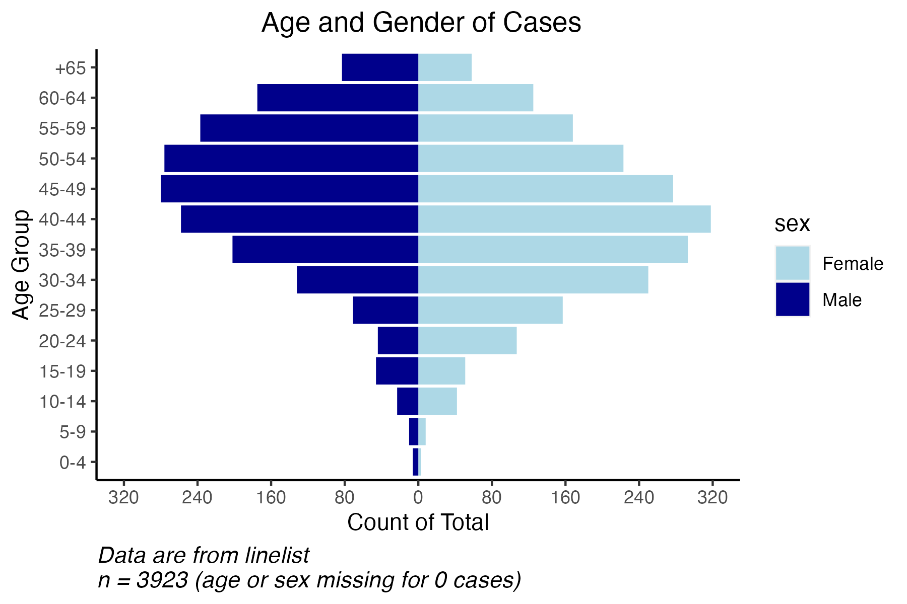

```{r, echo = F, message = F, warning = F}
# Charger les packages 
if(!require(pacman)) install.packages("pacman")
pacman::p_load(tidyverse, knitr, here, reactable, gt, flextable)

## fonctions
source(here::here("global/functions/misc_functions.R"))

## affichage par défaut
registerS3method("reactable_5_rows", "data.frame", reactable_5_rows)
knitr::opts_chunk$set(class.source = "tgc-code-block")

```

# Introduction

Aujourd'hui, vous allez apprendre l'importance d'utiliser des pyramides démographiques pour visualiser la distribution d'une maladie par âge et sexe et comment en créer une avec `ggplot2`.

Commençons !

# Objectifs d'Apprentissage

-   Vous connaissez l'importance d'utiliser des pyramides démographiques pour montrer la distribution des groupes d'âge et du sexe pour les maladies transmissibles.

-   Vous pouvez utiliser `geom_col` de `ggplot2` pour créer une pyramide démographique montrant le nombre ou le pourcentage total de cas, décès, et plus encore.

-   Vous pouvez personnaliser le graphique en changeant le schéma de couleurs, les étiquettes et les axes.


# Introduction aux pyramides démographiques

Une pyramide démographique, également connue sous le nom de pyramide de population ou pyramide âge-sexe, aide à visualiser la distribution d'une population selon deux variables démographiques importantes : **l'âge** et le **sexe**. La population globale prend la forme d'une pyramide, d'où son nom.

Les pyramides de population sont des graphiques qui montrent la distribution des âges dans une population divisée au centre entre les membres masculins et féminins de la population, où l'axe des ordonnées montre les groupes d'âge et l'axe des abscisses le sexe.

Grâce à l'utilisation de `ggplot2`, nous sommes en mesure de créer des pyramides tout en les personnalisant selon nos besoins spécifiques, comme le graphique ci-dessous :



Plusieurs packages sont disponibles pour faciliter l'analyse des données et la visualisation des données. Dans le cas des pyramides démographiques, le package `apyramid` peut être un outil utile. Néanmoins, en utilisant ce package, nous sommes limités dans la personnalisation de notre graphique, ce qui rend `ggplot2` une approche beaucoup plus polyvalente.

::: side-note  

Le package `apyramid` est un produit du projet **R4Epis** qui permet la création rapide de pyramides de population et de nombreuses autres fonctions utiles utilisées dans les rapports épidémiologiques.

Des informations détaillées sur le package peuvent être lues [**ici**](https://cran.r-project.org/web/packages/apyramid/vignettes/intro.html) ou en entrant `?age_pyramid` dans votre console R.

:::


## Utilisation des pyramides de population en épidémiologie

Pour décrire et comprendre l'épidémiologie de diverses maladies transmissibles, les pyramides de population fournissent des informations utiles tout en facilitant la visualisation de la distribution de la maladie par âge et par sexe.

Nous savons que l'incidence de certaines maladies transmissibles peut varier avec l'âge. Dans le cas de la tuberculose (TB), les adolescents et les jeunes adultes sont principalement touchés dans la région d'Afrique. Cependant, dans les pays où la TB est passée d'une forte à une faible incidence, comme les États-Unis, la TB est principalement une maladie des personnes âgées ou immunodéprimées. Une autre maladie qui démontre une variation en fonction de l'âge est le paludisme, où les enfants de moins de 5 ans représentent une grande majorité des décès dans la région d'Afrique.

Par conséquent, lors de la description de l'épidémiologie de maladies transmissibles telles que le VIH, le paludisme et la tuberculose, il est important d'observer la distribution des cas ou des décès par groupe d'âge et par sexe. Ces informations aident à informer les programmes de surveillance nationaux sur le groupe d'âge qui connaît le fardeau le plus lourd et celui à cibler pour l'intervention.


::: side-note

**Utilisation de la distribution démographique pour l'évaluation de la qualité des données**

Les pyramides démographiques peuvent également jouer un rôle crucial dans l'évaluation de la qualité des données des systèmes de surveillance de routine en aidant à évaluer la cohérence interne et externe.

Lorsqu'on essaie d'évaluer les normes de qualité des données de surveillance de certaines maladies, la cohérence externe peut être évaluée en comparant les données de surveillance nationales à l'épidémiologie mondiale de cette maladie. Les calculs de données basés sur des variables démographiques comme le groupe d'âge sont parfois utilisés.

Dans le cas des données de surveillance de la tuberculose, la cohérence externe peut être évaluée en calculant le pourcentage d'enfants diagnostiqués tuberculeux dans le programme et en le comparant à la moyenne mondiale des cas.

:::

## Conceptualisation des pyramides démographiques

Prenons un regard plus approfondi sur une pyramide de population et essayons de comprendre comment elle peut être représentée graphiquement à l'aide de `geom_col` de `ggplot2`.

Pour conceptualiser cela, nous utiliserons l'ensemble de données introduit plus tard dans la leçon. Regardons de plus près la pyramide démographique que nous avons montrée ci-dessus:


Comme vous pouvez le voir sur l'image ci-dessus, l'axe des x est divisé en deux moitiés (hommes et femmes) où les unités de l'axe des x sont symétriques de part et d'autre de l'axe au point 0 et les groupes d'âge sont étiquetés le long de l'axe des y.

En regardant de près ce graphique, vous avez probablement remarqué que la pyramide de population est constituée de deux tracés fusionnés à travers l'axe des y.

En d'autres termes, nous pouvons diviser la pyramide en deux sections (hommes ou femmes) et les représenter graphiquement de manière indépendante comme ci-dessous:


Ce type de graphique vous semble-t-il familier ? Et si nous inversions nos axes x et y et tournions le graphique de 90 degrés ?

Prenons la moitié féminine et retournons nos axes pour voir ce que nous obtenons:


Comme vous pouvez probablement le constater maintenant, pour créer une pyramide de population, nous avons créé deux **graphiques à barres** montrant la répartition des sexes par groupes d'âge. Une fois que nous avons créé un graphique pour les femmes et les hommes, nous les avons ensuite fusionnés ensemble à travers leur axe des y.

::: key-point

Pour que la moitié masculine soit représentée à gauche de l'axe des y, nous devrons nier le **compte** (nombre total de personnes par groupe d'âge).

:::

En d'autres termes, les pyramides de population sont des **graphiques à barres** dont les axes sont **inversés** (axes x et y inversés) et où les femmes sont représentées du **côté positif** de l'axe des y et les hommes sont représentés du **côté négatif** de l'axe des y.

# Packages

Cette leçon nécessitera l'installation et le chargement des "packages" suivants :

```{r warning = F, message = F}
# Charger les packages
if(!require(pacman)) install.packages("pacman")
pacman::p_load(here,       # pour localiser le fichier
               tidyverse,  # pour nettoyer, gérer et tracer les données (inclut le paquet ggplot2)
               janitor,    # tables et nettoyage des données
               apyramid)   # paquet dédié à la création de pyramides des âges

```

# Préparation des Données

## Introduction à l'ensemble de données

Pour cette leçon, nous utiliserons un ensemble de données fictif sur le VIH imitant une liste linéaire de cas de VIH au Zimbabwe en 2016.

::: side-note
Vous pouvez accéder à la source utilisée pour simuler les données sur le VIH [**ici**](https://phia.icap.columbia.edu/zimbabwe-final-report/#:~:text=ZIMPHIA%2C%20a%20nationally%20representative%20household,of%20Zimbabwe's%20national%20HIV%20response.)
:::

Chaque ligne (rangée) correspond à un patient, tandis que chaque colonne représente différentes variables d'intérêt. La liste linéaire ne contient que des variables démographiques et liées au VIH (statut VIH).

Pour cette leçon spécifique, nous nous concentrerons sur les variables **liées à l'âge** et **au sexe** pour créer notre pyramide démographique.

## Importation des Données

Commençons par importer nos données dans notre environnement RStudio et examinons-les de plus près pour mieux comprendre les variables que nous utiliserons pour la création de notre pyramide démographique.

::: side-note
Afin de concentrer notre attention sur la création de pyramides démographiques, nous avons déjà créé le sous-ensemble de données contenant les variables d'intérêt (`age_group` et `sex`).
:::

```{r load_data, warning = F, message = F, render = reactable_10_rows}
hiv_data <- read_csv(here::here("data/clean/hiv_zimbabwe_2016.csv"))

hiv_data
```

Notre ensemble de données importé contient **28000** rangées et **3** colonnes contenant les variables `age_group` et `sex` que nous utiliserons pour la création de notre pyramide démographique. De plus, la variable `hiv_status` nous fournit des informations sur le statut des patients (*positif* ou *négatif*).

Comme nous sommes intéressés à créer une pyramide démographique sur la prévalence du VIH, nous devons d'abord filtrer les patients séropositifs et nous assurer que les variables `age_group` et `hiv_status` sont factorisées.

Chargeons un sous-ensemble de nos données déjà nettoyées !

```{r hiv_prevalence, render = reactable_10_rows}

hiv_prevalence <- readRDS(here::here("data/clean/hiv_zimbabwe_prevalence.rds"))

hiv_prevalence
```

::: side-note
Remarquez que nous avons maintenant un sous-ensemble de données de **3923** rangées et **3** colonnes où tous les patients sont **séropositifs** !
:::

Maintenant, avant de passer à la création de notre pyramide démographique, inspectons les données en créant un tableau résumant les colonnes `age_group` et `sex` !

Pour cette étape, nous utiliserons `tabyl()` de **`janitor`**.

```{r summary_table, render = reactable_10_rows}
hiv_prevalence %>% 
  tabyl(age_group, sex)
```

Selon le tableau, les données sont propres tandis que la colonne `age_group` est correctement organisée par ordre croissant (du plus jeune au plus âgé).

::: pro-tip
Avant de créer votre pyramide démographique, assurez-vous de vérifier que vos données sont propres et correctement organisées dans un **ordre croissant** ! C'est important lorsque vous utilisez des variables catégorielles car l'ordre de votre `age_group` affectera l'ordre dans lequel il sera tracé dans votre pyramide.

Dans le cas des pyramides démographiques, nous voulons que le groupe d'âge le plus jeune soit situé en bas de l'axe des y et que le groupe d'âge le plus âgé soit en haut de l'axe des y.
:::

## Création d'un Sous-ensemble de Données Agrégées

Avant de commencer, nous devrons créer un sous-ensemble de données agrégées qui regroupe le nombre total d'occurrences par groupe d'âge et par sexe comme ci-dessous :


Notez que les valeurs *male* sont négatives afin d'obtenir le graphique en barres masculin sur le *côté gauche* du graphique!

::: key-point
Il est important de comprendre comment utiliser `geom_col`.

Lors de l'utilisation de la fonction `geom_col`, le nombre pour chaque groupe **doit être spécifié dans le `aes` comme variable x ou y**. En d'autres termes, vous devrez utiliser un ensemble de données avec le nombre agrégé d'occurrences pour chaque niveau catégoriel.

Dans le cas des pyramides démographiques, nous devrons utiliser un ensemble de données avec des comptages ou des pourcentages agrégés par groupe d'âge et par sexe.
:::

Commençons par calculer le nombre total et les pourcentages par groupe d'âge et par sexe et créons un sous-ensemble avec ces informations où les valeurs féminines sont *positives* et les valeurs masculines sont *négatives* !

::: reminder
N'oubliez pas de nier la **valeur y masculine** afin d'obtenir le graphique en barres masculin sur le *côté gauche* du graphique!
:::

```{r count_occurences, render = reactable_5_rows}

# Créez un nouveau sous-ensemble
pyramid_data <- 
  hiv_prevalence %>% 

# Comptez le nombre total par groupe d'âge et par sexe
  count(age_group, 
        sex,
        name = "total") %>% 
  ungroup() %>% 
  
# Créez une nouvelle colonne pour le nombre de age_group par sexe
  mutate(
    counts = case_when(
      sex == "female" ~ total,
      sex == "male" ~ -total, #convertit male en négatif
      TRUE ~ NA_real_),
    
# Créez une nouvelle colonne pour le pourcentage de age_group par sexe
    percent = round(100*(total / sum(total, na.rm = T)), digits = 1),
         percent = case_when(
           sex == "female" ~ percent, 
           sex == "male" ~ -percent, #convertit male en négatif
           TRUE ~ NA_real_)) #Rend les valeurs NA numériques également

pyramid_data
```

::: side-note
Notez que les valeurs masculines dans les colonnes `counts` et `percent` ne sont pas *négatives* !
:::

::: r-practice
Testons votre compréhension avec les questions à choix multiples suivantes (La clé de réponse est située à la fin) : 

1. **Lors de la création du graphique en barres masculin, quelle modification est apportée aux valeurs d'occurrence?**

```         
a.  Elles sont ajoutées aux valeurs de l'axe x.
b.  Elles sont multipliées par 2.
c.  Elles sont divisées par 2.
d.  Elles sont niées (multipliées par -1).
```
:::

# Création de graphiques

## Utilisation de `geom_col`

Comme nous allons créer la pyramide démographique en traçant un **graphique à barres**, nous aurons besoin d'utiliser une **variable catégorielle**. Par conséquent, nous utiliserons la variable catégorielle `age_group` pour tracer notre graphique à barres et 'fill' par `sex`.

::: reminder
Pour utiliser la fonction `geom_col`, votre jeu de données doit inclure le comptage agrégé ou le pourcentage pour chaque groupe (**groupe d'âge** et **sexe**) !
:::

Créons notre pyramide démographique en utilisant les fonctions `geom_col` de `ggplot2`.

```{r geom_col}

demo_pyramid <- 

# Commencer ggplot  
  ggplot() +
 
# Créer un graphique à barres avec geom_bar
  geom_col(data = pyramid_data, #spécifier les données à tracer
           mapping = aes(
             x = age_group,    #indiquer la variable x
             y = counts,       #indiquer la variable y
             fill = sex),      #remplir par sexe
           colour = "white") +
  
# Inverser les axes X et Y
  coord_flip()

demo_pyramid
```

::: pro-tip
Avez-vous remarqué que nous avons tracé les données et les informations de mappage de notre graphique dans la fonction `geom_col()` au lieu de la fonction `ggplot()` ?

En le traçant directement dans la fonction `geom_col()`, nous sommes en mesure d'ajouter différentes couches à notre graphique (comme des graphiques à barres supplémentaires, des lignes, des points, et plus encore) sans affecter le résultat de notre graphique à barres déjà créé et individuel.
:::

Nous pouvons également créer la même pyramide de population en utilisant le pourcentage total comme valeur de notre axe des y.

```{r geom_col_percent, warning=F}

demo_pyramid_percent <- 

# Commencer ggplot  
  ggplot() +
 
# Créer un graphique à barres avec geom_bar
  geom_col(data = pyramid_data, 
           mapping = aes(
             x = age_group,
             y = percent,
             fill = sex),
           colour = "white") +
  
# Inverser les axes x et y
  coord_flip()

demo_pyramid_percent

```

::: side-note
Si votre jeu de données contient le comptage/le pourcentage pour chaque groupe, comme le jeu de données `pyramid_data`, vous pouvez également utiliser `geom_bar`. Cependant, vous devrez passer `stat = "identity"` à l'intérieur de `geom_bar` comme suit :

```{r geom_bar_stat_identity, warning=F}
# Commencer ggplot
ggplot(data = pyramid_data,
       mapping = aes(
         x = age_group,
         y = counts,    # Spécifier l'axe des y
         fill = sex),
       colour = "white") +

# Inclure stat = "identity" dans geom_bar 
  geom_bar(stat = "identity") +
  
# Inverser les axes x et y
  coord_flip()
```
:::

::: r-practice
Testons votre compréhension avec les questions à choix multiples suivantes (la clé de réponse se trouve à la fin) :

2.  **Lors de l'utilisation de `geom_col`, quel type de variable x votre ensemble de données doit-il inclure ?**
    a. Variables continues
    b. Variables catégorielles
    c. Variables binaires
    d. Variables ordinales
    
3.  **Quelle fonction `ggplot2` pouvez-vous utiliser pour inverser les axes x et y ?**
    a.  `coord_flip()`
    b.  `x_y_flip()`
    c.  `geom_histogram_flip()`
    d.  Toutes les options ci-dessus
    
4.  **Dans quelle fonction `ggplot2` devriez-vous passer `stat = "identity"` lors de l'utilisation de données déjà agrégées et essayant de créer un diagramme à barres ?**
    a.  `geom_col`
    b.  `geom_histogram`
    c.  `geom_bar`
    d.  Toutes les options ci-dessus
:::

::: r-practice

Testons maintenant votre compréhension avec la question de pratique de codage suivante (la clé de réponse se trouve à la fin) :

**Nous utiliserons un ensemble de données nettoyé et préparé contenant la population totale du Zimbabwe en 2016, regroupée par tranche d'âge et sexe.** 

Commencez par charger l'ensemble de données comme suit :

```{r loading_coding_practice}

zw_2016 <- readRDS(here::here("data/clean/population_zw_2016.rds"))

zw_2016
```

*Notez que le total masculin est déjà **négatif** !*

5. **Créez une pyramide démographique pour la population totale du Zimbabwe en 2016 en utilisant la fonction `geom_col` du package `ggplot2`. Assurez-vous d'ajouter une bordure blanche autour de chaque barre !**

```{r coding_question4, eval=FALSE}
Q4_pyramid_zw_2016 <- 
  
# Commencez par ggplot
  ggplot() +

# Créez un graphique à barres avec geom_bar
  geom_col(data = ____,
           aes(x = ____,
               y = ____,
               fill = ____),
           color = ____) +
  
# Inversez les axes x et y    
  ____
```
:::

Sure, here is the translated version in French. Remember, certain technical terms and code have been kept in English to ensure they are understood universally by programmers:

# Personnalisation de graphique

Jusqu'à présent, vous avez appris à créer une pyramide démographique en utilisant `ggplot2` comme indiqué ci-dessous :

```{r geom_col_final, warning=FALSE}

demo_pyramid

```

Cependant, pour créer un graphique informatif, un certain niveau de personnalisation du graphique est nécessaire. Par exemple, il est important d'inclure des étiquettes informatives et de redimensionner l'axe des x et des y pour une meilleure visualisation.

Apprenons quelques personnalisations utiles de `ggplot2` !

## Étiquettes

Utilisons la pyramide de population que nous avons précédemment créée en utilisant la fonction `geom_col()` et construisons à partir de cela.

Nous pouvons commencer par ajouter un titre informatif, des axes, et une légende à notre graphique :

```{r adjusting_labels, warning=FALSE}

adjusted_labels <- 
  
# Utilisez la pyramide démographique précédente
  demo_pyramid +
  
# Ajustez les étiquettes
  labs(
    title = "Âge et Sexe des Cas",
    x = "Groupe d'âge",
    y = "Nombre total",
    caption = stringr::str_glue("Les données proviennent de la linelist \nn = {nrow(hiv_prevalence)} (âge ou sexe manquant pour {sum(is.na(hiv_prevalence$sex) | is.na(hiv_prevalence$age_years))} cas)"))

adjusted_labels

```

## Axe

Redimensionnons nos axes pour nous assurer que les données sont correctement visualisées et comprises.

Nous commencerons par redimensionner l'axe du *nombre total*, ou dans le cas de notre graphique, l'**axe des y**. Pour cela, nous commencerons par identifier les valeurs maximales et minimales et les sauvegarder en tant qu'objets.

```{r max_min}

max_count <- max(pyramid_data$counts, na.rm = T)
min_count <- min(pyramid_data$counts, na.rm = T)

max_count
min_count

```

Maintenant que nous avons identifié que la valeur minimale du *nombre total* est **-280** et que la valeur maximale est **318**, nous pouvons l'utiliser pour redimensionner notre axe des y en conséquence.

Dans ce cas particulier, nous voulons redimensionner notre axe des y pour qu'il soit symétrique. Nous prendrons donc la plus grande valeur absolue et l'utiliserons comme limite pour les côtés *positif* et *négatif*.

Dans ce cas, nous utiliserons notre valeur maximale.

```{r adjusted_axis, warning=F}

adjusted_axes <- 

# Utilisez le graphique précédent
  adjusted_labels +
  
# Ajustez l'axe des y (nombre total)  
  scale_y_continuous(

    # Spécifiez la limite de l'axe des y en utilisant la valeur max et en rendant positif et négatif
    limits = c(max_count * c(-1,1)),
    
    # Spécifiez comment diviser l'axe des y (basé sur la limite max)
    breaks = seq(-400, 400, 400/5),
    
    # Rendez les étiquettes de l'axe absolues afin que les étiquettes masculines apparaissent positives
    labels = abs)


adjusted_axes
```

## Schéma de Couleurs et Thèmes

Nous pouvons également effectuer les ajustements nécessaires au schéma de couleurs et au thème du graphique.

Voici un exemple de certaines modifications que nous pouvons effectuer :

```{r color_theme, warning=F}

adjusted_color_theme <- 
  
# Utiliser le graphique précédent
  adjusted_axes +
  
# Désigner manuellement les couleurs et les étiquettes de la légende
  scale_fill_manual(
    
    # Sélectionner la couleur de remplissage selon le sexe
    values = c("female" = "lightblue",
               "male" = "darkblue"),
    
    # Renommer les étiquettes de la légende
    labels = c("Femme", 
               "Homme")) +
  
# Ajuster les paramètres du thème
  theme(
    panel.grid.major = element_blank(),
    panel.grid.minor = element_blank(),
    panel.background = element_blank(),
    axis.line = element_line(colour = "black"), # rendre la ligne d'axe noire
    plot.title = element_text(hjust = 0.5),     # définir la hauteur du titre
    plot.caption = element_text(hjust = 0, size = 11, face = "italic")) # formater la légende

adjusted_color_theme

```


# Récap ! {.unnumbered}

Comme vous pouvez le voir, les pyramides démographiques sont un outil de visualisation essentiel pour comprendre la distribution de maladies spécifiques selon les groupes d'âge et le sexe.

Les concepts appris dans cette leçon peuvent également être appliqués pour créer d'autres types de graphiques nécessitant des sorties à la fois négatives et positives, comme le pourcentage de variation des taux de notification des cas et plus encore.

Maintenant que vous avez compris le concept derrière la création des pyramides démographiques, les possibilités sont infinies ! De la représentation des **cas** par groupe d'âge et sexe sur la **population de référence/vraie** à la représentation de la variation (positive et négative) des interventions dans une population, vous devriez être capable d'appliquer ces concepts pour créer des graphiques épidémiologiques informatifs.

Félicitations pour avoir terminé cette leçon. Nous espérons que vous pourrez maintenant appliquer les connaissances acquises lors de la leçon d'aujourd'hui lors de l'analyse et de la création de rapports d'examen épidémiologique.

# Corrigé {.unnumbered}

1.  d
2.  b
3.  a
4.  c
5.  
```{r}
Q4_pyramid_zw_2016 <-
  ggplot() +
  geom_col(data = zw_2016,
           aes(x = age_group,
               y = total_count,
               fill = sex),
           color = "white") +
  coord_flip()
```


# Contributeurs {.unlisted .unnumbered}

Les membres de l'équipe suivants ont contribué à cette leçon :

`r tgc_contributors_list(ids = c("sabina", "joy"))`

# Références {.unnumbered}

1.  Contenu de leçon ajusté à partir de : Batra, Neale, et al. The Epidemiologist R Handbook. 2021. <https://doi.org/10.5281/zenodo.4752646>\
2.  Contenu de leçon ajusté à partir de : OMS. Comprendre et utiliser les données sur la tuberculose. 2014. <https://apps.who.int/iris/bitstream/handle/10665/129942/9789241548786_eng.pdf>\
3.  Package référencé à partir de : <https://r4epis.netlify.app/>
