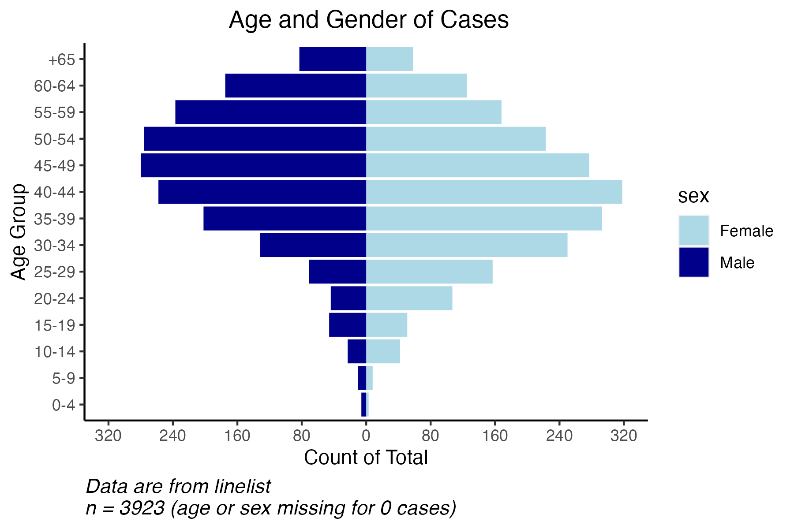
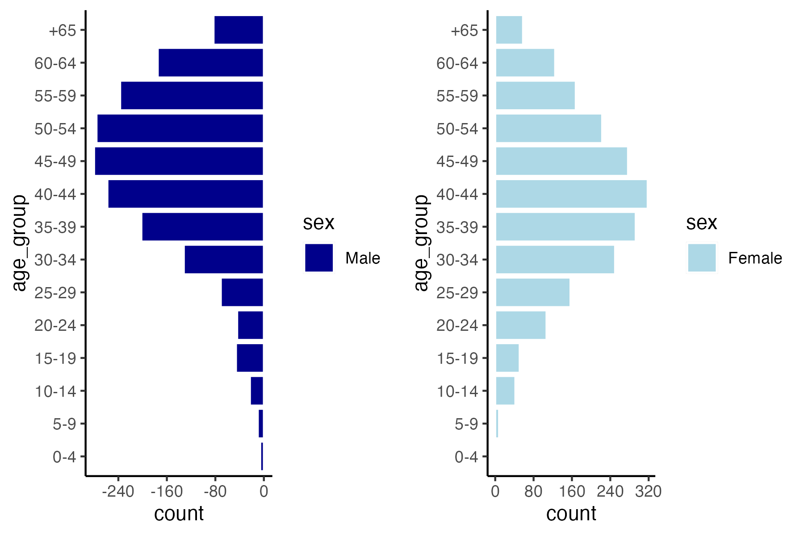
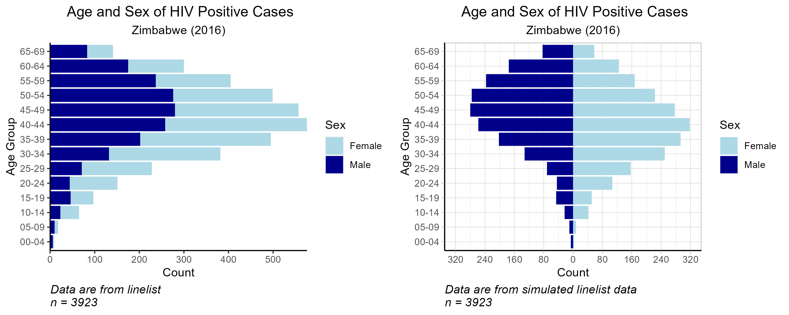
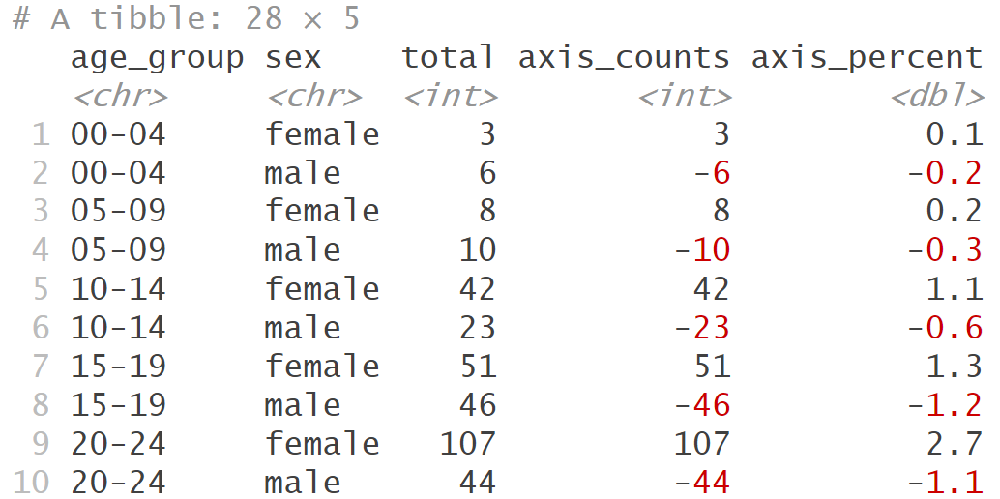
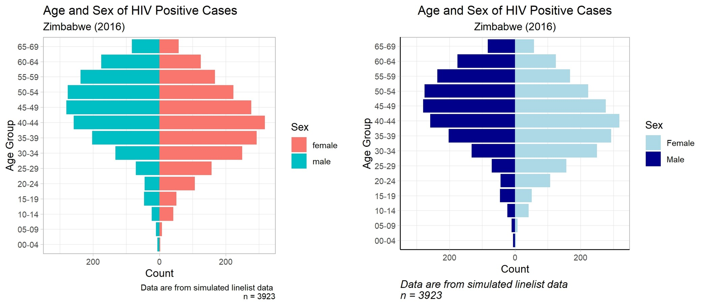

```{r, echo = F, message = F, warning = F}
knitr::opts_chunk$set(class.source = "tgc-code-block")
# Load packages 
if(!require(pacman)) install.packages("pacman")
pacman::p_load(tidyverse, knitr, here, reactable)

# Source functions 
source(here::here("global/functions/lesson_functions.R"))

# knitr settings
knitr::opts_chunk$set(warning = F, message = F, class.source = "tgc-code-block", error = T)


```


# Pyramides démographiques pour l'analyse épidémiologique

## Introduction

Une pyramide démographique, également connue sous le nom de pyramide de population ou pyramide âge-sexe, aide à visualiser la répartition d'une population selon deux variables démographiques importantes : **l'âge** et **le sexe**.

Aujourd'hui, vous allez apprendre l'importance d'utiliser des pyramides démographiques pour aider à visualiser la répartition d'une maladie par âge et sexe et comment en créer une en utilisant `{ggplot2}`.

Allons-y !

## Objectifs d'apprentissage

1. Expliquer **l'importance des pyramides démographiques** pour communiquer sur les **modèles spécifiques à l'âge et au sexe** de la distribution des maladies.

2. Comprendre les **composants d'une pyramide démographique** et la conceptualiser comme une version modifiée d'un **diagramme à barres empilées**.

3. **Résumer et préparer les données** dans le format approprié pour le tracé avec **`{dplyr}`**.

4. Utiliser le code **`{ggplot2}`** pour **tracer une pyramide démographique en utilisant `geom_col()`**, montrant les totaux ou les pourcentages sur l'axe des abscisses.

5. **Personnaliser le tracé** en changeant le schéma de couleurs, les étiquettes et les axes.


## Introduction aux Pyramides Démographiques

‣ Les pyramides démographiques visualisent la **répartition de la population** par **âge** et **sexe**.

‣ Le tracé est **divisé au centre** entre les membres masculins et féminins de la population.

‣ Groupes d'âge sur l'axe des ordonnées et sexe sur l'axe des abscisses.

‣ Trois caractéristiques clés d'une pyramide démographique sont :

**1) Groupes d'âge** : La pyramide est divisée en barres horizontales, chacune représentant un groupe d'âge, souvent par tranches de cinq ans.

**2) Représentation du genre** : Le côté gauche de la pyramide représente généralement les hommes et le côté droit les femmes.

**3) Taille de la population** : La longueur des barres indique la taille de la population dans chaque groupe d'âge.

‣ **`{ggplot2}`** nous permet de créer ces tracés et de personnaliser leur apparence.

{width="320"}


## Utilisation des Pyramides Démographiques en Épidémiologie

‣ Les pyramides aident à comprendre la **vulnérabilité spécifique à l'âge et au sexe** aux maladies.

‣ L'incidence de la **tuberculose**, du **VIH** et du **paludisme** varie avec l'âge, le sexe et diffère selon les régions.

‣ Ces visualisations peuvent informer les **programmes de surveillance** sur les groupes d'âge ou de sexe à cibler.

‣ La **répartition démographique** aide également à l'**évaluation de la qualité des données** pour les systèmes de surveillance en comparant les données nationales avec des vérifications épidémiologiques mondiales pour la **cohérence externe**.

{width="219"}


## Conceptualisation des Pyramides Démographiques

{width="364"}

‣ Une **pyramide de population** est essentiellement deux graphiques à barres fusionnés sur l'axe des ordonnées.

{width="533"}

‣ Ci-dessous se trouve la moitié féminine de la pyramide, avec les axes inversés :

{width="329"}

‣ On peut aussi penser à une pyramide démographique comme une version modifiée d'un **diagramme à barres empilées**, avec les barres **centrées au point de division** entre les sections masculines et féminines.

{width="560"}

‣ Pour obtenir cet effet dans `geom_col()`, nous calculerons un **compte négatif** pour les hommes afin de tracer les barres sur le côté gauche de l'axe.

## Chargement des paquets

‣ Cela nécessite des paquets R pour la **manipulation de données

**, la **visualisation de données**, et les **chemins de fichiers relatifs**

```{r}
# Chargement des paquets
p_load(
  tidyverse,  # pour nettoyer, manipuler et tracer les données (inclut readr, dplyr et ggplot2)
  here,       # pour localiser les fichiers
  apyramid)   # paquet dédié à la création de pyramides d'âge
```

## Préparation des Données

### Introduction au Jeu de Données

‣ Nous utiliserons un **jeu de données simulé sur le VIH** de **cas listés** au Zimbabwe en 2016.

‣ Notre focus : variables **liées à l'âge** et au **sexe** pour une pyramide démographique.

{width="212"}

### Importation des Données

‣ Importons notre jeu de données dans RStudio et examinons les variables :

```{r}
# Importation du jeu de données depuis un fichier CSV
hiv_data <- read_csv(here("data/hiv_zw_linelist_2016.csv"))

# Affichage du dataframe
hiv_data
```

‣ Notre jeu de données comprend **28000 cas** répartis sur **3 colonnes** : `age_group`, `sex`, et `hiv_status`.

‣ Pour créer une pyramide démographique de la **prévalence du VIH**, nous filtrerons les données pour inclure uniquement les individus **positifs au VIH**.

```{r}
# Filtrer et sauvegarder comme nouveau jeu de données
hiv_cases <- hiv_data %>% 
  filter(hiv_status == "positive")

# Voir le jeu de données
hiv_cases
```


‣ Sous-ensemble filtré : **3923 lignes**, tous individus **positifs au VIH**.


### Inspection des Données

‣ Ensuite, nous examinerons un tableau récapitulatif pour `age_group` et `sex` afin de vérifier que nos données sont propres.

```{r}
# Résumer les données dans un tableau par groupe d'âge et sexe
hiv_cases %>% 
  count(age_group, sex)
```

‣ **Les groupes d'âge sont dans un ordre croissant** - cela est crucial pour tracer correctement la pyramide démographique.


## Création d'un Sous-ensemble de Données Agrégées


‣ Pour tracer une pyramide démographique, nous devons résumer les données de la liste linéaire en un **sous-ensemble de données agrégées**.


‣ Nous utiliserons les verbes de **`{dplyr}`** pour obtenir les cas totaux et les pourcentages agrégés par groupe d'âge et sexe.

{width="212"}

‣ Rappelez-vous : dans notre sous-ensemble, les totaux féminins seront positifs et les totaux masculins négatifs pour être affichés de part et d'autre de l'axe.

{width="505"}

```{r}
# Créer un nouveau sous-ensemble
______________ <- 
  hiv_cases %>% 
  # Compter les cas totaux par groupe d'âge et genre
  group_by() %>%
  summarise() %>% 
  ungroup() %>%  
  # Créer de nouvelles colonnes pour les valeurs de l'axe des x sur le tracé
  mutate(
    # Nouvelle colonne avec les valeurs de l'axe - convertir les comptes masculins en négatif
    axis_counts = ifelse(sex == "male", ______, _____),
    # Nouvelle colonne pour les valeurs en pourcentage de l'axe
    axis_percent = round(100 * (axis_counts / sum(total)), digits = 1))
pyramid_data
```


‣ Maintenant que les données sont résumées et dans le **format approprié**, nous pouvons utiliser `pyramid_data` pour créer une pyramide de population avec `{ggplot2}` !

**Remarque**

Le paquet **`{apyramid}`** peut être un outil utile contenant une fonction `age_pyramid()`, qui permet la création rapide de pyramides de population :

```{r}
# Commencer avec la liste linéaire originale
hiv_cases %>% 
  # La variable du groupe d'âge doit être un facteur
  mutate(age_group = factor(age_group)) %>% 
  apyramid::age_pyramid(
    # Arguments requis :
    age_group = "age_group",
    split_by = "sex")
```


## Pratique

**Question d'entraînement**

Testez votre compréhension avec les questions à choix multiples suivantes :

**Lors de la création du tracé en barres pour les hommes, quelle modification est apportée aux valeurs d'occurrence ?**

1. Elles sont ajoutées aux valeurs de l'axe des x.
2. Elles sont multipliées par 2.
3. Elles sont divisées par 2.
4. Elles sont négativées (multipliées par -1).


## Création de Tracés avec `{ggplot2}`

‣ Rappelez-vous : une pyramide démographique est une version spéciale d'un **diagramme à barres empilées**.

‣ Pour créer un diagramme à barres empilées de base avec `geom_col()`, nous traçons une variable catégorielle (par exemple, `age_group`) contre une variable continue (par exemple, `total`), et définissons `fill` sur une deuxième variable catégorielle (par exemple, `sex`).

```{r}
# Diagramme à barres empilées de base : barres empilées les unes sur les autres
 
# Initialiser le tracé  
  ggplot() +
 
# Créer un graphique à barres en utilisant geom_col()
  ________(data = ____________,   # spécifier le jeu de données pour le tracé
           aes(x = _________,     # indiquer la variable catégorielle x
               y = _____,         # indiquer la variable continue y
               fill = ___))  +    # remplir par la

 deuxième variable catégorielle
# Modifier le thème
  theme_light()
```

‣ Notez que nous avons utilisé la variable **`total`** pour ce tracé où les comptes masculins ne sont **pas** négatifs.


### Utilisation de `geom_col()` pour les pyramides démographiques

‣ Nous pouvons développer le code de base de barres empilées pour créer une pyramide démographique

‣ Cette fois, nous utilisons `axis_counts` pour l'axe des ordonnées, avec des comptes masculins négatifs

```{r}
demo_pyramid <- 
  ggplot() +
  geom_col(data = pyramid_data, 
           aes(x = age_group,
               y = ____________, # indiquer la variable y spéciale
               fill = sex)) +
  theme_light() + 
  
# Inverser les axes X et Y
  ____________

demo_pyramid
```

‣ Nous pouvons également utiliser des valeurs en pourcentage sur l'axe des ordonnées

```{r}
demo_pyramid_percent <- 
  ggplot() +
  geom_col(data = pyramid_data, 
           aes(x = age_group,
               y = ____________, # indiquer la variable y spéciale
               fill = sex)) +
  theme_light() + 
  coord_flip()

demo_pyramid_percent
```

## Pratique 

**Questions d'entraînement**

‣ Quel type de variables doit être utilisé dans `geom_col()` et, en général, dans les tracés à barres ?

A) Variables continues
B) Variables catégorielles
C) Variables binaires
D) Variables ordinales

‣ Quelle fonction `{ggplot2}` inverse les axes d'un tracé ?

A) `coord_flip()`
B) `x_y_flip()`
C) `geom_flip()`
D) N'importe laquelle des précédentes


## Pratique

**Question de Pratique de Codage**

Commencez par charger le jeu de données préparé avec la population du Zimbabwe, agrégée par âge et sexe :

```{r}
zw_2016 <- readRDS(here::here("data/population_zw_2016.rds"))

zw_2016
```

‣ Créez une pyramide démographique avec le jeu de données `zw_2016`.

```{r}
# Remplissez les blancs avec les noms de variables et les valeurs correctes :
Q4_pyramid_zw_2016 <- 
  ggplot() +
  geom_col(data = ____________,
           aes(x = ____________,
               y = ____________,
               fill = ____________),
           color = "white") +
  coord_flip()
```
:::


## Personnalisation du graphique 

‣ Notre graphique actuel ressemble à ceci :

{width="427"}

‣ Ensuite, nous redimensionnerons l'axe des x pour une meilleure visualisation, ajouterons des étiquettes informatives et modifierons l'aspect général.

## Ajustements des Axes

‣ Le graphique actuel montre une plage d'**axes asymétriques** en raison de différences dans les nombres de cas entre les sexes.

‣ Nous commencerons par redimensionner l'**axe y** pour assurer la **symétrie** dans la pyramide démographique.

‣ Tout d'abord, nous identifions la valeur **maximale** à partir de nos `pyramid_data`.

```{r}
# Enregistrer le nombre maximum comme un objet
max_count <- _____________(pyramid_data$counts)
```

‣ Notre objectif est un axe y qui est **symétrique autour de zéro**.

‣ Nous utiliserons les **valeurs absolues du nombre maximum** pour définir les limites de l'axe y.

```{r}
# Ajouter une couche au graphique précédent
custom_axes <- demo_pyramid +
  # Fonction d'échelle pour l'axe y (nombre total)
  scale_y_continuous(
    # Spécifier les limites supérieure et inférieure de l'axe y de la même ampleur, pour la symétrie
    limits = c(-__________, __________),
    # Rendre les étiquettes d'axe absolues pour que les étiquettes masculines apparaissent positives
    labels = ___)

custom_axes
```

‣ Des limites d'axe égales des deux côtés garantissent une comparaison visuelle symétrique et précise.

‣ Les étiquettes d'axe sont transformées en leur valeur absolue avec `labels = abs`, de sorte que les nombres de cas masculins n'apparaissent plus comme des nombres négatifs.

## Ajouter des étiquettes personnalisées

‣ Ajouter un titre informatif, des étiquettes d'axes et une légende

```{r}
custom_labels <- 
  # Commencer avec la pyramide démographique précédente
  custom_axes +
  # La fonction labs contrôle le texte des étiquettes
  labs(
    title = "________",
    x = "________",
    y = "________",
    caption = "Les données proviennent de la liste de lignes \nn = ________")

custom_labels
```

## Améliorer le Schéma de Couleurs et les Thèmes

‣ Appliquons quelques ajustements de style à notre pyramide démographique.

```{r}
custom_color_theme <- 
# Construire sur le graphique précédent
  custom_axes +
# Spécifier manuellement des couleurs personnalisées pour chaque sexe
  scale_fill_manual(values = c("female" = "__________",
                               "male" = "__________"),
                    # Mettre en majuscule les étiquettes de légende
                    labels = c("____________", "____________")) +
  # Affiner les éléments du thème pour un aspect plus net
  theme(axis.line = element_line(colour = "_____"), # rendre les lignes d'axe noires
        # Centrer le titre et le sous-titre
        plot.title = element_text(hjust = 0.5),
        plot.subtitle = element_text(hjust = 0.5),
        # Formater le texte de la légende
        plot.caption = element_text(hjust = 0,            # aligner à gauche
                                    size = 11,            # augmenter la taille de la police
                                    face = "__________")) # italiciser le texte
custom_color_theme
```

‣ Examinons les modifications que nous venons de faire.




‣ Les pyramides démographiques sont des **outils essentiels** pour visualiser la distribution des maladies par **âge et sexe**.

‣ Les techniques utilisées ici peuvent être étendues à d'autres graphiques avec des valeurs **négatives et positives**.

‣ Vous pouvez maintenant utiliser ces concepts pour visualiser les **cas par rapport aux populations de base** ou l'**impact des interventions de santé**.

‣ Cette connaissance est inestimable pour l'**analyse épidémiologique** et la production de rapports.

‣ **Félicitations** pour avoir terminé cette leçon !
Vos nouvelles compétences sont prêtes pour une application dans le monde réel.

## Résultats d'apprentissage

Vous devriez maintenant être capable de :

1. Expliquer **l'importance des pyramides démographiques** pour communiquer les **modèles spécifiques à l'âge et au sexe** de la distribution des maladies.

2. Comprendre les **composants d'une pyramide démographique** et la conceptualiser comme une version modifiée d'un **graphique à barres empilées**.

3. **Résumer et préparer les données** dans le format approprié pour les représenter avec les fonctions **`{dplyr}`**.

4. Utiliser le code **`{ggplot2}`** pour **tracer une pyramide démographique en utilisant `geom_col()`**, affichant les totaux ou les pourcentages sur l'axe des x.

5. Vous pouvez **personnaliser le graphique** en changeant le schéma de couleurs, les étiquettes et les axes.
