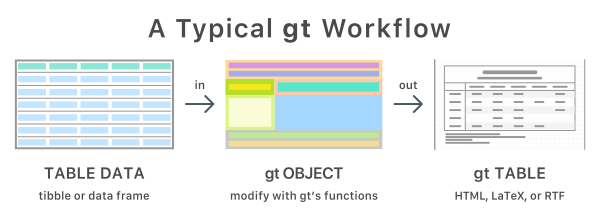

```{r setup, include=FALSE}
knitr::opts_chunk$set(echo = TRUE, class.source = "tgc-code-block")

if(!require(pacman)) install.packages("pacman")

# functions
source(here::here("global/functions/lesson_functions.R"))
```

# Introduction

Les tables sont un outil puissant pour visualiser les données de manière claire et concise. Avec R et le package gt, nous pouvons exploiter l'attrait visuel des tables pour communiquer efficacement des informations clés. Dans cette leçon, nous apprendrons comment construire des tables esthétiquement agréables et personnalisables qui soutiennent les objectifs d'analyse de données.

# Objectifs d'apprentissage {.unlisted .unnumbered}

-   Utiliser la fonction `gt()` pour créer des tables basiques

-   Regrouper les colonnes sous des en-têtes spanner

-   Renommer les noms des colonnes

-   Ajouter des lignes récapitulatives pour les groupes

À la fin, vous serez capable de générer des tables polies et reproductibles comme celle-ci :

{width="577"}

# Packages

Nous utiliserons ces packages :

-   `{gt}` pour créer des tables
-   `{tidyverse}` pour la manipulation des données
-   `{here}` pour les chemins de fichiers

```{r}
# Charger les packages
pacman::p_load(tidyverse, gt, here)
```

# Présentation du jeu de données

Nos données proviennent du \*\* Programme VIH du Malawi \*\* et couvrent les soins prénataux et le traitement du VIH en 2019. Nous nous concentrerons sur les agrégats régionaux et au niveau des installations par trimestre (disponibles [ici](https://dms.hiv.health.gov.mw/dataset/?tags=HIV&res_format=XLSX&year=2019)).

```{r message=FALSE}
# Importer les données
hiv_malawi <- read_csv(here::here("data/clean/hiv_malawi.csv"))
```

Explorons les variables :

```{r}
# Les 6 premières lignes
head(hiv_malawi)
```

```{r}
# Les noms et les types de variables
glimpse(hiv_malawi)
```

Les données couvrent les régions géographiques, les établissements de santé, les périodes de temps, les données démographiques des patients, les résultats des tests, les thérapies préventives, les médicaments antirétroviraux, et plus encore. Plus d'informations sur le jeu de données sont dans la section des annexes.

Les variables clés que nous examinerons sont :

1.  `previous_negative`: Le nombre de patients qui ont visité l'établissement de santé au cours de ce trimestre et qui avaient auparavant des tests VIH négatifs.

2.  `previous_positive`: Le nombre de patients (comme ci-dessus) avec des tests VIH positifs précédents.

3.  `new_negative`: Le nombre de patients testant nouvellement négatif pour le VIH.

4.  `new_positive`: Le nombre de patients testant nouvellement positif pour le VIH.

Dans cette leçon, nous allons agréger les données par trimestre et résumer les changements dans les résultats des tests VIH.

# Création de tables simples avec `{gt}`

La flexibilité, l'efficacité et la puissance de `{gt}` en font un package redoutable pour la création de tables dans R. Nous explorerons certaines de ses principales caractéristiques dans cette leçon.

::: key-point


Le package `{gt}` contient un ensemble de fonctions qui prennent des données brutes en entrée et produisent une table joliment formatée pour une analyse et un rapport ultérieurs.
:::

Pour utiliser efficacement le package `{gt}`, nous devons d'abord transformer nos données dans un format résumé approprié.

Dans le bloc de code ci-dessous, nous utilisons les fonctions de {dplyr} pour résumer les tests de VIH dans certains centres de dépistage du Malawi par trimestre. Nous regroupons d'abord les données par période, puis nous additionnons les cas sur plusieurs variables en utilisant `across()` :

```{r}
# Variables à résumer
cols <- c("new_positive", "previous_positive", "new_negative", "previous_negative")

# Créer un résumé par trimestre
hiv_malawi_summary <- hiv_malawi %>%  
  group_by(period) %>%
  summarize(
    across(all_of(cols), sum) # Résumer toutes les colonnes
  )

hiv_malawi_summary
```

Ceci agrège les données de manière appropriée pour les passer à `{gt}` afin de générer un tableau résumé propre.

Pour créer une table simple à partir des données agrégées, nous pouvons ensuite appeler la fonction `gt()` :

```{r}
hiv_malawi_summary %>%  
  gt() 
```

Comme vous pouvez le voir, le formatage de table par défaut est assez simple et non raffiné. Cependant, `{gt}` offre de nombreuses options pour personnaliser et embellir la sortie de table. Nous approfondirons ces aspects dans la prochaine section.

Voici la traduction en français du fragment de tutoriel Rmd, en gardant la syntaxe Rmd et le code valide :

# Personnalisation des tableaux `{gt}`

Le package {gt} permet une personnalisation complète des tableaux grâce à son cadre de « grammaire des tableaux ». C'est similaire à la façon dont la grammaire graphique de {ggplot2} fonctionne pour les graphiques.

Pour tirer pleinement parti de `{gt}`, il est utile de comprendre certains éléments clés de sa grammaire.


Comme on le voit dans la figure du site du package, les principaux composants d'un tableau `{gt}` sont :

-   **En-tête du tableau**: Contient un titre et un sous-titre facultatifs

-   **Colonne d'étiquette**: Étiquettes de lignes qui identifient chaque ligne

-   **En-tête de colonne d'étiquette**: Regroupement et étiquettes facultatifs pour les lignes de colonne d'étiquette

-   **Étiquettes de colonne**: En-têtes pour chaque colonne

-   **Corps du tableau**: Les principales cellules de données du tableau

-   **Pied de tableau**: Notes de bas de page et notes de source facultatives

Comprendre cette anatomie nous permet de construire systématiquement des tableaux `{gt}` en utilisant sa grammaire.

## En-tête et pied de tableau

Le tableau de base que nous avions peut maintenant être mis à jour avec plus de composants.

Les tableaux deviennent plus informatifs et professionnels avec l'ajout d'en-têtes, de notes de source et de notes de bas de page. Nous pouvons facilement améliorer le tableau de base d'avant en ajoutant ces éléments à l'aide des fonctions `{gt}`.

Pour créer un en-tête, nous utilisons `tab_header()` et spécifions un `title` et `subtitle`. Cela donne au lecteur le contexte de ce que montre le tableau.

```{r}
hiv_malawi_summary %>%
  gt() %>%
  tab_header(
    title = "Dépistage du VIH au Malawi",
    subtitle = "T1 à T4 2019"
  )
```

Nous pouvons ajouter un pied de page avec la fonction `tab_source_note()` pour citer la provenance des données :

```{r}
hiv_malawi_summary %>%
  gt() %>%
  tab_header(
    title = "Dépistage du VIH au Malawi",
    subtitle = "T1 à T4 2019"
  ) %>%
  tab_source_note("Source : Programme VIH du Malawi")
```

Les notes de bas de page sont utiles pour fournir des détails supplémentaires sur certains points de données ou étiquettes. La fonction `tab_footnote()` attache les notes de bas de page aux cellules de tableau indiquées. Par exemple, nous pouvons annoter les colonnes de diagnostic :

```{r}
hiv_malawi_summary %>%
  gt() %>%
  tab_header(
    title = "Dépistage du VIH au Malawi",
    subtitle = "T1 à T2 2019"
  ) %>%
  tab_source_note("Source : Programme VIH du Malawi") %>%
  tab_footnote(
    footnote = "Nouveau diagnostic",
    locations = cells_column_labels(columns = c(new_positive, new_negative))
  )
```

Ces petits ajouts améliorent grandement l'apparence professionnelle et informative des tableaux.

## Stub

Le stub est la section gauche d'un tableau contenant les étiquettes de ligne. Elles fournissent un contexte pour les données de chaque ligne.

::: reminder
Cette image montre le composant stub d'un tableau `{gt}`, marqué par un carré rouge. 
:::

Dans notre tableau de cas de VIH, la colonne `period` contient les étiquettes de ligne que nous voulons utiliser. Pour générer un stub, nous spécifions cette colonne dans `gt()` en utilisant l'argument `rowname_col`:

```{r}
hiv_malawi_summary %>%
  gt(rowname_col = "period") %>%
  tab_header(
    title = "Dépistage du VIH au Malawi",
    subtitle = "T1 à T2 2019"  
  ) %>%
  tab_source_note("Source: Programme VIH du Malawi")
```

Notez que le nom de la colonne passé à `rowname_col` doit être entre guillemets.

Pour plus de commodité, sauvegardons le tableau dans une variable `t1`:

```{r}
t1 <- hiv_malawi_summary %>%
  gt(rowname_col = "period") %>%
  tab_header(
    title = "Dépistage du VIH au Malawi",
    subtitle = "T1 à T2 2019"
  ) %>% 
  tab_source_note("Source: Programme VIH du Malawi")

t1
```

## Colonnes Spanner & sous-colonnes

Pour mieux structurer notre tableau, nous pouvons regrouper des colonnes liées sous des "spanners". Les spanners sont des titres qui couvrent plusieurs colonnes, fournissant une organisation catégorielle de niveau supérieur. Nous pouvons le faire avec la fonction `tab_spanner()`.

Créons deux colonnes spanner pour les tests nouveaux et précédents. Nous commencerons par le spanner "Nouveaux tests" afin que vous puissiez observer la syntaxe :

```{r}
t1 %>%  
  tab_spanner(
    label = "Nouveaux tests",
    columns = starts_with("new") # sélectionne les colonnes commençant par "new"
  )
```

L'argument `columns` nous permet de sélectionner les colonnes pertinentes, et l'argument `label` prend en entrée l'étiquette du spanner.

Ajoutons maintenant les deux spanners :

```{r}
# Enregistre le tableau dans t2 pour un accès facile  
t2 <- t1 %>%  
  # Premier spanner pour "Nouveaux tests"   
  tab_spanner(
    label = "Nouveaux tests",
    columns = starts_with("new") 
  ) %>%
  # Second spanner pour "Tests précédents"
  tab_spanner(
    label = "Tests précédents",
    columns = starts_with("prev")
  )

t2 
```

Notez que la fonction `tab_spanner` a automatiquement réarrangé les colonnes de manière appropriée.

::: practice
**Question 1 : Le but des Spanners**

Quel est le but de l'utilisation de "colonnes spanner" dans un tableau **`gt`** ?

A. Appliquer des styles CSS personnalisés à des colonnes spécifiques.

B. Créer des colonnes de groupe et augmenter la lisibilité.

C. Formater la taille de la police de toutes les colonnes de manière uniforme.

D. Trier les données par ordre croissant.

**Question 2 : Création de Spanners**

En utilisant le cadre de données **`hiv_malawi`**, créez un tableau **`gt`** qui affiche un résumé de la **`somme`** des cas "nouveaux_positifs" et "précédents_positifs" pour chaque région. Créez des en-têtes spanner pour étiqueter ces deux colonnes de résumé. Pour y parvenir, remplissez les parties manquantes du code ci-dessous :

```{r eval=FALSE, echo=TRUE}

region_summary <- hiv_malawi %>%
  group_by(region) %>%
  summarize(
    _________(
      c(nouveaux_positifs, précédents_positifs),
      ______
    )
  )

# Créer un tableau gt avec des en-têtes spanner
summary_table_spanners <- region_summary %>%
  _____________ %>%
  ___________(
    label = "Cas positifs",
    ________ = c(nouveaux_positifs, précédents_positifs)
  )
```
:::

# Renommage des colonnes du tableau

Les noms des colonnes contiennent actuellement des préfixes inutiles comme "new\_" et "previous\_". Pour une meilleure lisibilité, nous pouvons les renommer en utilisant `cols_label()`.

`cols_label()` prend un ensemble d'anciens noms à apparier (du côté gauche d'une tilde, `~`) et de nouveaux noms pour les remplacer (du côté droit de la tilde). Nous pouvons utiliser `contains()` pour sélectionner des colonnes avec "positive" ou "negative" :

```{r}
t3 <- t2 %>%
  cols_label(
    contains("positive") ~ "Positive", 
    contains("negative") ~ "Negative"
  )

t3
```

Ceci renomme les colonnes d'une manière plus propre.

`cols_label()` accepte plusieurs aides à la sélection de colonnes comme `contains()`, `starts_with()`, `ends_with()` etc. Celles-ci proviennent du package tidyselect et offrent une flexibilité dans le renommage.

```{r message=FALSE, warning=FALSE, include=FALSE, eval=FALSE}
t3 %>% write_rds("data/clean/malawi_hiv_summary_t3.rds")
```

::: pro-tip
`cols_label()` a d'autres fonctions d'identification comme `contains()` qui fonctionnent de manière similaire et sont identiques aux aides de [`tidyselect`](https://tidyselect.r-lib.org/reference/starts_with.html), celles-ci incluent également :

-   `starts_with()`: Commence par un préfixe exact.

-   `ends_with()`: Se termine par un suffixe exact.

-   `contains()`: Contient une chaîne de caractères littérale.

-   `matches()`: Correspond à une expression régulière.

-   `num_range()`: Correspond à une plage numérique comme x01, x02, x03.

Ces aides sont utiles, en particulier dans le cas de la sélection de plusieurs colonnes.
:::

Pour en savoir plus sur la fonction `cols_label()`, vous pouvez consulter ici : <https://gt.rstudio.com/reference/cols_label.html>

::: practice
**Question 3 : étiquettes de colonnes**

Quelle fonction est utilisée pour changer les étiquettes ou les noms des colonnes dans un tableau **`gt`** ?

```         
A. `tab_header()`

B. `tab_style()`

C. `tab_options()`

D. `tab_relabel()`
```
:::

# Lignes de résumé

Prenons les mêmes données avec lesquelles nous avons commencé au début de cette leçon et, au lieu de regrouper uniquement par période (trimestres), regroupons à la fois par période et par région. Nous faisons cela pour illustrer la puissance des fonctionnalités de résumé dans `gt` : les tableaux récapitulatifs.

::: reminder
**Rappel {gt} - Lignes de résumé** Cette image montre le composant des lignes de résumé d'un tableau `{gt}`, clairement indiqué dans un carré rouge. Les lignes de résumé fournissent des données agrégées ou des résumés statistiques des données contenues dans les colonnes correspondantes. 
:::

Tout d'abord, recréons les données :

```{r}
summary_data_2 <- hiv_malawi %>% 
  group_by(
    # Notez l'ordre des variables par lesquelles nous regroupons.
    region,
    period
  ) %>% 
  summarise(
    across(all_of(cols), sum) 
    ) %>% 
  gt()

summary_data_2
```

::: watch-out
L'ordre dans la fonction `group_by()` affecte les groupes de lignes dans le tableau `gt`.
:::

Deuxièmement, réincorporons tous les changements que nous avons précédemment effectués dans ce tableau :

```{r}
# sauvegardant les progrès dans l'objet t4

t4 <- summary_data_2 %>% 
  tab_header(
    title = "Somme des tests VIH au Malawi",
    subtitle = "du T1 2019 au T4 2019"
  ) %>% 
  tab_source_note("Source des données : Programme VIH du Malawi") %>% tab_spanner(
    label = "Nouveaux tests",
    columns = starts_with("new") # sélectionne les colonnes commençant par "new"
  ) %>% 
   # création du premier spanner pour les tests précédents
  tab_spanner(
    label = "Tests précédents",
    columns = starts_with("prev") # sélectionne les colonnes commençant par "prev"
  ) %>% 
  cols_label(
    # localiser ### assigner 
    contains("positive") ~ "Positif",
    contains("negative") ~ "Négatif"
  )

t4
```

Maintenant, que faire si nous voulons visualiser sur le tableau un résumé de chaque variable pour chaque groupe de régions ? Plus précisément, nous voulons voir la somme et la moyenne pour les 4 colonnes que nous avons pour chaque région.

::: rappel
N'oubliez pas que nos 4 colonnes d'intérêt sont : "new_positive", "previous_positive", "new_negative", et "previous_negative". Nous n'avons changé les labels de ces colonnes que dans la table `gt` et non dans le jeu de données lui-même, nous pouvons donc utiliser les noms de ces colonnes pour indiquer à `gt` où appliquer la fonction de résumé. De plus, nous avons déjà stocké les noms de ces 4 colonnes dans l'objet `cols` donc nous allons l'utiliser à nouveau ici.
:::

Pour atteindre cet objectif, nous allons utiliser la fonction pratique `summary_rows` où nous fournissons explicitement les colonnes que nous voulons résumer, et les fonctions avec lesquelles nous voulons résumer, dans notre cas c'est `sum` et `mean`. Notez que nous assignons le nom de la nouvelle ligne (non citée) à un nom de fonction ("cité").

```{r}
t5 <- t4 %>% 
  summary_rows(
    columns = cols, #using columns = 3:6 also works 
    fns = list( 
      TOTAL = "sum",
      MOYENNE = "mean"
    )
  )

t5
```

```{r message=FALSE, warning=FALSE, include=FALSE, eval=FALSE}
# saving table for next lesson as rds object
t5 %>% write_rds("data/clean/malawi_hiv_summary_t5.rds")
t5 %>% gtsave("data/clean/malawi_hiv_summary_t5.png")
```

::: pratique
**Question 4 : lignes résumées**

Quelle est la bonne réponse (ou les bonnes réponses) si vous deviez résumer l'écart type des lignes des colonnes "new_positive" et "previous_negative" uniquement?

**A.** Utilisez **`summary_rows()`** avec l'argument **`columns`** défini sur "new_positive" et "previous_negative" et l'argument **`fns`** défini sur "sd".

```{r eval=FALSE, echo=TRUE}
# Option A 
your_data %>%   
  summary_rows(
    columns = c("new_positive", "previous_negative"),     
    fns = "sd" 
  )
```

**B.** Utilisez **`summary_rows()`** avec l'argument **`columns`** défini sur "new_positive" et "previous_negative" et l'argument **`fns`** défini sur "summarize(sd)".

```{r eval=FALSE, echo=TRUE}
# Option B 
your_data %>%   
  summary_rows(
    columns = c("new_positive", "previous_negative"),     
    fns = summarize(sd) 
  )
```

**C.** Utilisez **`summary_rows()`** avec l'argument **`columns`** défini sur "new_positive" et "previous_negative" et l'argument **`fns`** défini sur **`list(ECART_TYPE = "sd")`**.

```{r eval=FALSE, echo=TRUE}
# Option C 
your_data %>%   
  summary_rows(
    columns = c("new_positive", "previous_negative"),     
    fns = list(ECART_TYPE = "sd")   
  )
```

**D.** Utilisez **`summary_rows()`** avec l'argument **`columns`** défini sur "new_positive" et "previous_negative" et l'argument **`fns`** défini sur "standard_deviation".

```{r eval=FALSE, echo=TRUE}
# Option D
your_data %>%
  summary_rows(
    columns = c("new_positive", "previous_negative"),
    fns = "standard_deviation"
  )
```
:::

# Conclusion

Dans la leçon d'aujourd'hui, nous nous sommes attaqués aux tables de données dans R en utilisant `gt`. Nous avons commencé par définir des objectifs clairs, présenté les packages que nous utiliserons et découvert notre jeu de données. Ensuite, nous avons mis la main à la pâte en créant des tables simples. Nous avons appris à organiser nos données proprement en utilisant des colonnes spanner et en ajustant les étiquettes des colonnes pour rendre les choses parfaitement claires et cohérentes. Nous avons ensuite conclu avec quelques résumés de table astucieux. Ce sont les bases de la création de tables dans R et `gt`, et elles seront très utiles à mesure que nous poursuivrons notre voyage pour créer des tableaux engageants et informatifs dans R.

# Corrigé {.unlisted .unnumbered}

1.  B

2.  

```{r eval=FALSE, echo=TRUE}
# Les solutions sont où les lignes sont numérotées

# résumer les données d'abord
district_summary <- hiv_malawi %>%
  group_by(region) %>%
  summarize(
    across(  #1
      c(new_positive, previous_positive),
      sum #2
    )
  )

# Créer une table gt avec des en-têtes spanner
summary_table_spanners <- district_summary %>%
  gt() %>% #3
  tab_spanner( #4
    label = "Cas positifs",
    columns = c(new_positive, previous_positive) #5
  )
  
```

3.  D

4.  C

# Contributeurs {.unlisted .unnumbered}

Les membres de l'équipe suivants ont contribué à cette leçon :

`r .tgc_contributors_list(ids = c("benn","joy", "guy"))`

# Références {.unlisted .unnumbered}

1.  Tom Mock, "The Definite Cookbook of {gt}" (2021), The Mockup Blog, <https://themockup.blog/static/resources/gt-cookbook.html#introduction>.

2.  Tom Mock, "The Grammar of Tables" (May 16, 2020), The Mockup Blog, <https://themockup.blog/posts/2020-05-16-gt-a-grammar-of-tables/#add-titles>.

3.  RStudio, "Introduction to Creating gt Tables," Official {gt} Documentation, <https://gt.rstudio.com/articles/intro-creating-gt-tables.html>.

4.  Fleming, Jessica A., Alister Munthali, Bagrey Ngwira, John Kadzandira, Monica Jamili-Phiri, Justin R. Ortiz, Philipp Lambach, et al. 2019. "Maternal Immunization in Malawi: A Mixed Methods Study of Community Perceptions, Programmatic Considerations, and Recommendations for Future Planning." *Vaccine* 37 (32): 4568--75. <https://doi.org/10.1016/j.vaccine.2019.06.020>.

`r .tgc_license()`
