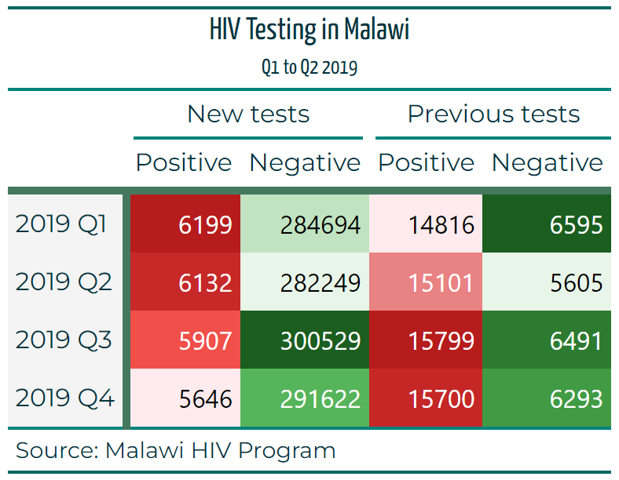

```{r setup, include=FALSE}
knitr::opts_chunk$set(echo = TRUE, class.source = "tgc-code-block")

if(!require(pacman)) install.packages("pacman")

# functions
source(here::here("global/functions/lesson_functions.R"))

# default render
registerS3method(".reactable_5_rows", "data.frame", .reactable_5_rows)
```

# Introduction {.unnumbered}

La leçon précédente sur `{gt}` se concentrait principalement sur les composants de la table, sa structure et comment la manipuler correctement. Cette leçon, qui présente la deuxième partie de la série `{gt}`, se focalisera sur l'utilisation du package pour peaufiner, styliser et personnaliser les effets visuels des tables d'une manière qui améliore la qualité et l'efficacité de vos rapports.

Allons-y.

------------------------------------------------------------------------

# Objectifs d'apprentissage {.unnumbered}

1.  **Utilisation de Thèmes Prédéfinis avec la Fonction `opt_stylize`**: Comprendre comment appliquer des styles et des thèmes de couleurs prédéfinis aux tableaux en utilisant la fonction `opt_stylize`. Explorer diverses options de style, y compris le choix du numéro de style et de la couleur, pour renforcer l'attrait visuel des tableaux

2.  **Formatage des Valeurs dans le tableau avec la Fonction `data_color`**: Apprendre à distinguer visuellement les valeurs dans des colonnes spécifiques en utilisant la fonction `data_color`. Cette technique est utile dans les grands tableaux pour mettre en évidence les données importantes.

3.  **Formatage Conditionnel Utilisant la Fonction `tab_style`**: Maîtriser le concept de formatage conditionnel dans les tableaux. Apprendre à appliquer des styles aux cellules en fonction de leurs valeurs lorsqu'elles atteignent un certain seuil.

4.  **Amélioration du Texte du tableau avec des Polices et des Couleurs**: Explorer la personnalisation du texte du tableau en utilisant la fonction `gt::tab_style()`. Apprendre à appliquer différentes polices et couleurs aux titres des tableaux, sous-titres et autres éléments textuels pour une présentation plus attrayante visuellement.

5.  **Ajout de Bordures avec les Fonctions `tab_style` et `cell_borders`**: Acquérir des compétences dans le tracé de bordures dans les tableaux pour souligner des zones spécifiques. Comprendre comment utiliser `tab_style` en conjonction avec `cell_borders` pour ajouter des lignes verticales et horizontales de différentes couleurs et épaisseurs.

À la fin de cette leçon, vous aurez les compétences pour styliser artistiquement vos tableaux **`{gt}`** selon vos préférences spécifiques, atteignant un niveau de détail similaire à ceci :


{width="482"}

# Packages

Dans cette leçon, nous utiliserons les packages suivants :

-   `{gt}` : pour créer nos tableaux.

-   `{dplyr}`, `{tidyr}` et `{purrr}` : pour manipuler les données et automatiser les fonctions.

-   `{janitor}` : pour un nettoyage rapide des noms de données.

-   `{Paletteer}`, `{ggsci}` : pour appeler des palettes prédéfinies.

```{r}
pacman::p_load(tidyverse, janitor, gt, here)
```

------------------------------------------------------------------------

# Précédemment dans la partie 1

::: recap
Dans la leçon précédente sur `{gt}`, nous avons eu l'opportunité de :

-   Découvrir les données de prévalence du VIH au Malawi.

-   Découvrir la grammaire des tableaux et le package `{gt}`.

-   Créer un tableau simple.

-   Ajouter des détails comme un titre et une note de bas de page au tableau.

-   Regrouper des colonnes dans des en-têtes de groupe.

-   Créer des lignes récapitulatives.

{width="455"}

# Le jeu de données

Dans cette leçon, nous utiliserons les mêmes données que dans la leçon précédente. Vous pouvez revenir en arrière pour une description détaillée des données et du processus de préparation que nous avons effectué.

::: recap
Voici les détails complets des colonnes que nous utiliserons :

-   `region` : La région géographique ou la zone où les données ont été collectées ou sont analysées.

-   `period` : Une période spécifique associée aux données, souvent utilisée pour l'analyse temporelle.

-   `previous_negative` : Le nombre d'individus avec un résultat de test négatif précédent.

-   `previous_positive` : Le nombre d'individus avec un résultat de test positif précédent.

-   `new_negative` : Le nombre de nouveaux cas diagnostiqués avec un résultat négatif.

-   `new_positive` : Le nombre de nouveaux cas diagnostiqués avec un résultat positif.
:::

Mais pour les besoins de cette leçon, nous utiliserons directement les tableaux, ceci est le tableau que nous avons créé avec les bons en-têtes de colonnes et étiquettes, nous baserons le reste de notre leçon sur celui-ci en particulier.

```{r}
hiv_malawi_summary <- read_rds(here::here("data/clean/malawi_hiv_summary_l2_t11.rds"))

hiv_malawi_summary
```

------------------------------------------------------------------------

# Thèmes

Puisque l'objectif de cette leçon est principalement le style, commençons par utiliser un thème prédéfini pour ajouter plus de visuels et de couleurs au tableau et à ses composants. Pour ce faire, nous utilisons la fonction `opt_stylize`. La fonction contient plusieurs styles prédéfinis et peut également accepter une couleur. Dans notre cas, nous avons choisi d'aller avec le style numéro 6 et la couleur 'gris', mais vous pouvez régler ces arguments selon vos préférences.

```{r}
t1 <- hiv_malawi_summary %>% 
  opt_stylize(
    style = 1, 
    color = 'cyan'
  ) %>% 
  tab_options(
    stub.background.color = '#F4F4F4',
  )

t1
```

::: challenge
Pour des thèmes et un style plus sophistiqués, vous pouvez vous référer à la fonction `tab_options` (documentation [ici](https://gt.rstudio.com/reference/tab_options.html?q=tab%20options#null)) qui est essentiellement l'équivalent de la fonction `theme` dans `ggplot2`. Cette fonction contient des arguments et des options sur chaque couche et composant du tableau. Pour les besoins de cette leçon, nous n'irons pas plus loin dans ce domaine.
:::

------------------------------------------------------------------------

# Formatage des valeurs dans le tableau

Ne serait-il pas utile de visualiser en couleurs la différence entre les valeurs dans une colonne spécifique ? Dans de nombreux rapports, ce genre de tableaux est très utile, surtout si le nombre de lignes est assez grand. Faisons cela pour notre tableau de sorte que la colonne `new_positive` soit formatée en rouge.

Nous pouvons le faire au moyen de la fonction `data_color` pour laquelle nous devons spécifier deux arguments, `columns` (c'est-à-dire dans quelle colonne ce style sera appliqué ?) et `palette` comme la palette de couleurs que nous avons l'intention d'utiliser.

```{r}
t2 <- t1 %>% 
  data_color(
    columns = new_positive, # la colonne ou les colonnes comme nous le verrons plus tard
    palette = "ggsci::red_material" # la palette du package ggsci.
  )

t2
```

::: side-note
`ggsci::red_material` n'est pas la seule palette que nous pouvons utiliser, en fait, il y a des centaines de palettes conçues pour être utilisées dans R. Vous pouvez en trouver beaucoup plus dans le package `paletteer` dans la documentation [ici](https://emilhvitfeldt.github.io/paletteer/#included-packages), ou dans la documentation officielle `data_color` [ici](https://gt.rstudio.com/reference/data_color.html?q=data_color#null).
:::

Nous pouvons également faire cela pour la colonne `previous_negative`. Nous pouvons utiliser un type différent de palette, j'utilise pour ce cas la palette verte du même package : [`ggsci::green_material`](https://github.com/nanxstats/ggsci), la palette que vous choisissez est une question de commodité et de goût personnel, vous pouvez en savoir plus à ce sujet si vous vous référez à la note latérale ci-dessus.

```{r}
t2 %>% 
  data_color(
    columns = previous_negative,
    palette = "ggsci::green_material"
  ) 
  
```

De même, nous pouvons également colorer plusieurs colonnes à la fois, par exemple nous pouvons styliser les colonnes avec des cas positifs en rouge et celles avec des cas négatifs en vert. Pour ce faire, nous devons écrire *deux* instructions `data_color`, une pour chaque style de couleur :

```{r}
t4 <- t1 %>% 

  data_color(
    columns = ends_with("positive"), # sélectionnant les colonnes se terminant par le mot positif
    palette = "ggsci::red_material" # palette rouge 
  ) %>% 
  data_color(
    columns = ends_with("negative"), # sélectionnant les colonnes se terminant par le mot négatif
    palette = "ggsci::green_material" # palette verte
  )


t4

```

::: reminder
Rappelez-vous que dans la leçon précédente nous avons utilisé les fonctions [`tidyselect`](https://tidyselect.r-lib.org/reference/starts_with.html) pour sélectionner les colonnes, dans le code ci-dessus nous avons utilisé la fonction `ends_with` pour sélectionner les colonnes se terminant soit par le mot 'négatif' soit par 'positif', ce qui est parfait pour l'objectif de notre tableau.

Encore une fois, les étiquettes des colonnes dans le tableau `{gt}` et les noms réels des colonnes dans le `data.frame` peuvent être différents, dans notre cas nous nous référons aux noms dans les données.
:::

------------------------------------------------------------------------

# Mise en forme conditionnelle

Nous pouvons également configurer la table pour changer conditionnellement le style d'une cellule en fonction de sa valeur. Dans notre cas, nous souhaitons mettre en évidence les valeurs de la colonne `previous_positive` selon un seuil (la valeur 15700). Les valeurs supérieures ou égales au seuil doivent être en vert.

Pour ce faire, nous utilisons la fonction `tab_style` où nous spécifions deux arguments :

- `style` : où nous spécifions la couleur dans la fonction `cell_text` puisque nous avons l'intention de manipuler le texte à l'intérieur des cellules.

- `location` : où nous spécifions les colonnes et les lignes de notre manipulation dans `cells_body` puisque ces cellules sont dans le corps principal du tableau.

Utilisons le tableau t2 comme exemple :

```{r}
t5 <- t2 %>% 
  tab_style(
    style = cell_text(
      color = "red", 
    ),
    locations = cells_body(
      columns = previous_positive,
      rows = previous_positive >= 15700
    )
  )
t5  
```

::: attention
Dans le code ci-dessus, la condition sur laquelle le style sera appliqué est énoncée dans :

`locations = cells_body(columns = previous_positive, rows = previous_positive >= 15700 )`

Notez également que nous pouvons passer plus d'arguments à la fonction `cell_text`, tels que la taille et la police des cellules que nous avons l'intention de styler.
:::

Que faire si nous voulons avoir une condition à double sens sur le même seuil ? Peut-on avoir des cellules avec des valeurs supérieures ou égales au seuil stylisées en vert, et simultanément d'autres cellules avec des valeurs inférieures au seuil stylisées en... cyan ?

Nous le pouvons absolument, nous avons déjà fait la première partie (dans le morceau de code précédent), nous devons juste ajouter une seconde condition de manière similaire mais dans une déclaration `tab_style` différente :

```{r}
t6 <- t5 %>% 
  tab_style(
    style = cell_text(
      color = 'cyan' 
    ),
    location = cells_body(
      columns = 'previous_positive',
      rows = previous_positive < 15700
    )
  )

t6

```

::: pratique
**Question 1 : Mise en forme conditionnelle** Pour mettre en évidence (en jaune) les lignes dans un tableau **`{gt}`** où la colonne "hiv_positive" dépasse 1 000, quel extrait de code R devriez-vous utiliser ?

A.

```{r eval=FALSE, echo=TRUE}
data %>% 
  gt() %>% 
  tab_style(
    style = cells_body(), 
    columns = "Sales", 
    conditions = style_number(Sales > 1000, background = "yellow")
  )
```

B.

```{r eval=FALSE, echo=TRUE}
data %>% 
  gt() %>% 
  tab_style(
    style = cells_data(columns = "Sales"), 
    conditions = style_number(Sales > 1000, background = "yellow") 
  )
```

C.

```{r eval=FALSE, echo=TRUE}
data %>% 
  gt() %>% 
  tab_style(
    style = cell_fill(
      color = "yellow"
    ), 
    locations = cells_body(
      columns = "hiv_positive",
      rows = hiv_positive > 1000
    ) 
  )
    
```

D.

```{r eval=FALSE, echo=TRUE}
 data %>% 
   gt() %>% 
   tab_style(
     style = cells_data(columns = "Sales"), 
     conditions = style_text(Sales > 1000, background = "yellow")
   )
```

**Question 2 : Coloration des cellules**

En utilisant le jeu de données **`hiv_malawi`**, créez un tableau **`{gt}`** qui affiche le total (**somme**) des cas "*`new_positive`*" pour chaque "*`region`*". Mettez en évidence les cellules avec des valeurs de plus de 50 cas en *rouge* et les cellules avec des valeurs inférieures ou égales à 50 en *vert*. Complétez les parties manquantes (\_\_\_\_\_\_\_\_) de ce code pour y parvenir.

```{r eval=FALSE, echo=TRUE}
# Calculez le résumé de total_new_pos```{r eval=FALSE, echo=TRUE}
# Calculez le résumé de total_new_pos
total_summary <- hiv_malawi %>%
  group_by(_________) %>%
  summarize(total_new_positive = __________)

# Créez un tableau gt et appliquez la coloration des cellules
summary_table <- total_summary %>%
  gt() %>%
  tab_style(
    style = cell_fill(color = "red"),
    locations = _________(
      columns = "new_positive",
      rows = _________________
    )
  ) %>%
  tab_style(
    style = ___________________,
    locations = cells_body(
      columns = "new_positive",
      _______ new_positive <= 50
    )
  )
```
:::

------------------------------------------------------------------------

# Polices et texte

Maintenant, nous allons améliorer l'attrait visuel du texte de notre tableau. Pour ce faire, nous utiliserons à nouveau la fonction `gt::tab_style()`.

Modifions la police et la couleur du titre et du sous-titre. Nous sélectionnerons la police `Yanone Kaffeesatz` de Google Fonts, une ressource offrant un vaste choix de polices qui peuvent ajouter une touche unique à votre tableau, au-delà des options standard d'Excel.

Pour appliquer ces changements, nous configurerons la fonction `gt::tab_style()` comme suit :

-   L'argument `style` est assigné à la fonction `cell_text()`, qui contient deux autres arguments :

    -   `font` est assigné à la fonction `google_font()` avec le nom de notre police choisie.

    -   `color` est défini sur un code couleur hexadécimal qui correspond à la couleur de texte désirée.

-   L'argument `locations` est assigné à la fonction `cells_title()` :

    -   Nous spécifions `title` et `subtitle` dans l'argument `groups` en utilisant la notation vectorielle `c(…)`.

::: side-note
Pour modifier spécifiquement le titre ou le sous-titre, vous pouvez utiliser `locations = cells_title(groups = "title")` ou `locations = cells_title(groups = "subtitle")`, respectivement, sans avoir besoin de `c(…)`.

**Utiliser des listes pour passer des arguments dans gt :** Les listes en R sont une partie intégrante du langage et sont extrêmement polyvalentes. Une liste peut contenir des éléments de différents types (nombres, chaînes, vecteurs, et même d'autres listes) et chaque élément peut être accédé par son indice. Dans le contexte de notre tableau {gt}, nous utilisons des listes pour regrouper ensemble des propriétés de style (avec l'argument style) et pour spécifier plusieurs emplacements dans le tableau où ces styles doivent être appliqués (avec l'argument locations).

**Utiliser des Codes Couleurs Hexadécimaux :** Les couleurs dans de nombreux langages de programmation, y compris R, peuvent être spécifiées à l'aide de codes couleurs hexadécimaux. Ces codes commencent par un symbole dièse (#) et sont suivis de six chiffres hexadécimaux. Les deux premiers chiffres représentent la composante rouge, les deux suivants la composante verte, et les deux derniers la composante bleue. Ainsi, lorsque nous définissons color = "#00353f", nous spécifions une couleur qui n'a pas de rouge, un peu de vert, et une bonne quantité de bleu, ce qui résulte en une couleur bleu profond. Cela nous permet de contrôler précisément les couleurs que nous utilisons dans nos tableaux.
:::

```{r}
t7 <- t4 %>% 
  tab_style(
      style = cell_text(
          font = google_font(name = 'Yanone Kaffeesatz'), 
          color = "#00353f"
        ),
      locations = cells_title(groups = c("title", "subtitle"))
  )
t7
```

Nous pouvons étendre notre personnalisation pour inclure les étiquettes des colonnes, des en-têtes de groupe et des lignes d'attente, ainsi que la note source. Dans l'argument `locations`, nous fournirons une liste indiquant les emplacements spécifiques pour ces changements. Pour une compréhension complète des emplacements, veuillez vous référer à l'Annexe (Liste 1).

```{r}
t8 <- t7 %>% 
  tab_style(
    style = list(
      cell_text(
        font = google_font(name = "Montserrat"),
        color = "#00353f"
      )
    ),
    locations = list(
      cells_column_labels(columns = everything()), # sélectionner chaque colonne
      cells_column_spanners(spanners = everything()), # sélectionner tous les en-têtes de groupe
      cells_source_notes(),
      cells_stub()
    )
  )
t8
```

::: side-note
Si vous souhaitez changer la couleur de fond du titre, vous pouvez le faire en ajustant l'argument `locations` pour pointer sur `cells_title(groups = "title")`. Voici comment vous pourriez le faire :

```{r eval = FALSE}
t9 <- t7 %>% 
  tab_style(
    style = cell_fill(color = "#ffffff"),
    locations = cells_title(groups = "title")
   )
t9
```

Dans ce code, `cell_fill(color = "#ffffff")` change la couleur de fond en blanc, et `locations = cells_title(groups = "title")` applique ce changement spécifiquement au titre du tableau.
:::

::: pratique
**Question 3 : Polices et Texte** Quel extrait de code R permet de changer la taille de la police du texte de bas de page dans un tableau **`{gt}`** ?

A.  

```{r eval=FALSE, echo=TRUE}
data %>% 
  gt() %>% 
  tab_header(font.size = px(16))
```

B.  

```{r eval=FALSE, echo=TRUE}
data %>% 
  gt() %>% 
  tab_style(
    style = cell_text(
      size = 16
    ),
    locations = cells_footnotes()
  )
```

C.  

```{r eval=FALSE, echo=TRUE}
 data %>% 
   gt() %>% 
   tab_style(
     style = cells_header(), 
     css = "font-size: 16px;"
   )
```

D.  

```{r eval=FALSE, echo=TRUE}
 data %>% 
   gt() %>% 
   tab_style(
     style = cells_header(), 
     css = "font-size: 16;"
   )
```
:::

------------------------------------------------------------------------

# Bordures

Dans `{gt}`, il est également possible de dessiner des bordures dans les tableaux pour aider l'utilisateur final à se concentrer sur une zone spécifique du tableau. Pour ajouter des bordures à un tableau `{gt}`, nous utiliserons, encore une fois, la fonction `tab_style` et, encore une fois, spécifierons l'argument style et locations. La seule différence maintenant est que nous utiliserons la fonction d'assistance `cell_borders` et l'assignerons à l'argument de style. Voici comment :

Ajoutons d'abord une ligne verticale :

```{r}
t10 <- t8 %>% 
  tab_style(
    style = cell_borders( # nous ajoutons une bordure
      sides = "left",     # à gauche de l'emplacement sélectionné
      color = "#45785e",     # avec une couleur vert foncé
      weight = px(5)      # et cinq pixels d'épaisseur
    ),
    locations = cells_body(columns = 2) # ajouter cette ligne de bordure à gauche de la colonne 2
  )
t10
```

Maintenant, ajoutons une autre ligne de bordure horizontale rose :

```{r}
t11 <- t10 %>% 
    tab_style(
    style = cell_borders( # nous ajoutons une bordure
      sides = "left",     # à gauche de l'emplacement sélectionné
      color = "#45785e",     # avec une couleur vert foncé
      weight = px(5)      # et cinq pixels d'épaisseur
    ),
    locations = list(
      cells_column_labels(columns = everything()), # ajouter cette ligne de bordure en bas des étiquettes des colonnes
      cells_stubhead()                             # et au stubhead
    )
  )
  
t11
```

::: challenge
**Question 4 : Bordures** Pour ajouter une bordure pleine autour de la totalité du tableau **`{gt}`**, quel extrait de code R devriez-vous utiliser ?

Indice : nous pouvons utiliser une fonction qui définit des options pour l'ensemble du tableau, tout comme la fonction `theme` pour le package `ggplot`.

A.  

```{r eval=FALSE, echo=TRUE}
donnees %>% 
  gt() %>% 
  tab_options(table.border.top.style = "solid")
```

B.  

```{r eval=FALSE, echo=TRUE}
donnees %>% 
  gt() %>% 
  tab_options(table.border.style = "solid")
```

C.  

```{r eval=FALSE, echo=TRUE}
donnees %>% 
  gt() %>% 
  tab_style(
    style = cells_table(), 
    css = "border: 1px solid black;"
  )
```

D.  

```{r eval=FALSE, echo=TRUE}
donnees %>% 
  gt() %>% 
  tab_style(
    style = cells_body(), 
    css = "border: 1px solid black;"
  )
```
:::

------------------------------------------------------------------------

# Conclusion

Pour conclure notre série, nous avons commencé par un récapitulatif complet de la première partie, posant les bases pour des techniques avancées de stylisation de tableaux. Nous avons exploré l'utilisation de la fonction `opt_stylize()` pour appliquer de manière élégante des styles et des couleurs prédéfinis, améliorant l'attrait visuel de nos tableaux. Une partie clé de notre discussion a introduit la fonction `data_color`, un outil puissant pour appliquer des distinctions codées par couleur aux valeurs du tableau, ce qui aide à une évaluation rapide des données et au suivi visuel. Nous avons ensuite abordé le formatage conditionnel, en utilisant la fonction `tab_style` pour modifier dynamiquement les styles des cellules en fonction des données qu'elles contiennent, une étape qui attire l'attention sur les métriques et les tendances critiques. Au-delà de la fonctionnalité, nous nous sommes concentrés sur l'esthétique avec `gt::tab_style()`, montrant comment des polices uniques de Google Fonts peuvent améliorer considérablement la lisibilité et l'apparence du texte dans les tableaux. Enfin, nous avons couvert l'ajout stratégique de bordures en utilisant la fonction `tab_style` en conjonction avec la fonction d'assistance `cell_borders`, guidant l'attention des utilisateurs sur des zones spécifiques du tableau et améliorant l'interprétation globale des données. Chacune de ces techniques contribue à une présentation de tableau plus engageante et informative, garantissant que les données ne sont pas seulement accessibles mais également captivantes.

# Corrigé {.unnumbered}

1.  **Question 1 : Formatage Conditionnel**
    -   *C*
2.  **Question 2 : Coloration de Remplissage des Cellules**

```{r eval=FALSE, echo=TRUE}
# Les solutions sont là où les lignes sont numérotées

# Calculer le résumé total_new_pos
total_summary <- hiv_malawi %>%
  group_by(region) %>% ##1
  summarize(total_new_positive = new_positive) ##2 

# Créer un tableau gt et appliquer la coloration des cellules
summary_table <- total_summary %>%
  gt() %>% ##3
  tab_style(
    style = cell_fill(color = "red"),
    locations = cells_body( ##4
      columns = "new_positive",
      rows = new_positive >= 50 ##5
    )
  ) %>%
  tab_style(
    style = cell_fill(color = "green"), ##6
    locations = cells_body(
      columns = "new_positive",
      rows = new_positive < 50  ##7
    )
  )
```

3.  **Question 3 : Polices et Texte**
    -   *B*
4.  **Question 4 : Bordures**
    -   *B*

------------------------------------------------------------------------

# Contributeurs {.unlisted .unnumbered}

Les membres de l'équipe suivants ont contribué à cette leçon :

`r .tgc_contributors_list(ids = c("benn", "joy", "guy"))`

------------------------------------------------------------------------

# Ressources externes et paquets

-   Le guide définitif de `{gt}` par Tom Mock : <https://themockup.blog/static/resources/gt-cookbook.html#introduction>

-   L'article sur la Grammaire des Tableaux : <https://themockup.blog/posts/2020-05-16-gt-a-grammar-of-tables/#add-titles>

-   Page de documentation officielle de `{gt}` : <https://gt.rstudio.com/articles/intro-creating-gt-tables.html>

-   Créer une table HTML impressionnante avec le livre knitr::kable et kableExtra par Hao Zhu : <https://cran.r-project.org/web/packages/kableExtra/vignettes/awesome_table_in_html.html#Overview>

# Annexe {.unlisted .unnumbered}

Le package `{gt}` en R fournit une variété de fonctions pour spécifier les emplacements dans un tableau où certains styles ou mises en forme doivent être appliqués. Voici certaines d'entre elles :

-   `cells_body()` : Cette fonction cible les cellules à l'intérieur du corps du tableau. Vous pouvez spécifier davantage les lignes et les colonnes pour cibler un sous-ensemble du corps.

-   `cells_column_labels()` : Cette fonction cible les cellules qui contiennent les étiquettes des colonnes.

-   `cells_column_spanners()` : Cette fonction cible les cellules qui s'étendent sur plusieurs colonnes.

-   `cells_footnotes()` : Cette fonction cible les cellules qui contiennent des notes de bas de page.

-   `cells_grand_summary()` : Cette fonction cible les cellules qui contiennent les lignes de grand résumé.

-   `cells_group()` : Cette fonction cible les cellules qui contiennent les lignes d'étiquettes de groupe.

-   `cells_row_groups()` : Cette fonction cible les cellules qui contiennent les lignes d'étiquettes de groupes de lignes.

-   `cells_source_notes()` : Cette fonction cible les cellules qui contiennent les notes sources.

-   `cells_stub()` : Cette fonction cible les cellules dans le talon du tableau (les étiquettes dans la première colonne du tableau).

-   `cells_stubhead()` : Cette fonction cible la cellule qui contient l'en-tête du talon.

-   `cells_stub_summary()` : Cette fonction cible les cellules qui contiennent les lignes de résumé du talon.

-   `cells_title()` : Cette fonction cible les cellules qui contiennent le titre et le sous-titre du tableau.

-   `cells_summary()` : Cette fonction cible les cellules qui contiennent les lignes de résumé.

Ces fonctions peuvent être utilisées dans l'argument `locations` de la fonction `tab_style()` pour appliquer des styles spécifiques à différentes parties du tableau.

------------------------------------------------------------------------
```