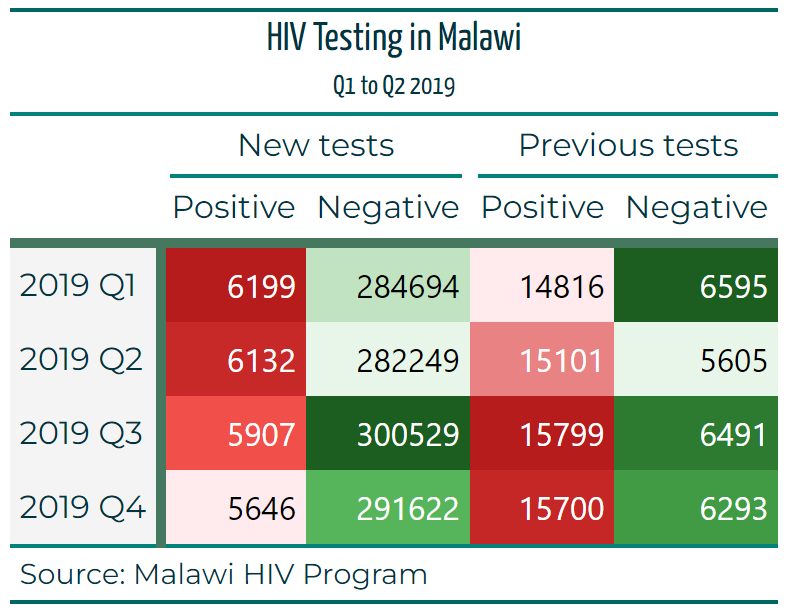

```{r installation, include=FALSE}
knitr::opts_chunk$set(echo = TRUE, class.source = "bloc-de-code-tgc")

if(!require(paletteer)) install.packages("paletteer")

# fonctions
source(here::here("global/functions/lesson_functions.R"))

# rendu par défaut
registerS3method(".reactable_5_rows", "data.frame", .reactable_5_rows)
```

# Introduction

La leçon précédente sur `{gt}` était principalement axée sur les composants du tableau, sa structure et la manière de le manipuler correctement. Cette leçon, qui présente la deuxième partie de la série sur `{gt}`, se concentrera sur l'utilisation du package pour polir, styler et personnaliser les effets visuels des tableaux de manière à rehausser la qualité et l'efficacité de vos rapports.

Allons plus loin.

------------------------------------------------------------------------

# Objectifs d'apprentissage

1.  Modifier les thèmes en utilisant la fonction `opt_style()`.

2.  Mettre en forme des cellules.

3.  Appliquer la Coloration conditionnelle.

4.  Mettre en forme le texte (couleur de police, gras, etc.).

5.  Ajouter les bordures au texte.

À la fin de cette leçon, vous aurez acquis les compétences pour donner du style avec art à vos tables **`{gt}`** afin de répondre à vos préférences spécifiques, en atteignant un niveau de détail similaire à ceci :

{width="482"}

------------------------------------------------------------------------

# Packages

Dans cette leçon, nous utiliserons les packages suivants :

‣ `{gt}` pour de améliorer la présentation des tableaux.

‣ `ggsci` pour les palettes de couleurs.

‣ `{paletteer}`pour charger les palettes de couleur

‣ `{dplyr}`, `{tidyr}` et `{purrr}`.

‣ `{janitor}`

```{r}
# Chargement des packages:
pacman::p_load( _______, _______, _______, _______, _______, _______, _______)
```

------------------------------------------------------------------------

# Précédemment dans la partie 1 de la lesson sur `{gt}`:

::: récapitulatif
Dans la leçon précédente sur `{gt}`, nous avons eu l'opportunité de :

‣ Découvrir les données sur la prévalence du VIH au Malawi.

‣ Découvrir la grammaire des tableaux et le packages `{gt}`.

‣ Créer un tableau simple avec {gt}.

‣ Ajouter des détails comme un titre et une note de bas de page au tableau.

‣ Regrouper des colonnes sous des en‣têtes de groupement.

‣ Créer des lignes récapitulatives.

{width="455"}
:::

# Jeu de données

Dans cette leçon, nous utiliserons les mêmes données que dans la leçon précédente, vous pouvez y retourner pour une description détaillée des données et du processus de préparation que nous avons effectué.

::: recap
Voici les détails complets des colonnes que nous utiliserons :

-   `region` : La région ou la zone géographique où les données ont été collectées ou analysées.

-   `period` : Une période de temps spécifique associée aux données, souvent utilisée pour l'analyse temporelle.

-   `previous_negative` : Le nombre ou le comptage d'individus ayant précédemment eu un résultat de test négatif.

-   `previous_positive` : Le nombre ou le comptage d'individus ayant précédemment eu un résultat de test positif.

-   `new_negative` : Le nombre ou le comptage de nouveaux cas diagnostiqués avec un résultat négatif.

-   `new_positive` : Le nombre ou le comptage de nouveaux cas diagnostiqués avec un résultat positif.
:::

Mais pour les besoins de cette leçon, nous utiliserons directement les tableaux, voici le tableau que nous avons créé avec les bonnes barres verticales et les étiquettes de colonnes, nous nous baserons sur celui-ci pour le reste de la leçon.

```{r}
# Lire l'objet gt 
hiv_malawi_summary <- read_rds(here::here("data/clean/malawi_hiv_summary_t3.rds"))

hiv_malawi_summary
```

# Modification des thèmes

‣ L'objectif principal de cette leçon est de se concentrer sur la mise en forme du tableau.

‣ Nous commencerons par utiliser un thème prédéfini pour améliorer la présentation visuelle et les couleurs du tableau.

‣ Cela peut être réalisé à l'aide de la fonction `opt_style()`.

‣ Cette fonction propose plusieurs styles prédéfinis et accepte un argument de couleur.

‣ Dans notre exemple, nous utiliserons le style n°1 et la couleur `'cyan'`.

‣ Vous pouvez ajuster ces arguments selon vos préférences.

```{r}
t1 <- hiv_malawi_summary %>%
  opt_stylize(
    _______,
    _______
  ) 

t1
```

::: challenge
Pour des thèmes et une mise en forme plus sophistiqués, vous pouvez vous référer à la fonction `tab_options()` (documentation [ici](https://gt.rstudio.com/reference/tab_options.html?q=tab%20options#null)) qui est essentiellement l'équivalent de la fonction `theme()` dans {`ggplot2}`. Cette fonction contient des arguments et options sur chaque couche et composant du tableau. Pour les besoins de cette leçon, nous ne plongerons pas dedans.
:::

# Formater les valeurs dans le tableau

‣ Visualiser les différences entre les valeurs d'une colonne spécifique à l'aide de couleurs peut être utile.

‣ Les tableaux codés en couleur sont particulièrement pratiques dans les rapports comportant un grand nombre de lignes.

‣ Nous souhaitons appliquer cette technique à notre tableau, en mettant la colonne `new_positive` en rouge.

‣ Pour cela, nous utiliserons la fonction `data_color()`.

‣ Deux arguments doivent être spécifiés pour cette fonction : `columns` (quelle colonne doit recevoir la mise en forme ?) et `palette` (quelle palette de couleurs souhaitons-nous utiliser ?).

```{r}
t2 <- t1 %>%
  data_color(
    columns = ___________, # la colonne ou les colonnes comme nous le verrons plus tard
    palette = "____________" # la palette de couleur du package {ggsci}
  )

t2 
```

::: side-note
`ggsci::red_material` n'est pas le seul palet que nous pouvons utiliser, en fait il existe des centaines de palettes spécialement conçus pour R. Vous pouvez en trouver beaucoup plus dans le package `paletteer` (documentation [ici](https://emilhvitfeldt.github.io/paletteer/#included-packages)), ou dans la documentation officielle de `data_color` [ici](https://gt.rstudio.com/reference/data_color.html?q=data_color#null).
:::

‣ Nous pouvons procéder de la même manière pour la colonne `previous_negative`.

‣ Nous pouvons utiliser un type de palette différent, spécifiquement la palette verte du même package : [`ggsci::green_material`](https://github.com/nanxstats/ggsci).

‣ La palette que vous choisissez est une question de commodité et de goût personnel.

‣ Vous pouvez explorer davantage dans la note de côté ci-dessus.

```{r}
t2 %>%
  data_color(
    columns = __________________,
    palette = "__________________"
  )
```

‣ De même, nous pouvons aussi colorier plusieurs colonnes à la fois.

‣ Par exemple, nous pouvons mettre les colonnes avec les cas positifs en rouge, et celles avec les cas négatifs en vert.

‣ Pour cela, nous devons écrire *deux* instructions `data_color`, une pour chaque style de couleur.

```{r}
t4 <- t1 %>%

  data_color(
    columns = ends_with("positive"), # sélection des colonnes se terminant par positive
    palette = "ggsci::red_material" # palette rouge
  ) %>%
  data_color(  
    columns = ends_with("negative"), # sélection des colonnes se terminant par negative
    palette = "ggsci::green_material" # palette verte
  )


t4

```

::: reminder
Dans la leçon précédente nous avons utilisé les fonctions [`tidyselect`](https://tidyselect.r-lib.org/reference/starts_with.html) pour sélectionner les colonnes. Dans le code ci-dessus, nous avons utilisé la fonction `ends_with` pour sélectionner les colonnes se terminant soit par le mot 'negative' ou 'positive' ce qui convenait parfaitement pour notre tableau.

Encore une fois, les étiquettes de colonnes dans le tableau `{gt}` et les noms réels des colonnes dans le `data.frame` peuvent être différents, dans notre cas nous nous référons aux noms dans les données.
:::

# Formatage conditionnel

‣ Le tableau peut être configuré pour modifier le style d'une cellule en fonction de sa valeur.

‣ Nous souhaitons mettre en surbrillance les valeurs de la colonne `previous_positive` qui atteignent ou dépassent un seuil de 15700, en les colorant en vert.

‣ Cela est réalisé à l'aide de la fonction `tab_style`, où nous spécifions deux arguments :

-   `style` : Ici nous définissons la couleur dans la fonction `cell_text`, car nous souhaitons modifier le texte à l'intérieur des cellules.


-   `location` : Cela identifie les colonnes et lignes pour notre modification dans les `cells_body`, car ces cellules sont situées dans le corps principal du tableau.

Nous utiliserons `t2` pour cette démonstration:

```{r}
t5 <- t2 %>%
  tab_style(  
    style = ____________,
    locations = ______________
  )
t5
```

::: watch-out
Dans le code ci-dessus, la condition sur laquelle le formatage se produira est indiquée dans :

`locations = cells_body(columns = previous_positive, rows = previous_positive >= 15700 )`

Notez également que nous pouvons passer davantage d'arguments à la fonction `cell_text`, tels que la taille et la police des cellules que nous souhaitons mettre en forme.
:::

‣ Nous souhaitons que les cellules dont les valeurs sont supérieures ou égales au seuil soient mises en forme en vert, et que les cellules dont les valeurs sont inférieures au seuil soient mises en forme en cyan.

‣ Cela est tout à fait possible. Nous avons déjà réalisé la première partie.

‣ Pour introduire la deuxième condition, il nous suffit d'ajouter une autre instruction `tab_style` de manière similaire.

```{r}
t6 <- t5 %>%
  tab_style(
    style = cell_text(color = 'cyan'),
    location = cells_body(  
      columns = previous_positive,
      rows = previous_positive < 15700)
  )

t6
```

::: practice
**Question 1: Formatage Conditionnel**

Pour mettre en surbrillance (en jaune) les lignes d'un tableau `{gt}` où la colonne "hiv_positive" dépasse 1 000, quel extrait de code R devriez-vous utiliser?

A.  

```{r eval=FALSE, echo=TRUE}
data %>%
  gt() %>%
  tab_style(
    style = cells_body(),
    columns = "Sales",
    conditions = style_number(Sales > 1000, background = "yellow")
  ) 
```

B.  

```{r eval=FALSE, echo=TRUE}
data %>%
  gt() %>%
  tab_style(  
    style = cells_data(columns = "Sales"),
    conditions = style_number(Sales > 1000, background = "yellow")
  )
```

C.  

```{r eval=FALSE, echo=TRUE}
data %>%
  gt() %>%
  tab_style(
    style = cell_fill(
  
      color = "jaune"
    ),
    locations = cells_body(
      columns = "hiv_positive",
      rows = hiv_positive > 1000
    )
  )
    
```

D.  

```{r eval=FALSE, echo=TRUE}
data %>%
  gt() %>%
  tab_style(
    style = cells_data(columns = "Sales"),
    conditions = style_text(Sales > 1000, background = "yellow")
  )
```

**Question 2: Remplissage de la Couleur des Cellules**

En utilisant le jeu de données **`hiv_malawi`**, créer un tableau **`{gt}`** affichant le nombre total (**sum**) de cas "*`new_positive`*" pour chaque "*`region`*". Mettre en surbrillance les cellules avec des valeurs supérieures à 50 cas en *rouge* et les cellules inférieures ou égales à 50 en *vert*. Complétez les parties manquantes (\_\_\_\_\_\_\_\_\_\_) de ce code pour y parvenir.

```{r eval=FALSE, echo=TRUE}
# Calculer le résumé total_new_pos 
total_summary <- hiv_malawi %>%
  grouper_par(_________) %>%
  résumer(total_new_positive = __________)


# Créer un tableau gt et appliquer la coloration des cellules
summary_table <- total_summary %>%
  gt() %>%
  tab_style(  
    style = cell_fill(color = "rouge"),
    locations = _________(  
      columns = "new_positive",
      rows = _________________
    )
  ) %>%
  tab_style(
    style = ___________________,
    locations = cells_body(
      columns = "new_positive",
      _______ new_positive <= 50
    )
  )
```
:::

# Polices et texte

‣ Notre prochaine étape consiste à améliorer l'aspect visuel du texte de notre tableau à l'aide de la fonction `tab_style()` du package `{gt}`.

‣ Nous souhaitons ajuster la police et la couleur du titre et du sous‣titre.

‣ Nous choisirons la police 'Yanone Kaffeesatz' depuis Google Fonts.

Pour appliquer ces modifications, nous allons configurer la fonction `tab_style()` comme suit:

‣ L'argument `style` est affecté à la fonction `cell_text()`, qui contient deux autres arguments:

-   `font` est affecté à la fonction `google_font()` avec notre police choisie.


-   `color` est défini sur un code hexadécimal de couleur correspondant à la couleur de texte souhaitée.

‣ L'argument `locations` est affecté à la fonction `cells_title()` :

-   Nous spécifions `title` et `subtitle` dans l'argument `groups` en utilisant une notation vectorielle `c(...)`.

```{r}
t7 <- t4 %>%
  tab_style(    
      style = ____________,
      locations = ______________
  )
t7
```

::: side-note
Pour modifier spécifiquement le titre ou le sous-titre, vous pouvez utiliser `locations = cells_title(groups = "title")` ou `locations = cells_title(groups = "subtitle")` respectivement, sans avoir besoin de `c(...)`.

**Utilisation des listes pour passer les arguments dans {gt} :**

Les listes sont une partie intégrante du langage R et sont extrêmement polyvalentes. Une liste peut contenir des éléments de différents types (nombres, chaînes de caractères, vecteurs et même d'autres listes) et chaque élément peut être accessible par son index. Dans le contexte de notre tableau {gt}, nous utilisons des listes pour regrouper les propriétés de style (avec l'argument `style`) et pour spécifier les multiples emplacements dans le tableau où ces styles doivent être appliqués (avec l'argument `locations`).

**Utilisation des codes hexadécimaux de couleur :** Les couleurs dans de nombreux langages de programmation, dont R, peuvent être spécifiées à l'aide de codes hexadécimaux de couleur. Ces codes commencent par un dièse (\#) suivi de six chiffres hexadécimaux. Les deux premiers chiffres représentent la composante rouge, les deux suivants représentent la composante verte et les deux derniers représentent la composante bleue. Donc, lorsque nous définissons color = "#00353f", nous spécifions une couleur sans rouge, avec un peu de vert et une bonne quantité de bleu, ce qui donne une couleur bleue profonde. Cela nous permet d'avoir un contrôle précis sur les couleurs utilisées dans nos tableaux.
:::

‣ Nous pouvons étendre notre personnalisation pour inclure les étiquettes de colonnes, les barres verticales et les débuts de lignes, ainsi que la note source.

‣ Dans l'argument `locations`, nous fournirons une liste indiquant les emplacements spécifiques pour ces modifications.

‣ Pour une compréhension complète des emplacements, veuillez vous référer à l'Annexe (Liste 1).

```{r}
t8 <- t7 %>%
  tab_style(
    style = list(
      cell_text(
        font = google_font(name = "Montserrat"),
        color = "#00353f")  
    ),
    locations = list(
     ______________
    )
  )
t8
```

::: side-note
Si vous souhaitez modifier le remplissage de fond du titre, vous pouvez le faire en ajustant l'argument `locations` pour cibler `cells_title(groups = "title")`. Voici comment procéder:

```{r eval = FALSE}
t9 <- t7 %>% 
  tab_style(
    style = _______________,
    locations = ________________
  ) 
t9


```

Dans ce code, `cell_fill(background = "#ffffff")` modifie la couleur de fond en blanc, et `locations = cells_title(groups = "title")` applique ce changement spécifiquement au titre du tableau.
:::

::: practice
**Question 2: Polices et texte**

Quel extrait de code R permet de modifier la taille de police du texte des notes de bas de page dans un tableau **`{gt}`** ?

A.  

```{r eval=FALSE, echo=TRUE}
data %>%
  gt() %>%
  tab_header(font.size = px(16))
```

B.  

```{r eval=FALSE, echo=TRUE}
data %>%
  gt() %>%
  tab_style(
    style = cell_text(
      size = 16
    ),
    locations = cells_footnotes()
  )
```

C.  

```{r eval=FALSE, echo=TRUE}
data %>%
  gt() %>%
  tab_style(
    style = cells_header(),
    css = "font-size: 16px;"
  )
```

D.  

```{r eval=FALSE, echo=TRUE}
data %>%
  gt() %>%
  tab_style(
    style = cells_header(),
    css = "font-size: 16;" 
  )
```
:::

# Bordures

‣ Dans `{gt}`, nous pouvons dessiner des bordures dans les tableaux pour aider les utilisateurs à se concentrer sur des zones spécifiques.

‣ Pour ajouter des bordures à un tableau `{gt}`, nous allons utiliser la fonction `tab_style` et spécifier les arguments `style` et `locations`.

‣ La différence cette fois-ci est que nous allons utiliser la fonction auxiliaire `cell_borders` et l'affecter à l'argument `style`.

‣ Les instructions suivantes démontreront comment procéder.

Commençons par ajouter une ligne verticale:

```{r}
t10 <- t8 %>%
  tab_style(
    style = ___________
    ),
    locations = _____________
  )
t10
```

Maintenant ajoutons une autre bordure horizontale :

```{r}
t11 <- t10 %>%
  tab_style(
    style = cell_borders( # nous ajoutons une bordure
      sides = "___________",    # en bas 
      color = "#45785e",     # avec une couleur vert foncé
      weight = px(5)      # et cinq pixels d'épaisseur
    ),
    locations = list(
      _________________, # ajouter cette bordure en bas des étiquettes de colonnes
      _________________                          # et en bas du stubhead
    )
  )
  
t11
```

```{r message=FALSE, warning=FALSE, include=FALSE}
# Enregistrer le tableau pour la prochaine leçon sous forme d'objet rds
t11 %>% write_rds(here("data/clean/malawi_hiv_summary_l2_t11.rds")) 
t11 %>% gt::gtsave(here("data/clean/malawi_hiv_summary_l2_t11.png"))
```

::: practice
**Question 4 : Bordures**

Pour ajouter une bordure pleine autour du tableau **{gt}** entier, quel extrait de code R devriez-vous utiliser ?

Indice : nous pouvons utiliser une fonction qui définit des options pour l'ensemble du tableau, tout comme la fonction `theme()` pour le package `{ggplot2}`.

A.  

```{r }
data %>%
  gt() %>%
  tab_options(table.border.top.style = "solid")
```

B.  

```{r }
data %>%
  gt() %>% 
  tab_options(table.border.style = "solid")
```

C.  

```{r }
data %>%
  gt() %>%
  tab_style(
    style = cells_table(),
    css = "border: 1px solid black;"
  )
```

D.  

```{r }
data %>%
  gt() %>%
  tab_style(
    style = cells_body(),
    css = "border: 1px solid black;"
  )
```
:::


# Objectifs d'apprentissage

1.  Modifier les thèmes en utilisant la fonction `opt_style()`.


2.  Mettre en forme des cellules.


3.  Appliquer la Coloration conditionnelle.


4.  Mettre en forme le texte (couleur de police, gras, etc.).


5.  Ajouter les bordures au texte.


# Récapitulatif

-   **précédement dans la partie 1 :** Rappel des discussions de la partie 1 de la série.

-   **Thèmes :** Utilisation de la fonction `opt_stylize()` pour appliquer des styles et couleurs prédéfinis aux tableaux.

-   **Mise en forme des valeurs dans le tableau :** Introduction à la fonction `data_color()` pour appliquer des distinctions de valeurs par coloration dans les colonnes.

-   **Formatage conditionnel :** Utilisation de la fonction `tab_style()` pour modifier le style des cellules en fonction de leurs valeurs.

-   **Polices et texte :** Amélioration de l'apparence du texte dans les tableaux avec les fonctions `gt::tab_style()` et les polices uniques de Google Fonts.

-   **Bordures :** Explication de l'ajout de bordures avec la fonction `tab_style()` et la fonction auxiliaire `cell_borders()` pour cibler des zones spécifiques du tableau.
