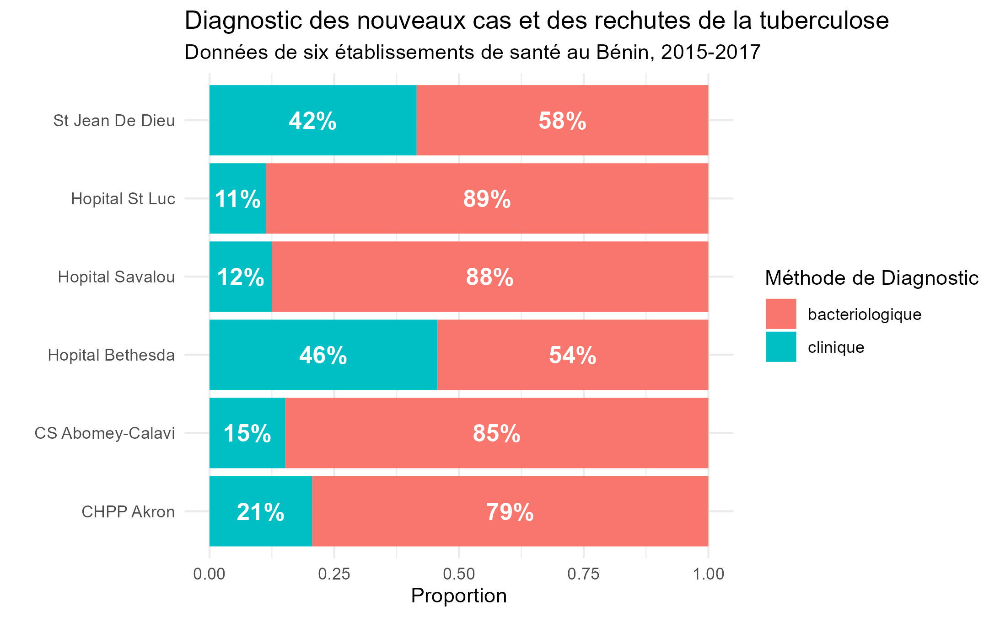

```{r, include = FALSE, warning = FALSE, message = FALSE}
## TEMPLATE FOR EPI REPORTS LESSONS

# require pacman 
if(!require(pacman)) install.packages("pacman")

# Source functions 
source(here::here("global/functions/lesson_functions.R"))

# knitr settings
knitr::opts_chunk$set(warning = F, message = F, class.source = "tgc-code-block", error = T)
```


# Introduction

Les graphiques à barres sont l'un des types de graphiques les plus courants et existent sous plusieurs variantes. Dans la leçon précédente, nous avons appris à créer des graphiques à barres et leurs équivalents circulaires avec `{ggplot2}`.

{width="566"}


Cette leçon pivotera des comparaisons de groupes à la pratique de l'étiquetage dans la visualisation de données. Les étiquettes fournissent un contexte supplémentaire, clarifient les points de données et améliorent la lisibilité générale d'un graphique. Nous nous plongerons dans les détails de l'étiquetage dans ggplot2, en nous concentrant particulièrement sur les fonctions `geom_label()` et `geom_text()` de `{ggplot2}`.

# Objectifs d'apprentissage

Après cette leçon, vous serez en mesure de :

1. **Utiliser deux différentes façons pour étiqueter les graphiques ggplots :**
    - **`geom_text()`** pour les étiquettes simples
    - **`geom_label()`** pour les étiquettes accentuées  

2. Transformer et résumer les données de manière appropriée dans le format approprié pour les différents types de graphiques.

3. Ajuster le positionnement du texte pour positionner les étiquettes sur des graphiques à barres empilées, groupées et en pourcentage empilé.

4. Ajuster le positionnement du texte pour positionner les étiquettes sur les diagrammes circulaires et les diagrammes circulaires à anneau.


# Packages

Nous utiliserons une combinaison de packages dans cette leçon pour améliorer nos visualisations de données :

1. **`tidyverse`** : Une collection de paquets R pour une manipulation et une visualisation de données efficaces, incluant `ggplot2`.

2. **`glue`** : Permet une interpolation de chaînes flexible pour du texte dynamique dans les graphiques.

3. **`here`** : Pour les chemins de fichiers relatifs au projet.

```{r}
pacman::p_load(tidyverse, glue, here)
```

# Introduction aux étiquettes avec {ggplot2}

Dans `{ggplot2}`, ajouter des étiquettes est un exercice de précision et d'esthétique. Nous commencerons par `geom_text()` pour un étiquetage simple, ensuite on passerons à `geom_label()` pour des étiquettes plus stylisé. Dans cette section, nous présenterons la différence entre ces deux fonctions avec un simple diagramme à barres, puis nous entrerons plus en détail sur comment les utiliser sur les barres empilées, les barres groupées, les barres empilées normalisées et les graphiques circulaires.

Commençons par pratiquer l'utilisation de ces fonctions sur un simple diagramme à barres fait avec des données fictives. Une fois que nous aurons couvert les bases de la syntaxe d'étiquetage, nous l'appliquerons à de vraies données épidémiologiques.

```{r}
# Créer un exemple de dataframe
data <- data.frame(
  categorie = c("A", "B", "C"),
  total = c(10, 20, 15) 
)

# Créer le diagramme à barres
ggplot(data, aes(x = categorie, y = total)) +
  geom_col(fill = "steelblue") + 
  theme_light()
```

On peut facilement ajouter des étiquettes à notre diagramme. Pour cela, nous utilisons la fonction **`geom_text()`**  et on va préciser à `aes()` quelle variable qu'il faut extraire pour l'étiquette en utilisant **`label =`**:

```{r} 
# Ajouter des étiquettes de texte sur les barres
ggplot(data, aes(x = categorie, y = total)) +
  geom_col(fill = "steelblue") +
  theme_light() +
  # AJOUTEZ JUSTE UNE COUCHE GEOM !
  geom_text(aes(label = total)) # doit fournir une variable à l'argument `label`
```

Comme vous pouvez le voir, c'est une façon très simple d'ameilliorer votre diagramme `ggplot` en quelques lignes de codes. Le reste de cette leçon vous apprendra comment le faire de plusieures différentes manières.

Ensuite, nous modifierons le code simple ci-dessus pour apprendre `geom_text()` et `geom_label()`. Ces deux façon d'étiquetter offrent des approches distinctes pour ajouter du texte aux graphiques, chacune avec ses caractéristiques et cas d'utilisation uniques.

- **`geom_text()`** : cette fonction place du texte brut directement sur le graphique. Il est préférable de l'utiliser lorsque l'arrière-plan n'est pas trop chargé et que le texte n'a pas besoin de se démarquer excessivement.

```{r}
# Etiquettes de base avec geom_text()
ggplot(data, aes(x = categorie, y = total)) +
  geom_col(fill = "steelblue") +
  theme_light() +
  geom_text(aes(label = total)) 
```
Bien que les étiquettes soient effectivement utiles, l'emplacement de notre texte est plutôt particulier, ni sur la barre, ni sous la barre. De plus, elles sont quelque peu petites et difficiles à discerner. Nous pouvons remédier à cela en agrandissant leur taille et en ajustant verticalement leur emplacement.

La fonction `geom_text()` a comme arguments `hjust` et `vjust` qui vous aide à aligner et positioner vos étiquettes.

Nous pouvons nous appuyer sur le code de l'exemple précédent pour ajouter des esthétiques supplémentaires à la fonction :
```{r}
# Étiquettes avec geom_text()  
ggplot(data, aes(x = categorie, y = total)) +
  geom_col(fill = "steelblue") +
  # PERSONNALISER LES ESTHÉTIQUES
  geom_text(aes(label = total),   
            vjust = -0.3, # Déplacer le texte vers le haut
            size = 5) + # Augmenter la taille du texte
  theme_light() +
  labs(title = "Diagramme à barres avec étiquettes de geom_text()",
       x = "Groupe", y = "Total") 
```

Dans ce code, le paramètre **`vjust`** est ajusté pour positionner le texte juste au-dessus des barres, et le paramètre `size` contrôle la taille de la police.

- **`geom_label()`** : cette fonction dessine un rectangle derrière le texte, améliorant le contraste et la lisibilité, en particulier utile dans les graphiques avec des arrière-plans complexes.

```{r}
# Étiquettes avec geom_label()
ggplot(data, aes(x = categorie, y = total)) + 
  geom_col(fill = "steelblue") +
  # GEOM_LABEL()
  geom_label(aes(label = total),  
             vjust = 1.3, # Déplacer le texte vers le bas
             fill = "yellow") + # Couleur d'arrière-plan du rectangle
  theme_light() +
  labs(title = "Diagramme à barres avec étiquettes de geom_label()",
       x = "Groupe", y = "Total")
```

Dans ce code, l'esthétique `fill` dans `geom_label()` peut être ajustée pour contrôler la couleur de remplissage d'arrière-plan des étiquettes, et cette fois le paramètre `vjust` est ajusté pour abaisser les étiquettes.


::: recap
**Deux façons d'étiquetter distinctes**

- Les deux façons d'étiquetter peuvent être utilisées en combinaison avec d'autres fonction de `ggplot`, comme `geom_col()`, pour annoter la hauteur des barres 

- `geom_text()` ajoute uniquement du texte au graphique 

- `geom_label()` dessine un rectangle derrière le texte, le rendant plus facile à lire. 
:::

::: pro-tip
**Définir un thème global pour {ggplot2}**
Jusqu'à présent, nous avons ajouté une fonction de thème à chacun de nos graphiques à barres. Nous pouvons utiliser la fonction `theme_set()` pour définir un thème global pour le reste de nos graphiques, de sorte que nous n'ayons pas à l'ajouter à chaque fois.

```{r}
# Définir un thème light pour tous les ggplots de cette leçon
theme_set(theme_light())
```
Désormais, `theme_light()` sera automatiquement appliqué à chaque graphique que vous créez.
:::

# Données : Résultats du traitement de la tuberculose au Bénin

Les exemples ci-dessus semblent assez simples, mais les données réelles sont souvent plus complexes, surtout lorsque vous avez plusieurs sous-groupes et niveaux d'agrégation. Vous rencontrerez des problèmes si vous ne préparez pas correctement les données. Plongeons-y.

Le jeu de données `resultats_tb` servira de base pour nos exemples, nous fournissant un ensemble riche de points de données à étiqueter.

```{r render = .reactable_10_rows, message = FALSE}
resultats_tb <- read_csv(here::here('data/benin_tb_fr.csv'))
resultats_tb
```

Nous allons régénérer les graphiques de la leçon précédente pour les utiliser comme base pour cette leçon.

# Étiquetage de diagrammes à barres simples

Commençons par créer un diagramme à barres simple pour visualiser le nombre de cas par pour chaque hôptial.

```{r}
# Diagramme à barres normal - splendide! aucun précalcul requis  
resultats_tb %>%
  ggplot(aes(x = hopital, y = cas)) +
  geom_col(fill = "steelblue")
```

Super! Ajoutons `geom_text()` comme nous l'avons fait précédemment.

```{r}
# mais si nous essayons d'ajouter geom_text, nous avons un problème...
resultats_tb %>%
  ggplot(aes(x = hopital, y = cas)) + 
  geom_col(fill = "steelblue") +
  geom_text(aes(label = cas))  
```


Oh non ! Plutôt qu'un seul nombre en haut de chaque barre, nous nous retrouvons avec beaucoup d'étiquettes entassées en bas de chaque barre. Examinons le problème.


- Regardez nos données `resultats_tb`, la colonne `cas`. La fonction geom_text prend des valeurs directement à partir de là et les place sur l'axe des y.
```{r render = .reactable_10_rows}
resultats_tb
```

Au lieu d'avoir un seul nombre en haut de chaque barre, on se retrouve avec une multitude d'étiquettes entassées en bas de chaque barre.  Il y a 711 lignes, ce qui signifie que 711 étiquettes ont été dessinées par `geom_text()`.

Contrairement à notre ensemble de données fictif où on avait des nombres précalculés pour chaque barre, **avec les données brutes on a souvent des cas non agrégés**. Bien que la fonction de base `geom_col()` intègre le calcul des totaux de groupe, `geom_text()` et `geom_label()` ne le font pas automatiquement, ce qui veut dire que nous on doit créer manuelle des étiquettes.

Pour résoudre ce problème, on va créer un jeu de données temporaire à l'aide des fonctions de `{dplyr}`, ce qui nous permettra de résumer le nombre total de cas par hôpital.


## Étape 1 : Résumer les données

Tout d'abord, nous allons commencer par agréger nos données puis créer un diagramme à barres de base comme point de départ

- **Commencez par résumer les données :** ce bloc de code régroupe d'abord notre ensemble de données `resultats_tb` par `hoptial` et calcule la somme total des `cas` pour chaque groupe

```{r render = .reactable_10_rows}
hopital_cas_total <- resultats_tb %>%  
  # Grouper les données par hôpital   
  group_by(hopital) %>%  
  # Obtenir le nombre total de cas par hôptial  
  summarise(cas_total = sum(cas))  

hopital_cas_total
```
Maintenant, nous avons 6 valeurs pour `cas_total`, qui serviront de 6 étiquettes de texte, une pour chaque barre.

## Étape 2 : Créer le graphique de base

Utilisons maintenant `hopital_cas_total` pour visualiser le nombre total de cas pour chaque hôpital :
```{r} 
hopital_barre <- hopital_cas_total %>%  
  # Transmettre les données résumées à ggplot pour la visualisation  
  ggplot(    
    # Dans aes(), spécifier que l'axe x représentera l' 'hopital',    
    # la hauteur des barres (axe y) représentera le 'cas_total',    
    aes(x = hopital, y = cas_total)) +  
  # Utiliser geom_col() pour créer un diagramme à barres bleu  
  geom_col(fill = "steelblue") +  
  labs(title = "Nouveaux cas et rechutes de TB par hôpital",       
       subtitle = "Données de six établissements de santé au Bénin, 2015-2017")  

hopital_barre
```

Ce graphique semble identique à celui créé avec `resultats_tb` mais la différence clé est que la hauteur des barres sur l'axe des y dans `hopital_cas_total` est précalculée, plutôt que faite avec `geom_col()`.

## Étape 3 : Annoter le graphique avec `geom_text()` ou `geom_label()` 

`geom_text()` fournit un moyen simple et efficace d'ajouter directement du texte à vos graphiques. Explorons comment nous pouvons l'utiliser  pour mettre en évidence le nombre total de cas de tuberculose par hôpital dans notre diagramme à barres `hopital_barre`
```{r}
# Donner les étiquettes précalculé à geom_text()
hopital_barre +  
  geom_text(aes(label = cas_total)) 
```
Voilà, c'est beaucoup mieux.

Pour les étiquettes qui doivent ressortir davantage, `geom_label()` dessine un rectangle derrière le texte, améliorant le contraste.

```{r}
# Donner les étiquettes précalculé à geom_label()
hopital_barre + 
  geom_label(aes(label = cas_total))
```

## Étape 4 : Ajuster le positionnement et le style du texte

Un argument important à utiliser avec `geom_text()` et d'autres fonctions d'étiquetage dans {ggplot2} est `vjust`. Cet argument peut ajuster la position verticale du texte, c'est-à-dire le déplacer vers le haut ou vers le bas.

Réglez `vjust` sur un nombre négatif pour le déplacer vers le haut :
```{r}
# Positionner le texte au-dessus des barres
hopital_barre + 
  geom_text(aes(label = cas_total), 
            # AJUSTER LA HAUTEUR VERTICALE VERS LE HAUT
            vjust=-0.2) 
```

... ou un nombre positif pour déplacer le texte vers le bas :

```{r}
# Positionner le texte à l'intérieur des barres
hopital_barre + 
  geom_text(aes(label = cas_total), 
            # AJUSTER LA HAUTEUR VERTICALE VERS LE BAS
            vjust=1.5)
```

Nous pouvons utiliser des arguments supplémentaires dans `geom_text()` pour modifier la couleur et la taille du texte.

```{r}
# Ajouter des ajustements (esthétiques fixes) à geom_text()
hopital_barre + 
  geom_text(aes(label = cas_total), 
            vjust=1.5, 
            color="white", 
            size=5)
```


::: pro-tip
**Modifications esthétiques**
Jusqu'à présent, nous n'avons utilisé que quelques-unes des esthétiques possibles pour `geom_text()` et `geom_label()`. Les trois esthétiques minimales sont `x`, `y` et `label`. Celles-ci doivent être mappées à une variable définie dans `aes()`. En plus des esthétiques requises, ces fonctions acceptent un certain nombre d'esthétiques optionnelles pour personnaliser le texte. Par exemple :

```{r}
# Ajustements supplémentaires (esthétiques fixes) dans geom_text()
hopital_barre +  geom_text(aes(label = cas_total),
            #vjust = 1.5, 
            color = "white",
            size = 5,
            family = "serif",
            fontface = "bold",
            angle = 90,
            # Utiliser hjust au lieu de vjust car le texte est pivoté de 90 degrés
            hjust = 1.2) 
```

Apprenez-en plus sur la définition de ces esthétiques dans `vignette("ggplot2-specs")`. Exécutez ce code dans votre console et faites défiler jusqu'à la section "Texte" de la vignette.
:::

Bien que ce graphique à barres mettant en avant une seule variable catégorielle soit agréable, soyons réalistes - la plupart du temps, nous avons affaire à plusieurs variables catégorielles. Il se peut que nous ayons besoin de les empiler, de les aligner côte à côte, voire de les transformer en graphiques circulaires. C'est là que les choses deviennent plus complexes.

# Étiquetage des graphiques à barres empilées 

Construisons des graphiques avec deux variables catégorielles, chacune ayant plusieurs niveaux, et ajoutons des étiquettes à chaque sous-groupe, en commençant par des graphiques à barres empilées.

Tout d'abord, créons un graphique à barres empilées de base, sans étiquettes.

```{r}
# Graphique à barres empilées de base  
resultats_tb %>%
  ggplot(aes(x = date_periode, y = cas)) +
  # Cartographier la variable de remplissage dans geom_col() pour empiler les barres
  geom_col(aes(fill = diagnosis_type)) +
  labs(title = "Nouveaux et rechutes de cas de tuberculose par trimestre",
       subtitle = "Données de six établissements de santé au Bénin, 2015-2017")
```

En général, le code reste assez similaire à notre graphique à barres avec une seule catégorie, mais au lieu de remplir les barres avec une couleur spécifique (`"steelblue"`) comme nous l'avons fait auparavant, nous les remplissons maintenant en fonction d'une deuxième variable catégorielle.

Comme nous l'avons déjà constaté, simplement ajouter `geom_text()` à ce code n'aura pas l'effet désiré.

```{r}
# Graphique à barres empilées avec geom_text() - code incorrect
resultats_tb %>%
  ggplot(aes(x = date_periode, y = cas)) + 
  geom_col(aes(fill = diagnosis_type)) +
  labs(title = "Nouveaux et rechutes de cas de tuberculose par trimestre",
       subtitle = "Données de six établissements de santé au Bénin, 2015-2017") +
  geom_text(aes(label = cas))
```

Rappelez-vous - nous devons résumer les données pour précalculer les étiquettes de texte. Le cadre de données de résumé doit avoir le même nombre de lignes que le nombre d'étiquettes souhaité. Dans ce cas, nous aurons besoin d'une étiquette pour chaque segment de barre - un total de 24 étiquettes.


## Étape 1 : Résumer les données

Ce morceau de code résume d'abord notre jeu de données `resultats_tb` par `periode` et `diagnosis_type`, calculant la somme des cas (`cas`) pour chaque groupe.

```{r render = .reactable_10_rows} 
# Résumer les données par période et type de diagnostic
tb_total <- resultats_tb %>%
  group_by(date_periode, diagnosis_type) %>%
  summarise(cas = sum(cas))

tb_total
```

## Étape 2 : Créer le graphique de base

**Ensuite, créons un simple graphique à barres empilées :** Nous allons représenter les données résumées sous forme d'un graphique à barres (`geom_col()`), où la hauteur de chaque barre représente le nombre total de cas pour un diagnostic particulier dans chaque période.

```{r}
# Créer un graphique à barres de base utilisant les données résumées  
periode_dx_barres <- tb_total %>%
  ggplot(aes(x = date_periode, y = cas, fill = diagnosis_type)) + 
  geom_col() +
  labs(title = "Nouveaux et rechutes de cas de tuberculose par trimestre",
       subtitle = "Données de six établissements de santé au Bénin, 2015-2017")

periode_dx_barres
```

## Étape 3 : Annoter le graphique avec `geom_text()` ou `geom_label()`

- **Ajouter du texte au graphique à barres :** Ensuite, nous ajoutons des étiquettes à ce graphique. La colonne `cas`, qui représente le nombre total de cas, sera utilisée pour étiqueter chaque barre.

```{r}
# Ajouter des étiquettes de texte au graphique à barres
periode_dx_barres +
  geom_text(aes(label = cas))
```

Ici, `geom_text()` est utilisé pour placer des étiquettes sur le dessus de chaque barre. Les étiquettes montrent le nombre total de cas (`cas`) pour chaque type de diagnostic durant chaque période.

Mais les étiquettes ne sont pas au bon endroit; elles ne correspondent pas à la hauteur des barres dans le graphique à barres empilées. Cela arrive parce que nous devons indiquer au graphique comment positionner chaque élément, et actuellement, nous l'avons fait uniquement pour les barres (`geom_col()`). 

Même si cela peut ne pas être évident dans le code, lorsque nous utilisons `fill = variable` dans `aes()` pour `geom_col()`, cela a pour effet par défaut de les empiler (en anglais: "stack"). Pour résoudre cela, il est essentiel d'aussi spécifier explicitement l'ajustement de la position dans `geom_text()`, assurant ainsi une cohérence dans leur configuration.


## Étape 4 : Ajuster la position du texte pour l'aligner avec les barres

Si nous ajoutons un argument `position` à `geom_text()` et lui demandons d'empiler les étiquettes, nous obtiendrons des étiquettes en haut de chaque segment de barre.
```{r}
# Placer le texte en haut de chaque segment de barre
periode_dx_barres +
  geom_text(
    aes(label = cas),
    position = position_stack()) # Définir la position en tant que stack
```

C'est corrigé !

Pour aligner verticalement le texte à l'intérieur des barres, nous pouvons ajouter `vjust` à `geom_text()` comme d'habitude.

```{r}
# Repositionner les étiquettes à l'intérieur des empilements pour plus de clarté et changer le style de police
periode_dx_barres +
  geom_text(aes(label = cas),
    position = position_stack(),
    vjust = 1.5,
    color = "white",
    fontface = "bold")
```

Plutôt que de déplacer les étiquettes vers le haut ou vers le bas d'une quantité fixe, nous pouvons également spécifier la hauteur de l'étiquette par rapport au segment de barre correspondant. Nous pouvons ajuster l'emplacement de l'étiquette au sein de chaque empilement comme suit :

```{r}
# Pour placer le texte au milieu de chaque segment de barre dans un graphique à barres empilées, vous devez définir le paramètre vjust de position_stack()
periode_dx_barres +
  geom_text(
    aes(label = cas),
    # AJOUTER LA FONCTION DE POSITION APPROPRIÉE
    position = position_stack(vjust = 0.5),
    color = "white",
    fontface = "bold")
```

Ce code modifie le graphique précédent en utilisant `position_stack(vjust = 0.5)` dans `geom_text()`. Cet ajustement centre verticalement les étiquettes dans chaque segment des barres empilées, facilitant leur association avec le segment de barre pertinent.

Cette disposition d'étiquette est particulièrement agréable pour les graphiques à barres horizontaux.

```{r}
# Convertir en graphique horizontal avec coord_flip()
periode_dx_barres +
  geom_text(
    aes(label = cas),
    position = position_stack(vjust = 0.5),
    color = "white",
    fontface = "bold") + 
  coord_flip() # Inverser l'orientation des barres
```


# Étiquetage des graphiques à barres groupées

Les graphiques à barres groupées présentent plusieurs catégories juxtaposées, regardons comment regrouper les données et placer correctement les étiquettes pour une interprétation claire. 

## Étape 1 : Résumer les données

Nous allons d'abord regrouper notre jeu de données `resultats_tb` par `hopital` et `diagnosis_type` et calculer la somme des cas (`cas`) pour chaque groupe.

```{r render = .reactable_10_rows}
hopital_dx_cas <- resultats_tb %>% 
  group_by(hopital, diagnosis_type) %>% 
  summarise(cas = sum(cas))

hopital_dx_cas
```


## Étape 2 : Créer le graphique de base

**Ensuite, créons un simple graphique à barres groupées :** Nous allons représenter les données résumées sous forme d'un graphique à barres regroupées (`geom_col()`), où la hauteur de chaque barre représente le nombre total de cas pour un diagnostic spécifique pour chaque hôpital. Le paramètre par défaut de geom_col est `stack`. Pour créer un graphique à barres groupées, nous allons spécifier `position = position_dodge()`.

```{r}
# utiliser "dodge" au lieu de la valeur par défaut "stack"
hopital_dx_barre <- hopital_dx_cas %>% 
  ggplot(aes(x = hopital, y = cas, fill = diagnosis_type)) +
  geom_col(position = position_dodge())

hopital_dx_barre
```


## Étape 3 : Annoter le graphique avec `geom_text()`

Maintenant, nous pouvons annoter le graphique avec `geom_text()` pour afficher des étiquettes, tout comme nous l'avons fait précédemment.

```{r}
# Ajouter geom_text()
hopital_dx_barre +
  geom_text(aes(label = cas))
```


## Étape 4: Ajuster la position du texte pour l'aligner avec les barres

Les étiquettes sont centrées verticalement sur une ligne droite, non alignées avec les barres juxtaposées. Encore une fois, comme pour les barres empilées dans la section précédente, nous devons ajouter l'ajustement de `position` à `geom_text()`.

```{r}
# Spécifier la position dodge à `geom_text()`
hopital_dx_barre +
  geom_text(aes(label = cas),
            position = position_dodge())
```

Nous obtenons le même graphique qu'avant! Lorsque vous utilisez `geom_text()` avec un positionnement `dodge` dans ggplot2, spécifier le paramètre `width` devient nécessaire car par défaut, `ggplot2` ne connait pas la largeur appropriée à utiliser pour décaler les étiquettes. 

Pour `geom_col()`, la valeur par défaut de `width` est `0.9`. Étant donné que nous n'avons pas spécifier une autre valeur en créant notre graphique, nous allons aussi utiliser `0.9` pour `geom_text()` pour que les barres et les étiquettes s'allignent.
```{r}
# Spécifier à ggplot2 d'aligner le texte en ajoutant la largeur du décalage
hopital_dx_barre +
  geom_text(aes(label = cas),
            position = position_dodge(width = 0.9))
```

Vous ne pouvez pas déplacer le texte aussi facilement avec `vjust`, alors ajustez plutôt la position `y` en ajoutant manuellement une petite quantité.

```{r}
# Ajustez les étiquettes verticalement
hopital_dx_barre +
  geom_text(aes(label = cas, 
                y = cas + 20), # ajouter 20 à l'axe des y
            position = position_dodge(width = 0.9))
```

# Étiquetage des graphiques à barres empilées normalisées

L'étiquetage des graphiques à barres empilées normalisées est un cas particulier car l'axe des y varie de 0 à 1 pour représenter des proportions ou des pourcentages plutôt que des valeurs brutes. Chaque segment à l'intérieur de la barre représente un pourcentage du total, et l'ensemble des segments totalise 100%.

Lors de l'étiquetage des graphiques à barres empilées normalisées, les étiquettes doivent refléter les pourcentages de chaque catégorie. Cela signifie que nous devons formater les étiquettes en pourcentages pour nous assurer qu'elles correspondent aux segments sur le graphique.



```{r eval = F, include = F}
resultats_tb %>% 
  group_by(hopital, diagnosis_type) %>% 
  summarise(cas_total = sum(cas)) %>%
  mutate(prop = cas_total / sum(cas_total)) %>% 
  ggplot(aes(x = hopital, y = cas_total, fill = diagnosis_type)) +
  geom_col(position = "fill") +
  geom_text(aes(label = scales::percent(prop, accuracy = 1)), # set sig figs
                position = position_fill(vjust = 0.5), 
            color = "white", fontface = "bold", size = 4.5) +
  coord_flip() + 
  theme_minimal() +
  labs(x="", y = "Proportion", fill = "Méthode de Diagnostic",
       title = "Diagnostic des nouveaux cas et des rechutes de la tuberculose",
       subtitle = "Données de six établissements de santé au Bénin, 2015-2017")

ggsave(filename = "pct_stack_final.jpg", path = here::here("images"))
```


## Étape 1 : Résumer les données

Nous voulons visualiser la proportion de cas dans chaque hôpital appartenant à chaque type de diagnostic. Il faut donc que nous traitons d'abord nos données pour calculer le nombre total de cas pour chaque établissement de santé (`hopital`) puis calculer le pourcentage de chaque type de diagnostic pour chacun d'eux.

```{r render = .reactable_10_rows}
# Préparation des données pour l'étiquetage de diagrammes à barres empilées à 100%  
hopital_dx_total <- resultats_tb %>%
  ## regrouper par hôpital et type de diagnostic
  group_by(hopital, diagnosis_type) %>%
  ### résumer nos données par la somme des cas
  summarise(cas_total = sum(cas))

hopital_dx_total
```

Nous pourrions utiliser ceci pour créer un diagramme à barres empilées normalisées comme cela :

```{r}
# Créer un diagramme à barres normalisé avec les données résumées
hopital_dx_total %>%
  ggplot(aes(x = hopital, y = cas_total, fill = diagnosis_type)) +
  geom_col(position = position_fill()) +
  geom_text(aes(label = cas_total),
  ## Définir position = position_fill pour normaliser l'axe y
            position = position_fill(),
            vjust = 1.5,
            color = "white", fontface = "bold", size = 4.5) 
```

C'est un bon début, cependant nous voulons des pourcentages, pas des valeurs brutes.

Voici comment nous préparons nos données :
```{r}
# Préparation des données pour l'étiquetage de diagrammes à barres empilées à 100% avec des étiquettes en POURCENTAGE
hopital_dx_prop <- resultats_tb %>%
  ## regrouper par hôpital et type de diagnostic 
  group_by(hopital, diagnosis_type) %>%
  ## d'abord, nous résumons nos données par la somme des cas, comme d'habitude
  summarise(cas_total = sum(cas)) %>% 
  ## calculer les proportions :
  ### ajouter une nouvelle colonne avec les proportions
  mutate(prop = cas_total / sum(cas_total))

hopital_dx_prop
```

Dans ce bloc de code, nous commençons par regrouper notre ensemble de données `resultats_tb` par hôpital et type de diagnostic. Nous calculons ensuite la somme des cas pour chaque combinaison, puis calculons la proportion de cas confirmés bactériologiquement et cliniquement diagnostiqués.


## Étape 2 : Créer le graphique de base
Ensuite, nous allons créer un graphique à barres en utilisant notre nouveau jeu de données `hopital_dx_prop` :

```{r}
# Création d'un diagramme à barres empilées normalisées avec les données résumées
hosp_dx_fill <- hopital_dx_prop %>%
  ggplot(aes(x = hopital, y = prop, fill = diagnosis_type)) +
  geom_col(position = position_fill()) +
  labs(title = "Diagnostic des nouveaux cas et des rechutes de tuberculose",
       subtitle = "Données de six établissements de santé au Bénin, 2015-2017",
       x="", y = "Proportion", fill = "Méthode de diagnostic")

hosp_dx_fill
```

Dans ce graphique, `geom_col()` est utilisé pour créer un graphique à barres basé sur les variables `hopital` et `prop`.

## Étape 3 : Annoter le graphique avec `geom_text()` ou `geom_label()`

Maintenant, nous pouvons utiliser `geom_text()` en spécifiant la position de pour ajouter des étiquettes :

```{r}
# Ajouter des étiquettes de texte au diagramme à barres empilées en pourcentage
hosp_dx_fill +
  geom_text(aes(label = prop),
            position=position_fill()) 
```

C'est un bon début mais évidemment nous avons encore un peu de travail à faire pour le rendre plus joli! 


## Étape 4 : Ajuster la position du texte pour l'aligner avec les barres

Avant d'ajuster nos étiquettes, nous alons nous occuper de ces décimales. Nous pourrions réduire le nombre de décimales comme ceci :

```{r} 
hosp_dx_fill +
  geom_text(aes(label = round(prop,2)), # arrondir le texte de l'étiquette à 2 chiffres sig
            position = position_fill()) 
```

Cependant, la meilleure méthode est :

```{r}
hosp_dx_fill +
  geom_text(aes(label = scales::percent(prop)),
            position = position_fill()) 
```

::: side-note
Le package `{scales}` est couramment utilisé avec `{ggplot2}` pour personnaliser les esthétiques, transformer les échelles d'axes, formater les étiquettes, définir des palettes de couleurs, etc.

La fonction `scales::percent(prop)` que nous avons utilisée dans le code ci-dessus avec `geom_text()` convertit les proportions (valeurs de notre variable `prop`) en un format de pourcentage et ajoute des signes de pourcentage. Nous pouvons également contrôler le nombre de chiffres affichés à l'aide de l'argument `accuracy` (voir ci-dessous).
:::

Ensuite, nous pouvons centrer les étiquettes dans chaque segment de barre en utilisant `vjust` dans la fonction `position_fill()`
```{r}
# Déplacer le texte des étiquettes au milieu de chaque segment de barre
hosp_dx_fill + 
  geom_text(aes(label = scales::percent(prop, accuracy = 1)),
            position = position_fill(vjust = 0.5)) # centrer les étiquettes
```

L'utilisation de coordonnées inversées dans les graphiques à barres peut grandement améliorer la lisibilité, en particulier lorsqu'on a affaire à de longs noms de catégories ou à de nombreuses catégories. Pour faire cela, nous allons utiliser `coord_flip` avec `geom_text()` comme nous l'avons fait pour les graphiques à barres empilées :

```{r}
# Inverser les coordonnées pour une meilleure visualisation
hosp_dx_fill +
  geom_text(aes(label = scales::percent(prop, accuracy = 1)),
            position = position_fill(vjust = 0.5)) +
  coord_flip() 
```

Super, maintenant nous pouvons ajouter quelques modifications esthétiques supplémentaires et nous obtiendrons le même graphique que nous avons vu au début de la section! 
```{r}
# Ajouter des modifications supplémentaires
hosp_dx_fill +
  geom_text(aes(label = scales::percent(prop, accuracy = 1)),
            position = position_fill(vjust = 0.5),
            color = "white", # Changer la couleur du texte
            fontface = "bold", # Mettre en gras
            size = 4.5) + # Changer la taille de la police
  coord_flip() 
```


# Étiquetage de graphiques circulaires

## Étape 1 : Résumer les données

Commençons par résumer les données. Nous allons calculer le nombre total de cas pour chaque hôpital en regroupant les données par la variable `hopital`, puis en calculant la somme des cas dans chaque groupe.

```{r render = .reactable_10_rows}
# Nouveau tableau récapitulatif - les diagrammes circulaires ne peuvent visualiser qu'une seule variable catégorielle, donc un seul regroupement cette fois
resultats_totals <- resultats_tb %>%
  group_by(hopital) %>%
  summarise(
    cas_total = sum(cas)) 

resultats_totals
```

## Étape 2 : Créer les graphiques de base 

Maintenant que nous avons notre nouvel ensemble de données, nous pouvons commencer par créer un diagramme à barres simple. Vous vous souvenez peut-être de la leçon précédente qu'un diagramme circulaire est fondamentalement une version ronde d'un diagramme à barres empilées.

```{r} 
# Diagramme à barres simple (précurseur du diagramme circulaire) 
resultats_stack <- ggplot(resultats_totals,
       aes(x=4, # Définir une valeur x arbitraire  
           y=cas_total,
           fill=hopital)) +
  geom_col()

resultats_stack
```

Maintenant, nous pouvons créer notre diagramme circulaire de base. Comme nous l'avons appris dans la dernière leçon, pour transformer des coordonnées linéaires en coordonnées polaires, nous utilisons la fonction `coord_polar()`. Le paramètre `theta` définit quelle variable esthétique doit être mappée sur la coordonnée angulaire dans le système de coordonnées polaires. En spécifiant `"y"`, nous utilisons la hauteur des barres pour déterminer l'angle de chaque tranche de notre diagramme circulaire. 

```{r}
resultats_circulaire <- resultats_stack +
  coord_polar(theta = "y")

resultats_circulaire
```

Ensuite, nous allons créer un diagramme circulaire à anneau vide de base en utilisant `xlim()`.

```{r} 
resultats_anneau <- resultats_circulaire +
  xlim(c(0.2, 4.5))

resultats_anneau
```

## Étape 3 : Annoter le graphique avec `geom_text()` ou `geom_label()`

Maintenant, ajoutons des étiquettes à notre graphique circulaire avec `geom_text()`.
```{r}
# Ajoutez geom text comme vous le feriez habituellement pour un diagramme à barres empilées
resultats_circulaire +
  geom_text(aes(label = cas_total)) 
```
Vous remarquerez que nos étiquettes restent au milieu des tranches parce que `coord_polar()` est appliqué à la fois à `geom_col()` et `geom_text()`. Les nombres apparaissent dans les mauvais segments car nous n'avons pas encore ajouté de réglage `position` à la géométrie d'étiquetage.

## Étape 4 : Ajuster la position du texte pour l'aligner avec les tranches du cercle et sections de l'anneau

Maintenant, tout comme nous l'avons fait précédemment, nous utiliserons l'argument `position_stack()` pour centrer les étiquettes.
```{r}
resultats_circulaire +
  geom_text(aes(label = cas_total), 
            position = position_stack(vjust = 0.5)) # Centrer les étiquettes
```

Pour déplacer les étiquettes le long de l'axe x de notre diagramme circulaire (vers le haut et vers le bas du rayon), nous pouvons spécifier une valeur fixe à l'esthétique x dans `geom_text()`
```{r}
resultats_circulaire +
  geom_text(aes(label = cas_total,
                x = 4.25), # déplacer le texte loin du centre   
            position = position_stack(vjust = 0.5)) 
```

Nous pouvons faire la même chose avec `geom_label()`.
```{r}  
# Ajustement similaire avec geom_label()
resultats_circulaire +
  geom_label(aes(label = cas_total,
                 x = 4.7), # déplacer le texte loin du centre
            position = position_stack(vjust = 0.5))
```

Remarquez qu'une fois que nous avons utilisé `geom_label()`, la lettre `a` est apparue sur les légendes. C'est gênant et ruinerait tout le travail ardu que nous avons fait pour rendre ces graphiques présentables. Pour atténuer ce problème, nous ajoutons l'argument `show.legend = FALSE` à la fonction `geom_label()` comme ceci :
```{r}  
# Ajustement similaire avec geom_label()
resultats_circulaire +
  geom_label(aes(label = cas_total,
                 x = 4.7), # déplacer le texte loin du centre
            position = position_stack(vjust = 0.5),
            show.legend=FALSE)
```


Ensuite, passons à notre diagramme à anneau de base. Nous allons l'étiquetter en utilisant `geom_text()`et en spécifiant directement la position et centrant nos étiquettes au milieu de chaque section du graphique, tout comme nous l'avons fait pour notre diagramme circulaire.

```{r}
# ajouter du texte - lims appliqué aux colonnes et au texte  
resultats_anneau +
  geom_text(aes(label = cas_total), 
            position = position_stack(vjust = 0.5))
```

Pour finir, nous pouvons apporter quelques modifications supplémentaires. Ici, nous améliorons l'esthétique du graphique en appliquant `theme_void()` pour supprimer les éléments d'arrière-plan encombrants, en introduisant une nouvelle palette de couleurs avec `scale_fill_viridis_d()`, et en ajustant les étiquettes de texte à l'aide de `geom_text()` avec du texte blanc et en gras pour une meilleure visibilité et un meilleur contraste.

```{r}
# Modifications esthétiques supplémentaires
resultats_anneau +
  geom_text(aes(label = cas_total),
            position = position_stack(vjust = 0.5),
            color = "white",
            fontface = "bold") +
  theme_void() +
  scale_fill_viridis_d()

```


# Conclusion ! {.unnumbered}


Dans cette leçon, nous nous sommes plongés dans l'amélioration des graphiques avec des étiquettes, en nous concentrant sur `geom_label()` et `geom_text()`. En utilisant des packages comme `{tidyverse}`, `{ggtext}` et `{glue}`, nous explorons une gamme de techniques d'étiquetage allant du texte simple au formatage avancé.

Nous avons commencé avec `geom_text()`, démontrant comment placer du texte lisible directement sur les graphiques en utilisant l'ensemble de données `resultats_tb`. Ensuite, `geom_label()` est introduit pour créer des étiquettes plus proéminentes avec des encadrés de fond, idéales pour les arrière-plans de graphiques complexes.

Ceci a été suivi par une discussion sur l'utilisation de coordonnées inversées dans les graphiques à barres pour une meilleure lisibilité et visibilité des étiquettes, ainsi que des conseils sur l'ajustement des limites d'axe avec `expand_limits()`.

Cette leçon est un guide complet sur l'utilisation efficace de l'étiquetage dans `{ggplot2}`, améliorant la clarté et l'attrait visuel des visualisations de données.

# Références {.unlisted .unnumbered}

Certains éléments de cette leçon ont été adaptés à partir des sources suivantes :

-   Horst, Allison. "Allisonhorst/Dplyr-Learnr: A Colorful Introduction to Some Common Functions in Dplyr, Part of the Tidyverse." GitHub. Accessed April 6, 2022. <https://github.com/allisonhorst/dplyr-learnr.>


`r .tgc_license()`
