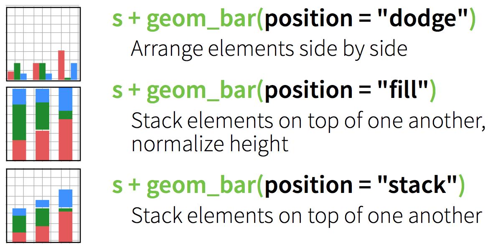
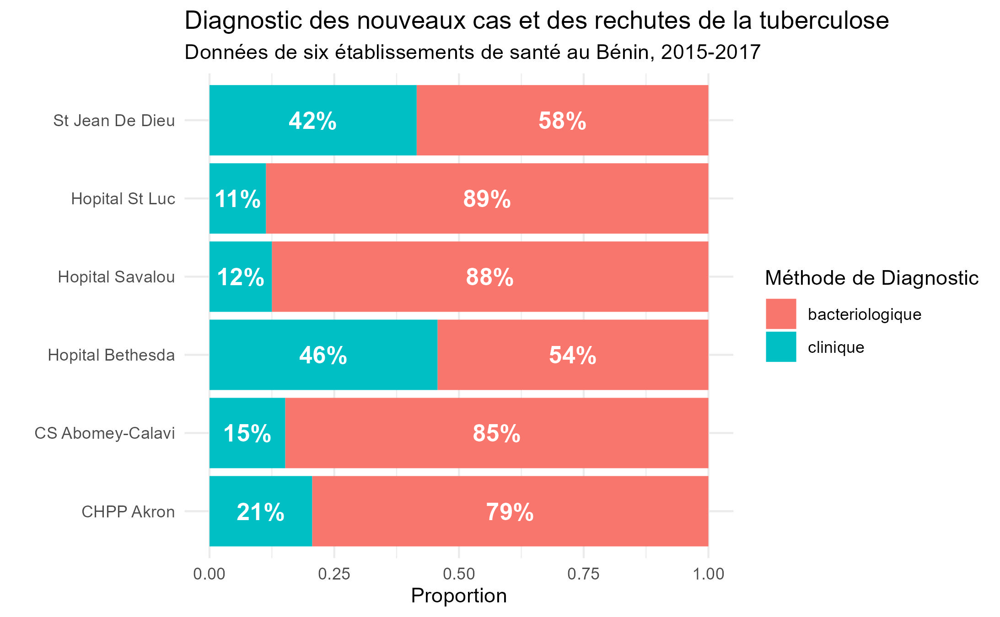

```{r, include = FALSE, warning = FALSE, message = FALSE}
## TEMPLATE FOR EPI REPORTS LESSONS

# require pacman 
if(!require(pacman)) install.packages("pacman")

# Source functions 
source(here::here("global/functions/lesson_functions.R"))

# knitr settings
knitr::opts_chunk$set(warning = F, message = F, class.source = "tgc-code-block", error = T)
```

# Introduction

Les graphiques à barres sont l'un des types de graphiques les plus courants et existent sous plusieurs variantes.

Dans la leçon précédente, on a appris à créer des graphiques à barres et des graphiques circulaires avec `{ggplot2}`. Dans cette leçon on va se concentrer sur l'étiquetage des graphiques. Les étiquettes sont importants car elles fournissent un contexte supplémentaire, clarifient les points de données, et améliorent la lisibilité générale d'un graphique.

Nous nous plongerons dans les détails de l'étiquetage dans ggplot2, en nous concentrant particulièrement sur les fonctions `geom_label()` et `geom_text()` de `{ggplot2}`.

# Objectifs d'apprentissage

Après cette leçon, vous serez en mesure de :

1.  **Utiliser deux différentes façons pour étiqueter les graphiques ggplots :**

    -   **`geom_text()`** pour les étiquettes simples
    -   **`geom_label()`** pour les étiquettes accentuées

2.  **Transformer et résumer les données** de manière appropriée dans le format approprié pour les différents types de graphiques.

3.  **Ajuster le positionnement du texte** pour positionner les étiquettes sur des **graphiques à barres empilées, groupées et empilées normalisées**.

4.  **Ajuster le positionnement du texte** pour positionner les étiquettes sur les **diagrammes circulaires et les diagrammes circulaires à anneau**.

# Packages

Nous utiliserons une combinaison de paquets dans cette leçon pour améliorer nos visualisations de données :

1.  **`tidyverse`** : Une collection de paquets R pour une manipulation et une visualisation de données efficaces, incluant `ggplot2`.

2.  **`glue`** : Permet une interpolation de chaînes flexible pour du texte dynamique dans les graphiques.

3.  **`here`** : Pour les chemins de fichiers relatifs au projet.

```{r}
pacman::p_load(tidyverse, glue, here)
```

# Introduction aux étiquettes avec {ggplot2}

‣ Commençons par `geom_text()` pour un étiquetage simple, puis passer à `geom_label()` pour des étiquettes plus stylisées

‣ Présentation de la différence entre ces deux fonctions avec un simple diagramme à barres, ensuit nous passerons aux barres empilées, barres groupées, barres empilées normalisées et aux graphiques circulaires

‣ Pratique de l'utilisation de ces fonctions sur un diagramme à barres avec des données fictives.

```{r}
# Créer un exemple de dataframe
data <- data.frame(
  categorie = c("A", "B", "C"),
  total = c(10, 20, 15) 
)

# Créer le diagramme à barres
ggplot(data, aes(x = categorie, y = total)) +
  geom_col(fill = "steelblue") + 
  theme_light()
```

‣ Ajout facile d'étiquettes avec la fonction **`geom_text()`** en spécifiant la variable à utiliser avec **`label =`** dans `aes()`

```{r}
# Ajouter des étiquettes de texte sur les barres
ggplot(data, aes(x = categorie, y = total)) +
  geom_col(fill = "steelblue") +
  theme_light() +
  # AJOUTEZ JUSTE UNE COUCHE GEOM !
  __________ # doit fournir une variable à l'argument `label`
```

‣ Amélioration rapide des graphiques `ggplot` avec quelques lignes de code.

‣ La leçon ultérieure explore différentes méthodes d'étiquetage.

‣ Introduction de **`geom_text()`** et **`geom_label()`** pour des approches distinctes d'ajout de texte aux graphiques.

‣ **`geom_text()`** : Place du texte brut directement sur le graphique

‣ Préférable lorsque l'arrière-plan n'est pas trop chargé

```{r}
# Etiquettes de base avec geom_text()
ggplot(data, aes(x = categorie, y = total))) +
  geom_col(fill = "steelblue") +
  theme_light() +
  geom_text(aes(label = total)) 
```

‣ L'emplacement des étiquttes est particulier et elles sont petites et difficiles à discerner

‣ Remède : Agrandir la taille des étiquettes et ajuster verticalement leur emplacement

‣ Utilisation de `hjust` et `vjust` dans **`geom_text()`** pour aligner et positionner les étiquettes horizontalement et verticalement

‣ Ajoutons des esthétiques supplémentaires à la fonction :

```{r}
# Étiquettes avec geom_text()  
ggplot(data, aes(x = categorie, y = total)) +
  geom_col(fill = "steelblue") +
  # PERSONNALISER LES ESTHÉTIQUES
  geom_text(aes(label = total),   
            __________,  # Déplacer le texte vers le haut
            __________) + # Augmenter la police du texte
  theme_light() +
  labs(title = "Diagramme à barres avec étiquettes de geom_text()",
       x = "Groupe", y = "Total") 
```

‣ **`geom_label()`** : Dessine un rectangle derrière le texte, améliorant le contraste et la lisibilité

‣ Utile dans les graphiques avec des arrière-plans complexes

```{r}
# Étiquettes avec geom_label()
ggplot(data, aes(x = categorie, y = total)) + 
  geom_col(fill = "steelblue") +
  # GEOM_LABEL()
  geom_label(aes(label = total),  
             __________ # Déplacer le texte vers le bas
             __________) + # Couleur d'arrière-plan du rectangle
  theme_light() +
  labs(title = "Diagramme à barres avec étiquettes de geom_label()",
       x = "Groupe", y = "Total")
```

::: recap
**Deux façons d'étiqueter distinctes**

-   Les deux façons d'étiquetter peuvent être utilisées en combinaison avec des fonction de `ggplot`, comme `geom_col()` pour annoter la hauteur des barres

-   `geom_text()` ajoute uniquement du texte au graphique

-   `geom_label()` dessine un rectangle derrière le texte, le rendant plus facile à lire.
:::

# Données : Résultats du traitement de la tuberculose au Bénin

‣ Les exemples avec les données fictives étaient simples, mais les données réelles sont souvent complexes.

‣ La complexité augmente avec plusieurs sous-groupes et niveaux d'agrégation.

‣ Nécessité d'une préparation appropriée pour aborder la complexité des données réelles.

‣ Jeu de données `resultats_tb` servira de base pour nos graphiques

```{r render = .reactable_10_rows, message = FALSE}
resultats_tb <- read_csv(here::here('data/benin_tb_fr.csv'))
resultats_tb
```

# Étiquetage de diagrammes à barres simples

‣ Diagramme à barres simple pour visualiser le nombre de cas pour chaque hôptial

```{r}
# Diagramme à barres normal  
resultats_tb %>%
  ggplot(__________) +
  geom_col(fill = "steelblue")
```

‣ Ajoutons `geom_text()` comme avant

```{r}
resultats_tb %>%
  ggplot(aes(x = hopital, y = cas)) + 
  geom_col(fill = "steelblue") +
  geom_text(__________)  
```

‣ Examinons les données `resultats_tb`

```{r}
resultats_tb
```

‣ La fonction`geom_text()` prend toutes les valeurs de la colonne `cas` et les place sur l'axe des y

‣ Il y a 711 lignes, ce qui signifie que 711 étiquettes de texte ont été dessinées par `geom_text()` dans le code ci-dessus

‣ Les données brutes typiques impliquent souvent des cas qui n'ont pas encore été regroupés et totalisés

‣ La fonction `geom_col()` calcul des totaux de groupe automatiqument pour créer le graphique, mais `geom_text()` et `geom_label()` ne font pas ce calcul pour les étiquttes

‣ Nous pouvons créer de données temporaire pour cette tâche, en utilisant les fonctions de `{dplyr}` pour résumer le nombre total de cas par hôpital

## Étape 1 : Résumer les données

‣ Nous allons régrouper notre ensemble de données `resultats_tb` par `hoptial` et calculer la somme total des `cas` pour chaque groupe

```{r}
hopital_cas_total <- resultats_tb %>%  
  # Grouper les données par hopital   
  group_by(__________ %>%  
  # Obtenir le nombre total de cas par hoptial  
  summarise(__________)  

hopital_cas_total
```

## Étape 2 : Créer le graphique de base

Utilisons maintenant `hopital_cas_total` pour visualiser le nombre total de cas pour chaque hôpital :

```{r}
hopital_barre <- hopital_cas_total %>%  
  # Transmettre les données résumées à ggplot pour la visualisation  
  ggplot(    
    aes(x = __________, y = __________)) +  
  # Utiliser geom_col() pour créer un diagramme à barres bleu  
  geom_col(fill = "steelblue") +  
  labs(title = "Nouveaux cas et rechutes de TB par hôpital",       
       subtitle = "Données de six établissements de santé au Bénin, 2015-2017")  

hopital_barre
```

## Étape 3 : Annoter le graphique avec `geom_text()` ou `geom_label()`

‣ Utilisons `geom_text()` pour mettre en évidence le nombre total de cas de tuberculose par hôpital dans notre diagramme à barres `hopital_barre`.

```{r}
# Donner les étiquettes précalculé à geom_text()
hopital_barre +  
  __________
```

‣ Utilsions `geom_label()` pour faire ressortir davantage les étiquettes

```{r}
# Donner les étiquettes précalculé à geom_label()
hopital_barre + 
  __________
```

## Étape 4 : Ajuster le positionnement et le style du texte

‣ Nous pouvons utiliser `vjust` avec `geom_text()` et `geom_label()`pour ajuster la position verticale du texte (le déplacer vers le haut ou vers le bas)

‣ Réglez `vjust` sur un nombre **négatif** va le déplacer vers le **haut** :

```{r}
# Positionner le texte au-dessus des barres
hopital_barre + 
  geom_text(aes(label = cas_total), 
            __________) # AJUSTER LA HAUTEUR VERTICALE VERS LE HAUT
```

‣ Réglez `vjust` sur un nombre **positif** pour le déplacer vers le **bas** :

```{r}
# Positionner le texte à l'intérieur des barres
hopital_barre + 
  geom_text(aes(label = cas_total), 
            __________) # AJUSTER LA HAUTEUR VERTICALE VERS LE BAS
```

‣ Nous pouvons utiliser des arguments supplémentaires dans `geom_text()` pour modifier la couleur et la taille du texte.

```{r}
# Ajouter des ajustements (esthétiques fixes) à geom_text()
hopital_barre + 
  geom_text(aes(label = cas_total), 
            vjust=1.5, 
            __________, # Changer le text en blanc
            __________) # Aggrandir la police du text
```

::: pro-tip
**Modifications esthétiques**

‣ Les esthétiques obligatoires pour `geom_text()` et `geom_label()` sont `x`, `y`, et `label` et doivent être mappées à une variable définie dans `aes()`.

‣ En plus des esthétiques requises, ces fonctions acceptent des esthétiques optionnelles pour personnaliser le texte.

```{r}
# Ajustements supplémentaires (esthétiques fixes) dans geom_text()
hopital_barre +  geom_text(aes(label = cas_total),
            #vjust = 1.5, 
            color = "white",
            size = 5,
            family = "serif", # Changer la police
            fontface = "bold", #  Mettre en gras
            angle = 90, #  Faire pivoter de 90 degres
            # Utiliser hjust au lieu de vjust car le texte est pivoté de 90 degrés
            hjust = 1.2) 
```

‣ Apprenez-en plus sur ces esthétiques en éxecutons `vignette("ggplot2-specs")` et en allant à la section "Texte" de la vignette.
:::

::: practice
**Q: Étiquetage de graphiques à barres simple**

Supposons que votre objectif soit de créer un graphique à barres étiqueté du nombre de cas par résultat de traitement, qui ressemble à ceci :


Transformez `tb_resultats` avec les fonctions {dplyr} pour créer un jeu de données résumés pour ce graphique.

```{r eval=F, include = F}
resultats_total <- "ÉCRIVEZ VOTRE CODE ICI"
```

Ensuite, utilisez `geom_col()` pour produire un graphique à barres avec `resultats_total`. Ajoutez l'argument approprié à `geom_text()` pour placer le text au-dessus des barres.

```{r eval=F, include = F}
# Remplissez le texte manquant ci-dessous :

resultats_total %>% 
  ggplot(aes(x = _______, y = ________)) +
  ________(fill = "goldenrod") + 
  geom_text(aes(_________), 
            _____=-0.2) +
  labs(title = "Fréquence des résultats de traitement",
       subtitle = "Données provenant de six établissements de santé au Bénin, 2015-2017",
       x = "Résultat de traitement", y = "Nombre de cas")
```
:::

# Étiqueter des graphiques à barres empilées

‣ Construisons des graphiques à barres empilées avec deux variables catégorielles, chacune ayant plusieurs niveaux, et ajoutons des étiquettes à chaque sous-groupe

‣ Tout d'abord, créons un graphique à barres empilées de base, sans étiquettes.

```{r}
# Graphique à barres empilées de base  
resultats_tb %>%
  ggplot(__________) +
  # Cartographier la variable de remplissage dans geom_col() pour empiler les barres
  geom_col(__________) +
  labs(title = "Nouveaux et rechutes de cas de tuberculose par trimestre",
       subtitle = "Données de six établissements de santé au Bénin, 2015-2017")
```

‣ Comme nous l'avons déjà constaté, simplement ajouter `geom_text()` à ce code n'aura pas l'effet désiré.

```{r}
# Graphique à barres empilées avec geom_text() - code incorrect
resultats_tb %>%
  ggplot(aes(x = date_periode, y = cas)) + 
  geom_col(aes(fill = diagnosis_type)) +
  labs(title = "Nouveaux et rechutes de cas de tuberculose par trimestre",
       subtitle = "Données de six établissements de santé au Bénin, 2015-2017") +
  geom_text(__________)
```

## Étape 1 : Résumer les données

‣ Nous allons d'abord résumé notre jeu de données `resultats_tb` par `date_periode` et `diagnosis_type`, calculant la somme des cas (`cas`) pour chaque groupe

```{r}
# Résumer les données par période et type de diagnostic
tb_total <- resultats_tb %>%
  group_by(__________) %>%
  summarise(__________)

tb_total
```

## Étape 2 : Créer le graphique de base

‣ Créeons un simple graphique à barres empilée en utilisant notre jeu de données `tb_total` où la hauteur de chaque barre représente le nombre total de cas pour un diagnostic particulier dans chaque période

```{r}
# Créer un graphique à barres de base utilisant les données résumées  
periode_dx_barres <- tb_total %>%
  ggplot(__________) + 
  geom_col() +
  labs(title = "Nouveaux et rechutes de cas de tuberculose par trimestre",
       subtitle = "Données de six établissements de santé au Bénin, 2015-2017")

periode_dx_barres
```

## Étape 3 : Annoter le graphique avec `geom_text()`

‣ Ajoutons des étiquettes à notre graphique en utilisant la colonne `total_cas` pour étiqueter chaque barre

```{r}
# Ajouter des étiquettes de texte au graphique à barres
periode_dx_barres +
  __________
```

‣ Les étiquettes ne sont pas correctement positionnées dû au fait que nous n'avons pas spécifier l'ajustement de position pour chaque élément du graphique

‣ Nous ne l'avons que spécifier pour les barres (`geom_col()`), l'utilisation de `fill = variable` dans `aes()` empile les barres par défaut (en anglais: "empiler" = "stack")

```{r}
# Code utilisé pour créer le graphique  
periode_dx_barres <- tb_total %>%
  ggplot(aes(x=date_periode,
             y=total_cas,
             fill = diagnosis_type)) + # position = "stack" par défaut 
  geom_col()


# Code utilisé pour ajouter les etiquettes
periode_dx_barres +
  geom_text(aes(label=total_cas)) # aucune position spécifier  
```



## Étape 4 : Ajuster la position du texte pour l'aligner avec les barres

‣ Ajoutons l'argument `position` à `geom_text()` pour obtenir des étiquettes en haut de chaque segment de barre

```{r}
# Placer le texte en haut de chaque segment de barre
periode_dx_barres +
  geom_text(
    aes(label = total_cas),
    __________) # Définir la position en tant que stack
```

‣ Utilisons `vjust` avec `geom_text()` pour aligner verticalement le texte à l'intérieur des barres et ajoutons quelques modications ésthetiques

```{r}
# Repositionner les étiquettes à l'intérieur des empilements pour plus de clarté et changer le style de police
periode_dx_barres +
  geom_text(aes(label = total_cas),
    position = position_stack(),
    __________,
    __________,  # Changer la couleur
    __________) # Mettre en gras
```

‣ Nous pouvons spécifier la hauteur de l'étiquette relative au segment de barre au lieu de les déplacer d'une quantité fixe :

```{r}
# Pour placer le texte au milieu de chaque segment de barre dans un graphique à barres empilées, vous devez définir le paramètre vjust de position_stack()
periode_dx_barres +
  geom_text(
    aes(label = total_cas),
    # AJOUTER LA FONCTION DE POSITION APPROPRIÉE
    position = position_stack(__________),
    color="white",  # Changer la couleur
    fontface="bold") # Mettre en gras
```

‣ Disposition d'étiquette particulièrement adaptée aux graphiques à barres horizontaux

```{r}
# Convertir en graphique horizontal avec coord_flip()
periode_dx_barres +
  geom_text(
    aes(label = total_cas),
    position = position_stack(vjust=0.5),
    color = "white",
    fontface = "bold") + 
  # Inverser l'orientation des barres
  __________
```

::: practice
**Q : Positionnement du texte dans des barres empilées**

Quel code devez-vous ajouter à `geom_text()` afin de positionner les étiquettes de texte au centre de chaque segment de barre ?

A)  `position_stack(vjust = 0.5)`

B)  `position_dodge(vjust = 0.5)`

C)  `position_stack(hjust = 0.5)`

D)  `position_dodge(hjust = 0.5)`
:::

# Étiquetage des graphiques à barres groupées

## Étape 1 : Résumer les données

‣ Regroupons notre jeu de données `resultats_tb` par `hopital` et `diagnosis_type` pour calculer la somme des cas pour chaque groupe

```{r}
hopital_dx_cas <- resultats_tb %>% 
  group_by(__________) %>% 
  summarise(__________)

hopital_dx_cas
```

## Étape 2 : Créer le graphique de base

‣ Créons un simple graphique à barres groupées où la hauteur de chaque barre représente le nombre total de cas pour un diagnostic spécifique pour chaque hôpital

‣ Le paramètre par défaut de geom_col est `stack`, nous devons spécifier `position = position_dodge()`

```{r}
# Utiliser "dodge" au lieu de la valeur par défaut "stack"
hopital_dx_barre <- hopital_dx_cas %>% 
  ggplot(aes(x = hopital, y = cas, fill = diagnosis_type)) +
  geom_col(__________)

hopital_dx_barre
```

## Étape 3 : Annoter le graphique avec `geom_text()`

‣ Utilisons `geom_text()` pour afficher des étiquettes

```{r}
# Ajouter geom_text()
hopital_dx_barre +
  geom_text(__________)
```

## Étape 4: Ajuster la position du texte pour l'aligner avec les barres

‣ Comme pour les barres empilées dans la section précédente, nous devons spécifier la`position` à `geom_text()`

```{r}
# Ajouter `position = position_dodge() ` à `geom_text()`
hopital_dx_barre +
  geom_text(aes(label = cas),
            __________)
```

‣ Nécessaire de spécifier le paramètre `width` avec `geom_text()` quand on utilise un positionnement `dodge` car `ggplot2` ne connait pas la largeur appropriée à utiliser pour décaler les étiquettes

‣ Pour `geom_col()`, la valeur par défaut de `width` est `0.9` lorsqu'on utilise le positionnement `dodge` donc nous allons utiliser la même valeur pour `geom_text()`

```{r}
# Spécifier "width" à ggplot2 pour aligner le texte avec les barres
hopital_dx_barre +
  geom_text(aes(label = cas),
            position = position_dodge(__________))
```

‣ Ajustez la position `y` en ajoutant manuellement une petite quantité

```{r}
# Ajustez les étiquettes verticalement
hopital_dx_barre +
  geom_text(aes(label = cas, 
                __________), # ajouter 20 à l'axe des y
            position = position_dodge(width = 0.9))
```

# Étiquetage des graphiques à barres empilées normalisées

‣ L'étiquetage est particulier car l'axe des y varie de 0 à 1 pour représenter des proportions

‣ Chaque segment dans la barre représente un pourcentage du total, avec l'ensemble des segments totalisant 100%

‣ Les étiquettes doivent refléter les pourcentages de chaque catégorie



## Étape 1 : Résumer les données

‣ But: Visualiser la proportion de cas dans chaque hôpital appartenant à chaque type de diagnostic

‣ Calculer le nombre total de cas pour chaque établissement de santé (`hopital`) puis calculer le pourcentage de chaque type de diagnostic pour chacun d'eux

```{r}
# Préparation des données pour l'étiquetage de diagrammes à barres empilées à 100%  
hopital_dx_total <- resultats_tb %>%
  ## regrouper par hôpital et type de diagnostic
  group_by(__________ %>%
  ### résumer nos données par la somme des cas
  summarise(__________)

hopital_dx_total
```

‣ Nous pourrions utiliser ceci pour créer un diagramme à barres empilées normalisées comme cela :

```{r}
# Créer un diagramme à barres normalisé avec les données résumées
hopital_dx_total %>%
  ggplot(aes(x=hopital, y=cas, fill=diagnosis_type)) +
  geom_col(__________) +  # Définir "position = position_fill()" 
  geom_text(aes(label=cas),
            __________, # Définir "position = position_fill()" 
            vjust = 1.5,  
            color = "white", 
            fontface = "bold", 
            size = 4.5)
```

‣ Nous devons préparer nos données pour avoir des pourcentages et non des valeurs brutes

```{r}
# Préparation des données pour l'étiquetage de diagrammes à barres empilées à 100% avec des étiquettes en POURCENTAGE
hopital_dx_prop <- resultats_tb %>%
  ## regrouper par hôpital et type de diagnostic 
  group_by(hopital, diagnosis_type) %>%
  ## d'abord, nous résumons nos données par la somme des cas, comme d'habitude
  summarise(cas = sum(cas)) %>% 
  ## calculer les proportions :
  ### ajouter une nouvelle colonne avec les proportions
  mutate(__________)

hopital_dx_prop
```

## Étape 2 : Créer le graphique de base

‣ Créeons un graphique à barres en utilisant notre nouveau jeu de données `hopital_dx_prop`

```{r}
# Création d'un diagramme à barres empilées en pourcentage avec les données résumées
hosp_dx_fill <- hopital_dx_prop %>%
  ggplot(aes(x = hopital, y = __________, fill = diagnosis_type)) +
  geom_col(__________) +
  labs(title = "Diagnostic des nouveaux cas et des rechutes de tuberculose",
       subtitle = "Données de six établissements de santé au Bénin, 2015-2017",
       x="", y = "Proportion", fill = "Méthode de diagnostic")

hosp_dx_fill
```

## Étape 3 : Annoter le graphique avec `geom_text()` ou `geom_label()`

‣ Maintenant, utilisons `geom_text()` en spécifiant la position de pour ajouter des étiquettes :

```{r}
# Ajouter des étiquettes de texte au diagramme à barres empilées en pourcentage
hosp_dx_fill +
  geom_text(__________) 
```

## Étape 4 : Ajuster la position du texte pour l'aligner avec les barres

‣ Nous pourrions réduire le nombre de décimales comme ceci :

```{r}
hosp_dx_fill +
  geom_text(__________), # arrondir le texte de l'étiquette à 2 chiffres sig
            position = position_fill()) 
```

‣ Cependant, la meilleure méthode est :

```{r}
hosp_dx_fill +
  geom_text(__________),
            position = position_fill()) 
```

::: side-note
-   Le package `{scales}` est souvent utilisé avec `{ggplot2}` pour personnaliser les esthétiques, transformer les échelles d'axes, et formater les étiquettes
-   La fonction `scales::percent(prop)` convertit les proportions en format de pourcentage et ajoute des signes de pourcentage
-   L'utilisation de `accuracy` dans `scales` permet de contrôler le nombre de chiffres affichés pour les pourcentages dans le graphique
:::

‣ Ensuite, nous pouvons centrer les étiquettes dans chaque segment de barre et enelver les décimales après les pourcentages

```{r}
# Déplacer le texte des étiquettes au milieu de chaque segment de barre
hosp_dx_fill + 
  geom_text(aes(label = scales::percent(__________)), # Enlever les décimales
            position = position_fill(__________)) # centrer les étiquettes
```

‣ L'utilisation de coordonnées inversées dans les graphiques à barres peut améliorer considérablement la lisibilité

‣ Utilisons `coord_flip` avec `geom_text()` pour inverser l'orientation des barres

```{r}
# Inverser les coordonnées pour une meilleure visualisation
hosp_dx_fill +
  geom_text(aes(label = scales::percent(prop, accuracy = 1)),
            position = position_fill(vjust = 0.5)) +
  __________ 
```

‣ Ajoutons quelques modifications esthétiques supplémentaires pour obtenir le même graphique qu'au début de la section

```{r}
# Ajouter des modifications supplémentaires
hosp_dx_fill +
  __________ + # Ajouter theme_light()
  geom_text(aes(label = scales::percent(prop, accuracy = 1)),
            position = position_fill(vjust = 0.5),
            color="white", # Changer la couleur du texte
            fontface="bold", # Mettre en gras
            size=4.5) + # Changer la taille de la police à 4.5
  coord_flip() 
```

::: practice
**Q : Graphique à barres groupées**

Créez un graphique à barres groupées montrant la distribution des types de diagnostics au fil du temps, en utilisant le cadre de données `hopital_dx_props` que nous avons créé précédemment. Ajoutez des étiquettes de texte à chaque barre.
:::

::: pro-tip
**Définir un thème global pour {ggplot2}**

‣ Utilisation de la fonction `theme_set()` pour définir un thème global pour tous les graphiques à venir.

‣ Élimination de la nécessité d'ajouter le thème à chaque graphique individuellement.

```{r}
# Définir un thème light pour tous les ggplots de cette leçon
theme_set(theme_light())
```
:::

# Étiquetage de graphiques circulaires

## Étape 1 : Résumer les données

‣ Calculons le nombre total de cas pour chaque hôpital en regroupant les données par la variable `hopital`, puis en calculant la somme des cas dans chaque groupe.

```{r}
# Nouveau tableau récapitulatif - les diagrammes circulaires ne peuvent visualiser qu'une seule variable catégorielle, donc un seul regroupement cette fois
resultats_totals <- resultats_tb %>%
  group_by(__________) %>%
  summarise(__________) 

resultats_totals
```

## Étape 2 : Créer les graphiques de base

‣ Un diagramme circulaire est une version ronde d'un diagramme à barres empilées

‣ Créons notre diagramme à barres empilées

```{r}
# Diagramme à barres simple (précurseur du diagramme circulaire) 
resultats_stack <- ggplot(resultats_totals,
       aes(__________, # Définir une valeur x arbitraire  
           __________,
           __________)) +
  geom_col()

resultats_stack
```

‣ Créons notre diagramme circulaire de base en utilisant la fonction `coord_polar()` pour convertir des coordonnées linéaires en coordonnées polaires

‣ Le paramètre `theta` est utilisé pour mapper une variable esthétique sur la coordonnée angulaire dans le système de coordonnées polaires

‣ En spécifiant `"y"`, la hauteur des barres est utilisée pour déterminer l'angle de chaque tranche dans le diagramme circulaire

```{r}
resultats_circulaire <- resultats_stack +
  __________

resultats_circulaire
```

‣ Créons maintenant un diagramme à anneau à partir de notre graphqiue circulaire en utilisant `xlim()`

```{r}
resultats_anneau <- resultats_circulaire +
  __________

resultats_anneau
```

## Étape 3 : Annoter le graphique avec `geom_text()` ou `geom_label()`

‣ Commençons par ajouter des étiquettes à notre graphique circulaire avec `geom_text()`.

```{r}
# Ajoutez geom text comme vous le feriez habituellement pour un diagramme à barres empilées
resultats_circulaire +
  geom_text(__________) 
```

## Étape 4 : Ajuster la position du texte pour l'aligner avec les tranches du cercle et sections de l'anneau

‣ Utilisons l'argument `position_stack()` pour centrer les étiquettes.

```{r}
resultats_circulaire +
  geom_text(aes(label = cas_total), 
            __________) # Centrer les étiquettes
```

‣ Nous allons spécifier une valeur fixe à l'esthétique x dans `geom_text()` pour déplacer les étiquettes le long de l'axe x de notre diagramme circulaire

```{r}
resultats_circulaire +
  geom_text(aes(label = cas_total,
                __________), # déplacer le texte loin du centre   
            position = position_stack(vjust = 0.5)) 
```

‣ Faisons la même chose avec `geom_label()`

```{r}
# Ajustement similaire avec geom_label()
resultats_circulaire +
  geom_label(aes(label = cas_total,
                 __________, # déplacer le texte loin du centre
            position = position_stack(vjust = 0.5))
```

‣ Pour enlever la lettre `a`, ajoutons l'argument `show.legend = FALSE` à la fonction `geom_label()`

```{r}
# Ajustement similaire avec geom_label()
resultats_circulaire +
  geom_label(aes(label = cas_total,
                 x = 4.7), # déplacer le texte loin du centre
            position = position_stack(vjust = 0.5),
            __________)
```

‣ Pour étiquetter notre diagramme à anneau, spécifions directement la position et le `vjust` de nos étiquettes

```{r}
# ajouter du texte
resultats_anneau +
  geom_text(__________)
```

‣ Utilisation de `theme_void()` pour supprimer les éléments d'arrière-plan encombrants

‣ Introduction d'une nouvelle palette de couleurs avec `scale_fill_viridis_d()`

‣ Ajustement des étiquettes de texte avec `geom_text()` en utilisant du texte blanc et en gras pour une meilleure visibilité et un meilleur contraste

```{r}
# Modifications esthétiques supplémentaires
resultats_anneau +
  geom_text(aes(label = cas_total),
            position = position_stack(vjust = 0.5),
            __________, # Changer la couleur en blanc
            __________) + # Mettre le texte en gras
  __________ + # Enlever les élément non-importants de l'arrière plan
  __________ # Changer la palettre de couleur

```

# En Résumé! {.unnumbered}

‣ Exploration de l'amélioration des graphiques avec `geom_label()` et `geom_text()`

‣ Démonstration de l'utilisation de `geom_text()` pour placer du texte directement sur les graphiques avec `resultats_tb`

‣ Introduction de `geom_label()` pour créer des étiquettes proéminentes avec des encadrés de fond

‣ Discussion sur l'utilisation de coordonnées inversées dans les graphiques à barres pour une meilleure lisibilité

‣ Guide complet sur l'utilisation efficace de l'étiquetage dans `{ggplot2}` améliorant la clarté et l'attrait visuel des visualisations de données
