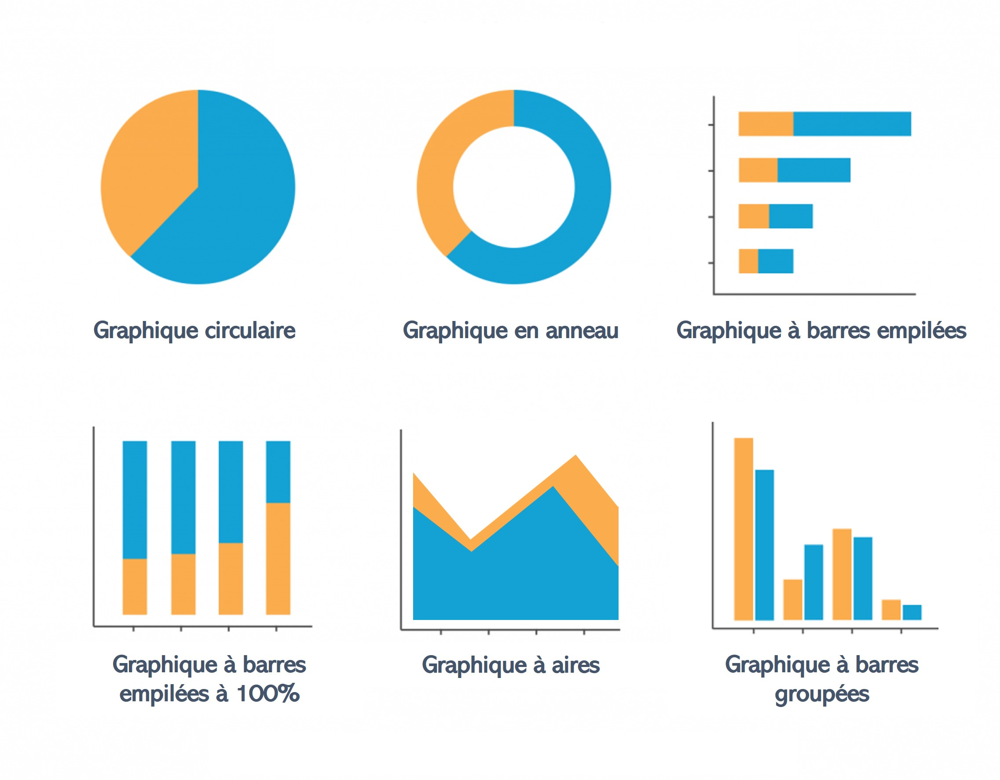
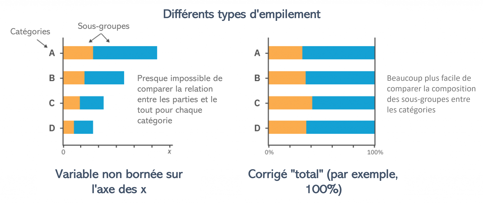

```{r, eval = F, include = F}
Salut étudiant du GRAPH Courses !

Ceci est un document CODE ALONG où vous pouvez taper du code pendant que vous suivez la vidéo de leçon.

Nous vous encourageons à le faire ; taper le code avec l'enseignant est le meilleur moyen d'apprendre la bonne syntaxe.
```

```{r, echo = F, message = F, warning = F}
# MORCEAU DE CONFIGURATION. N'oubliez pas d'exécuter tout ce morceau avant de continuer la leçon.

knitr::opts_chunk$set(fig.width = 4.5, fig.height = 3, warning = F, message = F)

# Load packages 
if(!require(pacman)) install.packages("pacman")
pacman::p_load(rlang, tidyverse, knitr, here, janitor,  reactable, gt, flextable)

## functions
source(here::here("global/functions/misc_functions.R"))

## default render
registerS3method("reactable_5_rows", "data.frame", reactable_5_rows)
#knitr::opts_chunk$set(class.source = "tgc-code-block", render = reactable_5_rows)
```

------------------------------------------------------------------------
# Visualisation des comparaisons et compositions

## Introduction

Bienvenue dans notre tutoriel sur la visualisation des comparaisons et compositions avec {ggplot2} en R. Analyser et comparer des catégories, ainsi que représenter visuellement la composition d'éléments, sont des aspects fondamentaux de la visualisation des données en R.

Dans cette leçon, nous explorerons une variété de techniques de visualisation pour ces deux applications !

Nous commencerons notre parcours en examinant les graphiques en barres, un élément fondamental de la visualisation des données. Les graphiques en barres offrent une polyvalence exceptionnelle, permettant des comparaisons simples entre des catégories diverses. Cependant, lorsque notre objectif est de comprendre les proportions ou les compositions, les camemberts et les graphiques en anneau entrent en jeu. Ces graphiques se révèlent inestimables pour représenter visuellement des données où la somme cumulative de toutes les parties constitue un tout.

Ce tutoriel vise à vous doter des compétences nécessaires pour visualiser efficacement des données agrégées et effectuer des comparaisons. À la fin, vous aurez une compréhension solide de l'utilisation des fonctions {ggplot2} pour visualiser et comparer des groupes dans vos données, améliorant votre capacité à tirer des perspectives significatifs de vos ensembles de données. Commençons !



------------------------------------------------------------------------

## Objectifs d'apprentissage

‣ Comprendre la différence entre la visualisation des comparaisons et la visualisation des compositions, et se rappeler les types de graphiques appropriés pour ces deux types d'analyses.

‣ Créer et personnaliser des graphiques en barres à l'aide de {ggplot2} pour comparer des données catégorielles, avec `geom_col()`, `geom_errorbar()` et des ajustements de `position`.

‣ Créer des graphiques à aires avec `geom_area()` pour visualiser des comparaisons.

‣ Comprendre les principes de création de camemberts et de graphiques en anneau efficaces pour visualiser des compositions.

‣ Créer et personnaliser des camemberts et des graphiques en anneau à l'aide de `coord_polar()` avec `geom_col()`.

------------------------------------------------------------------------

## Charger les packages

Dans cette leçon, nous utiliserons les packages suivants :

‣ `{tidyverse}` pour la manipulation et la visualisation des données

‣ `{here}` pour les chemins de fichiers relatifs au projet

```{r}
pacman::p_load("tidyverse", "here")
```

------------------------------------------------------------------------

## Données : Résultats du traitement de la tuberculose au Bénin

Dans le domaine de la santé publique, les données se présentent souvent sous des formes qui nécessitent de comparer des métriques entre des sous-groupes, ou de comprendre les contributions relatives à un décompte total.

Aujourd'hui, nous examinerons des données tuberculeuses (TB) au niveau sous-national du Bénin. Les données ont été fournies par l'OMS et sont hébergées sur ce [tableau de bord DHIS2](https://tbhistoric.org/). Nous examinerons un sous-ensemble de ces données, avec des enregistrements des résultats du traitement des patients atteints de tuberculose dans les hôpitaux, de 2015 à 2017.

Importons le sous-ensemble de données `tb_resultat`.

```{r render = reactable_10_rows, message = FALSE}
# Importer les données depuis un fichier CSV
tb_resultat <- read_csv(here::here('data/benin_tb_fr.csv'))

# Afficher le tableau de données
tb_resultat
```

Voici les définitions détaillées des variables pour chaque colonne :

1.  **`periode`** et **`date_periode`** : enregistrent la période pour chaque entrée dans le jeu de données. Les périodes sont marquées trimestriellement, à partir du premier trimestre de 2015 (représenté par `2015Q1`) jusqu'au dernier trimestre de 2017 (`2017Q4`). Cela nous permet de suivre la progression et les changements dans les cas de tuberculose au fil du temps.

2.  **`hopital`** : indique l'établissement de santé spécifique où les cas de tuberculose ont été enregistrés. Ces établissements représentent différentes zones géographiques et administratives, chacune ayant des caractéristiques et des capacités uniques. Ce sous-ensemble de données contient des enregistrements de résultats de traitement provenant de cinq établissements de santé : St Jean De Dieu, CHPP Akron, CS Abomey-Calavi, Hopital Bethesda, Hopital Savalou, et Hopital St Luc. Ces informations peuvent être utilisées pour analyser et comparer la prévalence et les résultats du traitement de la tuberculose dans différents établissements.

3.  **`resultat`** : cette colonne catégorise les cas de tuberculose en fonction du type de diagnostic et du stade de leur parcours de traitement. Chaque variable correspond à un aspect différent du diagnostic du patient et de l'évolution de son traitement :

    -   **`termine`** : a commencé le traitement et le résultat respectif indique qu'il est complet.

    -   **`perdu`** : nombre de nouveaux cas ou de rechutes ayant commencé le traitement et pour lesquels le résultat respectif est indiqué comme une perte de suivi

    -   **`gueri`** : a commencé le traitement et le résultat respectif indique qu'il est guéri (et confirmé par au moins deux résultats clairs d'examens de crachats)

    -   **`decede`** : représente les cas de tuberculose ayant entraîné la mort du patient pendant le traitement, comprenant à la fois les cas confirmés bactériologiquement et les cas diagnostiqués cliniquement. est décédé pendant le traitement

    -   **`echec`** : il s'agit des cas où le traitement a échoué, ce qui est confirmé pour les patients testés bactériologiquement et observé chez les cas diagnostiqués cliniquement.

    -   **`non_evalue`** : il s'agit des cas de tuberculose qui ont commencé le traitement mais pour lesquels aucun résultat d'évaluation du traitement n'est disponible. Cela s'applique aux cas confirmés bactériologiquement et aux cas diagnostiqués cliniquement.

4.  **`type_diagnostic`** : cette colonne catégorise les cas de tuberculose en fonction de la méthode de diagnostic. Il existe deux types de diagnostics inclus dans ce jeu de données :

    -   **`bacteriologique`** : il s'agit des cas où la présence de la bactérie de la tuberculose est confirmée par des méthodes d'examen bactériologique, telles que la microscopie des crachats ou les méthodes de culture.

    -   **`clinique`** : il s'agit des cas où le diagnostic de la tuberculose est établi sur la base de signes et symptômes cliniques, sans confirmation bactériologique. Cela se produit généralement lorsque les tests bactériologiques ne sont pas disponibles ou ne sont pas concluants, et le patient présente des symptômes de tuberculose.

5.  **`cas`** : le nombre de nouveaux cas ou de rechutes commençant un traitement. Cela permet une analyse quantitative des cas de tuberculose, telle que le nombre total de nouveaux cas sur une période spécifique ou le nombre de cas ayant terminé le traitement dans un établissement de santé particulier.

------------------------------------------------------------------------

## Visualiser les comparaisons

‣ Les visualisations vous permettent de poser des questions sur vos données, et le type de question que vous voulez poser déterminera le type de graphique.

‣ De nombreuses questions que vous pourriez poser sur vos données dépendront d'une comparaison entre les valeurs.

‣ Quelle région était responsable du plus grand nombre de cas ou de décès ?

‣ Quelle année a donné les meilleurs résultats de traitement ?

‣ Ces questions trouvent rapidement des réponses en rassemblant et en comparant différentes valeurs dans vos données.

### Graphique en barres

‣ L'un des types de graphiques les plus courants sont les graphiques en barres, et pour une bonne raison !

‣ Ils sont souvent la manière la plus efficace et la plus efficace de transmettre des décomptes par groupe ou catégorie afin que des comparaisons puissent être établies entre les barres.

‣ Ils sont particulièrement efficaces lorsque les catégories sont ordinales (c'est-à-dire qu'elles contiennent un ordre inhérent ; par exemple, les groupes d'âge), ou basées sur le temps (par exemple, les mois de l'année).

‣ Mais quand devrions-nous envisager de choisir un graphique en barres/colonnes ?

‣ Les graphiques en barres sont idéalement utilisés lorsqu'on traite des données qui peuvent être **regroupées en catégories** et que l'on souhaite faire des **comparaisons** entre ces catégories.

‣ Lorsque l'on utilise {ggplot2}, on peut utiliser la fonction `geom_col()` pour créer un graphique en barres d'une variable catégorielle par rapport à une variable numérique.

‣ Illustrons cela en visualisant le *Nombre de cas par résultat de traitement* dans l'ensemble de données `tb_resultat` :

```{r}
# Exemple de graphique en barres basique 1 : Fréquence des résultats de traitement
tb_resultat %>% 
  # Transmettre les données à ggplot comme base pour créer la visualisation
  ggplot(
    # Spécifier les variables de l'axe des x et y 
    _______________) + 
  #  geom_col() crée un graphique en barres
  _______________ +
  labs(title = "Nombre de cas par résultat de traitement")
```

‣ Comme nous pouvons le voir sur le graphique ci-dessus, `geom_col()` a automatiquement totalisé le nombre total de cas par résultat, sur l'ensemble des périodes, des hôpitaux et des types de diagnostic.

‣ Nous pouvons également changer la variable de l'axe des x par toute autre variable catégorielle dans les données comme suit :

```{r}
# Exemple de graphique à barres basique 2 : Nombre de cas par hôpital
tb_resultat %>% 
  ggplot(_______________) + 
  _______________ +
  labs(title = "Nombre de cas par hôpital")
```

‣ Pour visualiser correctement les différentes catégories, nous pouvons générer un graphique à barres horizontal en intégrant la fonction `coord_flip()` dans notre code précédent.

```{r}
# Exemple de graphique à barres basique 3 : Barres horizontales
tb_resultat %>% 
  ggplot(_______________) + 
  geom_col() +
  labs(title = "Nombre de cas par hôpital") +
  _______________
```

::: side-note
Nous utiliserons les fonctions `coord_*()` plus tard dans la leçon pour créer des graphiques circulaires.
:::

### Graphiques à barres empilées

‣ Alors que les graphiques à barres précédents représentaient la distribution des cas sur une *seule variable catégorielle*, nous pouvons approfondir notre compréhension en introduisant une *deuxième variable catégorielle* et en créant des **graphiques à barres empilées**.

‣ Cela peut être fait dans `ggplot()` en définissant la couleur de remplissage comme une variable catégorielle :

```{r}
# Graphique à barres empilées : 
tb_resultat %>% 
  ggplot(
    # Couleur de remplissage des barres par la variable 'resultat'
    _______________) + 
  _______________
```

‣ Comme on peut le voir ci-dessus, les graphiques empilés conservent nos *catégories principales* sur l'axe tout en **séparant visuellement les contributions** des différents sous-groupes en divisant les barres en segments plus petits.

### Graphiques à barres groupées

‣ Les graphiques à barres groupées offrent une représentation côte à côte des sous-groupes au sein de chaque catégorie principale.

‣ Nous pouvons définir l'argument `position` sur `"dodge"` dans `geom_col()` pour afficher les barres côte à côte :

```{r}
# Graphique à barres groupées : 
tb_resultat %>% 
  ggplot(_______________) +
  # Ajouter l'argument de position pour des barres côte à côte 
  _______________
```

‣ Les graphiques à barres groupées ne sont pas idéaux lorsqu'il y a trop de groupes.

‣ Nous pouvons réessayer avec une autre variable de regroupement qui a moins de catégories :

```{r}
# Graphique à barres groupées : divisé en 2 barres
tb_resultat %>% 
  ggplot(
    # Couleur de remplissage des barres par 'type_diagnostic' 
    _______________) +
  _______________
```

**PRATIQUEZ !**

::: practice
**Question 1: Graphique à barres basique**

Écrivez le code adéquat qui génère un graphique à barres basique du nombre de cas par trimestre avec `date_periode` sur l'axe des x

```{r eval = F}
tb_resultat %>% 
  ggplot(aes(x = _________, y = __________)) + 
  geom_col()
```

**Question 2: Graphique à barres empilées**

Créez un graphique à barres empilées pour afficher les résultats du traitement sur différentes périodes

```{r eval = F}
tb_resultat %>% 
  ggplot(_______________) + 
  _______________
```
:::

### Ajout de barres d'erreur

‣ La visualisation des données avec des barres d'erreur permet une compréhension plus claire de la variabilité ou de l'incertitude inhérente au jeu de données.

‣ Les barres d'erreur peuvent indiquer la fiabilité d'un score moyen ou d'un point de données individuel, fournissant un contexte aux valeurs tracées.

‣ Pour implémenter des barres d'erreur dans {ggplot2}, nous utilisons la fonction `geom_errorbar()`.

‣ Cela nécessite une valeur pour la plage de votre erreur, généralement définie par l'écart type, l'erreur standard ou les intervalles de confiance.

‣ Voici un exemple d'ajout de barres d'erreur à notre graphique `geom_col()` groupé ci-dessus.

‣ Tout d'abord, créons les données récapitulatives nécessaires, car nous devons avoir une sorte de mesure d'erreur.

```{r render = reactable_5_rows}
hop_dx_erreur <- tb_resultat %>%  
  group_by(_______________) %>% 
  summarise(_______________)

hop_dx_erreur
```

```{r}
# Recréer le graphique à barres groupées et ajouter des barres d'erreur
hop_dx_erreur %>% 
  ggplot(_______________) +
  geom_col(_______________) +  # Éviter les barres
  #  geom_errorbar() ajoute des barres d'erreur
  geom_errorbar(
    # Spécifier les limites supérieures et inférieures des barres d'erreur
    _______________ # Éviter les barres d'erreur pour les aligner avec les barres côte à côte
  )
```

### Graphiques à aires

‣ Dans cette section, nous allons explorer les graphiques à aires avec `geom_area()`.

‣ Ces graphiques sont particulièrement avantageux pour visualiser une plage de valeurs de données ou la progression des données au fil du temps.

‣ Ils sont idéaux pour des cas d'utilisation tels que le suivi du nombre de nouveaux cas de traitement par trimestre.

‣ Commençons par visualiser cette distribution avec un graphique à barres empilées.

```{r}
tb_resultat %>% 
  ggplot(_______________) + 
  _______________
```

‣ Contrairement à `geom_col()`, `geom_area()` ne calculera pas automatiquement les sommes pour chaque catégorie.

‣ Nous devons regrouper et résumer nos données afin d'obtenir un cadre de données avec la somme des cas pour chaque résultat de traitement par trimestre.

```{r render = reactable_5_rows}
# Créer un cadre de données de synthèse
resultat_par_periode <- tb_resultat %>% 
  group_by(_______________) %>% 
  summarise(_______________)

resultat_par_periode
```

```{r}
# Graphique à aires des cas traités au fil du temps
resultat_par_periode %>% 
ggplot(
  aes(
    _______________,    # Mapper 'periode' sur l'axe des x
    _______________,     # Mapper 'value' sur l'axe des y
    _______________   # Mapper 'variable_name' à l'esthétique de remplissage
  )) +
  # geom_area() crée un graphique à aires
  _______________
```

‣ Supposons maintenant que nous voulons savoir quelle issue contribue le plus à chaque section, ou suivre la proportion de cas guéris à chaque période au fil du temps.

‣ Ces questions impliquent également des comparaisons, mais elles sont subtilement différentes.

‣ Au lieu de comparer les valeurs totales, nous voulons comparer la contribution relative de ces valeurs à un ensemble plus vaste en tant que proportions ou pourcentages.

‣ En d'autres termes, nous sommes intéressés à examiner la composition ou les relations partie-ensemble.

‣ Dans la prochaine section, nous apprendrons comment visualiser ces relations.

**PRATIQUEZ !**

::: practice

**Question 3: Graphique en aires**

Créez un graphique en aires qui illustre la variation temporelle du nombre total de cas tout en comparant simultanément différents types de diagnostics.

```{r eval = F}
tb_resultat %>% 
  group_by(________________) %>% 
  summarise(________________) %>% 
ggplot(
  aes(
    x = __________,
    y = __________,
    fill = __________)) +
  ________________
```
:::

------------------------------------------------------------------------

## Visualiser les compositions

‣ Avec les compositions, nous voulons montrer comment les parties individuelles constituent le tout.

‣ Nous pourrions essayer de répondre à ces questions en utilisant les types de graphiques discutés ci-dessus, mais il existe de nombreux types de graphiques dédiés aux compositions qui font un bien meilleur travail.

‣ Ces types de graphiques de partie à tout focalisent immédiatement notre attention visuelle sur l'importance relative de chaque partie par rapport à la valeur totale dans les données.

### Graphique à barres empilées en pourcentage

‣ Pour visualiser une composition ou une relation partie-tout, nous avons besoin de deux éléments : les parties et le tout.

‣ Les graphiques à barres empilées que nous avons créés précédemment font un travail assez correct de cela.

```{r}
# Graphique à barres empilées régulier
tb_resultat %>% 
  ggplot(_______________) + 
  _______________
```

‣ Ils nous montrent des parties du tout, mais tous les ensembles sont de tailles différentes.

‣ La hauteur des barres représente le nombre total de cas, qui est différent à chaque endroit.

‣ Examiner la distribution relative des résultats serait beaucoup plus facile si chaque barre était de la même taille.

‣ Nous pouvons le faire en créant un graphique à barres empilées à 100 %, où la hauteur totale de chaque barre est normalisée à la même taille, montrant ainsi les proportions plutôt que les nombres ou les valeurs absolues.



‣ Cela est réalisé en définissant l'argument `position` sur `"fill"` dans `geom_col()`.

```{r}
# Graphique à barres empilées en pourcentage
tb_resultat %>% 
  ggplot(_______________) + 
  # Ajouter l'argument de position pour des barres normalisées
  geom_col(_______________)
```

‣ Toutes les barres ont maintenant la même longueur, ce qui signifie que tous les ensembles sont maintenant de la même taille. Cela nous permet maintenant d'évaluer facilement les contributions des différentes parties au tout.

### Graphiques circulaires

‣ Dans cette section, nous allons explorer les visualisations de données circulaires, en particulier les graphiques en secteurs (pie charts) et les graphiques en anneau (donut plots), pour illustrer la distribution des données catégorielles.

‣ Ces types de graphiques peuvent être assez controversés au sein de la communauté de la visualisation des données en raison de leur tendance à déformer l'interprétation des données.

‣ Cependant, lorsqu'ils sont utilisés judicieusement, ils peuvent offrir un aperçu intuitif des proportions au sein d'un ensemble de données.

::: watch-out
‣ Plongez dans les graphiques en anneau et les graphiques circulaires avec une note de prudence : ils sont visuellement attrayants mais peuvent être trompeurs.

‣ Reconnaissez que les graphiques à barres surpassent souvent ces graphiques pour fournir des interprétations précises des données.

‣ Comprenez que notre cerveau préfère comparer des longueurs (comme des barres) plutôt que des angles ou des surfaces (comme des parts de gâteau).

‣ Rappelez-vous que, à mesure que les catégories de données augmentent, les graphiques circulaires peuvent devenir trop chargés et perdre en clarté.

‣ Reconnaissez leur incapacité à afficher efficacement les changements au fil du temps, contrairement au graphique à barres habile.

‣ Utilisez les graphiques circulaires et en anneau avec parcimonie, en gardant à l'esprit leur potentiel à obscurcir la véritable histoire des données.
:::

‣ Avant de pouvoir visualiser les données, nous devons d'abord les agréger pour obtenir le total des occurrences de chaque catégorie de résultats de traitement, afin de garantir une représentation claire de chaque segment de notre ensemble de données.

```{r render = reactable_5_rows}
resultat_total <- tb_resultat %>% 
  group_by(_______________) %>% 
  summarise(_______________)

resultat_total
```

‣ Un graphique en secteurs est essentiellement une version ronde d'un seul barre empilée à 100 %.

```{r}
# Graphique à barre unique (précurseur du graphique en secteurs)
ggplot(_______________, 
       aes(_______________, # Définir une valeur arbitraire pour x
           _______________,
           _______________)) +
  geom_col()
```

‣ Dans ggplot2, nous allons explorer comment les fonctions `coord_*()` peuvent changer la perspective d'un graphique, comme ajuster les rapports d'aspect ou les limites des axes.

‣ Nous allons transformer notre graphique de coordonnées linéaires en coordonnées polaires en utilisant `coord_polar()`, ce qui façonnera nos données en tranches pour un graphique en secteurs.

‣ En cartographiant l'esthétique `y` aux angles (en utilisant l'argument `theta`), nous allons collaborativement créer une visualisation qui affiche clairement la distribution de nos données catégorielles.

```{r}
# graphique en secteurs de base
ggplot(_______________) +
  geom_col() +
  coord_polar(_______________) # Changer l'axe y pour qu'il soit circulaire
```

‣ Les graphiques en anneau, également appelés graphiques en anneau, sont une alternative aux graphiques en secteurs et peuvent être créés dans {ggplot2} de manière similaire.

‣ Les graphiques en anneau, ou graphiques en donut, offrent une variation captivante par rapport aux graphiques circulaires traditionnels et sont à notre portée grâce à ggplot2 en R.

‣ Nous construisons ces graphiques avec un processus similaire à celui des graphiques circulaires, mais en ajoutant des touches distinctives.

‣ En utilisant `geom_col()`, nous jetons les bases avec un graphique à barres.

‣ La transformation en cercle se fait ensuite avec `coord_polar(theta = "y")`.

‣ Avec `xlim(c(0.2, 4 + 0.5))`, nous préparons le terrain pour la caractéristique distinctive du donut : son vide central.

‣ La limite inférieure de `0.2` crée l'espace pour le trou du donut, tandis que `4.5` à la limite supérieure garantit que chaque catégorie a sa place.

‣ Un graphique en anneau peut être créé en utilisant `geom_col()`, `coord_polar(theta = "y")` et en définissant une limite sur l'axe x avec `xlim` comme ceci :

```{r}
# Transformez-le en graphique en anneau
ggplot(_______________) +
  geom_col() +
  coord_polar(_______________) + 
  _______________ # Définir les limites de l'axe x
```

‣ La valeur x contrôle la taille du trou.

‣ Remplacez 4 par le paramètre de substitution `hsize` qui peut varier.

‣ Plus la valeur est grande, plus le trou est grand. Notez que la taille du trou doit être supérieure à 0.

```{r}
# Définir la largeur du trou
hsize <- _______________

ggplot(_______________) +
  geom_col() +
  coord_polar(_______________) +
  _______________

# Augmenter la valeur pour agrandir le trou
hsize <- _______________

ggplot(_______________) +
  geom_col() +
  coord_polar(_______________) +
  _______________

# Diminuer la valeur pour réduire la taille du trou
hsize <- _______________

ggplot(_______________) +
  geom_col() +
  coord_polar(_______________) +
  _______________

```

‣ La bordure, les couleurs de remplissage et le thème du graphique en anneau peuvent être personnalisés de plusieurs façons. Le code ci-dessous illustre quelques options de personnalisation :

```{r}
# Esthétique améliorée
ggplot(_______________) +
  geom_col(_______________) + # Ajouter des bordures blanches
  _______________
  _______________ + # Définir la palette de couleurs
  theme_void() # Supprimer l'arrière-plan, la grille, les étiquettes numériques
```

‣ Nous pouvons utiliser des données résumées pour représenter la distribution des cas par période à l'aide d'un tracé de facettes.

‣ Pour cela, nous pouvons créer un graphique avec des facettes comme ci-dessous.

‣ Dans ce graphique, chaque facette correspond à une période temporelle, affichant la proportion des résultats de cas dans des colonnes empilées.

‣ Les variations de couleur indiquent les résultats spécifiques, et le graphique en anneau offre une perspective concise de l'évolution des cas au fil du temps.

```{r}
# Tracé facettes à l'aide des données de résumé précédentes
ggplot(_______________, aes(_______________)) +
  geom_col(_______________) +
  coord_polar(_______________) + 
  xlim(c(_______________)) +
  theme_void() +
  _______________
```

::: recap
‣ Qu'ont en commun les barres empilées, les graphiques en secteurs et les graphiques en anneau ? Ce sont tous des types de graphiques de parties à tout !

‣ En plus de permettre des comparaisons, visualiser la composition des choses est l'une des applications les plus importantes de la visualisation des données.

‣ Ces visualisations fonctionnent pour des données regroupées en plusieurs sous-catégories, où notre objectif est de voir combien chaque catégorie représente du total.

‣ L'examen de ces relations "parties à tout" peut fournir des informations sur les données démographiques, l'allocation budgétaire, les niveaux d'accord, et plus encore.
:::

::: practice
**Question 4 : L'image complète**

En utilisant l'ensemble de données `tb_resultat`, créez une représentation visuelle qui compare la proportion de cas de tuberculose par résultat à travers différents types de diagnostics. Votre visualisation doit :

‣ Regrouper les données par `resultat` et `type_diagnostic`.

‣ Résumer le nombre total de cas pour chaque groupe, en tenant compte des éventuelles valeurs manquantes (NA).

‣ Afficher ces informations dans une série de graphiques en anneau (donut charts), un pour chaque type de diagnostic, montrant la proportion de chaque résultat dans le type de diagnostic.

‣ Assurez-vous que les graphiques aient un aspect propre avec des bordures **`white`** autour des segments et sans arrière-plan ni lignes de grille.

‣ Organiser les graphiques en anneau individuels pour chaque type de diagnostic en utilisant facet_wrap.

Écrivez le code R pour créer cette visualisation.

```{r eval = FALSE}
tb_resultat %>% 
  group_by(___________________) %>% 
  summarise(
    cas_total = sum(___________________)) %>% 
ggplot(aes(___________________)) +
  geom_col(color = _______, position = _______) +
  coord_polar(___________) + 
  xlim(c(___________________)) +
  theme_void() +
  face_wrap()
```
:::

## En Résumé ! {.unnumbered}

Félicitations pour avoir suivi ce tutoriel sur la visualisation des comparaisons et compositions avec {ggplot2} en R !

En débutant notre exploration par les graphiques en barres, élément essentiel de la visualisation des données, nous avons apprécié leur polyvalence pour des comparaisons directes entre catégories diverses. Toutefois, pour saisir les proportions ou les compositions, les graphiques circulaires et les graphiques en anneau deviennent cruciaux, offrant une représentation visuelle inestimable pour des données où la somme cumulative de toutes les parties constitue un tout significatif.

Continuez à explorer et à pratiquer ces concepts pour renforcer vos compétences en visualisation des données avec {ggplot2} et à les appliquer dans vos projets d'analyse de données.

Bonne visualisation !

## Solutions {.unnumbered}

**Question 1: Graphique à barres basique**

```{r eval = F}
# Réponse à la question PQ1 :
tb_resultat %>% 
  ggplot(aes(x = date_periode,
             y = cas)) + 
  geom_col()
```

**Question 2: Graphique à barres empilées**

```{r eval = F}
# Réponse à la question PQ2 :
tb_resultat %>% 
  ggplot(
    aes(x = date_period, 
        y = cas,
        fill = resultat)) + 
  geom_col()
```

**Question 3: Graphique en aires**

```{r eval = F}
# Réponse à la question PQ3
tb_resultat %>% 
  group_by(date_periode, type_diagnostic) %>% 
  summarise(
    cas_total = sum(cas, na.rm = T)) %>% 
ggplot(
  aes(
    x = date_periode,
    y = cas_total,
    fill = type_diagnostic)) +
  geom_area()
```

**Question 4: L'image complète**

```{r eval = F}
# Réponse à la question PQ4
tb_resultat %>% 
  group_by(resultat, type_diagnostic) %>% 
  summarise(
    cas_total = sum(cas, na.rm = T)) %>% 
ggplot(aes(x=hsize, y=cas_total, fill=resultat)) +
  geom_col(color = "white", position = "fill") +
  coord_polar(theta = "y") + 
  xlim(c(0.2, hsize + 0.5)) +
  theme_void() +
  facet_wrap(~type_diagnostic)
```

## Contributors {.unlisted .unnumbered}

Les membres suivants de l'équipe ont contribué à cette leçon :

`r tgc_contributors_list(ids = c("benn", "joy", "sabina"))`

## Références {.unnumbered}

Certains éléments de cette leçon ont été adaptés à partir des sources suivantes :

1.  Horst, Allison. "Allisonhorst/Dplyr-Learnr: A Colorful Introduction to Some Common Functions in Dplyr, Part of the Tidyverse." GitHub. Accessed April 6, 2022. <https://github.com/allisonhorst/dplyr-learnr.>