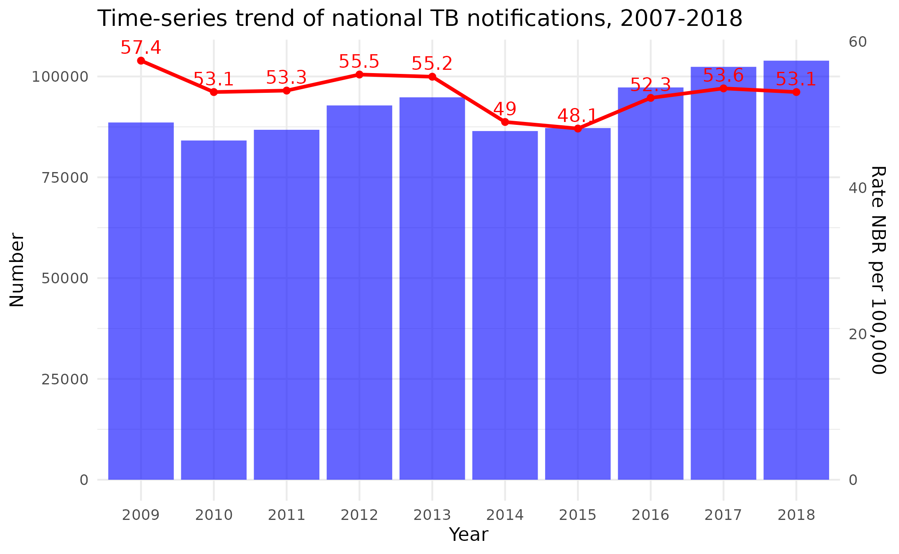

```{r, echo = F, message = F, warning = F}
# Load packages 
if(!require(pacman)) install.packages("pacman")
pacman::p_load(tidyverse, outbreaks, scales, ggrepel, ggthemes)

## functions
source(here::here("global/functions/misc_functions.R"))

## default render
knitr::opts_chunk$set(class.source = "tgc-code-block", warning = FALSE, message = FALSE)
```

# Introduction

En analysant des données de séries temporelles, des données collectées à intervalles réguliers, les épidémiologistes peuvent générer des prévisions, informer les décisions politiques et, finalement, améliorer les mesures de prévention et de contrôle des maladies. Dans cette leçon, nous explorons comment créer et interpréter des séries temporelles épidémiologiques, en utilisant R pour visualiser les données de manière efficace.

{width="408"}

# Objectifs d'Apprentissage

À la fin de cette leçon, vous serez capable de :

- Remodeler les données de séries temporelles pour la représentation graphique avec pivot_longer()
- Créer des graphiques linéaires dans ggplot2 en associant le temps à l'axe x et les valeurs à l'axe y
- Améliorer l'esthétique des graphiques linéaires avec des techniques telles que les étiquettes personnalisées, les palettes de couleurs, les annotations
- Visualiser les intervalles de confiance avec geom_ribbon()
- Mettre en évidence les modèles dans des données bruyantes en utilisant le lissage et l'agrégation
- Comparer des séries temporelles avec des échelles distinctes en utilisant des axes doubles et sec_axis()

# Packages

Installez et chargez les paquets nécessaires avec le bloc de code suivant :

```{r warning = F, message = F}
# Charger les paquets
if(!require(pacman)) install.packages("pacman")
pacman::p_load(dplyr, ggplot2, tidyr, lubridate, outbreaks, scales, ggrepel, ggthemes, zoo, here)
options(scipen=999)
```


::: pro-tip

Définir `options(scipen = 999)` empêche l'utilisation de la notation scientifique dans nos graphiques, rendant les nombres longs plus faciles à lire et à interpréter.

:::


# Introduction aux Graphiques Linéaires pour les Données de Séries Temporelles

Pour commencer à visualiser les données de séries temporelles, nous allons examiner la dynamique des notifications de tuberculose (TB) en Australie au fil du temps, en comparant les notifications dans les zones urbaines et rurales. Le jeu de données source est accessible [ici](https://www.health.vic.gov.au/infectious-diseases/tuberculosis-tb-quarterly-surveillance-report)

::: vocabulary 
**Notifications** est un terme technique pour le nombre de cas d'une maladie qui sont signalés aux autorités de santé publique.
:::

## Préparation des Données : Agrégation et Pivotement

Commençons par charger et inspecter les données :

```{r}
tb_data_aus <- read_csv(here::here("data/aus_tb_notifs.csv"))
head(tb_data_aus)
```

Ce jeu de données comprend les colonnes `period` (temps en format trimestriel, par exemple, '1993Q1'), `rural` (cas dans les zones rurales) et `urban` (cas dans les zones urbaines).

Nous aimerions visualiser le nombre de notifications annuelles de TB dans les zones urbaines et rurales, mais les données sont actuellement au format trimestriel. Ainsi, nous devons agréger les données par année.

Commençons par extraire l'année de la colonne `period`. Nous faisons cela en utilisant la fonction `str_sub()` du paquet `stringr` :

```{r}
tb_data_aus %>% 
  mutate(year = str_sub(period, 1, 4)) %>% 
  # reconvertir en numérique
  mutate(year = as.numeric(year))
```

La fonction `str_sub()` prend trois arguments : la chaîne à partir de laquelle nous voulons extraire, la position de départ et la position de fin. Dans ce cas, nous voulons extraire les quatre premiers caractères de la colonne `period`, qui correspondent à l'année.

Maintenant, agrégeons les données par année. Nous pouvons le faire en utilisant les fonctions `group_by()` et `summarise()` :

```{r}
annual_data_aus <- tb_data_aus %>%
  mutate(year = str_sub(period, 1, 4)) %>% 
  mutate(year = as.numeric(year)) %>% 
  # grouper par année
  group_by(year) %>% 
  # sommer le nombre de cas chaque année
  summarise(rural = sum(rural), 
            urban = sum(urban))
annual_data_aus
```


Maintenant que nous semblons avoir les données dans le format souhaité, faisons un premier graphique linéaire :

```{r}
ggplot(annual_data_aus, aes(x = year)) +
  geom_line(aes(y = urban, couleur = "Urbain")) + 
  geom_line(aes(y = rural, couleur = "Rural"))
```

C'est un graphique informatif, cependant, il y a une certaine redondance inutile dans le code, bien que vous ne le réalisiez peut-être pas encore. Cela deviendra plus clair si nous essayons d'ajouter d'autres géométries, comme des points ou du texte :

```{r}
ggplot(annual_data_aus, aes(x = year)) +
  geom_line(aes(y = urban, couleur = "Urbain")) + 
  geom_line(aes(y = rural, couleur = "Rural")) + 
  geom_point(aes(y = urban, couleur = "Urbain")) + 
  geom_point(aes(y = rural, couleur = "Rural")) + 
  geom_text(aes(y = urban, label = urban), size = 2, nudge_y = 20) + 
  geom_text(aes(y = rural, label = rural), size = 2, nudge_y = 20)
```

Comme vous pouvez le voir, nous devons répéter les mêmes lignes de code pour chaque géométrie. Cela est non seulement fastidieux, mais rend également le code plus difficile à lire et à interpréter. Si nous avions plus de deux catégories, comme cela arrive souvent, cela serait encore plus encombrant.

Heureusement, il existe une meilleure façon de faire. Nous pouvons utiliser la fonction `pivot_longer()` du package {tidyr} pour remodeler les données dans un format plus adapté pour la représentation graphique :

```{r}
# Utilisation de `pivot_longer` de tidyr pour remodeler les données
annual_data_aus %>%
  pivot_longer(cols = c("urban", "rural"))
```

Le code ci-dessus a converti les données d'un format "large" à un format "long". C'est un format plus adapté pour la représentation graphique, car il nous permet d'associer une colonne spécifique à l'esthétique `couleur`.

Avant de représenter ce jeu de données long, renommons les colonnes pour les rendre plus informatives :

```{r}
aus_long <- annual_data_aus %>%
  pivot_longer(cols = c("urban", "rural")) %>% 
  rename(region = name, cases = value)
```


## Un Graphique Linéaire Groupé Basique

Nous sommes prêts à représenter à nouveau les données. Nous associons les esthétiques couleur et groupe à la colonne `region`, qui contient les deux catégories d'intérêt : urbain et rural.

```{r}
ggplot(aus_long, aes(x = year, y = cases, couleur = region, groupe = region)) +
  geom_line()
```

Le code de tracé est maintenant plus concis, grâce à l'opération de pivotement effectuée précédemment.

Nous pouvons maintenant également ajouter des points et des étiquettes textuelles avec beaucoup moins de code :

```{r}
ggplot(aus_long, aes(x = year, y = cases, coulour = region, group = region)) +
  geom_line() +
  geom_point() +
  geom_text(aes(label = cases), size = 2, nudge_y = 20)
```


Super ! Nous avons maintenant une vue claire des tendances des notifications annuelles de cas de tuberculose (TB) dans les zones rurales et urbaines au fil du temps. Cependant, il y a encore des améliorations esthétiques que nous pouvons apporter ; nous les aborderons dans la section suivante.

::: practice

### Q : Remodelage et Représentation des Données sur la Tuberculose {.unlisted .unnumbered}

Considérez le jeu de données du Bénin montré ci-dessous, qui contient des informations sur les cas de tuberculose confirmés bactériologiquement et diagnostiqués cliniquement pendant plusieurs années au Bénin. (Les données proviennent d'un article [ici](https://www.ncbi.nlm.nih.gov/pmc/articles/PMC4884892/)

```{r}
tb_data_benin <- read_csv(here("data/benin_tb_notifs.csv"))
tb_data_benin
```

Remodelez le jeu de données en utilisant `pivot_longer()`, puis créez un graphique avec deux lignes, une pour chaque type de diagnostic de cas de tuberculose. Ajoutez des points et des étiquettes textuelles au graphique.
:::

# Améliorations Esthétiques des Graphiques Linéaires

Dans cette section, nous allons nous concentrer sur l'amélioration de l'esthétique des graphiques linéaires de séries temporelles pour renforcer leur clarté et leur attrait visuel.

## Réduction de la Fréquence des Étiquettes

Lorsque nous avons laissé le graphique, il ressemblait à ceci :

```{r}
ggplot(aus_long, aes(x = year, y = cases, coulour = region, groupe = region)) +
  geom_line() +
  geom_point() +
  geom_text(aes(label = cases), size = 2, nudge_y = 20)
```

Un problème avec ce graphique est que les étiquettes textuelles sont un peu trop petites. De telles étiquettes minuscules ne sont pas idéales pour un graphique destiné au public, car elles sont difficiles à lire. Cependant, si nous augmentons la taille des étiquettes, celles-ci commenceront à se chevaucher, comme illustré ci-dessous :

```{r}
ggplot(aus_long, aes(x = year, y = cases, coulour = region, groupe = region)) +
  geom_line() +
  geom_point() +
  geom_text(aes(label = cases), size = 2.8, nudge_y = 20)
```

Pour éviter cet encombrement, une technique pratique consiste à afficher des étiquettes seulement pour certaines années. Pour ce faire, nous pouvons fournir un jeu de données personnalisé à la fonction `geom_text()`. Dans ce cas, nous allons créer un jeu de données qui contient uniquement les années paires :

```{r}
even_years <- aus_long %>%
  filter(year %% 2 == 0) # Garder uniquement les années qui sont des multiples de 2

ggplot(aus_long, aes(x = year, y = cases, coulour = region, group = region)) +
  geom_line() + 
  geom_point() + 
  geom_text(data = even_years, aes(label = cases), 
            size = 2.8, nudge_y = 20)
```

Super, nous avons maintenant des étiquettes plus grandes et elles ne se chevauchent pas.


## Alternance des Étiquettes

Bien que le graphique ci-dessus soit une amélioration, il serait encore mieux si nous pouvions afficher les étiquettes pour *toutes* les années. Nous pouvons le faire en affichant les étiquettes des années paires au-dessus des points de données, et les étiquettes des années impaires en dessous.

Inclure de nombreux points de données (dans la limite du raisonnable) dans vos graphiques est utile pour les responsables de la santé publique ; car ils peuvent rapidement tirer des chiffres du graphique lorsqu'ils essaient de prendre des décisions, sans avoir besoin de consulter les ensembles de données de référence.

Pour cela, créons un jeu de données filtré pour les années impaires, puis utilisons `geom_text()` deux fois, une fois pour chaque jeu de données filtré.

```{r}
odd_years <- aus_long %>%
  filter(year %% 2 != 0) # Garder uniquement les années qui NE SONT PAS des multiples de 2

ggplot(aus_long, aes(x = year, y = cases, coulour = region, groupe = region)) +
  geom_line() + 
  geom_point() + 
  geom_text(data = even_years, aes(label = cases), 
            nudge_y = 20, size = 2.8) +
  geom_text(data = odd_years, aes(label = cases), 
            nudge_y = -20, size = 2.8)
```

## `ggrepel::geom_text_repel()`

Le graphique ci-dessus est clair, mais il y a encore un certain chevauchement entre les étiquettes et la ligne.

Pour améliorer encore plus la clarté, nous pouvons utiliser la fonction `geom_text_repel()` du package {ggrepel}.

Cette fonction décale individuellement les étiquettes pour éviter le chevauchement et relie les étiquettes à leurs points de données avec des lignes, rendant plus facile de voir à quel point de données chaque étiquette correspond, et nous permettant d'augmenter la distance entre les étiquettes et les points de données.

```{r}
ggplot(aus_long, aes(x = year, y = cases, coulour = region, group = region)) +
  geom_line() + 
  geom_point() + 
  geom_text_repel(data = even_years, aes(label = cases), 
                  nudge_y = 60, size = 2.8, segment.size = 0.1) +
  geom_text_repel(data = odd_years, aes(label = cases), 
                  nudge_y = -60, size = 2.8, segment.size = 0.1)
```

Comme vous pouvez le voir, la fonction `geom_text_repel()` prend essentiellement les mêmes arguments que `geom_text()`. L'argument supplémentaire, `segment.size`, contrôle la largeur des lignes reliant les étiquettes aux points de données.


## Personnalisation de la Palette de Couleurs

Il est souvent utile de personnaliser la palette de couleurs de vos graphiques, pour qu'elle corresponde, par exemple, à la charte graphique de votre organisation.

Nous pouvons personnaliser les couleurs des lignes en utilisant la fonction `scale_color_manual()`. Ci-dessous, nous spécifions deux couleurs, une pour chaque région :

```{r}
ggplot(aus_long, aes(x = year, y = cases, coulour = region, group = region)) +
  geom_line() + 
  geom_point() + 
  geom_text_repel(data = even_years, aes(label = cases), 
                  décalage_y = 60, taille = 2.8, segment.size = 0.1) +
  geom_text_repel(data = odd_years, aes(label = cases), 
                  décalage_y = -60, taille = 2.8, segment.size = 0.1) +
  scale_color_manual(values = c("urbain" = "#0fa3b1", 
                                "rural" = "#2F2C4E"))
```

Succès !

## Ajout d'Annotations au Graphique

Enfin, ajoutons une série de touches finales. Nous allons annoter le graphique avec des titres appropriés, des étiquettes d'axe et des légendes, et modifier le thème :

```{r}
ggplot(aus_long, aes(x = year, y = cases, coulour = region, groupe = region)) +
  geom_line(largeur_ligne = 1) + 
  geom_text_repel(data = even_years, aes(label = cases), 
                  nudge_y = 60, size = 2.8, segment.size = 0.08) +
  geom_text_repel(data = odd_years, aes(label = cases), 
                  nudge_y = -50, size = 2.8, segment.size = 0.08) +
  scale_color_manual(values = c("urbain" = "#0fa3b1", "rural" = "#2F2C4E")) +
  labs(title = "Notifications de Tuberculose en Australie", 
       subtitle = "1993-2022",
       caption = "Source : Département de la Santé du gouvernement de l'État de Victoria",
       x = "Année",
       coulour = "Région") +
  ggthemes::theme_few() +
  theme(legend.position = "droite")
```

Cela couvre certaines options pour améliorer l'esthétique des graphiques linéaires ! N'hésitez pas à ajuster davantage les visuels en fonction de vos besoins d'analyse spécifiques.

::: recap

Nous avons transformé notre graphique en une représentation visuellement attrayante et facile à lire des tendances des notifications de tuberculose en Australie. Nous avons équilibré le besoin d'informations détaillées avec une présentation claire, rendant notre graphique à la fois informatif et accessible.

:::

::: pratice

### Q : Améliorations esthétiques {.unlisted .unnumbered} 

Considérez le graphique suivant, qui montre le nombre de cas de tuberculose chez les enfants dans trois pays au fil du temps :

```{r}
tb_child_cases_southam <- tidyr::who2 %>% 
  transmute(country, year, 
            tb_cases_children = sp_m_014 + sp_f_014 + sn_m_014 + sn_f_014) %>% 
  filter(country %in% c("Brazil", "Colombia", "Chile")) %>% 
  filter(!is.na(tb_cases_children))

tb_child_cases_southam %>% 
  ggplot(aes(x = year, y = tb_cases_children, color = country)) +
  geom_line() + 
  geom_point() + 
  geom_text(aes(label = tb_cases_children))
```

Améliorez ce graphique en implémentant les améliorations suivantes :

- Réglez les étiquettes `geom_text` pour alterner au-dessus et en dessous des lignes, semblable à l'exemple que nous avons vu ci-dessus.
- Utilisez la palette de couleurs suivante `c("#212738", "#F97068", "#067BC2")`
- Appliquez `theme_classic()`
- Ajoutez un titre, un sous-titre et une légende pour fournir un contexte et des informations sur les données. (Vous pouvez taper `?tidyr::who2` dans la console pour en savoir plus sur la source des données.)

:::

# Représentation des Intervalle de Confiance avec `geom_ribbon()`

Dans les visualisations de séries temporelles, il est souvent important de représenter les intervalles de confiance pour indiquer le niveau d'incertitude de vos données.

Nous allons démontrer comment faire cela en utilisant un jeu de données sur les nouvelles infections par le VIH au Brésil, qui comprend les nombres estimés pour les cas masculins et féminins ainsi que les intervalles de confiance. Le jeu de données est issu de l'Organisation Mondiale de la Santé (OMS) et peut être consulté [ici](https://www.who.int/data/gho/data/indicators/indicator-details/GHO/number-of-new-hiv-infections).

Commençons par charger et inspecter le jeu de données :

```{r}
hiv_data_brazil <- 
  rio::import(here("data/new_hiv_infections_gho.xlsx"), 
                               sheet = "Brazil") %>% 
  as_tibble() %>% 
  janitor::clean_names()
hiv_data_brazil
```


Nous pouvons voir que la colonne `new_hiv_cases` contient à la fois le nombre de cas et les intervalles de confiance correspondants entre crochets. Ce format ne peut pas être utilisé directement pour la représentation graphique, donc nous devons les extraire sous forme numérique pure.

Tout d'abord, pour séparer ces valeurs, nous pouvons utiliser la fonction `separate()` du package {tidyr} :

```{r}
hiv_data_brazil %>% 
  separate(new_hiv_cases, 
           into = c("cases", "cases_lower", "cases_upper"), 
           sep = "\\[|–")
```

Dans le code ci-dessus, nous divisons la colonne `cases_upper` en trois nouvelles colonnes : `cases`, `cases_lower` et `cases_upper`. Nous utilisons `[` et `–` comme séparateurs. Le double antislash `\\` est utilisé pour échapper au crochet, qui a une signification spéciale dans les expressions régulières. Et le `|` est utilisé pour indiquer que soit `[` soit `–` peut être utilisé comme séparateur.

::: pro-tip

Les modèles de langage de grande taille comme ChatGPT sont excellents pour comprendre les expressions régulières. Si vous êtes bloqué avec un code comme `sep = "\\[|–"` et que vous voulez comprendre ce qu'il fait, vous pouvez demander à ChatGPT de vous l'expliquer. Et si vous avez besoin de générer de telles expressions vous-même, vous pouvez demander à ChatGPT de les générer pour vous.

:::

Ensuite, nous devons convertir ces valeurs en chaîne de caractères en valeurs numériques, en supprimant tous les caractères non numériques.

```{r}
hiv_data_brazil_clean <- 
  hiv_data_brazil %>% 
  separate(new_hiv_cases, 
           into = c("cases", "cases_lower", "cases_upper"), 
           sep = "\\[|–") %>% 
  mutate(across(c("cases", "cases_lower", "cases_upper"),
                ~ str_replace_all(.x, "[^0-9]", "") %>% 
                  as.numeric()))

hiv_data_brazil_clean
```

Le code ci-dessus semble complexe, mais essentiellement, il nettoie les données en ne conservant que les caractères numériques, puis convertit ces nombres en valeurs numériques réelles. Voir notre leçon sur la fonction `across()` pour plus de détails.

Nous sommes enfin prêts à représenter les données. Nous utiliserons `geom_ribbon()` de ggplot pour afficher les intervalles de confiance :

```{r}
hiv_data_brazil_clean %>% 
  filter(sex == "Both sexes") %>% 
  ggplot(aes(x = year, y = cases)) +
  geom_line() +
  geom_ribbon(aes(ymin = cases_lower, ymax = cases_upper), alpha = 0.4)
```

La fonction `geom_ribbon()` prend les esthétiques `x` et `y` comme `geom_line()`, mais elle prend également en compte les esthétiques `ymin` et `ymax`, pour déterminer l'étendue verticale du ruban. Nous réglons également la transparence du ruban à l'aide de l'argument `alpha`.

Nous pouvons créer un ruban séparé pour les hommes et les femmes pour comparer leurs tendances d'infection.

```{r}
hiv_data_brazil_clean %>% 
  filter(sex != "Both sexes") %>% 
  ggplot(aes(x = year, y = cases, color = sex, fill = sex)) +
  geom_line() +
  geom_ribbon(aes(ymin = cases_lower, ymax = cases_upper), alpha = 0.4)
```

Il est à noter que les taux d'infection par le VIH chez les femmes ont diminué ces dernières années, mais ceux chez les hommes ont augmenté.

::: practice

### Q : Représentation des intervalles de confiance {.unlisted .unnumbered}

Considérez le jeu de données suivant qui montre le nombre de cas annuels de paludisme au Kenya et au Nigeria. Les données proviennent du dépôt de données de l'Observatoire mondial de la santé de l'OMS et peuvent être consultées [ici](https://www.who.int/data/gho/data/indicators).

```{r}
nig_ken_mal <- read_csv("data/nigeria_kenya_malaria.csv")
nig_ken_mal
```

Écrivez du code pour extraire les intervalles de confiance de la colonne "malaria_cases" et créez un graphique avec des intervalles de confiance en utilisant `geom_ribbon()`. Utilisez une couleur différente pour chaque pays.

:::


# Lissage des Tendances Bruyantes

Lors de l'analyse de données de séries temporelles, il est courant que les mesures quotidiennes ou granulaires montrent beaucoup de bruit et de variabilité, ce qui peut masquer les tendances importantes qui nous intéressent réellement. Les techniques de lissage peuvent aider à mettre en évidence ces tendances et motifs. Nous allons explorer plusieurs techniques à cet effet dans les sections ci-dessous.

Tout d'abord, faisons quelques préparations de données !

## Création d'un Tableau d'Incidence à partir d'une Liste de Cas

Considérez la liste de cas suivante des admissions pédiatriques pour la malaria dans quatre hôpitaux au Mozambique ([Source de données](https://f1000research.com/articles/11-756)) :

```{r}
mal <- 
  rio::import(here("data/pediatric_malaria_data_joao_2021.xlsx")) %>% 
  as_tibble() %>% 
  mutate(date_positive_test = as.Date(date_positive_test)) %>% 
  # Keep data from 2019-2020 
  filter(date_positive_test >= as.Date("2019-01-01"),
         date_positive_test <= as.Date("2020-12-31")) 
mal
```

Chaque ligne correspond à un cas unique de malaria, et la colonne `date_test_positif` indique la date à laquelle l'enfant a été testé positif pour la malaria.

Pour obtenir un décompte des cas par jour - c'est-à-dire, un tableau d'incidence - nous pouvons simplement utiliser `count()` pour agréger les cas par date de test positif :

```{r}
mal %>%
  count(date_positive_test, name = "cases")
```

Cependant, de nombreuses dates manquent - les jours où aucun enfant n'a été admis. Pour créer un tableau d'incidence complet, nous devrions utiliser `complete()` pour insérer les dates manquantes, puis remplir les valeurs manquantes avec 0 :

```{r}
mal_notif_count <- mal %>%
  count(date_positive_test, name = "cases") %>% 
  complete(date_positive_test = seq.Date(min(date_positive_test),
                                         max(date_positive_test), 
                                         by = "day"), 
           fill = list(cases = 0))

mal_notif_count
```

Maintenant, nous avons un tableau d'incidence complet avec le nombre de cas sur 406 jours consécutifs.

Nous pouvons maintenant tracer les données pour voir la tendance globale :

```{r}
# Créer une épicourbe basique en utilisant ggplot2
ggplot(mal_notif_count, aes(x = date_positive_test, y = cases)) +
  geom_line()
```

Nous avons une épicourbe valide, mais comme vous pouvez le remarquer, la variabilité quotidienne rend difficile de voir la tendance globale. Lissage à suivre.


## Lissage avec `geom_smooth()`

Une option pour le lissage est la fonction `geom_smooth()`, qui peut effectuer une régression locale avec `loess` pour lisser la série temporelle. Essayons :

```{r, warning=FALSE, message=FALSE}
ggplot(mal_notif_count, aes(x = date_positive_test, y = cases)) +
  geom_smooth()


# Or we can specify the method explicitly
ggplot(mal_notif_count, aes(x = date_positive_test, y = cases)) +
  geom_smooth(method = "loess")
```

La méthode `loess`, qui signifie "locally weighted scatterplot smoothing", ajuste une courbe lisse aux données en calculant des moyennes pondérées pour les points proches.

Vous pouvez ajuster la sensibilité du lissage en modifiant l'argument `span`. Un `span` de 0.1 donnera un lissage plus sensible, tandis qu'un `span` de 0.9 donnera un lissage moins sensible.

```{r}
# Ajuster la sensibilité du lissage
ggplot(mal_notif_count, aes(x = date_positive_test, y = cases)) +
  geom_smooth(method = "loess", span = 0.1)
```

```{r}
ggplot(mal_notif_count, aes(x = date_positive_test, y = cases)) +
  geom_smooth(method = "loess", span = 0.9)
```

## Lissage par Agrégation

Une autre façon de lisser les données est de les agréger - regrouper les données en intervalles de temps plus grands et calculer des statistiques récapitulatives pour chaque intervalle.

Nous avons déjà vu cela au début de la leçon, lorsque nous avons agrégé les données trimestrielles en données annuelles.

Appliquons-le à nouveau, cette fois en agrégeant l'incidence quotidienne de la malaria en incidence mensuelle. Pour cela, nous utilisons la fonction `floor_date()` du package `lubridate` pour arrondir les dates au mois le plus proche :

```{r}
mal_notif_count %>% 
  mutate(month = floor_date(date_positive_test, unit = "month")) 
```

Nous pouvons ensuite utiliser `group_by()` et `summarize()` pour calculer le nombre total de cas par mois :

```{r}
mal_monthly <- 
  mal_notif_count %>% 
  mutate(month = floor_date(date_positive_test, unit = "month")) %>% 
  group_by(month) %>% 
  summarize(cases = sum(cases))
```

Cela nous donne un tableau d'incidence mensuelle, que nous pouvons tracer pour voir la tendance globale :

```{r}
ggplot(mal_monthly, aes(x = month, y = cases)) + 
  geom_line()
```

Voilà ! Une image beaucoup plus claire.

::: pratice

### Q : Lissage des Données sur les Décès liés au VIH en Colombie {.unlisted .unnumbered}

Considérez ce jeu de données sur les personnes décédées du VIH en Colombie entre 2010 et 2016, provenant de [cette URL](https://www.datos.gov.co/en/Salud-y-Protecci-n-Social/Mortalidad-VIH-2010-A-2016/yht4-twf4).

```{r}
colom_hiv_deaths <- 
  read_csv(here("data/colombia_hiv_deaths_2010_to_2016.csv")) %>% 
  mutate(date_death = ymd(paste(death_year, death_month, death_day, sep = "-")))
colom_hiv_deaths 
```

En utilisant les étapes enseignées ci-dessus :

1. Créez un tableau qui compte les décès liés au VIH par mois.
2. Tracez une épicourbe des décès par mois
3. Appliquez `geom_smooth` à l'épicourbe pour une visualisation plus lisse. Assurez-vous de choisir une portée appropriée pour le lissage.

:::


## Lissage avec des Moyennes Mobiles

Une autre technique pour lisser les données bruyantes de séries temporelles est de calculer des **moyennes mobiles**. Cela prend la moyenne d'un nombre fixe de points, centrée autour de chaque point de données.

La fonction `rollmean()` du package {zoo} sera votre principal outil pour calculer les moyennes mobiles.

Appliquons une moyenne mobile sur 14 jours pour lisser nos données quotidiennes de cas de malaria :

```{r}
mal_notif_count <- mal_notif_count %>%
  mutate(roll_cases = rollmean(cases, k = 14, fill = NA)) 
mal_notif_count
```

Les arguments clés sont :

- `x` : La série temporelle à lisser
- `k` : Le nombre de points avant et après pour faire la moyenne
- `fill` : Comment gérer les données manquantes dans chaque fenêtre

Cela calcule la moyenne mobile sur 14 jours, laissant les données manquantes comme NA. Notez que les 6 premiers jours sont NA, car il n'y a pas assez de points pour faire une moyenne (avec un `k` de 14, nous avons besoin de 7 jours avant et 7 jours après chaque point pour calculer la moyenne mobile.

Tracer le graphique :

```{r}
mal_notif_count %>% 
  ggplot(aes(x = date_positive_test, y = cases)) +
  geom_line(color = "gray80")
```

Souvent, on vous demandera de tracer une moyenne mobile des *dernières* 1 ou 2 semaines. Pour cela, vous devez régler l'argument `align` sur `"right"` :

```{r}
mal_notif_count_right <-
  mal_notif_count %>% 
  mutate(roll_cases = rollmean(cases, k = 14, fill = NA, align = "right")) 

head(mal_notif_count_right, 15)
```

Notez que maintenant les 13 premiers jours sont NA, car il n'y a pas assez de points pour faire une moyenne. C'est parce que nous calculons la moyenne des *14 derniers jours*, et les 13 premiers jours n'ont pas 14 jours avant eux.

La sortie ne change pas beaucoup dans ce cas :

```{r}
ggplot(mal_notif_count_right, aes(x = date_positive_test, y = cases)) +
  geom_line(color = "gray80") + 
  geom_line(aes(y = roll_cases), color = "red")
```

Finalement, traçons à la fois les données originales et lissées :

```{r}
mal_notif_count %>% 
  ggplot(aes(x = date_positive_test, y = cases)) +
  geom_line(color = "gray80") + 
  geom_line(aes(y = roll_cases), color = "red")
```

En résumé, la fonction `rollmean()` nous permet de calculer facilement une moyenne mobile sur une fenêtre fixe pour lisser et mettre en évidence les motifs dans les données bruyantes de séries temporelles.

::: practice

### Q : Lissage avec des moyennes mobiles {.unlisted .unnumbered}

Considérez à nouveau le jeu de données sur les décès de patients VIH en Colombie :

```{r, }
colom_hiv_deaths
```

Le code suivant calcule le nombre de décès par jour :

```{r}
colom_hiv_deaths_per_day <- 
  colom_hiv_deaths %>% 
  group_by(date_death) %>%
  summarize(deaths = n()) %>% 
  complete(date_death = seq.Date(min(date_death),
                                 max(date_death), 
                                 by = "day"), 
           fill = list(deaths = 0)) 
  
colom_hiv_deaths_per_day
```

Votre tâche est de créer une nouvelle colonne qui calcule la moyenne mobile des décès par jour sur une période de 14 jours. Ensuite, tracez cette moyenne mobile aux côtés des données brutes.

:::

# Axes Secondaires

## Comprendre le Concept d'un Axe Y Secondaire

Un axe y secondaire est utile lorsque l'on souhaite visualiser deux mesures différentes avec des échelles distinctes sur le même graphique. Cette approche est utile lorsque les variables ont des unités ou des magnitudes différentes, rendant la comparaison directe sur une seule échelle difficile.

Bien que certains experts en visualisation de données déconseillent l'utilisation d'axes secondaires, les décideurs en santé publique apprécient souvent ces graphiques.

## Création d'un Graphique avec un Axe Y Secondaire

Démontrons comment créer un graphique avec un axe y secondaire en utilisant notre jeu de données sur les notifications de malaria :

**Étape 1 :** Créer des Comptes Cumulatifs de Cas

D'abord, nous allons agréger nos données sur la malaria pour calculer les comptes cumulatifs de cas.

```{r}
mal_notif_count_cumul <- 
  mal_notif_count %>% 
  mutate(cumul_cases = cumsum(cases))

mal_notif_count_cumul
```

**Étape 2 :** Identifier le Besoin d'un Axe Y Secondaire

Maintenant, nous pouvons commencer à tracer. D'abord, nous traçons seulement les cas quotidiens :

```{r}
# Tracer les cas totaux de malaria
ggplot(mal_notif_count_cumul, aes(x = date_positive_test)) +
  geom_line(aes(y = cases))
```

Si nous essayons d'ajouter des cas cumulatifs sur le même axe y, les cas quotidiens seront éclipsés et leur magnitude sera difficile à lire en raison de l'échelle beaucoup plus grande des données cumulatives :

```{r}
# Ajouter des cas cumulatifs de malaria au graphique
ggplot(mal_notif_count_cumul, aes(x = date_positive_test)) +
  geom_line(aes(y = cases)) +
  geom_line(aes(y = cumul_cases), color = "red")
```

Pour afficher efficacement les deux ensembles de données, nous devons introduire un axe y secondaire.


**Étape 3 :** Calcul et Application du Facteur d'Échelle

Avant d'ajouter un axe y secondaire, nous devons déterminer un *facteur d'échelle* en comparant les gammes de cas et de cas cumulatifs.

Le facteur d'échelle est généralement le rapport des valeurs maximales des deux ensembles de données. Voyons quelles sont les valeurs maximales pour chaque variable :

```{r}
max(mal_notif_count_cumul$cases)
max(mal_notif_count_cumul$cumul_cases)
```

Avec un maximum d'environ 20000 pour les cas cumulatifs, et environ 400 pour les cas quotidiens, nous pouvons voir que les cas cumulatifs sont environ 50 fois plus importants que les cas quotidiens, donc notre facteur d'échelle sera d'environ 50.

Plus précisément, le facteur d'échelle sera :

```{r}
max(mal_notif_count_cumul$cumul_cases) / max(mal_notif_count_cumul$cases)
```

Nous devrons diviser les cas cumulatifs par ce ratio pour forcer les deux variables à être sur une échelle similaire :

```{r}
ggplot(mal_notif_count_cumul, aes(x = date_positive_test)) +
  geom_line(aes(y = cases)) +
  geom_line(aes(y = cumul_cases / 49.97), color = "red") # diviser par le facteur d'échelle
```

Super ! Maintenant, nous pouvons clairement voir les deux ensembles de données sur le même graphique, et leurs points maximaux sont alignés. Cependant, l'axe y n'est plus pertinent pour la ligne des cas cumulatifs en rouge. Nous devons ajouter un axe y secondaire pour cela.

::: side-note

Normalement, vous assigneriez le facteur d'échelle à une variable, puis utiliseriez cette variable dans la fonction `geom_line()`. Dans ce cas, nous l'écrivons directement dans la fonction pour une meilleure compréhension.

:::

**Étape 4 :** Ajout de l'Axe Y Secondaire

Nous utiliserons la fonction `sec_axis()` de {ggplot2}. Les arguments clés sont `trans`, qui indique combien multiplier ou diviser l'axe y original, et `name`, qui spécifie le nom de l'axe secondaire.

Dans notre cas, nous voulons que l'axe secondaire soit environ 49.97 fois plus grand que l'axe original, donc nous utiliserons `trans = ~ .x * 49.97`. (Le symbole `~` est un opérateur spécial qui indique à R de traiter l'expression qui suit comme une fonction, dont l'entrée est indiquée par le symbole `.x`.)

Mettre cela en œuvre :

```{r}
# Ajouter un axe y secondaire
ggplot(mal_notif_count_cumul, aes(x = date_positive_test)) +
  geom_line(aes(y = cases)) +
  geom_line(aes(y = cumul_cases / 49.97), color = "red") +
  scale_y_continuous(sec.axis = sec_axis(trans = ~ .x * 49.97, 
                                         name = "Cumulative Cases"))
```

**Étape 5 :** Améliorer la Lisibilité du Graphique

Pour améliorer la lisibilité, nous allons faire correspondre les étiquettes de l'axe secondaire en rouge, assorties à la couleur de la ligne des cas cumulatifs, et nous ajouterons un peu de formatage supplémentaire au graphique :

```{r}
# Finaliser le graphique avec des axes coordonnés en couleur
ggplot(mal_notif_count_cumul, aes(x = date_positive_test)) +
  geom_line(aes(y = cases)) +
  geom_line(aes(y = cumul_cases / 49.97), color = "red") +
  scale_y_continuous(
    name = "Daily Cases",
    sec.axis = sec_axis(~ . * 49.97, name = "Cumulative Cases")
  ) +
  labs(title = "Malaria Cases in Sussundenga Municipality",
       subtitle = "Daily and Cumulative Cases",
       x = NULL) + 
  theme_economist() + 
  theme(axis.text.y.right = element_text(color = "red"),
        axis.title.y.right = element_text(color = "red"))
```

Voilà ! Nous avons avec succès ajouté un axe y secondaire à un graphique, permettant la comparaison de deux ensembles de données avec des échelles différentes dans une seule visualisation.


::: pratice

### Q : Axes secondaires {.unlisted .unnumbered}

Revenez sur le jeu de données `colom_hiv_deaths_per_day`.

```{r}
colom_hiv_deaths_per_day
```

Votre tâche est de créer un graphique avec deux axes y : un pour les décès quotidiens et un autre pour les décès cumulatifs en Colombie.

:::


## Conclusion !

* Ce cours a fourni une introduction complète à la visualisation des données de séries temporelles à l'aide de graphiques en ligne, en mettant l'accent sur les applications pratiques dans les contextes de santé publique. En maîtrisant ces techniques, vous êtes maintenant équipé pour communiquer efficacement les tendances des données complexes et informer la prise de décision basée sur les données dans les domaines de la santé et connexes.*

‣ Visualiser les notifications de TB au fil du temps.

‣ Surmonter les défis de la conversion des données trimestrielles en format annuel.

‣ Créer des Graphiques en Ligne Basiques et Groupés en employant des méthodes de remodelage des données comme `pivot_longer()`.

‣ Améliorer les tracés avec des techniques de gestion des étiquettes et de personnalisation des couleurs comme `ggrepel::geom_text_repel()` pour une clarté dans le placement des étiquettes.

‣ Apprendre l'importance de représenter la variabilité à travers des intervalles de confiance dans les données avec `geom_ribbon()`.

‣ Lisser les données bruyantes avec `geom_smooth()` et des moyennes mobiles pour une visualisation des tendances plus claire.

‣ Maîtriser l'utilisation d'un axe y secondaire pour comparer des mesures distinctes.

Prochaines Étapes : Continuez à explorer des techniques de visualisation avancées et appliquez ces compétences à divers ensembles de données pour approfondir votre compréhension et votre maîtrise de l'analyse et de la visualisation des données.

# Solutions

### Q: Mise en forme et représentation des données sur la tuberculose  {.unlisted .unnumbered}

```{r}
tb_benin_long <- tb_data_benin %>%
  pivot_longer(cols = c("new_clindx", "new_labconf")) %>% 
  rename(type = name, cases = value)

ggplot(tb_benin_long, aes(x = year, y = cases, colour = type, group = type)) +
  geom_line() +
  geom_point() + 
  geom_text(aes(label = cases), size = 2.2, nudge_y = 100, color = "black")
```


### Q: Améliorations esthétiques {.unlisted .unnumbered} 


```{r}
even_years_southam <- tb_child_cases_southam %>%
  filter(year %% 2 == 0) # Keep only years that are multiples of 2

odd_years_southam <- tb_child_cases_southam %>%
  filter(year %% 2 == 1) # Keep only years that are not multiples of 2


tb_child_cases_southam %>% 
  ggplot(aes(x = year, y = tb_cases_children, color = country)) +
  geom_line() + 
  geom_point() +
  geom_text(data = even_years_southam, aes(label = tb_cases_children), 
            nudge_y = 100, size = 2.8) +
  geom_text(data = odd_years_southam, aes(label = tb_cases_children), 
            nudge_y = -100, size = 2.8) +
  scale_color_manual(values = c("#212738", "#F97068", "#067BC2")) +
  labs(title = "Tuberculosis Notifications in Three South American Countries", 
       subtitle = "Child Cases, 1993-2022", 
       caption = "Source: World Health Organization",
       x = "Year",
       y = "Number of Cases", 
       color = "Country") +
  theme_classic()
```

### Q: Représentation des intervalles de confiance {.unlisted .unnumbered}

```{r}
nig_ken_mal %>% 
  separate(malaria_cases, 
           into = c("cases", "cases_lower", "cases_upper"), 
           sep = "\\(|to") %>% 
  mutate(across(c("cases", "cases_lower", "cases_upper"), 
                ~ str_replace_all(.x, "[^0-9]", "") %>% 
                  as.numeric()
                )) %>% 
  ggplot(aes(x = year, y = cases, color = country, fill = country)) +
  geom_line() +
  geom_ribbon(aes(ymin = cases_lower, ymax = cases_upper), alpha = 0.4)
```

### Q: Lissage des données sur les décès liés au VIH en Colombie  {.unlisted .unnumbered}

```{r}
hiv_monthly_deaths_table <- 
  colom_hiv_deaths %>% 
  # Aggregate data to count deaths per month
  mutate(month = floor_date(date_death, unit = "month")) %>%
  group_by(month) %>%
  summarize(deaths = n())

# Create the epicurve
ggplot(hiv_monthly_deaths_table, aes(x = month, y = deaths)) +
  # Apply smoothing to the curve
  geom_smooth(method = "loess", span = 0.1) + 
  scale_x_date(date_breaks = "12 months", date_labels = "%b %Y") 
```

### Q: Lissage avec des moyennes mobiles {.unlisted .unnumbered}


```{r}
colom_hiv_deaths_per_day %>% 
  mutate(roll_deaths = rollmean(deaths, k = 14, fill = NA)) %>% 
  ggplot(aes(x = date_death, y = deaths)) +
  geom_line(color = "gray80") +
  geom_line(aes(y = roll_deaths), color = "red")
```

### Q: Axes secondaires{.unlisted .unnumbered}


```{r}
# Step 1: Calculate cumulative deaths
colom_hiv_deaths_cumul <- colom_hiv_deaths_per_day %>%
  mutate(cum_deaths = cumsum(deaths))

# Step 2: Plot daily deaths
ggplot(colom_hiv_deaths_cumul, aes(x = date_death)) +
  geom_line(aes(y = deaths))

# Step 3: Calculate scale factor
scale_factor <- max(colom_hiv_deaths_cumul$cum_deaths) / max(colom_hiv_deaths_cumul$deaths)

# Step 4: Add cumulative deaths to the plot
ggplot(colom_hiv_deaths_cumul, aes(x = date_death)) +
  geom_line(aes(y = deaths)) +
  geom_line(aes(y = cum_deaths / scale_factor), color = "red")

# Step 5: Add secondary y-axis
ggplot(colom_hiv_deaths_cumul, aes(x = date_death)) +
  geom_line(aes(y = deaths)) +
  geom_line(aes(y = cum_deaths / scale_factor), color = "red") +
  scale_y_continuous(sec.axis = sec_axis(trans = ~ .x * scale_factor, name = "Cumulative Deaths")) + 
    theme(axis.text.y.right = element_text(color = "red"),
        axis.title.y.right = element_text(color = "red"))

```

# Contributeurs

Les membres suivants de l'équipe ont contribué à cette leçon :


`r tgc_contributors_list(ids = c("imad", "joy", "kendavidn"))`


