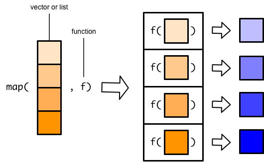

```{r, echo = F, message = F, warning = F}
knitr::opts_chunk$set(class.source = "tgc-code-block")
# Load packages 
if(!require(pacman)) install.packages("pacman")
pacman::p_load(tidyverse, knitr, here, reactable)

# Source functions 
source(here::here("global/functions/lesson_functions.R"))

# knitr settings
knitr::opts_chunk$set(warning = F, message = F, class.source = "tgc-code-block", error = T)


```

# Automating Data Visualization

## Introduction

There are often situations when you need to perform repetitive plotting tasks. For example, you'd like to plot the same kind of data (e.g. the same epidemic indicator) for several states, provinces, or cities. In this lesson, we will explore how to automate data visualizations using the powerful combination of `{ggplot2}` and `{purrr}` in R. First, we'll delve into the programmatic side of `{ggplot2}`, creating custom plotting functions to streamline your graphing tasks. Then we'll use `{purrr}` to iterate through different variables, allowing us to generate and save a multitude of plots in one step! Learning how to automate plotting will greatly enhance your data analysis workflows.


## Learning Objectives {.unlisted .unnumbered}

1.  **Recognize the challenges of repetitive filtering and plotting**: Identify when repetitive plotting is needed and create a workflow involving data subsetting, plotting, and saving.

2.  **Create custom plotting functions**: Develop custom functions for repetitive plotting tasks with, including variable and row subsetting. Learn to add multiple inputs for dynamic plot customization.

3.  **Iterate plotting tasks**: Apply plotting functions over a vector of variables, with the help of `purrr::map()`.

4.  **Use nested loops for automation**: Use `map()` within a for loop to iterate over a combination of subsets and response variables.

By the end of this lesson, you'll have the skills to automate `{ggplot2}` graphs, saving time and enhancing the reproducibility of your data-driven narratives.

## Packages

In this lesson we will use the following packages:

-   `{tidyverse}` metapackage

    -   `{ggplot2}` for creating plots

    -   `{purrr}` for iterating functions through a vector

-   `{here}` for project-relative file paths

-   `{glue}` for concatenating strings and automating plot annotation

```{r warning = F, message = F}
# Load packages 
pacman::p_load(tidyverse, here, glue)
```

------------------------------------------------------------------------

## Introduction to the data: HIV in Malawi

Today, we will be looking at a dataset of subnational HIV epidemic indicators from the Malawi Ministry of Health Department of HIV & AIDS and Viral Hepatitis, for December 2022. These estimates were derived from a small‐area estimation model, called Naomi, to estimate key measures stratified by subnational administrative units, sex, and five‐year age groups. The original dataset can be accessed [here](https://dms.hiv.health.gov.mw/dataset/malawi-hiv-subnational-estimates-naomi-model-2023).

We have prepared a subset of that data to analyse in this lesson:

```{r render = .reactable_10_rows, message = FALSE}
# Import data from CSV
hiv_mwi_agesex <- read_csv(here("data/clean/hiv_mwi_agesex.csv"))

# View data frame
hiv_mwi_agesex
```

-   **Geographic area**:
    -   `area_level` - administrative unit (country, region, or district)
    -   `area_name` - name of the geographic area
-   **Demographic information**
    -   `age_group` and `sex`
    -   **HIV indicators**: total population, people living with HIV (PLHIV), HIV prevalence, incidence, ART coverage, and PLHIV who are aware of their status.
    -   `indicator` - short code
    -   `indicator_label` - full name
-   **Statistical measures**: model estimates with probabilistic uncertainty
    -   `mean`, `lower`, `upper`

::: key-point
The Naomi model synthesizes data from multiple data sources to give small-area estimates of key HIV indicators for sub‐Saharan Africa. These estimates are instrumental for HIV program planning, resource allocation, and target setting. You can learn more about the Naomi model [here](https://www.ncbi.nlm.nih.gov/pmc/articles/PMC8454682/).
:::

### Visualizing age-sex distribution

Age and sex disparities in HIV prevalence are observed globally and are affected by a multitude of overlapping factors, including gender discrimination, sexual behavior, and access to healthcare and education. These factors can influence both the likelihood of initial infection and the outcomes for people living with HIV.

In this lesson we will focus on visualizing the age-sex distribution of various indicators at the national, regional, and district level. First let's use `ggplot()` to create a national-level bar chart of HIV prevalence, grouped by age and split by sex.

```{r}
# Bar chart of age-sex distribution 
hiv_mwi_agesex %>% 
  filter(area_level == "Country",
         indicator == "prevalence") %>% 
  ggplot(aes(x = age_group, 
             y = mean, 
             fill = sex)) +
  geom_col(position = "dodge") +
  theme_minimal() +
  labs(title = 'National estimates of HIV prevalence, Malawi (Dec 2022)')
```

Oops! Something looks off with the order of age groups. This is important to fix because we will be creating plots grouped by age and sex for the rest of this lesson.

::: error
**Reveling the x-axis variable**

The variable **`age_group`** is a **character** vector, which is not inherently ordered the way a **factor** is.

```{r}
# View unique values the age_group variable
hiv_mwi_agesex %>% pull(age_group) %>% unique()
```

If we look at the unique values of the variable, we get a vector that is correctly ordered from youngest to oldest. However, `{ggplot2}` arranges character variables "alphabetically", which means our "5-9" age group is plotted in the wrong place.

To arrange our bar plot the correct age sequence, we can convert `age_group` to a factor and specify the order of levels using **`forcats::fct_relevel()`**:

```{r}
# Create a vector of correctly ordered age group values
ordered_age_groups <- hiv_mwi_agesex %>% pull(age_group) %>% unique()

# Reorder age_group levels and save to a new data frame
hiv_malawi <- hiv_mwi_agesex %>%
  mutate(age_group = forcats::fct_relevel(age_group, ordered_age_groups))
```

Now we are ready to plot age distributions with our new **`hiv_malawi`** data frame.
:::

Let's try the same `ggplot()` code again, with `hiv_malawi`:

```{r}
# Plot with releveled age groups
hiv_malawi %>% 
  filter(area_level == "Country",
         indicator == "prevalence") %>% 
  ggplot(aes(x = age_group, 
             y = mean, 
             fill = sex)) +
  geom_col(position = "dodge") +
  theme_minimal() +
  labs(title = "National estimates of HIV prevalence, Malawi (Dec 2022)")
```

Much better!

::: side-note
**Insights on HIV prevalence**

The graph reveals a discernible gender disparity in HIV prevalence starting at age 15, likely tied to the onset of sexual activity. Women face a significantly higher prevalence than men through their 20s to 40s, which may reflect factors such as biological vulnerability and social dynamics. Interestingly, this trend reverses after the 50s, where men show higher rates. This shift could be influenced by men's sexual behavior, mortality rates, and access to or seeking of treatment.
:::

Now, let's dig deeper and investigate if the same trends are observed when we zoom into more localized areas. We can filter the data to plot the age-sex distribution at different geographic areas. Our dataset includes estimates aggregated for the 3 main regions and 28 districts of Malawi. We'll start by focusing on Malawi's first administrative level --- the **three regions**.


## The challenge of repetitive plotting

In this section, we will highlight a common challenge in data visualization: repetitive filtering of data subsets.

Let's first create a plot of HIV prevalence for the `"Northern"` region of Malawi. We can copy the code for the national plot we made earlier, and replace `"Country"` with `"Region"`, and `"Malawi"` with the name of the Region we want to plot.

```{r}
# Example of repetitive filtering and plotting - Region 1

hiv_malawi %>% 
  # Filter to Northern Region
  filter(area_level == "Region",
         area_name == 'Northern',
         indicator == "prevalence") %>% 
  ggplot(aes(x = age_group, 
             y = mean, 
             fill = sex)) +
  geom_col(position = "dodge") +
  theme_minimal() +
  # Change the title
  labs(title = "HIV Prevelance by age and sex in Northern Region, Malawi (Dec 2022)")
```

Now let's repeat this for the other two regions:

```{r}
# Example of repetitive filtering and plotting - Region 2

hiv_malawi %>% 
  # Filter to Southern Region
  filter(area_level == "Region",
         area_name == 'Southern',
         indicator == "prevalence") %>% 
  ggplot(aes(x = age_group, 
             y = mean, 
             fill = sex)) +
  geom_col(position = "dodge") +
  theme_minimal() +
  # Change the title
  labs(title = "HIV Prevelance by age and sex in Southern Region, Malawi (Dec 2022)")

# Example of repetitive filtering and plotting - Region 3

hiv_malawi %>% 
  # Filter to Central Region
  filter(area_level == "Region",
         area_name == 'Central',
         indicator == "prevalence") %>% 
  ggplot(aes(x = age_group, 
             y = mean, 
             fill = sex)) +
  geom_col(position = "dodge") +
  theme_minimal() +
  # Change the title
  labs(title = "HIV Prevelance by age and sex in Central Region, Malawi (Dec 2022)")
```

While the above method of copying and replacing names works for a small number of subgroups, the limitations of manual filtering become evident as the number of subgroups increases. Imagine doing this for each of the 28 districts in the data -- it would be highly inefficient and an error-prone process!

Instead of copying and pasting the same code and adjusting the variables, we'll demonstrate how to handle this challenge in the next sections, using a combination of `{ggplot2}` and functional programming techniques.

::: side-note
**Faceting for small multiples**

Another option is to create a faceted plot, broken down by region or district. Again, the limitation is that there can be too many levels in your grouping variable, or too much data to fit in each subset. A plot made up of 28 facets would be crowded and virtually unreadable.

```{r}
# Example of faceted subplots by region
hiv_malawi %>% 
  filter(area_level == "Region",
         indicator == "prevalence") %>% 
  ggplot(aes(x = age_group, 
             y = mean, 
             fill = sex)) +
  geom_col(position = "dodge") +
  theme_minimal() +
  labs(title = "HIV Prevelance by age and sex for Regions of Malawi (Dec 2022)") +
  facet_wrap(~area_name)
```

Other times we may generate individual plots for separate documents or slides. Instead of sticking solely to faceting, we can create functions that allow us to create a series of plots systematically.
:::

::: practice
**Question 1: Filtering and plotting**

Make an age-sex bar plot of **ART coverage** in **Lilongwe** district. You can start with the code we used to create the regional plots. This time, you will need to filter the data to **District**, and adjust the plot title accordingly.

```{r include = F}
# PQ1 ans A
hiv_malawi %>% 
  filter(area_level == "District",
         area_name == "Lilongwe",
         indicator == "art_coverage") %>% 
  ggplot(aes(x = age_group, 
             y = mean, 
             fill = sex)) +
  geom_col(position = "dodge") +
  theme_minimal() +
  labs(title = 'Estimates of ART coverage by age and sex for Lilongwe district')
```

Now adapt your code to create the same plot for **Mzimba** district.

```{r include = F}
# PQ1 ans B
hiv_malawi %>% 
  filter(area_level == "District",
         area_name == "Mzimba",
         indicator == "art_coverage") %>% 
  ggplot(aes(x = age_group, 
             y = mean, 
             fill = sex)) +
  geom_col(position = "dodge") +
  theme_minimal() +
  labs(title = 'Estimates of ART coverage by age and sex for Mzibma district')

```
:::

## Create custom plotting functions

### Single-argument function

The first step to automating out plotting is to create a small function that filters the data for us, and plots the subsetted data.

For example, to visualize the mean prevalence for a region, we can **define a function** that takes a subset condition as an input argument and creates the regional plot with the filtered data.

```{r}
# Simple function for filtering to region and plotting age sex grouped bar chart

plot_region<- function(region_name){
  # copy the code from above and replace area name with a placeholder
  hiv_malawi %>% 
  filter(area_level == "Region",
         area_name == {{region_name}},
         indicator == "prevalence") %>% 
  ggplot(aes(x = age_group, 
             y = mean, 
             fill = sex)) +
  geom_col(position = "dodge") +
  theme_minimal() +
  labs(title = {{region_name}})
}
```

The code inside the user-defined function above is basically the same as the one to create the previous chart. The only difference is that we do not specify a specific region name, but create a **placeholder**, here called**`{{region_name}}`**, to control the filtering condition and title. In the `filter()` function, we subset our data based on `region_name`; in the `labs()` function we use this string as the plot title.

::: watch-out
**Curly curlies**

Notice the use of curly braces `{{}}` inside the `plot_region()` function. This practice is recommended when using `{tidyverse}` functions inside another custom function, to avoid errors. See [here](https://r4ds.hadley.nz/functions.html#plot-functions) for more examples.
:::

Now let's run the function for each region featured in the data set, and see what we get!

```{r}
# Create individual plots for the three regions 
northern <- plot_region('Northern')
southern <- plot_region('Southern')
central <- plot_region('Central')

# Print plots
northern
southern
central
```

You can see that using a custom function is much more efficient than repeating and editing the same code chunk. If changes are necessary, we don't need to alter the code for each individual plot. Instead, we can make a small adjustment to our `plot_region()` function.

These plots show that the age-sex patterns of HIV prevalence holds the same at national and regional levels. But you can see that overall prevalence is much higher in the Southern region than others.

::: pro-tip
**Customizing titles with `glue()`**

The plots generated by our custom function look *almost* exactly the same as the ones before - can you spot one difference? That's right, the title! Instead of just "Central", we want it to say 'Central region estimates of HIV prevalence'.

We can fix that with the **`glue()`** function inside our custom function:

```{r}
# Adapt function to include custom title
plot_region2 <- function(region_name){
  hiv_malawi %>% 
  filter(area_level == "Region",
         area_name == {{region_name}},
         indicator == "prevalence") %>% 
  ggplot(aes(x = age_group, 
             y = mean, 
             fill = sex)) +
  geom_col(position = "dodge") +
  theme_minimal() +
  labs(title = glue("HIV Prevelance by age and sex in {region_name} Region, Malawi (Dec 2022)"))
}

# Test function
plot_region2("Central")
```
:::

::: practice
**Question 2: Custom plotting function for districts**

-   Create custom function called **`plot_district()`** which takes `district_name` as an input, and creates an age-sex plot of **persons living with HIV** (the "plhiv" indicator), at the district level. Use `glue()` to create a custom title.

```{r include = F}
## PQ2 ans A - same as the plot_region() function from above, but filter area_level to to "District", replace {{region_name}} with {{district_name}}, and change indicator to "plhiv"

plot_district <- function(district_name){
  hiv_malawi %>% 
    filter(area_level == "District",
           area_name == {{district_name}},
           indicator == "plhiv") %>% 
    ggplot(aes(x = age_group, 
               y = mean, 
               fill = sex)) +
    geom_col(position = "dodge") +
    theme_minimal() +
    labs(title = glue("PLHIV by age and sex in {district_name} District, Malawi (Dec 2022)"))
}
```

Use your function to create a plot for the **Chitipa** and **Neno** districts.

```{r include=F}
# PQ2 ans B - Test function
plot_district("Chitipa")
plot_district("Neno")
```
:::

### Multiple input function

In the previous section, our `plot_region()` function accepted just one input: `region_name`, and filtered data to the "Region" level only.

We can make our function even more versatile by allowing us to customize the HIV indicator to plot on the y-axis, and whether to filter by "Region" or "District".

```{r}
# Create custom function with multiple inputs
plot_malawi <- function(area_name, area_level, hiv_indicator){
  hiv_malawi %>% 
    # filter by 3 conditions
  filter(
    area_level == {{area_level}},
    area_name == {{area_name}},
    indicator == {{hiv_indicator}}) %>% 
  ggplot(aes(x = age_group, 
             y = mean, 
             fill = sex)) +
  geom_col(position = "dodge") +
  theme_minimal() +
    # custom title
  labs(title = glue("Mean {hiv_indicator} by age group in {area_name} {area_level}, Malawi (Dec 2022)"))
}
```

Now we can apply the new custom function **`plot_malawi()`** to any indicator, at any geographic level in our dataset when we specify the 3 required inputs.

```{r}
# ART coverage for a district
plot_malawi("Chitipa", "District", "art_coverage")

# Population for a region
plot_malawi("Southern", "Region", "population")
```

::: side-note
**Filtering to area level**

The reason we added **`area_level`** is to avoid a situation where a district and region share the same name. We don't have such cases in this dataset, however it is not uncommon for states/provinces to have the same name as a prominent district/city within its borders (e.g., New York city is in New York state). As an added bonus, it allows us to customize the title of out plot to mention area level.
:::

Using custom functions, we can create plots for different regions, districts, and indicators without the need to copy-paste the `{ggplot2}` code and make multiple adjustments manually.

But this is still repetitive! It still requires some copying and pasting and replace the names. Even though it's just one line, it's still not automated!

For example, if we wanted to use our custom function to create a plot of PLHIV for each of the 28 districts, we'd have to do this:

```{r eval=F}
# Apply custom function to each district
chitipa_plhiv <- plot_malawi("Chitipa", "District", "plhiv")
karonga_plhiv <- plot_malawi("Karonga", "District", "plhiv")
nkhatabay_plhiv <- plot_malawi("Nkhatabay", "District", "plhiv")
rumphi_plhiv <- plot_malawi("Rumphi", "District", "plhiv")
mzimba_plhiv <- plot_malawi("Mzimba", "District", "plhiv")
likoma_plhiv <- plot_malawi("Likoma", "District", "plhiv")
kasungu_plhiv <- plot_malawi("Kasungu", "District", "plhiv")
nkhotakota_plhiv <- plot_malawi("Nkhotakota", "District", "plhiv")
ntchisi_plhiv <- plot_malawi("Ntchisi", "District", "plhiv")
dowa_plhiv <- plot_malawi("Dowa", "District", "plhiv")
salima_plhiv <- plot_malawi("Salima", "District", "plhiv")
lilongwe_plhiv <- plot_malawi("Lilongwe", "District", "plhiv")
mchinji_plhiv <- plot_malawi("Mchinji", "District", "plhiv")
dedza_plhiv <- plot_malawi("Dedza", "District", "plhiv")
ntcheu_plhiv <- plot_malawi("Ntcheu", "District", "plhiv")
mangochi_plhiv <- plot_malawi("Mangochi", "District", "plhiv")
machinga_plhiv <- plot_malawi("Machinga", "District", "plhiv")
zomba_plhiv <- plot_malawi("Zomba", "District", "plhiv")
mulanje_plhiv <- plot_malawi("Mulanje", "District", "plhiv")
phalombe_plhiv <- plot_malawi("Phalombe", "District", "plhiv")
balaka_plhiv <- plot_malawi("Balaka", "District", "plhiv")
chiradzulu_plhiv <- plot_malawi("Chiradzulu", "District", "plhiv")
blantyre_plhiv <- plot_malawi("Blantyre", "District", "plhiv")
mwanza_plhiv <- plot_malawi("Mwanza", "District", "plhiv")
thyolo_plhiv <- plot_malawi("Thyolo", "District", "plhiv")
chikwawa_plhiv <- plot_malawi("Chikwawa", "District", "plhiv")
nsanje_plhiv <- plot_malawi("Nsanje", "District", "plhiv")
neno_plhiv <- plot_malawi("Neno", "District", "plhiv")
```

What a pain! Fortunately, R provides with a way to **iterate** our custom function through all the regions or districts, without any copying and pasting.

## Looping through a vector of variables

### Introducing `purrr::map()`

We can make a vector of names and run the function to go through all the names in that vector with the `map()` function form the `{purrr}` package.

We will give `map()` two arguments: a **vector** and a **function**.


`map()` will then apply the function to each element of the input vector.


Applying the function to each element of the input vector results in one output element per each input element.



`map()` then combines all these output elements into a list.


For example, here we have a custom function that takes an input and appends a "Dr." prefix to the beginning of the string.

```{r}
# Example single argument function
add_dr <- function(full_name) {
  return(paste("Dr.", full_name))
}
# Apply the function to a single name
add_dr("Mohamed Hsin Bennour")
```

Now let's say we have a vector of names for which we want to add the prefix "Dr."

```{r}
# List of people
phd_students <- c("Mohamed Hsin Bennour", "Imad El Badisy", "Kenechukwu David Nwosu")
```

We pass the vector of names to `purrr::map()`, and insert our custom `add_dr()` function as an argument. This will allow us to apply the custom function to all elements of the vector, iterating the process.

```{r}
# Loop function over vector of variables
purrr::map(phd_students, add_dr)
```

Above you will notice that the output of `purrr::map()` is a list. To retrieve elements from list, we can first assign it to an object and then use the `[[` operator, like so:

```{r}
# Pipe vector to map() and save output as a list
phd_grads <- phd_students %>% purrr::map(add_dr)

# Print list
phd_grads

# Call a specific element from the list
phd_grads[[2]]
```

In essence, `map()` does the same work a `for` loop would do, but in a functional way.

### Automating ggplots

We can use the same workflow to create a list of plots, by applying our custom `plot_malawi()` function to a vector of region names.

```{r}
# Create vector of the 3 Malawi regions
region_names <- c("Northern", "Central", "Southern")

# Apply plot_region() to region_names
region_names %>% map(plot_malawi, "Region", "prevalence")
```

Now we created 3 plots with 2 lines of code.

::: practice
**Question 3: Iterating through a vector of districts**

Create a vector of 5 district names from `hiv_malawi`.

```{r include=F}
districts5 <- "WRITE YOUR CODE HERE"
```

Apply the `plot_malawi()` function to the vector of disctrict names, to create five plots for **PLHIV** in one step.

```{r include=F}
districts5 %>% purrr::map("District", "plhiv")
```
:::

#### Area level helper function

Looking at disease patterns at different geographic scales (country, state, county, city, etc.) is crucial in epidemiological analysis. We may want to make a plot for every state, or every county.

We can create a vector of all district names from `hiv_malawi` using this code pattern:

```{r}
# Creating a vector of unique district names
district_names <- hiv_malawi %>% 
  filter(area_level == "District") %>% 
  pull(area_name) %>% 
  unique()
# Print
district_names
```

This code identifies unique area names at the "District" level. However, manually repeating this for different levels is inefficient. To optimize, we introduce a helper function called `area_lvl()`:

```{r}
# Write helper function to get unique area names for a given level
area_lvl <- function(level){
  hiv_malawi %>% 
    filter(area_level == {{level}}) %>% 
    pull(area_name) %>% 
    unique() %>% 
    return()
}

# Test helper function
area_lvl("Region")
area_lvl("District")
```

This function simplifies obtaining unique names for any area level. We can use `area_lvl()` in conjunction with `map()` to iterate through all regions or all districts, without having to create a custom vector first.

```{r}
# Plot incidence for all regions
area_lvl("Region") %>% map(plot_malawi, "Region", "incidence")
```

```{r eval= F}
# Plot HIV awareness for all districts
area_lvl("District") %>% map(plot_malawi, "District", "aware_plhiv_prop")
```

### Looping through two vectors

For only a few response variables we could easily copy and paste the code above, changing the hard-coded y-axis variable (`indicator`) each time. This process can get burdensome if we want to do this for many indicators, though.

Though we could use a nested loop, with a second `map()` function nested inside our previous one, this method is not as easy to interpret as using a for loop.

Here we will create a vector of two indicators, and feed them to a for loop. The for loop will feed each indicator to `map()`, and we will end up with 6 plots.

```{r}
# Choose indicators: PLHIV and Prevalence
indicators <- c("plhiv", "prevalence")

# Nested loop to plot 3 regions x 2 indicators
for (i in 1:length(indicators)) {
  area_lvl("Region") %>% 
    map(plot_malawi, "Region", indicators[i]) %>% 
    print()
}
```

We could change "Region" to "District", and the above code would give us 56 plots, 2 indicators for each of the 28 districts.

## Finalize and save

Now that our plotting process is fully automated, we can get ready to finalize them and save the images for further use.

First let's examine the plots and decide if any adjustments are needed. If changes are necessary, we don't need to alter the code for each individual plot. Instead, we can make a small adjustment to our `plot_malawi()` function and then rerun it with the `map()` function. This is a powerful way to manage multiple plots efficiently.

Let's revisit out original `ggplot()` code, which we've been filtering and reusing for all the plots:

```{r}
# National prevalence age-sex bar chart
hiv_malawi %>% 
  filter(area_level == "Country",
         indicator == "prevalence") %>% 
  ggplot(aes(x = age_group, 
             y = mean, 
             fill = sex)) +
  geom_col(position = "dodge") +
  theme_minimal() +
  labs(title = "National estimates of HIV prevalence, Malawi (Dec 2022)")
```

This plot is not bad by any means, but there are still lots of features we can adjust and polish to make a final, publication-ready graph. Remember that `ggplot()` graphs are infinitely customizable!

The code below makes several modifications to create a final plot that looks more refined.

```{r}
# National prevalence age-sex bar chart with additional modifications
hiv_malawi %>% 
  filter(indicator == "prevalence", area_name == "Malawi") %>% 
  ggplot(aes(x = age_group, y = mean, fill = sex,
             ymin = lower, ymax = upper)) + 
  geom_col(position = position_dodge(width = 0.9)) +
  geom_errorbar(position = position_dodge(width = 0.9), ## add error bars
                width = 0.25, linewidth = 0.8) +   # Adjust the size for thicker lines
####################################################################################
  scale_y_continuous(expand = c(0, 0)) +  # Start y-axis at 0
  scale_fill_manual(values = c("female" = "#E69F00", "male" = "#56B4E9"),
                    labels = c("Female", "Male")) +  # Use colorblind-friendly colors
  theme_light() + # Light theme for a cleaner look
####################################################################################
  theme(legend.position = c(0.05, 0.95), # Place legend in the top left corner
        legend.justification = c(0, 1),  # Anchor the legend at the top left corner
        legend.background = element_rect(color = "darkgray", linewidth = 0.5),
        legend.title = element_blank()) +
  labs(x = "Age (years)",
       y = "Prevalence",
       title = "Age-Sex Distribution of HIV Prevalence in Malawi",
       subtitle = "Naomi model estimates, December 2022")
```

Once we are satisfied with the look of the plot, we can use this new `ggplot()` code in a custom function:

```{r}
# Create custom function with multiple inputs
plot_malawi_final <- function(area_name, area_level, hiv_indicator){
  hiv_malawi %>% 
    # ADD PLACEHOLDERS FOR FILTERING BASED ON INPUTS
    filter(indicator == {{hiv_indicator}},
           area_level == {{area_level}},
           area_name=={{area_name}}) %>% 
  ggplot(aes(x = age_group, y = mean, fill = sex,
             ymin = lower, ymax = upper)) + 
  geom_col(position = position_dodge(width = 0.9)) +
  geom_errorbar(position = position_dodge(width = 0.9), ## add error bars
                width = 0.25, linewidth = 0.8) +   # Adjust the size for thicker lines
####################################################################################
  scale_y_continuous(expand = c(0, 0)) +  # Start y-axis at 0
  scale_fill_manual(values = c("female" = "#E69F00", "male" = "#56B4E9"),
                    labels = c("Female", "Male")) +  # Use colorblind-friendly colors
  theme_light() + # Light theme for a cleaner look
####################################################################################
  theme(legend.position = c(0.05, 0.95), # Place legend in the top left corner
        legend.justification = c(0, 1),  # Anchor the legend at the top left corner
        legend.background = element_rect(color = "darkgray", linewidth = 0.5),
        legend.title = element_blank()) + +
    # ADD PLACEHOLDERS FOR TITLE AND Y AXIS NAME
  labs(x = "Age (years)", 
       y = hiv_indicator, 
       title = glue("Age-Sex Distribution of {hiv_indicator} in {area_name} {area_level}"),
       subtitle = "Naomi model estimates, Malawi, December 2022")
}

# Test function
plot_malawi_final("Chitipa", "District", "plhiv")
```

We can use this new function to get plots for a set of regions or districts, just like we did with the previous `plot_malawi()` function.

```{r}
# Iterate over regions
area_lvl("Region") %>% map(plot_malawi_final, "Region", "prevalence")
```

Now that we know the function works correctly and generates the plots we want, it's time to save them locally. This will enable us to access the plots without having to rerun the code and generate them every time.

We'll do this by making one final change to our plotting function. This time we will add the `ggsave()` function at the end, to save our plots as image files with unique and descriptive names.

```{r}
# Create custom function to plot AND save to a specific file path
plot_save_final <- function(area_name, area_level, hiv_indicator){
  hiv_malawi %>% 
    # ADD PLACEHOLDERS FOR FILTERING BASED ON INPUTS
    filter(indicator == {{hiv_indicator}},
           area_level == {{area_level}},
           area_name=={{area_name}}) %>% 
  ggplot(aes(x = age_group, y = mean, fill = sex,
             ymin = lower, ymax = upper)) + 
  geom_col(position = position_dodge(width = 0.9)) +
  geom_errorbar(position = position_dodge(width = 0.9), ## add error bars
                width = 0.25, linewidth = 0.8) +   # Adjust the size for thicker lines
####################################################################################
  scale_y_continuous(expand = c(0, 0)) +  # Start y-axis at 0
  scale_fill_manual(values = c("female" = "#E69F00", "male" = "#56B4E9"),
                    labels = c("Female", "Male")) +  # Use colorblind-friendly colors
  theme_light() + # Light theme for a cleaner look
####################################################################################
  theme(legend.position = c(0.05, 0.95), # Place legend in the top left corner
        legend.justification = c(0, 1),  # Anchor the legend at the top left corner
        legend.background = element_rect(color = "darkgray", linewidth = 0.5),
        legend.title = element_blank()) + +
    # ADD PLACEHOLDERS FOR TITLE AND Y AXIS NAME
  labs(x = "Age (years)", 
       y = hiv_indicator, 
       title = glue("Age-Sex Distribution of {hiv_indicator} in {area_name} {area_level}"),
       subtitle = "Naomi model estimates, Malawi, December 2022") +
  # NEW CODE STARTS HERE: Save plot with custom file names
  ggsave(filename = here(glue("outputs/{hiv_indicator}_{area_level}_{area_name}.jpg")))
}
```

Now that we have finalized our custom function called `plot_save_final()` let's try it out for the Chitipa district!

```{r eval=F}
plot_save_final("Chitipa", "District", "plhiv")
```

You should now see a new file named "plhiv_District_Chitipa.jpg" in your outputs folder.

Just like before, let's now try to create a for loop for our two indicators `plhiv` and `prevalence`, but this time we will use our `plot_save_final()` function to create the plots **and** save the images in our outputs folder!

```{r eval=F}
# Iterate over regions and SAVE
area_lvl("Region") %>% map(plot_save_final, "Region", "prevalence")
```

Next, let's loop through **two** vectors and save region-level plots for two more HIV indicators.

```{r eval=F}
# Choose new indicators
indicators2 <- c("plhiv", "art_coverage")

# Loop through plot saving function
for (i in 1:length(indicators2)) {
  area_lvl("Region") %>% 
    map(plot_save_final, "Region", indicators2[i])
}
```

If you access the `outputs` folder, you should now find **6** newly created and saved plots added to the folder. This is the magic of automation in R!

::: practice
**Question 4: Save a plot series**

Using your `districts5` vector from the last question, write a for loop to create and save age-sex distribution graphs for: - Prevalence - ART coverage - PLHIV

```{r include=F}
# PQ4 ans
indicators3 <- c("prevalence", "plhiv", "art_coverage")

# Loop through plot saving function
for (i in 1:length(indicators3)) {
  districts5 %>% 
    map(plot_save_final, "District", indicators3[i])
}
```
:::

## WRAP UP! {.unnumbered}

In this lesson, we learned how to develop custom filtering and plotting functions with `{dplyr}` and `{ggplot2}`, and iterate them over vectors in two dimensions with `purrr::map()` and for loops.

In this way, we can efficiently generate customized plots and save them for future use without having to create them individually each time. This approach offers a powerful demonstration of how functional programming principles can be used to write cleaner, more modular, and easily maintainable code.

## Answer Key {.unnumbered}

[Joy will add]

## Contributors {.unlisted .unnumbered}

The following team members contributed to this lesson:

`r .tgc_contributors_list(ids = c("benn", "joy"))`

## References {.unlisted .unnumbered}

[Joy will add]

`r .tgc_license()`
