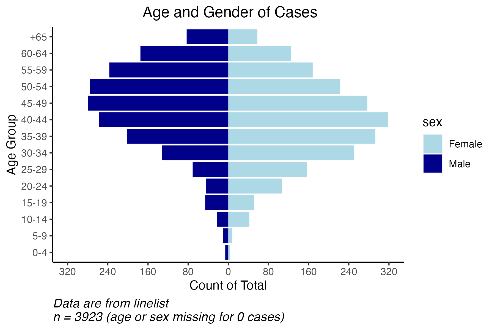
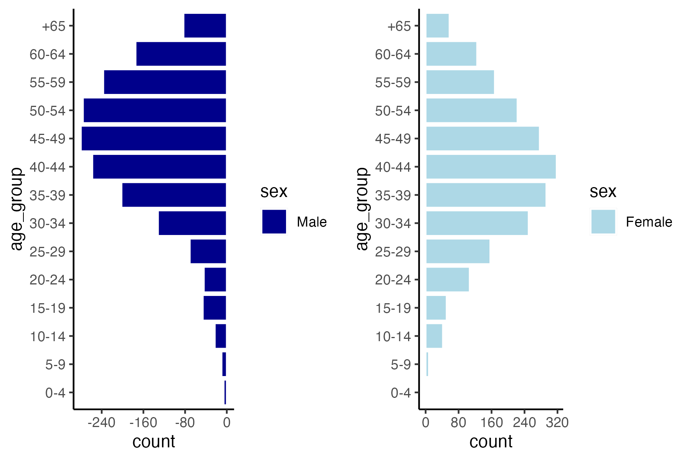
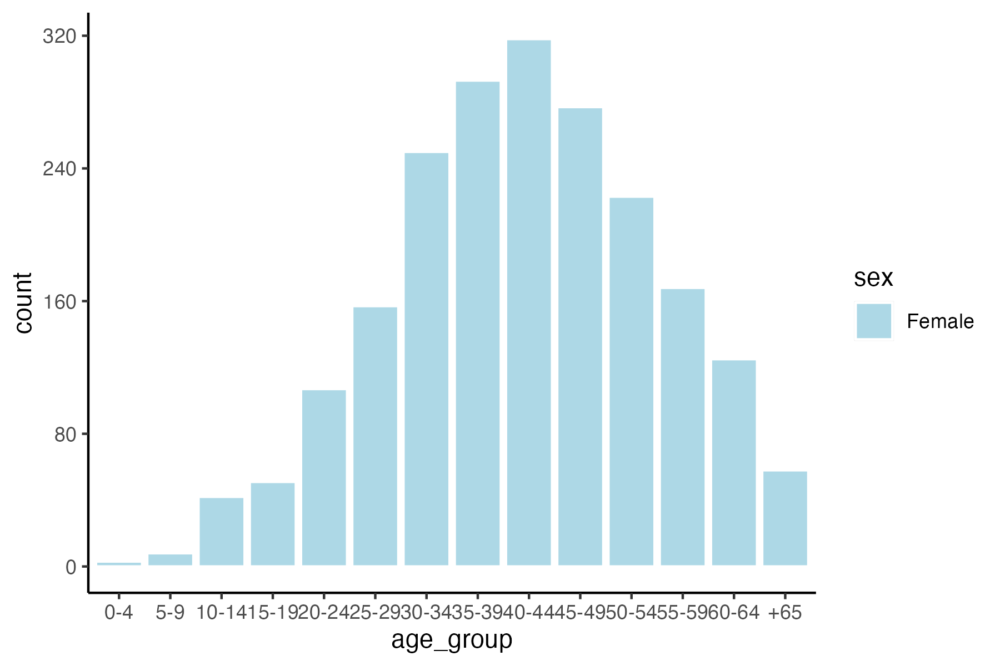
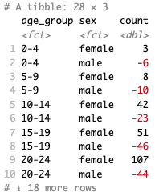

```{r, echo = F, message = F, warning = F}
# Load packages 
if(!require(pacman)) install.packages("pacman")
pacman::p_load(tidyverse, knitr, here, reactable, gt, flextable)

## functions
source(here::here("global/functions/misc_functions.R"))

## default render
registerS3method("reactable_5_rows", "data.frame", reactable_5_rows)
knitr::opts_chunk$set(class.source = "tgc-code-block")

```

# Introduction

Today you will learn about the importance of using demographic pyramids to help visualize the distribution of a disease by age and sex and how to create one using `ggplot2`.

Let's get into it!

# Learning Objectives

-   You know the importance of using demographic pyramids to show the distribution of age groups and sex for communicable diseases.

-   You can use `geom_col` from `ggplot2` to create a demographic pyramid showing the number or percent total of cases, deaths, and more.

-   You can customize the plot by changing the color scheme, labels, and axis.

# Introducing Demographic Pyramids

A demographic pyramid, also known as a population pyramid or an age-sex pyramid, helps to visualize the distribution of a population by two important demographic variables: **age** and **sex**. The overall population takes the shape of a pyramid, therefore taking its name.

Population pyramids are graphs that show the distribution of ages across a population divided down the center between male and female members of the population, where the y-axis shows the age groups and the x-axis the sex.

Through the use of `ggplot2` we are able to create pyramids while customizing it to our specific needs such as the plot below:



Multiple packages are available to facilitate data analysis and data visualization. In the case of demographic pyramids, the `apyramid` package can be a useful tool. Nonetheless, by using this package we are limited in the customization of our plot, making `ggplot2` a much versatile approach.

::: side-note
The package `apyramid` is a product of the **R4Epis** project that allows for the rapid creation of population pyramids any many other useful functions used in epidemiological reports.

Detailed information about the package can be read [**here**](https://cran.r-project.org/web/packages/apyramid/vignettes/intro.html) or by entering `?age_pyramid` in your R console.
:::

## Using Population Pyramids in Epidemiology

Population pyramids provide useful information to describe and understand the epidemiology of various communicable diseases, while facilitating the visualization of the distribution of disease by age and sex.

We know that the incidence of certain communicable diseases can vary with age. For the case of tuberculosis (TB), adolescents and young adults are primarily affected in the region of Africa. However, in countries where TB has gone from high to low incidence, such as the United States, TB is mainly a disease of older people, or the immunocompromised. Another disease that demonstrates age variation is malaria, where children under the age of 5 years old account for a high majority of deaths in the region of Africa.

Therefore, when describing the epidemiology of communicable diseases such as HIV, Malaria, and TB, it is important to observe the distribution of cases or deaths by age group and sex. This information helps inform national surveillance programs which age group is experiencing the highest burden and who to target for intervention.

::: side-note
**Using Demographic Distribution for Data Quality Assessment**

Demographic pyramids can also play a crucial role in assessing the data quality of routine surveillance systems by helping assess the internal and external consistency.

When trying to assess surveillance data quality standards of certain diseases, external consistency can be evaluated by comparing the national surveillance data with the global epidemiology of that disease. Data calculations based on demographic variables such as age group are sometimes used.

For the instance of TB surveillance data, external consistency can be evaluated by calculating the percentage of children diagnosed with TB within the program and comparing it with the global average cases.
:::

## Conceptualizing Demographic Pyramids

Let's take a closer look at a population pyramid and try to understand how it can be graphed using `geom_col` from `ggplot2`.

In order to conceptualize this, we will be using the dataset introduced later in the lesson. Let's take a closer look at the demographic pyramid we showed above:


As you can see from the image above, the x-axis is divided in two halves (males and females) where the units of the x-axis are symmetrical across the axis at point 0 and the age groups are labelled along the y-axis.

While closely looking at this graph, you probably noticed that the population pyramid consists of two plots merged together through the y-axis.

In other words, we can divide the pyramid into two sections (males or females) and graph them independently such as below:



Does this type of graph look familiar? What if we flip our x and y axes and turn the graph 90 degrees?

Let's take the female half and flip our axes and see what we get:



As you can probably tell by now, in order to create a population pyramid we created two **bar graphs** that show the distribution of sex by age groups. Once we have created a plot for the females and the males, we then proceed to merged them together through their y-axis.

::: key-point
In order for the male half to be graphed on the left of the y-axis, we will need to negate the **count** (total count of people per age group).
:::

In other words, population pyramids are **bar graphs** whose axes are **flipped** (x and y axis flipped) and where females are graphed on the **positive side** of the y-axis and males are graphed on the **negative side** of the y-axis.

# Packages

This lesson will require the following packages to be installed and loaded:

```{r warning = F, message = F}
# Load packages 
if(!require(pacman)) install.packages("pacman")
pacman::p_load(here,       # to locate file
               tidyverse,  # to clean, handle, and plot the data (includes ggplot2 package)
               janitor,    # tables and cleaning data
               apyramid)   # package dedicated to creating age pyramids

```

# Data Preparation

## Intro to the Dataset

For this lesson, we will use a fictional HIV dataset imitating a linelist of HIV cases in Zimbabwe during 2016.

::: side-note
You can access the source used to simulate the HIV data [**here**](https://phia.icap.columbia.edu/zimbabwe-final-report/#:~:text=ZIMPHIA%2C%20a%20nationally%20representative%20household,of%20Zimbabwe's%20national%20HIV%20response.)
:::

Each line (row) corresponds to one patient, while each column represents different variables of interest. The linelist only contains demographic and HIV-related variables (HIV status) .

For this specific lesson, we will focus on the **age-related** and **sex** variables to create our demographic pyramid.

## Importing Data

Let's start by importing our data into our RStudio environment and taking a closer look at it to better understand the variables we will be using for the creation of our demographic pyramid.

::: side-note
In order to focus our attention to the creation of demographic pyramids, we went ahead and created the data subset containing the variables of interest (`age_group` and `sex`).
:::

```{r load_data, warning = F, message = F, render = reactable_10_rows}
hiv_data <- read_csv(here::here("data/clean/hiv_zimbabwe_2016.csv"))

hiv_data
```

Our imported dataset contains **28000** rows and **3** columns containing the `age_group` and `sex` variables we will be using for the creation of our demographic pyramid. In addition, the `hiv_status` variable provides us with information on the status of patients (*positive* or *negative*).

Since we are interested on creating a demographic pyramid on HIV prevalence, we first need to filter for HIV positive patients and make sure the `age_group` and `hiv_status` variables are factorized.

Let's load an already cleaned subset of our data!

```{r hiv_prevalence, render = reactable_10_rows}

hiv_prevalence <- readRDS(here::here("data/clean/hiv_zimbabwe_prevalence.rds"))

hiv_prevalence
```

::: side-note
Notice that we now have data subset of **3923** rows and **3** columns where all of the patients are **HIV positive**!
:::

Now, before moving to the creation of our demographic pyramid, let's inspect the data by creating a table summarizing the `age_group` and `sex` columns!

For this step, we will use `tabyl()` from **`janitor`**.

```{r summary_table, render = reactable_10_rows}
hiv_prevalence %>% 
  tabyl(age_group, sex)
```

Based on the table, the data is clean while the `age_group` column is correctly organized in ascending order (youngest to oldest).

::: pro-tip
Before creating your demographic pyramid, make sure to check that your data is clean and correctly organized in **ascending order**! This is important when using categorical variables as the order of your `age_group` will affect the order it will be plotted in your pyramid.

In the case of demographic pyramids, we want the youngest age group to be located at the bottom of the y-axis and the oldest age group to be at the top of the y-axis.
:::

## Creating Aggregated Data Subset

Before we get started, we will need to create an aggregated data subset that aggregates the total occurrences per age group and sex as below:



Notice that the *male* values are negative in order to obtain the male bar plot on the *left side* of the graph!

::: key-point
It is important to understand how to use `geom_col`.

When using the `geom_col` function, the count for each group **needs to be specified in the `aes` as the x or y variable**. In other words, you will need to use a dataset with the aggregated number of occurrences for each categorical level.

In the case of demographic pyramids, we will need to use a dataset with aggregated counts or percentages per age group and sex.
:::

Let's start by calculating the total count and percentages per age group and sex and create a subset with this information where the female values are *positive* and the male values are *negative*!

::: reminder
Don't forget to negate the male **y value** in order to obtain the male bar plot on the *left side* of the graph!
:::

```{r count_occurences, render = reactable_5_rows}

# Create new subset
pyramid_data <- 
  hiv_prevalence %>% 

# Count total number by age group and gender
  count(age_group, 
        sex,
        name = "total") %>% 
  ungroup() %>% 
  
# Create new column for count of age_group by gender
  mutate(
    counts = case_when(
      sex == "female" ~ total,
      sex == "male" ~ -total, #convert male to negative
      TRUE ~ NA_real_),
    
# Create new column for percentage of age_group by gender
    percent = round(100*(total / sum(total, na.rm = T)), digits = 1),
         percent = case_when(
           sex == "female" ~ percent, 
           sex == "male" ~ -percent, #convert male to negative
           TRUE ~ NA_real_)) #Make NA values numeric as well

pyramid_data
```

::: side-note
Notice that the male values in the `counts` and `percent` columns are not *negative*!
:::

::: r-practice
Let's test your understanding with the following multiple-choice questions (Answer Key is located at the end):

1.  **When creating the male bar plot, what modification is made to the occurrence values?**

```         
a.  They are added to the x-axis values.
b.  They are multiplied by 2.
c.  They are divided by 2.
d.  They are negated (multiplied by -1).
```
:::

# Plot Creation

## Using `geom_col`

Since we are going to create the demographic pyramid by plotting of a **bar graph**, we will need to use a **categorical variable**. Therefore, we will be using the categorical variable `age_group` to graph our bar plot and and 'fill' by `sex`.

::: reminder
In order to use the `geom_col` function, your dataset needs to include the aggregated count or percentage for each group (**age group** and **sex**)!
:::

Let's create our demographic pyramid using the `geom_col` functions from `ggplot2`.

```{r geom_col}

demo_pyramid <- 

# Begin ggplot  
  ggplot() +
 
# Create bar graph using geom_bar
  geom_col(data = pyramid_data, #specify data to graph
           mapping = aes(
             x = age_group,    #indicate x variable
             y = counts,       #indicate y variable
             fill = sex),      #fill by sex
           colour = "white") +
  
# Flip X and Y axes
  coord_flip()

demo_pyramid
```

::: pro-tip
Did you notice that we plotted the data and mapping information of our graph in `geom_col()` function instead of `ggplot()` function?

By plotting it directly in the `geom_col()` function, we are able to add different layers to our graph (such additional bar plots, lines, points, and more) without affecting the outcome of our already created and individual bar plot.
:::

We can also create the same population pyramid using the percent total as our y-axis value.

```{r geom_col_percent, warning=F}

demo_pyramid_percent <- 

# Begin ggplot  
  ggplot() +
 
# Create bar graph using geom_bar
  geom_col(data = pyramid_data, 
           mapping = aes(
             x = age_group,
             y = percent,
             fill = sex),
           colour = "white") +
  
# Flip x and y axes
  coord_flip()

demo_pyramid_percent

```

::: side-note
If your dataset contains the count/percentage for each group, such as dataset `pyramid_data`, you can also use `geom_bar`. However, you will need to pass `stat = "identity"` inside `geom_bar` as following:

```{r geom_bar_stat_identity, warning=F}
# Begin ggplot
ggplot(data = pyramid_data,
       mapping = aes(
         x = age_group,
         y = counts,    # Specify y-axis
         fill = sex),
       colour = "white") +

# Include stat = "identity" in gemo_bar 
  geom_bar(stat = "identity") +
  
# Flip x and y axes
  coord_flip()
```
:::

::: r-practice
Let's test your understanding with the following multiple-choice questions (Answer Key is located at the end):

2.  **When using `geom_col`, what type of x variable should your dataset include?**
    a.  Continuous variables
    b.  Categorical variables
    c.  Binary variables
    d.  Ordinal variables
3.  **Which `ggplot2` function can you use to flip the x and y axes?**
    a.  `coord_flip()`
    b.  `x_y_flip()`
    c.  `geom_histogram_flip()`
    d.  All of the above
4.  **Inside which `ggplot2` function should you pass `stat = "identity"` when using already aggregated data and trying to create a bar plot?**
    a.  `geom_col`
    b.  `geom_histogram`
    c.  `geom_bar`
    d.  All of the above
:::

::: r-practice
Now let's test your understanding with the following coding practice question (Answer Key is located at the end):

**We will be using a cleaned and prepared dataset containing the total population of Zimbabwe in 2016 grouped by age group and sex.**

Start by loading the dataset as following:

```{r loading_coding_practice}

zw_2016 <- readRDS(here::here("data/clean/population_zw_2016.rds"))

zw_2016
```

*Note that the male total count is already **negated**!*

5.  **Create a demographic pyramid for the total population of Zimbabwe in 2016 using the `geom_col` function from the `ggplot2` package. Make sure to add a white border around each bar!**

```{r coding_question4, eval=FALSE}
Q4_pyramid_zw_2016 <- 
  
# Begin ggplot
  ggplot() +

# Create bar graph using geom_bar
  geom_col(data = ____,
           aes(x = ____,
               y = ____,
               fill = ____),
           color = ____) +
  
# Flip x and y axes    
  ____
```
:::

# Plot Customization

So far, you have learned how to create a demographic pyramid using `ggplot2` as shown below:

```{r geom_col_final, warning=FALSE}

demo_pyramid

```

However, in order to create an informative graph, a certain level of plot customization is needed. For instance, it is important to include informative labels and to re-scale the x and y axis for better visualization.

Let's learn some useful `ggplot2` customization!

## Labels

Let's use the population pyramid we previously created using the `geom_col()` function and build upon it.

We can start by adding an informative title, axes, and caption to our graph:

```{r adjusting_labels, warning=FALSE}

adjusted_labels <- 
  
# Use previous demographic pyramid
  demo_pyramid +
  
# Adjust the labels
  labs(
    title = " Age and Sex of Cases",
    x = "Age Group",
    y = "Count of Total",
    caption = stringr::str_glue("Data are from linelist \nn = {nrow(hiv_prevalence)} (age or sex missing for {sum(is.na(hiv_prevalence$sex) | is.na(hiv_prevalence$age_years))} cases)"))

adjusted_labels

```

## Axis

Let's re-scale our axes to make sure the data is properly visualized and understood.

We will start by re-scaling the *total count* axis, or in the case of our plot, the **y-axis**. For this, we will start by identifying the maximum and minimum values and saving them as objects.

```{r max_min}

max_count <- max(pyramid_data$counts, na.rm = T)
min_count <- min(pyramid_data$counts, na.rm = T)

max_count
min_count

```

Now that we have identified that the minimum value for the *total count* is **-280** and the maximum value is **318**, we can use it to re-scale our y-axis accordingly.

In this particular case, we want to rescale our y axis to be symmetrical. Therefore we will take the biggest absolute value and use it as our limit for both the *positive* and *negative* sides.

In this case, we will use our maximum value.

```{r adjusted_axis, warning=F}

adjusted_axes <- 

# Use previous graph
  adjusted_labels +
  
# Adjust y-axis (total count)  
  scale_y_continuous(

    # Specify limit of y-axis using max value and making positive and negative
    limits = c(max_count * c(-1,1)),
    
    # Specify how to break the y-axis (based on max limit)
    breaks = seq(-400, 400, 400/5),
    
    # Make axis labels absolute so male labels appear positive
    labels = abs)


adjusted_axes
```

## Color Scheme and Themes

We can also make necessary adjustments to the color scheme and theme of the graph.

Below is an example of some changes, we can perform:

```{r color_theme, warning=F}

adjusted_color_theme <- 
  
# Use previous graph
  adjusted_axes +
  
# Designate colors and legend labels manually
  scale_fill_manual(
    
    # Select color of sex fill
    values = c("female" = "lightblue",
               "male" = "darkblue"),
    
    # Rename legend labels
    labels = c("Female", 
               "Male")) +
  
# Adjust theme settings
  theme(
    panel.grid.major = element_blank(),
    panel.grid.minor = element_blank(),
    panel.background = element_blank(),
    axis.line = element_line(colour = "black"), #make axis line black
    plot.title = element_text(hjust = 0.5),     #set high of title
    plot.caption = element_text(hjust = 0, size = 11, face = "italic")) #format caption

adjusted_color_theme

```

# WRAP UP! {.unnumbered}

As you can see, demographic pyramids are an essential visualization tool to understand the distribution of specific diseases across age groups and sex.

The concepts learned in this lesson can also be applied to create other types of graphs that require both negative and positive outputs such as percentage change in case notification rates and more.

Now that you have learned the concept behind the creation of demographic pyramids, the possibilities are endless! From plotting the **cases** per age group and sex over the **baseline/true** population to graphing the change (positive and negative) of interventions in a population, you should be able to apply these concepts to create informative epidemiological graphs.

Congratulations on finishing this lesson. We hope you can now apply the knowledge learned in today's lesson during the analysis and creation of epidemiological review reports.

# Answer Key {.unnumbered}

1.  d
2.  b
3.  a
4.  c
5.  

```{r}
Q4_pyramid_zw_2016 <-
  ggplot() +
  geom_col(data = zw_2016,
           aes(x = age_group,
               y = total_count,
               fill = sex),
           color = "white") +
  coord_flip()
```

# Contributors {.unlisted .unnumbered}

The following team members contributed to this lesson:

`r tgc_contributors_list(ids = c("sabina", "joy"))`

# References {.unnumbered}

1.  Adjusted lesson content from: Batra, Neale, et al. The Epidemiologist R Handbook. 2021. <https://doi.org/10.5281/zenodo.4752646>\
2.  Adjusted lesson content from: WHO. Understanding and Using Tuberculosis Data. 2014. <https://apps.who.int/iris/bitstream/handle/10665/129942/9789241548786_eng.pdf>\
3.  Referenced package from: <https://r4epis.netlify.app/>
