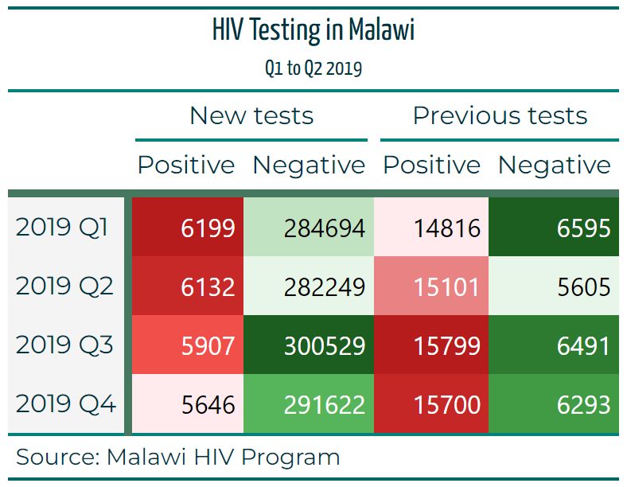

```{r setup, include=FALSE}
knitr::opts_chunk$set(echo = TRUE, class.source = "tgc-code-block")

if(!require(pacman)) install.packages("pacman")

# functions
source(here::here("global/functions/lesson_functions.R"))

# default render
registerS3method(".reactable_5_rows", "data.frame", .reactable_5_rows)
```

# Introduction

The previous `{gt}` lesson focused mainly on the components of the table its structure and how to manipulate it properly. This lesson, presenting the second part of the `{gt}` series will focus on using the package to polish, style, and customize the visual effects of tables in a way that elevate the quality and efficiency of your reports.

Let's dig in.

------------------------------------------------------------------------

# Learning objectives {.unlisted .unnumbered}

1.  **Using Pre-defined Themes with `opt_stylize` Function**: Understand how to apply pre-defined styles and color themes to tables using the `opt_stylize` function. Explore various styling options, including the choice of style number and color, to enhance the visual appeal of tables.

2.  **Formatting Values in Table with `data_color` Function**: Learn to visually distinguish values in specific columns using the `data_color` function. This technique is useful in large tables for highlighting important data.

3.  **Conditional Formatting Using `tab_style` Function**: Master the concept of conditional formatting in tables. Learn to apply styles to cells based on their values when they meet a certain threshold.

4.  **Enhancing Table Text with Fonts and Colors**: Explore the customization of table text using the `gt::tab_style()` function. Learn to apply different fonts and colors to table titles, subtitles, and other text elements for a more visually appealing presentation.

5.  **Adding Borders with `tab_style` and `cell_borders` Functions**: Gain skills in drawing borders within tables to highlight specific areas. Understand how to use `tab_style` in conjunction with `cell_borders` for adding both vertical and horizontal lines of varying colors and thicknesses.

By the conclusion of this lesson, you will have the skills to artfully style your **`{gt}`** tables to meet your specific preferences achieving a level of detail similar to this:

{width="482"}

------------------------------------------------------------------------

# Packages

In this lesson, we will use the following packages:

-   `{gt}`: to create our tables.

-   `{dplyr}` , `{tidyr}` , and `{purrr}`: to manipulate data an automate functions.

-   `{janitor}`: for rapid cleaning of data names.

-   `{Paletteer}` , `{ggsci}`: for calling pre-defined palettes.

```{r}
pacman::p_load(tidyverse, janitor, gt, here)
```

------------------------------------------------------------------------

# Previously in pt1

::: recap
In the previous `{gt}` lesson we had the opportunity to :

-   Discover the HIV prevalence data of Malawi.

-   Discover the grammar of tables and the `{gt}` package.

-   create simple table.

-   Add details like title and footnote to the table.

-   Group columns into spanners.

-   Create Summary rows.

{width="455"}
:::

------------------------------------------------------------------------

# The dataset

In this lesson, we will use the same data from the previous lesson, you can go back for a detailed description of the data and the preparation process we made.

::: recap
Here's the full details of the columns we will use:

-   `region`: The geographical region or area where the data was collected or is being analyzed.

-   `period`: A specific time period associated with the data, often used for temporal analysis.

-   `previous_negative`: The count or number of individuals with a previous negative test result.

-   `previous_positive`: The count or number of individuals with a previous positive test result.

-   `new_negative`: The count or number of newly diagnosed cases with a negative result.

-   `new_positive`: The count or number of newly diagnosed cases with a positive result.
:::

But for the purposes of this lesson we will use the tables directly, this this the table that we created with the right spanners and columns labels, we will base the rest of our lesson on this particular one.

```{r}
hiv_malawi_summary <- read_rds(here::here("data", "clean", "malawi_hiv_summary_t3.rds"))

hiv_malawi_summary
```

------------------------------------------------------------------------

# Themes

Since the objective of this lesson is mainly styling, let's start with using a pre-defined theme to add more visuals and colors to the table and its components. To do so we use the `opt_stylize` function. The function contains multiple pre-defined styles and can accept a color as well. In our case we chose to go with style No.6 and the color 'gray', you can set these arguments to your liking.

```{r}
t1 <- hiv_malawi_summary %>% 
  opt_stylize(
    style = 1, 
    color = 'cyan'
  ) %>% 
  tab_options(
    stub.background.color = '#F4F4F4',
  )

t1
```

::: challenge
For more sophisticated themes and styling, you can refer to the function `tab_options` (documentations [here](https://gt.rstudio.com/reference/tab_options.html?q=tab%20options#null)) which is basically the equivalent to the `theme` function in `ggplot2`. This function contains arguments and options on every single layer and component of the table. For the purposes of this lesson we won't dive into it.
:::

------------------------------------------------------------------------

# Formatting the values in the table

Wouldn't it be useful to visualize in colors the difference between values in a specific column? In many reports, these kind of tables are quite useful especially if the number of rows is quite large. Let's do this for our table such that we have the `new_positive` column is formatted red.

We can do this by means of the `data_color` function for which we need two specify tow arguments, `columns` (as in at what column this styling will take place?) and `palette` as the color palette we intend to use.

```{r}
t2 <- t1 %>% 
  data_color(
    columns = new_positive, # the column or columns as we will see later
    palette = "ggsci::red_material" # the palette form the ggsci package.
  )

t2
```

::: side-note
`ggsci::red_material` is not the only palette we can use, in fact there are hundereds of palettes that are designed to be used in R. You can find a lot more in the `paletteer` package documentations in [here](https://emilhvitfeldt.github.io/paletteer/#included-packages), or in the official `data_color` documentation [here](https://gt.rstudio.com/reference/data_color.html?q=data_color#null).
:::

We can do this for the `previous_negative` column as well. We can use a different kind of palette, I'm using for this case the green palette from the same package: [`ggsci::green_material`](https://github.com/nanxstats/ggsci) , the palette you choose is a matter of convenience and personal taste, you can explore more about this if you refer to the side note above.

```{r}
t2 %>% 
  data_color(
    columns = previous_negative,
    palette = "ggsci::green_material"
  ) 
  
```

Similarly, we can also color multiple columns at once, for example we can style the columns with positive cases in red, and those with negative cases in green. To do this we need to write *two* `data_color` statements one for each color style:

```{r}
t4 <- t1 %>% 

  data_color(
    columns = ends_with("positive"), # selecting columns ending with the wor positive
    palette = "ggsci::red_material" # red palette 
  ) %>% 
  data_color(
    columns = ends_with("negative"), # selecting columns ending with the wor negative
    palette = "ggsci::green_material" # green palette
  )


t4

```

::: reminder
Remember in the previous lesson we used the [`tidyselect`](https://tidyselect.r-lib.org/reference/starts_with.html) functions to select columns, in the code above we used the function `ends_with` to select the columns ending either with the word 'negative' or 'positive' which is perfect for the purpose of our table.

Again, the column labels in the `{gt}` table and the actual column names in the `data.frame` can be different, in our case we refer to the names in the data.
:::

------------------------------------------------------------------------

# Conditional formatting

We can also set up the table to conditionally change the style of a cell given its value. In our case we want to highlight values in the column `previous_positive` according to a threshold (the value 15700). Greater or equal values than the threshold should be in green.

To achieve this we use the `tab_style` function where we specify two arguments:

-   `stye` : where we specify the color in the `cell_text` function since we intend to manipulate the text within the cells.

-   `location` : where we specify the columns and the rows of our manipulation in the `cells_body` since these cells are in the main body of the table.

Let's use the t2 table as an example:

```{r}
t5 <- t2 %>% 
  tab_style(
    style = cell_text(
      color = "red", 
    ),
    locations = cells_body(
      columns = previous_positive,
      rows = previous_positive >= 15700
    )
  )
t5  
```

::: watch-out
In the code above, the condition over which the styling will occur is stated in :

`locations = cells_body(columns = previous_positive, rows = previous_positive >= 15700 )`

Also, note that we can pass more arguments to the `cell_text` function, such as the size and the font of the cells we intend to style.
:::

What if we want to have a two sided condition over the same threshold? Can we have cells with values greater or equal to the threshold styled in green, and simultaneously other cells with values less than the threshold styled in.... cyan?

We absolutely can, we've already done the first part (in the previous code chunk), we just need to add a second condition in a similar manner but in a different `tab_style` statement:

```{r}
t6 <- t5 %>% 
  tab_style(
    style = cell_text(
      color = 'cyan' 
    ),
    location = cells_body(
      columns = 'previous_positive',
      rows = previous_positive < 15700
    )
  )

t6

```

::: practice
**Question 1: Conditional Formatting** To highlight (in yellow) rows in a **`{gt}`** table where the "hiv_positive" column exceeds 1,000, which R code snippet should you use?

A.  

```{r eval=FALSE, echo=TRUE}
data %>% 
  gt() %>% 
  tab_style(
    style = cells_body(), 
    columns = "Sales", 
    conditions = style_number(Sales > 1000, background = "yellow")
  )
```

B.  

```{r eval=FALSE, echo=TRUE}
data %>% 
  gt() %>% 
  tab_style(
    style = cells_data(columns = "Sales"), 
    conditions = style_number(Sales > 1000, background = "yellow") 
  )
```

C.  

```{r eval=FALSE, echo=TRUE}
data %>% 
  gt() %>% 
  tab_style(
    style = cell_fill(
      color = "yellow"
    ), 
    locations = cells_body(
      columns = "hiv_positive",
      rows = hiv_positive > 1000
    ) 
  )
    
```

D.  

```{r eval=FALSE, echo=TRUE}
 data %>% 
   gt() %>% 
   tab_style(
     style = cells_data(columns = "Sales"), 
     conditions = style_text(Sales > 1000, background = "yellow")
   )
```

**Question 2: Cell Coloration Fill**

Using the **`hiv_malawi`** data frame, create a **`{gt}`** table that displays the total number (**sum**) of "*`new_positive`*" cases for each "*`region`*". Highlight cells with values more than 50 cases in *red* and cells with less or equal to 50 in *green*. Complete the missing parts (\_\_\_\_\_\_\_\_) of this code to achieve this.

```{r eval=FALSE, echo=TRUE}
# Calculate the total_new_pos summary
total_summary <- hiv_malawi %>%
  group_by(_________) %>%
  summarize(total_new_positive = __________)

# Create a gt table and apply cell coloration
summary_table <- total_summary %>%
  gt() %>%
  tab_style(
    style = cell_fill(color = "red"),
    locations = _________(
      columns = "new_positive",
      rows = _________________
    )
  ) %>%
  tab_style(
    style = ___________________,
    locations = cells_body(
      columns = "new_positive",
      _______ new_positive <= 50
    )
  )
```
:::

------------------------------------------------------------------------

# Fonts and text

Now, we'll enhance the visual appeal of our table's text. For this, we'll use the `gt::tab_style()` function once again.

Let's modify the font and color of the title and the subtitle. We'll select the `Yanone Kaffeesatz` font from Google Fonts, a resource offering a vast array of fonts that can add a unique touch to your table, beyond the standard options in Excel.

To apply these changes, we'll configure the `gt::tab_style()` function as follows:

-   The `style` argument is assigned the `cell_text()` function, which houses two other arguments:

    -   `font` is assigned the `google_font()` function with our chosen font name.

    -   `color` is set to a hexadecimal color code that corresponds to our desired text color.

-   The `locations` argument is assigned the `cells_title()` function:

    -   We specify `title` and `subtitle` within the `groups` argument using vector notation `c(…)`.

::: side-note
To specifically modify the title or subtitle, you can use `locations = cells_title(groups = "title")` or `locations = cells_title(groups = "subtitle")`, respectively, without the need for `c(…)`.

**Using lists to pass arguments in gt:** Lists in R are an integral part of the language and are extremely versatile. A list can contain elements of different types (numbers, strings, vectors, and even other lists) and each element can be accessed by its index. In the context of our {gt} table, we use lists to group together style properties (with the style argument) and to specify multiple locations in the table where these styles should be applied (with the locations argument).

**Using Hexadecimal Color Codes:** Colors in many programming languages, including R, can be specified using hexadecimal color codes. These codes start with a hash symbol (\#) and are followed by six hexadecimal digits. The first two digits represent the red component, the next two represent the green component, and the last two represent the blue component. So, when we set color = "#00353f", we're specifying a color that has no red, a bit of green, and a good amount of blue, which results in a deep blue color. This allows us to have precise control over the colors we use in our tables.
:::

```{r}
t7 <- t4 %>% 
  tab_style(
      style = cell_text(
          font = google_font(name = 'Yanone Kaffeesatz'), 
          color = "#00353f"
        ),
      locations = cells_title(groups = c("title", "subtitle"))
  )
t7
```

We can extend our customization to include the labels for columns, spanners, and stubs, as well as the source note. Within the `locations` argument, we'll supply a list indicating the specific locations for these changes. For a comprehensive understanding of the locations, please refer to Appendix (List 1).

```{r}
t8 <- t7 %>% 
  tab_style(
    style = list(
      cell_text(
        font = google_font(name = "Montserrat"),
        color = "#00353f"
      )
    ),
    locations = list(
      cells_column_labels(columns = everything()), # select every column
      cells_column_spanners(spanners = everything()), # select all spanners
      cells_source_notes(),
      cells_stub()
    )
  )
t8
```

::: side-note
If you want to change the fill background of the title, you can do so by adjusting the `locations` argument to point at `cells_title(groups = "title")`. Here's how you could do it:

```{r eval = FALSE}
t9 <- t7 %>% 
  tab_style(
    style = cell_fill(background = "#ffffff"),
    locations = cells_title(groups = "title")
  )
t9
```

In this code, `cell_fill(background = "#ffffff")` changes the background color to white, and `locations = cells_title(groups = "title")` applies this change specifically to the title of the table.
:::

::: practice
**Question 3: Fonts and Text** Which R code snippet allows you to change the font size of the footnote text in a **`{gt}`** table?

A.  

```{r eval=FALSE, echo=TRUE}
data %>% 
  gt() %>% 
  tab_header(font.size = px(16))
```

B.  

```{r eval=FALSE, echo=TRUE}
data %>% 
  gt() %>% 
  tab_style(
    style = cell_text(
      size = 16
    ),
    locations = cells_footnotes()
  )
```

C.  

```{r eval=FALSE, echo=TRUE}
 data %>% 
   gt() %>% 
   tab_style(
     style = cells_header(), 
     css = "font-size: 16px;"
   )
```

D.  

```{r eval=FALSE, echo=TRUE}
 data %>% 
   gt() %>% 
   tab_style(
     style = cells_header(), 
     css = "font-size: 16;"
   )
```
:::

------------------------------------------------------------------------

# Borders

In `{gt}` it's also possible to draw borders in the tables to help the end user focus on specific area in the table. In order to add borders to a `{gt}` table we will use, again the, `tab_style` function and, again, specify the style and locations argument. The only difference now is that we will use the `cell_borders` helper function and assign it to the style argument. Here's how:

Let's first add a vertical line:

```{r}
t10 <- t8 %>% 
  tab_style(
    style = cell_borders( # we are adding a border
      sides = "left",     # to the left of the selected location
      color = "#45785e",     # with a dark green color
      weight = px(5)      # and five pixels of thickness
    ),
    locations = cells_body(columns = 2) # add this border line to the left of column 2
  )
t10
```

Now let's add another pink horizontal border line:

```{r}
t11 <- t10 %>% 
    tab_style(
    style = cell_borders( # we are adding a border line
      sides = "bottom",   # to the bottom of the selected location
      color = "#45785e",     # with a pink color
      weight = px(5)      # and five pixels of thickness
    ),
    locations = list(
      cells_column_labels(columns = everything()), # add this border line to the bottom of the column labels
      cells_stubhead()                             # and to the stubhead 
    )
  )
  
t11
```

```{r message=FALSE, warning=FALSE, include=FALSE}
# saving table for next lesson as rds object
t11 %>% write_rds(here("data/clean/malawi_hiv_summary_l2_t11.rds"))
t11 %>% gt::gtsave(here("data/clean/malawi_hiv_summary_l2_t11.png"))
```

::: challenge
**Question 4: Borders** To add a solid border around the entire **`{gt}`** table, which R code snippet should you use?

Hint : we can use a function that sets options for the entirety of the table, just like the `theme` function for the `ggplot` package.

A.  

```{r eval=FALSE, echo=TRUE}
data %>% 
  gt() %>% 
  tab_options(table.border.top.style = "solid")
```

B.  

```{r eval=FALSE, echo=TRUE}
data %>% 
  gt() %>% 
  tab_options(table.border.style = "solid")
```

C.  

```{r eval=FALSE, echo=TRUE}
data %>% 
  gt() %>% 
  tab_style(
    style = cells_table(), 
    css = "border: 1px solid black;"
  )
```

D.  

```{r eval=FALSE, echo=TRUE}
data %>% 
  gt() %>% 
  tab_style(
    style = cells_body(), 
    css = "border: 1px solid black;"
  )
```
:::

------------------------------------------------------------------------

# Wrap up

Wrapping up our series, we began with a comprehensive recap from part one, setting the stage for advanced table styling techniques. We explored the utilization of the `opt_stylize()` function to elegantly apply predefined styles and colors, enhancing the visual appeal of our tables. A key part of our discussion introduced the `data_color` function, a powerful tool for applying color-coded distinctions to table values, which aids in quick data assessment and visual tracking. We then delved into conditional formatting, leveraging the `tab_style` function to dynamically alter cell styles based on the data they contain, a step that brings attention to critical metrics and trends. Moving beyond functionality, we focused on aesthetics with `gt::tab_style()`, showcasing how unique fonts from Google Fonts can significantly enhance the readability and text appearance within tables. Finally, we covered the strategic addition of borders using the `tab_style` function in conjunction with the `cell_borders` helper function, guiding users' focus to specific areas of the table and improving overall data interpretation. Each of these techniques contributes to a more engaging and informative table presentation, ensuring that the data is not only accessible but also compelling.

# Answer Key {.unnumbered}

1.  **Question 1: Conditional Formatting**
    -   *C*
2.  **Question 2: Cell Coloration Fill**

```{r eval=FALSE, echo=TRUE}
# Solutions are where the numbered lines are

# Calculate the total_new_pos summary
total_summary <- hiv_malawi %>%
  group_by(region) %>% ##1
  summarize(total_new_positive = new_positive) ##2 

# Create a gt table and apply cell coloration
summary_table <- total_summary %>%
  gt() %>% ##3
  tab_style(
    style = cell_fill(color = "red"),
    locations = cells_body( ##4
      columns = "new_positive",
      rows = new_positive >= 50 ##5
    )
  ) %>%
  tab_style(
    style = cell_fill(color = "green"), ##6
    locations = cells_body(
      columns = "new_positive",
      rows = new_positive < 50  ##7
    )
  )
```

3.  **Question 2: Fonts and Text**
    -   *B*
4.  **Question 4: Borders**
    -   *B*

------------------------------------------------------------------------

# Contributors {.unlisted .unnumbered}

The following team members contributed to this lesson:

`r .tgc_contributors_list(ids = c("benn", "joy"))`

------------------------------------------------------------------------

# External resources and packages

-   The definite cookbook of `{gt}` by Tom Mock : <https://themockup.blog/static/resources/gt-cookbook.html#introduction>

-   the Grammar of Table article : <https://themockup.blog/posts/2020-05-16-gt-a-grammar-of-tables/#add-titles>

-   official `{gt}` documentation page : <https://gt.rstudio.com/articles/intro-creating-gt-tables.html>

-   Create Awesome HTML Table with knitr::kable and kableExtra book by Hao Zhu : <https://cran.r-project.org/web/packages/kableExtra/vignettes/awesome_table_in_html.html#Overview>

# Appendix {.unlisted .unnumbered}

The `{gt}` package in R provides a variety of functions to specify locations within a table where certain styles or formatting should be applied. Here are some of them:

-   `cells_body()`: This function targets cells within the body of the table. You can further specify rows and columns to target a subset of the body.

-   `cells_column_labels()`: This function targets the cells that contain the column labels.

-   `cells_column_spanners()`: This function targets cells that span multiple columns.

-   `cells_footnotes()`: This function targets cells that contain footnotes.

-   `cells_grand_summary()`: This function targets cells that contain grand summary rows.

-   `cells_group()`: This function targets cells that contain group label rows.

-   `cells_row_groups()`: This function targets cells that contain row group label rows.

-   `cells_source_notes()`: This function targets cells that contain source notes.

-   `cells_stub()`: This function targets cells in the table stub (the labels in the first column of the table).

-   `cells_stubhead()`: This function targets the cell that contains the stubhead.

-   `cells_stub_summary()`: This function targets cells that contain stub summary rows.

-   `cells_title()` : This function targets cells that contain the table title and subtitle.

-   `cells_summary()`: This function targets cells that contain summary rows.

These functions can be used in the `locations` argument of the `tab_style()` function to apply specific styles to different parts of the table.

------------------------------------------------------------------------
